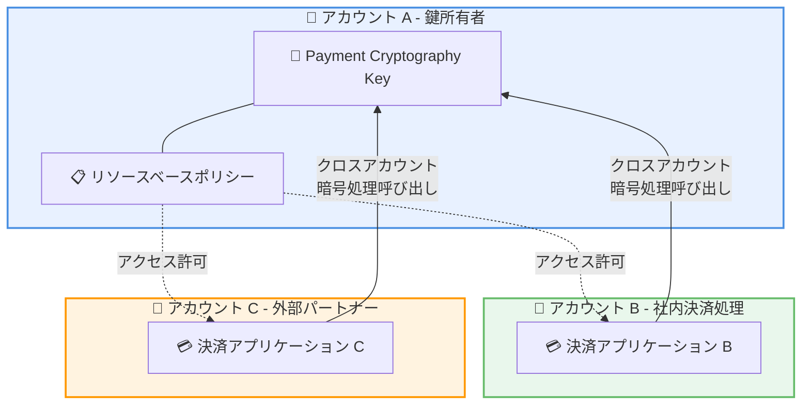

# AWS Payment Cryptography - クロスアカウント鍵共有

**リリース日**: 2026年5月4日
**サービス**: AWS Payment Cryptography
**機能**: リソースベースポリシーによるクロスアカウント鍵共有

📊 [このアップデートのインフォグラフィックを見る](https://takech9203.github.io/aws-news-summary/20260504-payment-cryptography-resource.html)

## 概要

AWS Payment Cryptography がリソースベースポリシー (Resource-Based Policy: RBP) を使用したクロスアカウント鍵共有をサポートした。この機能により、複数の AWS アカウント間で暗号鍵を安全に共有できるようになり、社内の異なるワークロード間だけでなく、外部パートナー企業との鍵共有も容易になる。

AWS Payment Cryptography は PCI PIN Security および Point-to-Point Encryption (P2PE) の要件に準拠したマネージドサービスであり、クラウドホスト型の決済アプリケーションにおける暗号処理を簡素化する。多くの顧客は AWS PCI DSS ガイダンスに従い、決済処理のワークロードやアプリケーション、ユースケースごとに複数の AWS アカウントを使用しているが、これまではアカウント間で暗号鍵を共有する際にインポート/エクスポートフローに依存する必要があった。

**アップデート前の課題**

- 複数アカウント間で暗号鍵を共有するには、鍵のインポート/エクスポートフローが必要であり、運用が煩雑だった
- アカウントごとに同じ暗号鍵を複製する必要があり、鍵マテリアルの管理が困難でリネージュ (出自追跡) が失われやすかった
- アカウント間のアクセス制御が複雑になり、セキュリティ監査やコンプライアンス対応の負担が大きかった

**アップデート後の改善**

- リソースベースポリシーにより、鍵の単一コピーを維持したままクロスアカウントアクセスを実現できるようになった
- インポート/エクスポートフローが不要になり、リソース単位の簡潔なアクセス制御が可能になった
- 鍵マテリアルのリネージュが明確になり、監査性とコンプライアンス対応が改善された

## アーキテクチャ図



リソースベースポリシーにより、鍵所有者アカウントの暗号鍵を他のアカウントから直接利用できる構成を示す。鍵のコピーや移動は不要である。

## サービスアップデートの詳細

### 主要機能

1. **リソースベースポリシーによる鍵共有**
   - 暗号鍵リソースに直接ポリシーをアタッチし、他アカウントからのアクセスを許可
   - JSON 形式のポリシードキュメントで、きめ細かなアクセス制御が可能
   - 鍵の単一コピーを維持しながらマルチアカウントアクセスを実現

2. **クロスアカウントアクセス制御**
   - 社内の複数アカウント間での鍵共有
   - 外部パートナー企業のアカウントとの鍵共有
   - リソース単位でのアクセス許可/拒否の設定

3. **Multi-Party Approval (MPA) チーム連携 API**
   - ルート公開鍵のインポート操作を保護するための MPA チーム関連付け機能
   - 機密性の高い鍵操作に対する多者承認ワークフロー
   - AssociateMpaTeam / DisassociateMpaTeam / GetMpaTeamAssociation API の追加

## 技術仕様

### リソースベースポリシー API

| API | 説明 |
|-----|------|
| `PutResourcePolicy` | 鍵リソースにリソースベースポリシーをアタッチ |
| `GetResourcePolicy` | 鍵リソースに設定されたポリシーを取得 |
| `DeleteResourcePolicy` | 鍵リソースからポリシーを削除 |

### MPA チーム連携 API

| API | 説明 |
|-----|------|
| `AssociateMpaTeam` | MPA チームをルート公開鍵インポート操作に関連付け |
| `DisassociateMpaTeam` | MPA チームの関連付けを解除 |
| `GetMpaTeamAssociation` | MPA チーム関連付けの状態を取得 |

### API 変更履歴

| 日付 | サービス | 変更内容 |
|------|----------|----------|
| 2026/04/30 | [Payment Cryptography Control Plane](https://awsapichanges.com/archive/changes/7084f0-controlplane.payment-cryptography.html) | 6 new 9 updated api methods - リソースベースポリシーおよび MPA チーム連携 API の追加 |

### リソースベースポリシーの例

```json
{
  "Version": "2012-10-17",
  "Statement": [
    {
      "Sid": "AllowCrossAccountAccess",
      "Effect": "Allow",
      "Principal": {
        "AWS": "arn:aws:iam::123456789012:root"
      },
      "Action": [
        "payment-cryptography:Encrypt",
        "payment-cryptography:Decrypt",
        "payment-cryptography:GenerateMac",
        "payment-cryptography:VerifyMac"
      ],
      "Resource": "*"
    }
  ]
}
```

## 設定方法

### 前提条件

1. 鍵所有者アカウントで AWS Payment Cryptography の鍵が作成済みであること
2. アクセスを許可する対象アカウントの AWS アカウント ID を把握していること
3. 適切な IAM 権限 (payment-cryptography:PutResourcePolicy) を持つ IAM プリンシパルでの操作

### 手順

#### ステップ 1: リソースベースポリシーの作成

```bash
# リソースベースポリシーを JSON ファイルとして作成
cat > policy.json << 'EOF'
{
  "Version": "2012-10-17",
  "Statement": [
    {
      "Sid": "CrossAccountKeyAccess",
      "Effect": "Allow",
      "Principal": {
        "AWS": "arn:aws:iam::CONSUMER_ACCOUNT_ID:root"
      },
      "Action": [
        "payment-cryptography:Encrypt",
        "payment-cryptography:Decrypt"
      ],
      "Resource": "*"
    }
  ]
}
EOF
```

鍵を利用するアカウントの ID を `CONSUMER_ACCOUNT_ID` に置き換えて、許可するアクションを定義する。

#### ステップ 2: ポリシーを鍵リソースにアタッチ

```bash
aws payment-cryptography put-resource-policy \
  --resource-arn "arn:aws:payment-cryptography:us-east-1:OWNER_ACCOUNT_ID:key/KEY_ID" \
  --policy file://policy.json
```

鍵所有者アカウントの鍵 ARN を指定し、リソースベースポリシーをアタッチする。

#### ステップ 3: 消費者アカウントからのアクセス確認

```bash
# 消費者アカウントから鍵情報を取得して接続を確認
aws payment-cryptography get-key \
  --key-identifier "arn:aws:payment-cryptography:us-east-1:OWNER_ACCOUNT_ID:key/KEY_ID"
```

消費者アカウント側から、鍵所有者アカウントの鍵 ARN を指定して暗号操作を呼び出す。IAM ポリシーとリソースベースポリシーの両方で許可されている必要がある。

## メリット

### ビジネス面

- **鍵管理コストの削減**: 鍵の複製が不要になり、アカウントごとの鍵管理コストが削減される
- **コンプライアンス対応の効率化**: 単一コピーの鍵で監査証跡が明確になり、PCI DSS 準拠の証明が容易になる
- **パートナー連携の迅速化**: 外部パートナーとの鍵共有が API 一つで完了し、ビジネス連携のリードタイムが短縮される

### 技術面

- **鍵リネージュの維持**: 鍵マテリアルの単一コピーにより、出自追跡と変更管理が一元化される
- **最小権限の原則の適用**: リソース単位の細粒度なアクセス制御により、必要最小限の権限付与が可能
- **運用の簡素化**: インポート/エクスポートフローの排除により、鍵ローテーションや管理の運用負荷が大幅に削減される

## デメリット・制約事項

### 制限事項

- リソースベースポリシーは鍵リソースにのみアタッチ可能であり、エイリアスなど他のリソースタイプには適用できない可能性がある
- クロスアカウントアクセスでは、消費者アカウント側の IAM ポリシーとリソースベースポリシーの両方で許可が必要
- ポリシーサイズの上限が存在する可能性があり、大量のアカウントを許可する場合は AWS Organizations の条件キーの活用を検討する必要がある

### 考慮すべき点

- クロスアカウントアクセスのレイテンシーが同一アカウント内の呼び出しと比較して若干増加する可能性がある
- セキュリティ設計上、リソースベースポリシーの変更権限を厳格に管理する必要がある
- CloudTrail によるクロスアカウントアクセスの監視体制を事前に構築しておくことが推奨される

## ユースケース

### ユースケース 1: マルチアカウント決済プラットフォーム

**シナリオ**: 大規模な決済処理企業が、AWS PCI DSS ガイダンスに従い、カード発行、加盟店処理、スイッチングの各ワークロードを別々の AWS アカウントで運用している。従来は各アカウントに同じ鍵をインポートしていた。

**実装例**:
```json
{
  "Version": "2012-10-17",
  "Statement": [
    {
      "Sid": "AllowIssuingAccount",
      "Effect": "Allow",
      "Principal": {
        "AWS": "arn:aws:iam::111111111111:root"
      },
      "Action": [
        "payment-cryptography:GeneratePinData",
        "payment-cryptography:VerifyPinData"
      ],
      "Resource": "*"
    },
    {
      "Sid": "AllowSwitchingAccount",
      "Effect": "Allow",
      "Principal": {
        "AWS": "arn:aws:iam::222222222222:root"
      },
      "Action": [
        "payment-cryptography:TranslatePinData"
      ],
      "Resource": "*"
    }
  ]
}
```

**効果**: 鍵の単一コピーを維持しながら、各ワークロードに必要最小限の暗号操作のみを許可でき、セキュリティとコンプライアンスが向上する。

### ユースケース 2: パートナー間の安全な暗号鍵共有

**シナリオ**: カード発行会社と決済ネットワーク事業者が、トランザクション認証用の暗号鍵を共有する必要がある。従来は TR-34 プロトコルによる鍵交換を定期的に実施していた。

**実装例**:
```bash
# カード発行会社のアカウントで、決済ネットワーク事業者にアクセスを許可
aws payment-cryptography put-resource-policy \
  --resource-arn "arn:aws:payment-cryptography:us-east-1:ISSUER_ACCOUNT:key/SHARED_KEY_ID" \
  --policy '{
    "Version": "2012-10-17",
    "Statement": [{
      "Sid": "NetworkPartnerAccess",
      "Effect": "Allow",
      "Principal": {"AWS": "arn:aws:iam::NETWORK_ACCOUNT:root"},
      "Action": ["payment-cryptography:VerifyMac", "payment-cryptography:GenerateMac"],
      "Resource": "*",
      "Condition": {"StringEquals": {"aws:PrincipalOrgID": "o-partnerorg"}}
    }]
  }'
```

**効果**: 鍵交換フローが不要になり、鍵のリネージュが保持され、即時のアクセス制御変更が可能になる。

### ユースケース 3: 開発・テスト環境での鍵参照

**シナリオ**: 本番環境の鍵を開発・ステージング環境から読み取り専用で参照し、鍵メタデータの検証やテストデータの暗号処理を行いたい。ただし、本番鍵の複製はセキュリティポリシーで禁止されている。

**実装例**:
```json
{
  "Version": "2012-10-17",
  "Statement": [
    {
      "Sid": "DevAccountReadOnly",
      "Effect": "Allow",
      "Principal": {
        "AWS": "arn:aws:iam::DEV_ACCOUNT_ID:role/PaymentTestRole"
      },
      "Action": [
        "payment-cryptography:GetKey",
        "payment-cryptography:Encrypt"
      ],
      "Resource": "*",
      "Condition": {
        "IpAddress": {
          "aws:SourceIp": "10.0.0.0/8"
        }
      }
    }
  ]
}
```

**効果**: 本番鍵の複製を防止しながら、開発チームが必要な暗号操作を実行でき、セキュリティポリシーとの整合性が維持される。

## 料金

AWS Payment Cryptography の料金体系は従来と同様であり、クロスアカウント鍵共有機能の利用に追加料金は発生しない。

| 項目 | 料金 |
|------|------|
| API 呼び出し (最初の 2,000 万回/月) | $2.00 / 10,000 回 |
| API 呼び出し (2,000 万回超/月) | $0.75 / 10,000 回 |
| アクティブ鍵 | $1.00 / 鍵 / 月 |

クロスアカウントで鍵を共有する場合、鍵のコピーが不要になるため、アクティブ鍵の数が削減され、結果的にコスト最適化につながる。

## 利用可能リージョン

本機能は AWS Payment Cryptography が利用可能なすべてのリージョンで提供される。

| リージョン名 | リージョンコード |
|-------------|-----------------|
| 米国東部 (バージニア北部) | us-east-1 |
| 米国東部 (オハイオ) | us-east-2 |
| 米国西部 (オレゴン) | us-west-2 |
| アフリカ (ケープタウン) | af-south-1 |
| アジアパシフィック (ハイデラバード) | ap-south-2 |
| アジアパシフィック (ムンバイ) | ap-south-1 |
| アジアパシフィック (大阪) | ap-northeast-3 |
| アジアパシフィック (シンガポール) | ap-southeast-1 |
| アジアパシフィック (シドニー) | ap-southeast-2 |
| アジアパシフィック (東京) | ap-northeast-1 |
| カナダ (中部) | ca-central-1 |
| 欧州 (フランクフルト) | eu-central-1 |
| 欧州 (アイルランド) | eu-west-1 |
| 欧州 (ロンドン) | eu-west-2 |
| 欧州 (パリ) | eu-west-3 |
| 南米 (サンパウロ) | sa-east-1 |

## 関連サービス・機能

- **AWS KMS**: 同様にリソースベースポリシーによるクロスアカウント鍵共有をサポートする汎用暗号鍵管理サービス。Payment Cryptography は決済業界固有の暗号操作に特化
- **AWS Organizations**: 組織全体でのアクセス制御に `aws:PrincipalOrgID` 条件キーを使用することで、組織内の全アカウントに対するポリシー管理を効率化
- **AWS CloudTrail**: クロスアカウントアクセスの監査ログを記録し、誰がいつどの鍵にアクセスしたかを追跡
- **AWS RAM (Resource Access Manager)**: 他の AWS サービスにおけるリソース共有メカニズム。Payment Cryptography は独自の RBP メカニズムを採用

## 参考リンク

- 📊 [インフォグラフィック](https://takech9203.github.io/aws-news-summary/20260504-payment-cryptography-resource.html)
- [公式発表 (What's New)](https://aws.amazon.com/about-aws/whats-new/2026/05/payment-cryptography-resource/)
- [AWS Payment Cryptography ユーザーガイド](https://docs.aws.amazon.com/payment-cryptography/latest/userguide/)
- [IAM およびリソースベースポリシー](https://docs.aws.amazon.com/payment-cryptography/latest/userguide/security-iam.html)
- [AWS Payment Cryptography 料金](https://aws.amazon.com/payment-cryptography/pricing/)
- [AWS API Changes - Payment Cryptography Control Plane](https://awsapichanges.com/archive/changes/7084f0-controlplane.payment-cryptography.html)

## まとめ

AWS Payment Cryptography のリソースベースポリシーによるクロスアカウント鍵共有は、マルチアカウント環境での決済暗号処理を大幅に簡素化する重要なアップデートである。鍵マテリアルの単一コピー管理、インポート/エクスポートフローの排除、リソース単位の細粒度アクセス制御により、セキュリティとコンプライアンスを維持しながら運用効率を向上させる。PCI DSS ガイダンスに従ってマルチアカウント戦略を採用している決済事業者は、既存の鍵管理フローの見直しとリソースベースポリシーへの移行を検討することを推奨する。
