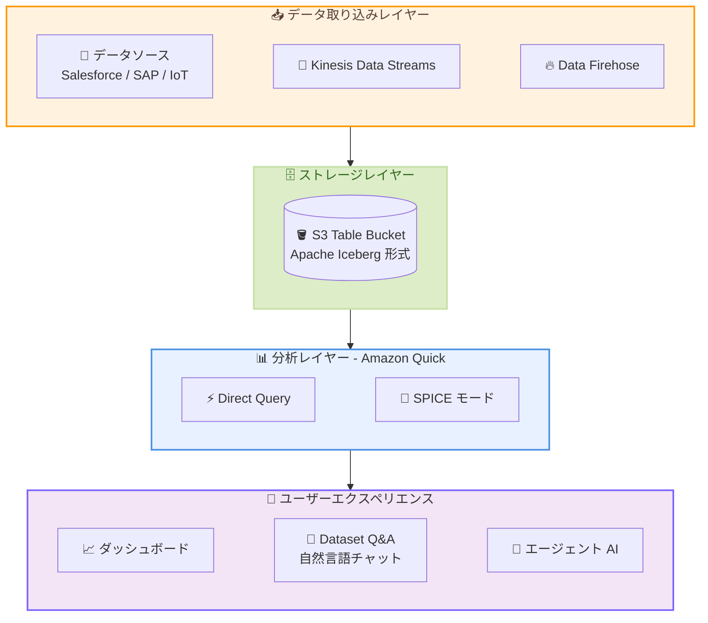

# Amazon Quick - S3 Tables データソース (Direct Query)

**リリース日**: 2026 年 5 月 4 日
**サービス**: Amazon Quick (Amazon QuickSight)
**機能**: Amazon S3 Tables (Apache Iceberg tables) as a data source

📊 [このアップデートのインフォグラフィックを見る](https://takech9203.github.io/aws-news-summary/20260504-quick-direct-query-s3-tables.html)

## 概要

Amazon Quick が Amazon S3 テーブルバケットをデータソースとして直接サポートするようになった。これにより、S3 テーブルバケットに格納された Apache Iceberg テーブルに対して、中間のデータウェアハウスや OLAP レイヤーを介さずにダッシュボード構築、会話型分析、データ探索が可能になる。エージェント AI と BI の両方のワークロードを、簡素化されたデータアーキテクチャで実現できる。

Salesforce、SAP、Amazon Kinesis Data Firehose などからの Zero-ETL を S3 テーブルバケットに直接取り込むことで、パイプライン依存を最小限に抑えたニアリアルタイムのインサイトを得られる。管理者が S3 テーブルバケットの権限を一度設定すれば、作成者はすぐにデータセットを作成してダッシュボード構築を開始できる。S3 テーブルバケットのデータセットは Amazon Quick の Dataset Q&A (自然言語質問応答) からもフルアクセス可能である。

本機能は Amazon Quick が利用可能なすべての AWS リージョンで提供されている。

**アップデート前の課題**

- データレイクに格納された大規模データを分析するには、データウェアハウスや OLAP システムへのデータ移動が必要で、レイテンシ、追加コスト、運用複雑性が発生していた
- Apache Iceberg テーブルを BI ツールで可視化するには Amazon Athena 等のクエリエンジンを中間レイヤーとして構築する必要があった
- ストリーミングデータのニアリアルタイム分析には、複雑な ETL パイプラインの構築・維持が必要だった
- データの移動により、データレイクを唯一の真実のソース (Single Source of Truth) として維持することが困難だった

**アップデート後の改善**

- Amazon Quick から S3 テーブルバケットの Apache Iceberg テーブルを直接クエリでき、中間レイヤーが不要になった
- Direct Query モードにより、手動更新なしでストリーミングデータを含むニアリアルタイムのダッシュボードを実現できる
- 自然言語チャット (My Assistant) によるデータ探索で、技術的専門知識なしにリアルタイムインサイトを取得可能になった
- データレイクを Single Source of Truth として維持しながら、AI 搭載の分析が可能になった

## アーキテクチャ図



Amazon Quick が S3 テーブルバケットに Direct Query で直接接続し、ストリーミングデータをニアリアルタイムで分析する全体アーキテクチャを示す。

## サービスアップデートの詳細

### 主要機能

1. **S3 Tables Direct Query モード**
   - S3 テーブルバケット内の Apache Iceberg テーブルに対して直接クエリを実行
   - 中間のデータウェアハウスや OLAP レイヤーが不要
   - ストリーミングデータを含む最新データにニアリアルタイムでアクセス可能
   - 手動のデータセット更新なしで最新のデータが反映される

2. **SPICE モードのサポート**
   - S3 Tables データソースに対して SPICE (Super-fast, Parallel, In-memory Calculation Engine) モードも選択可能
   - スケジュールベースのデータ更新が適切なユースケース向け
   - 高速な繰り返しクエリが必要な場合に最適

3. **自然言語による対話的分析**
   - Dataset Q&A を通じて S3 テーブルバケットのデータに自然言語で質問可能
   - My Assistant チャットエージェントによるインタラクティブな分析
   - データレイクを信頼のソースとして、AI が根拠のある回答を生成

4. **Zero-ETL 連携**
   - Salesforce、SAP、Amazon Kinesis Data Firehose から S3 テーブルバケットへの Zero-ETL
   - パイプライン依存を最小限に抑えたデータ連携
   - ニアリアルタイムのデータ取り込みと分析の統合

## 技術仕様

### データソース構成

| 項目 | 詳細 |
|------|------|
| データソースタイプ | Amazon S3 Tables (Apache Iceberg tables) |
| テーブル形式 | Apache Iceberg |
| ストレージ | Amazon S3 Table Bucket |
| クエリモード | Direct Query / SPICE |
| テーブル結合 | Inner Join をサポート (複数テーブル間) |
| 自動検出 | S3 テーブルバケット内のテーブルを自動検出 |

### 対応する分析機能

| 機能 | Direct Query | SPICE |
|------|:---:|:---:|
| ダッシュボード構築 | 対応 | 対応 |
| Dataset Q&A | 対応 | 対応 |
| ニアリアルタイム更新 | 対応 | スケジュール更新 |
| My Assistant チャット | 対応 | 対応 |
| エージェント AI ワークロード | 対応 | 対応 |

### 権限設定

```json
{
  "Effect": "Allow",
  "Action": [
    "s3tables:GetTable",
    "s3tables:GetTableData",
    "s3tables:ListTables",
    "s3tables:ListNamespaces"
  ],
  "Resource": "arn:aws:s3tables:<region>:<account-id>:bucket/<table-bucket-name>/*"
}
```

## 設定方法

### 前提条件

1. Amazon Quick Enterprise サブスクリプションが有効であること
2. S3 テーブルバケットが作成済みで、Apache Iceberg 形式のデータが格納されていること
3. データ取り込みパイプライン (Kinesis Data Streams / Data Firehose など) が構成済みであること (ストリーミングの場合)

### 手順

#### ステップ 1: Amazon Quick から S3 Tables へのアクセス権限を有効化

1. Amazon Quick コンソールで右上のアカウント名を選択し「Manage account」を選択
2. 左ナビゲーションの「Permissions」配下の「AWS Resources」を選択
3. 「Allow access and auto discovery for these resources」セクションで「Amazon S3 Tables」を選択
4. 「Select S3 table buckets」を選択し、対象のテーブルバケットを選択して「Finish」をクリック
5. 「Save」を選択して設定を保存

この操作により、Amazon Quick のサービスロールに必要な権限が追加され、データソース作成時に指定した S3 テーブルバケットのデータが自動検出される。

#### ステップ 2: S3 Tables データソースを作成

1. Amazon Quick ホームページのメニューから「Datasets」を選択
2. 「Data sources」タブで「Create data source」を選択
3. データソースタイプとして「Amazon S3 Tables (Apache Iceberg tables)」を選択し「Next」をクリック
4. データソース名を入力し、S3 テーブルバケットの ARN を指定
5. 「Create data source」を選択して作成を完了

#### ステップ 3: データセットを構築

1. 作成したデータソースを選択し「Create dataset」をクリック
2. 自動検出されたネームスペースとテーブルの一覧からテーブルを選択
3. 「Edit/Preview data」でデータをプレビュー確認
4. 必要に応じて「Add data」から追加テーブルを選択し、Join を設定
5. 右上で「Direct Query」モードが選択されていることを確認
6. 「Save & Publish」でデータセットを公開

#### ステップ 4: 自然言語チャットでデータを探索

1. Amazon Quick ホームページで「Chat agents」から「My Assistant」を選択
2. 「All data and apps」から作成したデータセットを追加
3. チャットパネルに自然言語で質問を入力して分析を開始

## メリット

### ビジネス面

- **データパイプラインコストの削減**: 中間のデータウェアハウスや OLAP レイヤーが不要になり、インフラコストとライセンスコストを削減できる
- **インサイトまでの時間短縮**: ニアリアルタイムのデータアクセスにより、意思決定のスピードが向上する
- **BI の民主化**: 自然言語チャットにより、技術的専門知識のないビジネスユーザーもデータ分析を自律的に実行できる

### 技術面

- **アーキテクチャの簡素化**: データウェアハウスやクエリエンジンのレイヤーが削減され、運用負荷が低減する
- **Single Source of Truth の維持**: データレイクを唯一の真実のソースとして活用でき、データ整合性の問題を回避できる
- **スケーラビリティ**: S3 テーブルバケットの大規模データセットに対して、データキュレーションやレプリケーションなしでシームレスにスケール可能
- **オープンテーブルフォーマット**: Apache Iceberg 形式による互換性の高いデータレイク構成が可能

## デメリット・制約事項

### 制限事項

- Direct Query モードはリアルタイムではなく「ニアリアルタイム」であり、データ取り込みからクエリ可能になるまでに若干の遅延がある
- Amazon Quick Enterprise サブスクリプションが必要 (Standard では利用不可)
- S3 テーブルバケットの Apache Iceberg 形式のみサポート (他のテーブル形式は非対応)

### 考慮すべき点

- Direct Query モードでは SPICE と比較してクエリレイテンシが高くなる可能性がある (大規模データセットの場合)
- 頻繁に繰り返し実行される同一クエリについては SPICE モードの方がパフォーマンス面で有利な場合がある
- S3 テーブルバケットへのアクセス権限設定を適切に管理する必要がある
- ストリーミングパイプライン (Kinesis / Firehose) の構成は別途必要

## ユースケース

### ユースケース 1: 金融サービスにおけるリアルタイム不正検知ダッシュボード

**シナリオ**: グローバル金融サービス企業が、POS システム、モバイルバンキング、IoT 決済デバイス、オンラインゲートウェイからのカード取引データをリアルタイムで監視し、不正検知と承認率モニタリングを行う。

**実装例**:
```
データフロー:
  決済システム → Kinesis Data Streams → Data Firehose → S3 Table Bucket (Iceberg)
                                                                    ↓
  Amazon Quick (Direct Query) → 不正検知ダッシュボード / チャットエージェント

チャットクエリ例:
  "過去 1 時間で不正率が高いリージョンを表示して"
  "今月の日別トランザクション数の推移を見せて"
```

**効果**: バッチ処理に依存せず、ストリーミングデータをニアリアルタイムで分析し、不正取引の早期検出と対応時間の短縮を実現する。

### ユースケース 2: SaaS 企業のプロダクト分析基盤

**シナリオ**: SaaS 企業がユーザー行動データ、課金データ、サポートチケットを Salesforce や自社システムから S3 テーブルバケットに Zero-ETL で取り込み、プロダクトチームが自然言語で分析する。

**実装例**:
```
データソース:
  Salesforce (顧客データ) --Zero-ETL--> S3 Table Bucket
  アプリケーションログ --> Kinesis --> S3 Table Bucket
  課金システム --Zero-ETL--> S3 Table Bucket

Amazon Quick データセット:
  - 顧客テーブル JOIN 行動ログテーブル JOIN 課金テーブル

チャットクエリ例:
  "先月解約した顧客の直近 30 日間の利用パターンを分析して"
  "エンタープライズプランの顧客で利用率が低下しているアカウントは?"
```

**効果**: 複雑な ETL パイプラインを構築せずに複数データソースを統合し、プロダクトマネージャーが自律的にデータ分析を実行できる。

### ユースケース 3: 製造業の IoT データ分析とオペレーション最適化

**シナリオ**: 製造業企業が工場の IoT センサーデータを S3 テーブルバケットに蓄積し、設備稼働率・品質指標・エネルギー消費をニアリアルタイムで可視化する。

**実装例**:
```
データフロー:
  IoT センサー → Kinesis Data Streams → Data Firehose → S3 Table Bucket

Amazon Quick ダッシュボード:
  - 設備稼働率のリアルタイムモニタリング
  - 品質異常の早期検出アラート
  - エネルギー消費パターンの分析

チャットクエリ例:
  "今日稼働率が 80% を下回っている生産ラインはどれ?"
  "先週の品質不良率を工程別に比較して"
```

**効果**: データウェアハウスへのバッチロードを待たずに、工場オペレーションの状況をニアリアルタイムで把握し、ダウンタイムの最小化と品質改善を実現する。

## 料金

本機能固有の追加料金は発生しない。既存の Amazon Quick の料金体系と S3 テーブルバケットの料金が適用される。

### 関連する料金コンポーネント

| コンポーネント | 料金体系 |
|---------------|----------|
| Amazon Quick Enterprise (Author Pro) | ユーザーあたり月額料金 |
| Amazon Quick Enterprise (Reader) | セッションベースの料金 |
| S3 Table Bucket ストレージ | GB あたりの月額料金 |
| S3 Table Bucket クエリ | スキャンデータ量に基づく料金 |
| Direct Query 実行 | Amazon Quick の既存クエリ料金に含まれる |
| SPICE 容量 | GB あたりの月額料金 (SPICE モード選択時) |

詳細な料金は [Amazon Quick 料金ページ](https://aws.amazon.com/quicksight/pricing/) および [Amazon S3 Tables 料金ページ](https://aws.amazon.com/s3/pricing/) を参照。

## 利用可能リージョン

Amazon Quick が利用可能なすべての AWS リージョンで提供されている。主要なリージョンは以下の通り。

- 米国東部 (バージニア北部 / オハイオ)
- 米国西部 (オレゴン)
- アジアパシフィック (東京 / シンガポール / シドニー / ムンバイ / ソウル)
- 欧州 (フランクフルト / アイルランド / ロンドン)
- カナダ (中部)
- 南米 (サンパウロ)

最新のリージョン対応状況は [AWS リージョン別サービス一覧](https://aws.amazon.com/about-aws/global-infrastructure/regional-product-services/) を参照。

## 関連サービス・機能

- **Amazon S3 Tables**: Apache Iceberg 形式のテーブルを S3 上でネイティブに管理するサービス。本機能のデータソースとなる
- **Amazon Kinesis Data Streams / Data Firehose**: リアルタイムデータストリーミング。S3 テーブルバケットへのデータ取り込みに使用
- **Amazon Quick Dataset Q&A**: 自然言語でデータセットに質問できる機能。S3 Tables データソースにも対応
- **Zero-ETL**: Salesforce、SAP 等から S3 テーブルバケットへのパイプレスデータ統合
- **Amazon Athena**: S3 上のデータに対する SQL クエリサービス。従来の S3 データ分析の代替手段

## 参考リンク

- 📊 [インフォグラフィック](https://takech9203.github.io/aws-news-summary/20260504-quick-direct-query-s3-tables.html)
- [公式発表 (What's New)](https://aws.amazon.com/about-aws/whats-new/2026/05/quick-direct-query-s3-tables/)
- [AWS Blog - From data lake to AI-ready analytics: Introducing new data source with S3 Tables in Amazon Quick](https://aws.amazon.com/blogs/machine-learning/from-data-lake-to-ai-ready-analytics-introducing-direct-query-with-s3-tables-in-amazon-quick/)
- [Amazon Quick ドキュメント - Creating a dataset using Amazon S3 Tables](https://docs.aws.amazon.com/quicksight/latest/user/create-a-data-set-s3-tables.html)
- [Amazon Quick 料金](https://aws.amazon.com/quicksight/pricing/)
- [Amazon S3 Tables ドキュメント](https://docs.aws.amazon.com/AmazonS3/latest/userguide/s3-tables.html)

## まとめ

Amazon Quick の S3 Tables データソースサポートにより、データレイクの Apache Iceberg テーブルに対してデータウェアハウスや OLAP レイヤーを介さず直接分析が可能になった。Solutions Architect としては、特にストリーミングデータのニアリアルタイム分析が求められるユースケースや、データアーキテクチャの簡素化を目指すプロジェクトにおいて、本機能の採用を検討することを推奨する。Zero-ETL との組み合わせにより、最小限のパイプライン構成で統合的な分析基盤を実現できる点が最大の価値である。
