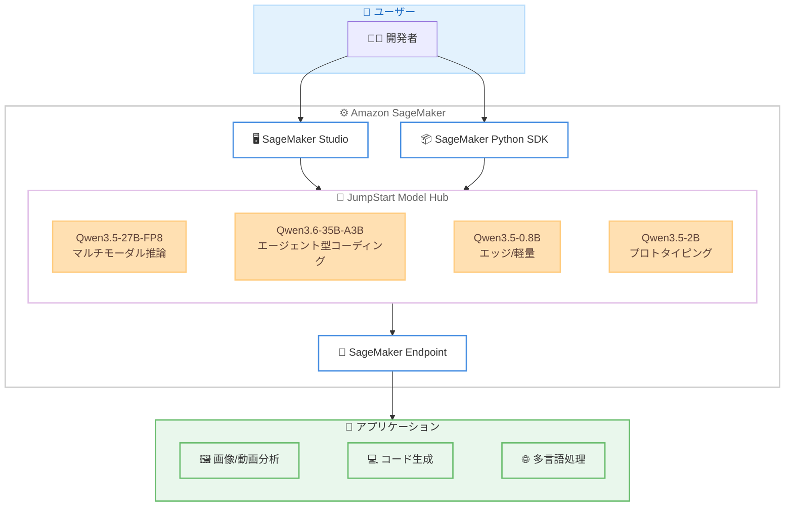

# Amazon SageMaker JumpStart - Qwen 3.5/3.6 モデルの追加

**リリース日**: 2026年5月4日
**サービス**: Amazon SageMaker JumpStart
**機能**: Qwen3.5-27B-FP8、Qwen3.6-35B-A3B、Qwen3.5-0.8B、Qwen3.5-2B の提供開始

📊 [このアップデートのインフォグラフィックを見る](https://takech9203.github.io/aws-news-summary/20260504-qwen-models-on-sagemaker-jumpstart.html)

## 概要

Amazon SageMaker JumpStart に 4 つの新しい Qwen モデルが追加された。Qwen3.5-27B-FP8、Qwen3.6-35B-A3B、Qwen3.5-0.8B、Qwen3.5-2B の 4 モデルで、マルチモーダル推論、エージェント型コーディング、多言語アプリケーションなど、異なる AI アプリケーションのニーズに対応する。

これらのモデルは Alibaba Cloud の Qwen ファミリーに属し、画像・動画・テキストにまたがるマルチモーダル理解から、軽量なエッジデプロイメントまで幅広いユースケースをカバーする。SageMaker Studio から数クリックでデプロイでき、SageMaker Python SDK を使用したプログラマティックなデプロイにも対応している。

**アップデート前の課題**

- SageMaker JumpStart で利用可能な Qwen モデルのバリエーションが限られていた
- マルチモーダル推論やエージェント型コーディングに特化した軽量モデルの選択肢が少なかった
- エッジデバイスやオンデバイス推論に適した超軽量マルチモーダルモデルが不足していた

**アップデート後の改善**

- 27B パラメータの高性能マルチモーダルモデルから 0.8B の超軽量モデルまで、用途に応じた選択が可能になった
- Mixture-of-Experts アーキテクチャによる効率的なエージェント型コーディングモデルが利用可能になった
- 200 以上の言語に対応し、最大 100 万トークンのロングコンテキスト処理が SageMaker 上で実現可能になった

## アーキテクチャ図



SageMaker JumpStart を通じて 4 つの Qwen モデルをデプロイし、さまざまなアプリケーションに活用するフローを示している。

## サービスアップデートの詳細

### 主要機能

1. **Qwen3.5-27B-FP8 - マルチモーダルビジョン言語モデル**
   - 画像、動画、テキストにまたがる推論が可能
   - エージェント型ツール使用、コーディング支援に対応
   - 複雑な数学的推論をサポート
   - 200 以上の言語での多言語コミュニケーション
   - 最大 100 万トークンのロングコンテキスト処理
   - FP8 量子化による効率的な推論

2. **Qwen3.6-35B-A3B - エージェント型コーディング特化 MoE モデル**
   - Mixture-of-Experts アーキテクチャで 30 億のアクティブパラメータ
   - フロントエンド開発に最適化
   - リポジトリレベルのコード推論が可能
   - マルチステップエージェントインタラクションに対応
   - コーディングコパイロットアプリケーション向け

3. **Qwen3.5-0.8B - 超軽量マルチモーダルモデル**
   - 高速プロトタイピング向け
   - ファインチューニングに適した小規模モデル
   - オンデバイス推論、エッジデプロイメント対応
   - 最小限のコンピュートフットプリントで多言語・マルチモーダル理解

4. **Qwen3.5-2B - 軽量マルチモーダルモデル**
   - プロトタイピングおよびファインチューニング向け
   - 中程度のコンピュートリソースでのデプロイ
   - 多言語テキスト生成に対応
   - 視覚理解と会話 AI タスクを効率的に処理

## 技術仕様

### モデル比較

| モデル | パラメータ数 | アーキテクチャ | 主な用途 | コンテキスト長 |
|--------|-------------|---------------|----------|---------------|
| Qwen3.5-27B-FP8 | 270 億 | Dense, FP8 量子化 | マルチモーダル推論、ツール使用 | 最大 100 万トークン |
| Qwen3.6-35B-A3B | 350 億 (30 億アクティブ) | Mixture-of-Experts | エージェント型コーディング | - |
| Qwen3.5-0.8B | 8 億 | Dense | エッジ/オンデバイス推論 | - |
| Qwen3.5-2B | 20 億 | Dense | プロトタイピング | - |

### API 変更履歴

| 日付 | サービス | 変更内容 |
|------|----------|----------|
| 2026/05/05 | [Amazon SageMaker Service](https://awsapichanges.com/archive/changes/2d415e-api.sagemaker.html) | 12 updated methods - ml.p5.4xlarge インスタンスタイプのサポート追加 |

### デプロイ方法

SageMaker JumpStart からのデプロイは以下の 2 つの方法で実行可能。

**SageMaker Studio (GUI)**:
- SageMaker Studio を開く
- JumpStart のモデルハブから対象の Qwen モデルを検索
- デプロイボタンをクリックしてエンドポイントを作成

**SageMaker Python SDK (プログラマティック)**:
```python
from sagemaker.jumpstart.model import JumpStartModel

# モデルのデプロイ例
model = JumpStartModel(model_id="huggingface-llm-qwen3-5-27b-fp8")
predictor = model.deploy()
```

## 設定方法

### 前提条件

1. AWS アカウントと SageMaker へのアクセス権限
2. SageMaker 実行ロール (IAM Role) の設定
3. 対象モデルに必要なインスタンスタイプのサービスクォータ

### 手順

#### ステップ 1: SageMaker Studio の起動

```bash
# AWS CLI で SageMaker ドメインを確認
aws sagemaker list-domains
```

SageMaker Studio にアクセスし、JumpStart セクションを開く。

#### ステップ 2: モデルの検索とデプロイ

```python
from sagemaker.jumpstart.model import JumpStartModel

# Qwen3.5-27B-FP8 のデプロイ例
model = JumpStartModel(
    model_id="huggingface-llm-qwen3-5-27b-fp8",
    role="arn:aws:iam::123456789012:role/SageMakerExecutionRole"
)

# エンドポイントの作成
predictor = model.deploy(
    initial_instance_count=1,
    instance_type="ml.g5.12xlarge"
)
```

SageMaker Python SDK を使用してモデルをデプロイする。model_id はモデルごとに異なる。

#### ステップ 3: 推論の実行

```python
# テキスト推論の例
response = predictor.predict({
    "inputs": "Explain quantum computing in simple terms.",
    "parameters": {
        "max_new_tokens": 256,
        "temperature": 0.7
    }
})
print(response)
```

デプロイしたエンドポイントに対してリクエストを送信し、推論結果を取得する。

## メリット

### ビジネス面

- **用途別モデル選択**: マルチモーダル推論からエッジデプロイまで、ビジネス要件に最適なモデルを選択可能
- **コスト最適化**: 0.8B や 2B の軽量モデルにより、プロトタイピングやエッジ環境でのコストを抑制
- **多言語対応**: 200 以上の言語をサポートし、グローバルなアプリケーション展開が容易

### 技術面

- **MoE アーキテクチャ**: Qwen3.6-35B-A3B は 30 億のアクティブパラメータのみで 350 億パラメータ相当の性能を実現
- **ロングコンテキスト**: 100 万トークンのコンテキスト長により、大規模ドキュメントの処理が可能
- **FP8 量子化**: Qwen3.5-27B-FP8 は FP8 量子化により、メモリ効率と推論速度を改善
- **JumpStart 統合**: 数クリックまたは数行のコードでデプロイ完了

## デメリット・制約事項

### 制限事項

- SageMaker JumpStart 経由のデプロイに限定される (SageMaker エンドポイントの料金が発生)
- 大規模モデル (27B、35B) のデプロイには GPU インスタンスが必要で、サービスクォータの引き上げが必要な場合がある
- FP8 量子化モデルは精度がわずかに低下する可能性がある

### 考慮すべき点

- モデルのライセンス条件 (Qwen モデルは Apache 2.0 ライセンスだが、使用前に最新のライセンスを確認すること)
- 推論コストはインスタンスタイプとリクエスト量に依存するため、事前にコスト見積もりを実施すること
- Mixture-of-Experts モデルはメモリ使用量が大きいため、インスタンスタイプの選定に注意が必要

## ユースケース

### ユースケース 1: マルチモーダルドキュメント分析

**シナリオ**: 企業内の PDF ドキュメントや画像付きレポートを自動的に分析し、要約や質問応答を行う。

**実装例**:
```python
# Qwen3.5-27B-FP8 を使用した画像付きドキュメント分析
response = predictor.predict({
    "inputs": [
        {"type": "image", "image_url": "s3://bucket/document.png"},
        {"type": "text", "text": "この文書の主要なポイントを要約してください。"}
    ],
    "parameters": {"max_new_tokens": 512}
})
```

**効果**: 画像とテキストを統合的に理解し、人手による確認作業を大幅に削減。100 万トークンのロングコンテキストにより、大規模文書も一括処理可能。

### ユースケース 2: エージェント型コード生成パイプライン

**シナリオ**: 開発チームがリポジトリ全体のコンテキストを理解したコード生成エージェントを構築する。

**実装例**:
```python
# Qwen3.6-35B-A3B を使用したエージェント型コーディング
response = predictor.predict({
    "inputs": "このリポジトリの認証モジュールにOAuth2.0サポートを追加するコードを生成してください。",
    "parameters": {
        "max_new_tokens": 2048,
        "temperature": 0.3
    }
})
```

**効果**: MoE アーキテクチャによる効率的な推論で、リポジトリレベルのコード理解とマルチステップのコード生成が可能。フロントエンド開発やリファクタリング提案にも活用可能。

### ユースケース 3: エッジデバイスでの多言語チャットボット

**シナリオ**: IoT デバイスや組み込みシステム上で動作する多言語対応のチャットボットを構築する。

**実装例**:
```python
# Qwen3.5-0.8B をファインチューニングしてエッジデプロイ
from sagemaker.jumpstart.model import JumpStartModel

model = JumpStartModel(model_id="huggingface-llm-qwen3-5-0-8b")
# ファインチューニング後にエッジデバイスへエクスポート
```

**効果**: 0.8B パラメータの超軽量モデルにより、限られたリソースのデバイスでもリアルタイムの多言語対応が可能。ネットワーク接続が不安定な環境でもローカル推論で安定したサービスを提供。

## 料金

SageMaker JumpStart のモデルデプロイ料金は、使用するインスタンスタイプと稼働時間に基づく。モデル自体の追加料金は発生しない。

### 料金例

| モデル | 推奨インスタンス | 1 時間あたりの料金 (概算、us-east-1) |
|--------|-----------------|--------------------------------------|
| Qwen3.5-27B-FP8 | ml.g5.12xlarge | $7.09 |
| Qwen3.6-35B-A3B | ml.g5.12xlarge | $7.09 |
| Qwen3.5-0.8B | ml.g5.xlarge | $1.41 |
| Qwen3.5-2B | ml.g5.xlarge | $1.41 |

※ 実際の料金は AWS 公式料金ページで確認すること。インスタンスタイプはモデル要件に応じて変動する可能性がある。

## 利用可能リージョン

Amazon SageMaker JumpStart が利用可能なすべてのリージョンで利用可能。主なリージョンは以下の通り。

- 米国東部 (バージニア北部) - us-east-1
- 米国東部 (オハイオ) - us-east-2
- 米国西部 (オレゴン) - us-west-2
- アジアパシフィック (東京) - ap-northeast-1
- アジアパシフィック (シンガポール) - ap-southeast-1
- アジアパシフィック (シドニー) - ap-southeast-2
- 欧州 (アイルランド) - eu-west-1
- 欧州 (フランクフルト) - eu-central-1

## 関連サービス・機能

- **Amazon SageMaker Studio**: モデルのデプロイと管理を行う統合開発環境
- **Amazon SageMaker Endpoints**: デプロイされたモデルのリアルタイム推論エンドポイント
- **Amazon Bedrock**: マネージド型の基盤モデルサービス (別途 Qwen 対応状況を確認)
- **AWS Inferentia / Trainium**: カスタムチップによる推論/学習の高速化

## 参考リンク

- 📊 [インフォグラフィック](https://takech9203.github.io/aws-news-summary/20260504-qwen-models-on-sagemaker-jumpstart.html)
- [公式発表 (What's New)](https://aws.amazon.com/about-aws/whats-new/2026/05/qwen-models-on-sagemaker-jumpstart/)
- [Amazon SageMaker JumpStart ドキュメント](https://docs.aws.amazon.com/sagemaker/latest/dg/studio-jumpstart.html)
- [SageMaker 料金ページ](https://aws.amazon.com/sagemaker/pricing/)

## まとめ

Amazon SageMaker JumpStart への 4 つの Qwen モデル追加により、マルチモーダル推論 (27B)、エージェント型コーディング (35B MoE)、エッジ推論 (0.8B)、プロトタイピング (2B) と、幅広い AI アプリケーションニーズに対応できるようになった。特に Qwen3.6-35B-A3B の Mixture-of-Experts アーキテクチャは、30 億のアクティブパラメータで効率的なコーディング支援を実現する点が注目に値する。開発チームは、まず SageMaker JumpStart からワンクリックでモデルをデプロイし、ユースケースに応じた評価を開始することを推奨する。
