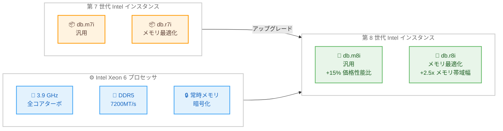

# Amazon RDS for SQL Server - M8i / R8i インスタンスサポート

**リリース日**: 2026 年 5 月 4 日
**サービス**: Amazon RDS for SQL Server
**機能**: M8i および R8i インスタンスタイプのサポート

📊 [このアップデートのインフォグラフィックを見る](https://takech9203.github.io/aws-news-summary/20260504-rds-sqlserver-supports-m8i-r8i-instances.html)

## 概要

Amazon RDS for SQL Server が M8i および R8i インスタンスをサポートしました。これらのインスタンスは、AWS 専用にカスタマイズされた Intel Xeon 6 プロセッサを搭載しており、クラウド上の同等の Intel プロセッサの中で最高のパフォーマンスと最速のメモリ帯域幅を提供します。

M8i インスタンスは汎用ワークロード向け、R8i インスタンスはメモリ最適化ワークロード向けに設計されており、第 7 世代の Intel ベースインスタンスと比較して最大 15% の価格性能比改善と 2.5 倍のメモリ帯域幅を実現します。SQL Server ワークロードを実行する Solutions Architect やデータベース管理者にとって、コスト効率とパフォーマンスの両面で大きな改善が期待できるアップデートです。

**アップデート前の課題**

- 第 7 世代インスタンス (M7i / R7i) ではメモリ帯域幅が限定的で、大規模な SQL Server ワークロードのスループットに制約があった
- インメモリ OLTP や大規模データウェアハウスクエリで、メモリ帯域幅がボトルネックとなるケースがあった
- 同等のパフォーマンスを得るために、より大きなインスタンスサイズを選択する必要があり、コストが増加していた

**アップデート後の改善**

- Intel Xeon 6 プロセッサの搭載により、最大 15% の価格性能比向上を実現
- DDR5 7200MT/s メモリの採用で 2.5 倍のメモリ帯域幅を提供し、メモリ集約型クエリの処理速度が向上
- 常時メモリ暗号化 (Always-on Memory Encryption) のサポートにより、セキュリティが強化
- 全体的なパフォーマンスが M7i 比で最大 20% 向上

## アーキテクチャ図



第 7 世代から第 8 世代 Intel インスタンスへのアップグレードパスと、Intel Xeon 6 プロセッサの主要な技術仕様を示しています。

## サービスアップデートの詳細

### 主要機能

1. **カスタム Intel Xeon 6 プロセッサ**
   - AWS 専用に設計されたカスタムプロセッサ
   - 全コア持続ターボ周波数 3.9 GHz
   - クラウド上の同等 Intel プロセッサの中で最高の計算性能
   - Advanced Matrix Extensions (AMX) with FP16 サポート

2. **DDR5 高速メモリ**
   - DDR5 7200MT/s DIMM を採用
   - 前世代比 2.5 倍のメモリスループット
   - メモリ集約型の SQL Server ワークロードに最適

3. **常時メモリ暗号化**
   - Always-on Memory Encryption をハードウェアレベルでサポート
   - 追加のパフォーマンスオーバーヘッドなしにデータ保護を実現
   - コンプライアンス要件への対応が容易

## 技術仕様

### インスタンスファミリー比較

| 項目 | M7i / R7i | M8i / R8i |
|------|-----------|-----------|
| プロセッサ | Intel Xeon Sapphire Rapids | Intel Xeon 6 (AWS カスタム) |
| 全コアターボ周波数 | 3.2 GHz | 3.9 GHz |
| メモリタイプ | DDR5 4800MT/s | DDR5 7200MT/s |
| メモリ帯域幅 | ベースライン | 2.5 倍向上 |
| 価格性能比 | ベースライン | 最大 15% 改善 |
| 全体パフォーマンス | ベースライン | 最大 20% 向上 |
| メモリ暗号化 | ソフトウェアベース | 常時ハードウェア暗号化 |
| EBS 帯域幅 (最大) | 40 Gbps | 80 Gbps |
| ネットワーク帯域幅 (最大) | 50 Gbps | 100 Gbps |

### M8i インスタンスの特徴 (汎用)

| 項目 | 詳細 |
|------|------|
| 用途 | 汎用ワークロード、バランスの取れたコンピューティングとメモリ |
| vCPU : メモリ比率 | 1:4 |
| EBS 帯域幅 | 最大 80 Gbps |
| ネットワーク帯域幅 | 最大 100 Gbps |
| EFA サポート | 48xlarge, 96xlarge, metal サイズ |

### R8i インスタンスの特徴 (メモリ最適化)

| 項目 | 詳細 |
|------|------|
| 用途 | メモリ集約型ワークロード、大規模データベース |
| vCPU : メモリ比率 | 1:8 |
| EBS 帯域幅 | 最大 80 Gbps |
| ネットワーク帯域幅 | 最大 100 Gbps |
| SAP 認定 | 13 サイズで認定済み |
| aSAPS | 142,100 (同等マシン中最高) |

## 設定方法

### 前提条件

1. Amazon RDS for SQL Server のデータベースインスタンスが存在すること
2. 対象リージョンで M8i / R8i インスタンスが利用可能であること
3. SQL Server のバージョンが M8i / R8i でサポートされていること

### 手順

#### ステップ 1: 既存インスタンスの変更 (マネジメントコンソール)

1. RDS マネジメントコンソールにアクセス
2. 対象のデータベースインスタンスを選択
3. [Modify] をクリック
4. DB instance class で `db.m8i` または `db.r8i` ファミリーを選択
5. 変更を適用 (即時適用またはメンテナンスウィンドウで適用)

#### ステップ 2: AWS CLI による既存インスタンスの変更

```bash
aws rds modify-db-instance \
  --db-instance-identifier my-sqlserver-instance \
  --db-instance-class db.m8i.2xlarge \
  --apply-immediately
```

既存の RDS for SQL Server インスタンスのインスタンスクラスを db.m8i.2xlarge に変更します。`--apply-immediately` を指定すると即時適用されますが、短時間のダウンタイムが発生します。

#### ステップ 3: 新規インスタンスの作成

```bash
aws rds create-db-instance \
  --db-instance-identifier my-new-sqlserver \
  --db-instance-class db.r8i.4xlarge \
  --engine sqlserver-ee \
  --master-username admin \
  --master-user-password <password> \
  --allocated-storage 200
```

R8i インスタンスを使用して新しい RDS for SQL Server Enterprise Edition インスタンスを作成します。メモリ最適化が必要な大規模ワークロード向けに R8i を選択しています。

## メリット

### ビジネス面

- **コスト削減**: 最大 15% の価格性能比改善により、同じワークロードをより低コストで実行可能
- **ライセンス最適化**: より小さなインスタンスサイズで同等のパフォーマンスを達成でき、SQL Server のコアベースライセンスコストを削減可能
- **セキュリティ強化**: 常時メモリ暗号化により、追加コストなしでコンプライアンス要件に対応

### 技術面

- **メモリ帯域幅の大幅向上**: 2.5 倍のメモリ帯域幅により、インメモリ OLTP やカラムストアインデックスの処理速度が向上
- **高い全コアターボ周波数**: 3.9 GHz の持続ターボ周波数により、SQL Server の並列クエリ実行が高速化
- **AMX アクセラレータ**: FP16 サポートによる CPU ベースの推論ワークロード対応で、将来の AI/ML 統合に備えた基盤を提供
- **高帯域ネットワーキング**: 最大 100 Gbps のネットワーク帯域幅により、レプリケーションやバックアップの高速化を実現

## デメリット・制約事項

### 制限事項

- 全てのリージョンで即座に利用可能とは限らない (利用可能リージョンは料金ページを参照)
- インスタンスクラス変更時に短時間のダウンタイムが発生する
- 一部の古い SQL Server バージョンでは M8i / R8i がサポートされない可能性がある

### 考慮すべき点

- インスタンスクラス変更前に、現在のワークロードパターンを分析し、適切なインスタンスサイズを選定すること
- Multi-AZ 配置の場合、フェイルオーバーを利用したローリングアップグレードを計画すること
- パラメータグループやオプショングループの互換性を事前に確認すること
- 移行前にテスト環境で性能検証を実施することを推奨

## ユースケース

### ユースケース 1: 基幹業務システムのデータベース最適化

**シナリオ**: 大規模な ERP システムの SQL Server データベースが db.m7i.4xlarge で稼働しており、ピーク時にメモリ帯域幅がボトルネックとなりレスポンスが低下している。

**実装例**:
```bash
# Multi-AZ 環境でのローリングアップグレード
aws rds modify-db-instance \
  --db-instance-identifier erp-production-db \
  --db-instance-class db.m8i.4xlarge \
  --apply-immediately false
```

**効果**: 2.5 倍のメモリ帯域幅により、ピーク時のレスポンスタイムが改善。同じインスタンスサイズで 15% の価格性能比向上を実現し、年間のインフラコストを削減。

### ユースケース 2: データウェアハウスのクエリ高速化

**シナリオ**: SQL Server のカラムストアインデックスを活用した分析クエリが、メモリ集約型の処理で時間がかかっている。db.r7i.8xlarge を使用中。

**実装例**:
```bash
# メモリ最適化インスタンスへのアップグレード
aws rds modify-db-instance \
  --db-instance-identifier analytics-dw \
  --db-instance-class db.r8i.8xlarge \
  --apply-immediately false
```

**効果**: R8i のメモリ帯域幅向上により、カラムストアスキャンやバッチモード処理が高速化。DDR5 7200MT/s メモリにより、大量データの集計クエリが従来比で大幅に短縮。

### ユースケース 3: セキュリティ要件の厳しい金融系システム

**シナリオ**: 金融規制により、データベース上のデータを常時暗号化する必要がある。従来はソフトウェアベースの暗号化によるパフォーマンスオーバーヘッドが課題だった。

**実装例**:
```bash
# 常時メモリ暗号化対応インスタンスへの移行
aws rds create-db-instance \
  --db-instance-identifier finance-secure-db \
  --db-instance-class db.r8i.4xlarge \
  --engine sqlserver-ee \
  --storage-encrypted \
  --kms-key-id arn:aws:kms:ap-northeast-1:123456789012:key/example-key \
  --master-username admin \
  --master-user-password <password> \
  --allocated-storage 500
```

**効果**: ハードウェアレベルの常時メモリ暗号化により、パフォーマンスを犠牲にすることなくコンプライアンス要件を満たす。監査対応も容易になり、運用負荷を軽減。

## 料金

M8i / R8i インスタンスの料金は、前世代と同等またはそれ以下の単位時間あたりコストで提供されます。価格性能比が 15% 改善されているため、同じワークロードに対してより低いコストで運用が可能です。

詳細な料金情報は [Amazon RDS for SQL Server Pricing](https://aws.amazon.com/rds/sqlserver/pricing/) を参照してください。

### 料金モデル

| 項目 | 説明 |
|------|------|
| オンデマンド | 時間単位の従量課金 |
| リザーブドインスタンス | 1 年または 3 年のコミットメントで最大 60% 割引 |
| ライセンス | License Included または Bring Your Own License (BYOL) |

## 利用可能リージョン

M8i および R8i インスタンスの利用可能リージョンは [Amazon RDS for SQL Server Pricing](https://aws.amazon.com/rds/sqlserver/pricing/) ページで確認できます。EC2 インスタンスとしては主要なリージョンで既に提供されているため、RDS での対応も順次拡大されることが期待されます。

## 関連サービス・機能

- **Amazon EC2 M8i / R8i**: RDS の基盤となる同一プロセッサファミリーの EC2 インスタンス
- **Amazon RDS Multi-AZ**: M8i / R8i インスタンスと組み合わせた高可用性構成
- **Amazon RDS Performance Insights**: 新インスタンスでのパフォーマンスモニタリングとボトルネック分析
- **AWS Database Migration Service**: 既存の SQL Server ワークロードの RDS への移行支援

## 参考リンク

- 📊 [インフォグラフィック](https://takech9203.github.io/aws-news-summary/20260504-rds-sqlserver-supports-m8i-r8i-instances.html)
- [公式発表 (What's New)](https://aws.amazon.com/about-aws/whats-new/2026/05/rds-sqlserver-supports-m8i-r8i-instances/)
- [Amazon RDS for SQL Server](https://aws.amazon.com/rds/sqlserver/)
- [Amazon RDS for SQL Server 料金](https://aws.amazon.com/rds/sqlserver/pricing/)
- [Amazon EC2 M8i インスタンスタイプ](https://aws.amazon.com/ec2/instance-types/m8i/)
- [Amazon EC2 R8i インスタンスタイプ](https://aws.amazon.com/ec2/instance-types/r8i/)

## まとめ

Amazon RDS for SQL Server の M8i / R8i インスタンスサポートは、Intel Xeon 6 プロセッサによる最大 15% の価格性能比改善と 2.5 倍のメモリ帯域幅向上を提供する重要なアップデートです。特にメモリ集約型の SQL Server ワークロードを運用している環境では、同じインスタンスサイズでのパフォーマンス向上またはインスタンスサイズのダウンサイジングによるコスト削減が期待できます。既存環境からの移行はインスタンスクラスの変更のみで完了するため、テスト環境での検証後に本番環境への適用を推奨します。
