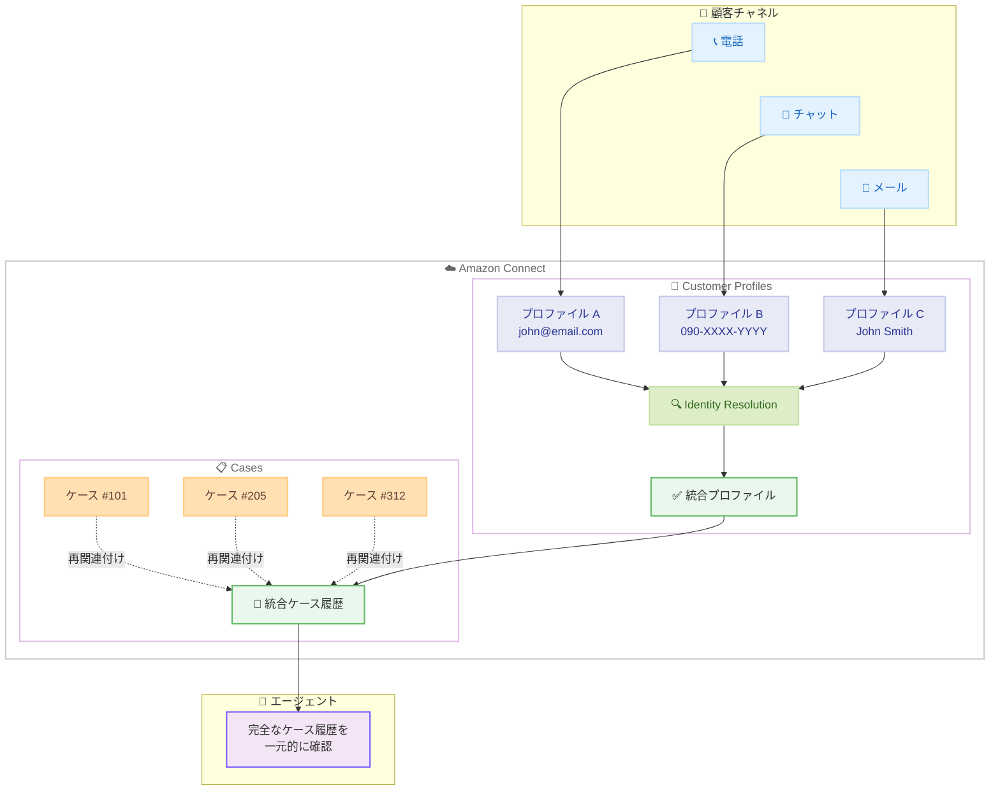

# Amazon Connect Cases - Customer Profiles Identity Resolution 連携

**リリース日**: 2026 年 5 月 5 日
**サービス**: Amazon Connect
**機能**: Cases と Customer Profiles Identity Resolution の連携

📊 [このアップデートのインフォグラフィックを見る](https://takech9203.github.io/aws-news-summary/20260505-amazon-connect-cases-customer-profiles-id-res.html)

## 概要

Amazon Connect Cases が Customer Profiles の Identity Resolution 機能と連携し、重複する顧客プロファイルが統合された際にケースを自動的に再関連付けする機能が追加されました。これにより、エージェントは常に各顧客の完全なケース履歴を一元的に確認できるようになります。

顧客が異なるチャネルから問い合わせたり、異なる連絡先情報を提供したりすることで、同一顧客に対して複数のプロファイルが作成されることがあります。Identity Resolution はこれらの重複を検出して統合し、Cases は統合されたプロファイルの下にすべての関連ケースを自動的に集約します。エージェントはプロファイルを横断して検索したり、顧客の履歴を手動でつなぎ合わせたりする必要がなくなります。

この機能は、オムニチャネル対応のコンタクトセンターにおいて、顧客体験の一貫性と品質を向上させるために重要なアップデートです。

**アップデート前の課題**

- 同一顧客が電話、チャット、メールなど異なるチャネルで問い合わせると、それぞれ別のプロファイルが作成され、ケースが分散してしまう
- エージェントが顧客の完全な対応履歴を把握するためには、複数のプロファイルを手動で検索する必要がある
- Identity Resolution でプロファイルが統合されても、Cases 側のケースは元のプロファイルに紐づいたまま残り、統合が反映されない
- 顧客の過去の問い合わせ状況を把握できず、同じ説明を繰り返させるなど顧客体験が低下する

**アップデート後の改善**

- Identity Resolution によるプロファイル統合時に、関連するすべてのケースが自動的に統合後のプロファイルに再関連付けされる
- エージェントは単一のプロファイルから顧客の完全なケース履歴を確認でき、手動検索が不要になる
- オムニチャネルでの問い合わせ履歴が自動的に統合され、顧客対応の品質と効率が向上する
- 追加の設定や開発作業なしに、既存の Identity Resolution の設定と連動して自動的に動作する

## アーキテクチャ図

Identity Resolution が重複プロファイルを検出・統合すると、Cases が自動的にすべての関連ケースを統合プロファイルの下に再関連付けし、エージェントは完全な履歴を確認できます。

## サービスアップデートの詳細

### 主要機能

1. **ケースの自動再関連付け**
   - Identity Resolution によってプロファイルが統合されると、元のプロファイルに紐づいていたケースが自動的に統合後のプロファイルに移動する
   - エージェントや管理者による手動操作は不要
   - 既存のケースデータや履歴は維持されたまま再関連付けが行われる

2. **Identity Resolution との統合**
   - Amazon Connect Customer Profiles の Identity Resolution が重複プロファイルを検出・統合する既存の機能を活用
   - 機械学習ベースのマッチングアルゴリズムにより、名前、メールアドレス、電話番号などの属性から同一顧客を識別
   - 自動統合ルールまたは手動承認ワークフローのいずれにも対応

3. **完全なケース履歴の統合ビュー**
   - 統合後のプロファイルから、すべてのチャネルで作成されたケースを一覧で確認可能
   - ケースのステータス、タイムライン、コメント、添付ファイルなどすべての情報が保持される
   - エージェントワークスペースでシームレスに表示

## 技術仕様

### 動作の仕組み

| 項目 | 詳細 |
|------|------|
| トリガー | Identity Resolution によるプロファイル統合イベント |
| 対象 | 統合元プロファイルに関連付けられたすべてのケース |
| 動作 | ケースの顧客プロファイル参照を統合先プロファイルに更新 |
| データ保持 | ケースの内容、履歴、メタデータはすべて維持 |
| 追加設定 | 不要 - Identity Resolution が有効であれば自動的に動作 |

### 前提条件

| 項目 | 要件 |
|------|------|
| Amazon Connect Cases | 有効化済み |
| Customer Profiles | 有効化済み |
| Identity Resolution | 設定・有効化済み |
| 追加の IAM 権限 | 不要 |

## 設定方法

### 前提条件

1. Amazon Connect インスタンスが作成済みであること
2. Amazon Connect Customer Profiles が有効化されていること
3. Identity Resolution が設定・有効化されていること
4. Amazon Connect Cases が有効化されていること

### 手順

#### ステップ 1: Customer Profiles の有効化確認

Amazon Connect コンソールで Customer Profiles が有効になっていることを確認します。Customer Profiles は顧客データの統合管理基盤であり、Identity Resolution の前提条件です。

#### ステップ 2: Identity Resolution の設定確認

Customer Profiles の設定画面で Identity Resolution が有効になっていることを確認します。Identity Resolution は機械学習を使用して重複プロファイルを自動検出し、統合ルールに基づいてプロファイルをマージします。

#### ステップ 3: Cases の有効化確認

Amazon Connect Cases が有効化されていることを確認します。Cases が有効であれば、Identity Resolution によるプロファイル統合時に自動的にケースの再関連付けが行われます。追加の設定は不要です。

## メリット

### ビジネス面

- **顧客体験の向上**: エージェントが完全な対応履歴を把握できるため、顧客に同じ説明を繰り返させることがなくなり、満足度が向上
- **対応効率の改善**: 複数プロファイルを検索する手間がなくなり、平均対応時間 (AHT) の短縮が期待できる
- **オムニチャネル対応の強化**: チャネルをまたいだ問い合わせ履歴が自動統合されるため、真のオムニチャネル体験を提供可能

### 技術面

- **設定不要の自動動作**: Identity Resolution の既存設定と連動し、追加の設定や開発作業なしに利用可能
- **データの整合性維持**: ケースのデータや履歴はすべて保持されたまま再関連付けが行われ、情報の損失がない
- **スケーラビリティ**: 大量のプロファイル統合にも対応し、バックグラウンドで自動的に処理される

## デメリット・制約事項

### 制限事項

- Identity Resolution が有効化されていない環境では利用できない
- Identity Resolution の精度に依存するため、誤ったプロファイル統合が行われた場合、ケースも誤って再関連付けされる可能性がある
- プロファイル統合の取り消し時のケース再分離の動作については公式ドキュメントでの確認が必要

### 考慮すべき点

- Identity Resolution の統合ルールの精度を定期的に確認し、誤統合を最小限に抑える運用が重要
- 大量のプロファイル統合が一度に発生した場合の処理時間やパフォーマンスへの影響を考慮する

## ユースケース

### ユースケース 1: オムニチャネルコンタクトセンター

**シナリオ**: 顧客が最初に電話で問い合わせてケースを作成し、後日チャットで別の問い合わせを行った場合。電話とチャットで異なる連絡先情報が使用されたため、別々のプロファイルが作成されている。

**効果**: Identity Resolution が同一顧客であることを検出してプロファイルを統合すると、両方のケースが自動的に統合プロファイルに集約され、次回問い合わせ時にエージェントは完全な履歴を確認できる。

### ユースケース 2: EC サイトのカスタマーサポート

**シナリオ**: 顧客が個人用メールアドレスと会社用メールアドレスの両方でサポートに問い合わせており、それぞれ別のプロファイルで複数のケースが作成されている。

**効果**: Identity Resolution が名前や電話番号などの共通属性から同一顧客を特定し、プロファイル統合後にすべての注文関連ケースが一つのプロファイルに集約される。サポートエージェントは顧客の全注文履歴と対応状況を把握できる。

### ユースケース 3: 金融機関のカスタマーサービス

**シナリオ**: 銀行の顧客が、口座開設時と住所変更時に異なる電話番号を登録し、それぞれの問い合わせで別プロファイルが作成されている。口座に関するケースと住所変更のケースが分散している。

**効果**: プロファイル統合により、口座関連のすべてのケースが一元化され、コンプライアンス対応や監査時にも顧客の完全な対応履歴を追跡できる。

## 料金

Amazon Connect Cases の料金は、既存の Amazon Connect Cases の料金体系に含まれます。Identity Resolution との連携による追加料金は発生しません。

| コンポーネント | 料金 |
|----------------|------|
| Amazon Connect Cases | ケースあたりの従量課金 |
| Customer Profiles | プロファイルあたりの従量課金 |
| Identity Resolution | プロファイル処理量に基づく従量課金 |

詳細な料金については [Amazon Connect 料金ページ](https://aws.amazon.com/connect/pricing/) を参照してください。

## 利用可能リージョン

以下の AWS リージョンで利用可能です。

- 米国東部 (バージニア北部)
- 米国西部 (オレゴン)
- カナダ (中部)
- 欧州 (フランクフルト)
- 欧州 (ロンドン)
- アジアパシフィック (ソウル)
- アジアパシフィック (シンガポール)
- アジアパシフィック (シドニー)
- アジアパシフィック (東京)
- アフリカ (ケープタウン)

## 関連サービス・機能

- **Amazon Connect Customer Profiles**: 顧客データを統合し、エージェントに統一された顧客ビューを提供するサービス
- **Amazon Connect Customer Profiles Identity Resolution**: 機械学習を使用して重複する顧客プロファイルを自動検出・統合する機能
- **Amazon Connect Cases**: 顧客の問い合わせをケースとして追跡・管理する機能

## 参考リンク

- 📊 [インフォグラフィック](https://takech9203.github.io/aws-news-summary/20260505-amazon-connect-cases-customer-profiles-id-res.html)
- [公式発表 (What's New)](https://aws.amazon.com/about-aws/whats-new/2026/05/amazon-connect-cases-customer-profiles-id-res/)
- [Amazon Connect Cases ウェブページ](https://aws.amazon.com/connect/cases/)
- [Amazon Connect Cases ドキュメント](https://docs.aws.amazon.com/connect/latest/adminguide/cases.html)
- [Amazon Connect 料金ページ](https://aws.amazon.com/connect/pricing/)

## まとめ

Amazon Connect Cases と Customer Profiles Identity Resolution の連携により、オムニチャネル環境で発生する顧客プロファイルの重複問題が自動的に解消され、エージェントは常に完全なケース履歴にアクセスできるようになりました。追加の設定なしに利用できるため、既に Identity Resolution を利用している組織はすぐにメリットを享受できます。コンタクトセンターの顧客体験向上と運用効率改善を目指す組織にとって、重要なアップデートです。
