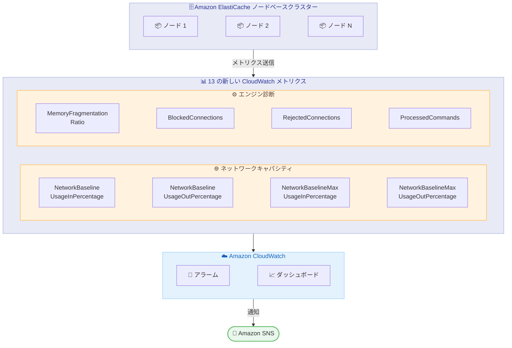

# Amazon ElastiCache - ネットワークキャパシティプランニングおよびエンジン診断用の 13 の新しい CloudWatch メトリクス

**リリース日**: 2026 年 5 月 5 日
**サービス**: Amazon ElastiCache
**機能**: ノードベースクラスター向け 13 の新しい Amazon CloudWatch メトリクス

📊 [このアップデートのインフォグラフィックを見る](https://takech9203.github.io/aws-news-summary/20260505-amazon-elasticache-cloudwatch-metrics-network-engine-diagnostics.html)

## 概要

Amazon ElastiCache のノードベースクラスターに、ネットワークキャパシティプランニングおよびエンジン診断のための 13 の新しい Amazon CloudWatch メトリクスが追加されました。これにより、ネットワークスロットリング、メモリフラグメンテーション、コネクション枯渇を CloudWatch から直接検出できるようになります。

従来は個別ノードに対して INFO コマンドを実行したり、生のバイトカウンターからベースラインを計算する必要がありましたが、今回のアップデートによりホストレベルおよびエンジンレベルの診断情報を CloudWatch で一元的に監視できるようになりました。本機能はすべての商用 AWS リージョン、AWS China リージョン、AWS GovCloud (US) リージョンで追加料金なしで利用可能です。

**アップデート前の課題**

- ネットワーク使用率を把握するために生のバイトカウンターからベースラインを手動で計算する必要があった
- エンジンの健全性を確認するために個別ノードで INFO コマンドを実行する必要があり、運用負荷が高かった
- インスタンスタイプを変更するたびにネットワークアラームの閾値を再設定する必要があった
- メモリフラグメンテーションやコネクション枯渇の検出がリアクティブになりがちだった
- Pub/Sub チャネルの利用状況をノード単位で把握する手段が限られていた

**アップデート後の改善**

- ネットワーク使用率がベースラインに対するパーセンテージで表示され、インスタンスタイプの変更に依存しないポータブルなアラームの設定が可能になった
- CloudWatch のみでホストレベル・エンジンレベルの診断が完結し、INFO コマンドの手動実行が不要になった
- メモリフラグメンテーション、ブロックされた接続、拒否された接続をリアルタイムで監視し、プロアクティブな対応が可能になった
- Pub/Sub チャネル数の監視により、クラシックからシャード Pub/Sub への移行判断に必要なデータが得られるようになった

## アーキテクチャ図



ElastiCache ノードベースクラスターから 13 の新しいメトリクスが CloudWatch に送信され、アラームやダッシュボードを通じてネットワークキャパシティとエンジンの健全性をリアルタイムに監視するフローを示しています。

## サービスアップデートの詳細

### 主要機能

1. **ネットワークキャパシティメトリクス**
   - `NetworkBaselineUsageInPercentage`: インバウンドネットワーク使用率 (インスタンスベースライン比)
   - `NetworkBaselineUsageOutPercentage`: アウトバウンドネットワーク使用率 (インスタンスベースライン比)
   - `NetworkBaselineMaxUsageInPercentage`: インバウンドの 1 秒あたりのピーク使用率
   - `NetworkBaselineMaxUsageOutPercentage`: アウトバウンドの 1 秒あたりのピーク使用率
   - 100% を超える値はバーストクレジットを消費していることを示し、持続するとスロットリングが発生する

2. **メモリヘルスメトリクス**
   - `UsedMemoryDataset`: エンジンオーバーヘッドを除いた実データのメモリ消費量
   - `AllocatorFragmentationBytes`: アロケーターのフラグメンテーション量 (バイト)
   - `AllocatorFragmentationRatio`: フラグメンテーション比率 (`activedefrag` パラメータで対処可能)
   - `MajorPageFaults`: エンジンが検知できないメモリプレッシャーを示す OS レベルのページフォルト

3. **接続ヘルスメトリクス**
   - `BlockedConnections`: ブロッキングコマンドで待機中の接続数
   - `RejectedConnections`: `maxclients` 制限到達により拒否された接続数
   - `RejectedConnections` が非ゼロの場合、`maxclients` の引き上げまたはクライアント側のコネクションプールリークの調査が必要

4. **Pub/Sub ワークロードメトリクス**
   - `PubSubChannels`: 各ノードのアクティブなクラシック Pub/Sub チャネル数
   - `PubSubShardChannels`: 各ノードのアクティブなシャード Pub/Sub チャネル数
   - クラシックチャネル数が増加している場合、水平スケールのためにシャード Pub/Sub への切り替えを検討

5. **コマンドスループットメトリクス**
   - `ProcessedCommands`: 全コマンドタイプにわたる合計コマンドスループット

## 技術仕様

### 新規メトリクス一覧

| カテゴリ | メトリクス名 | 説明 |
|----------|-------------|------|
| ネットワーク | NetworkBaselineUsageInPercentage | インバウンド使用率 (ベースライン比) |
| ネットワーク | NetworkBaselineUsageOutPercentage | アウトバウンド使用率 (ベースライン比) |
| ネットワーク | NetworkBaselineMaxUsageInPercentage | インバウンドピーク使用率 |
| ネットワーク | NetworkBaselineMaxUsageOutPercentage | アウトバウンドピーク使用率 |
| メモリ | UsedMemoryDataset | データセットのメモリ使用量 |
| メモリ | AllocatorFragmentationBytes | フラグメンテーション量 |
| メモリ | AllocatorFragmentationRatio | フラグメンテーション比率 |
| メモリ | MajorPageFaults | メジャーページフォルト数 |
| 接続 | BlockedConnections | ブロック中の接続数 |
| 接続 | RejectedConnections | 拒否された接続数 |
| Pub/Sub | PubSubChannels | クラシックチャネル数 |
| Pub/Sub | PubSubShardChannels | シャードチャネル数 |
| スループット | ProcessedCommands | 処理コマンド合計数 |

### メトリクスの解釈ガイド

| メトリクス | 正常値 | 警告値 | 対処方法 |
|-----------|--------|--------|----------|
| NetworkBaselineUsage*Percentage | 80% 未満 | 100% 超 | インスタンスタイプの変更またはワークロードの分散 |
| AllocatorFragmentationRatio | 1.0 - 1.5 | 1.5 超 | `activedefrag yes` の有効化 |
| RejectedConnections | 0 | 1 以上 | `maxclients` 引き上げまたはコネクションプール見直し |
| MajorPageFaults | 0 | 1 以上 | メモリサイズの増加またはデータ量の削減 |

## 設定方法

### 前提条件

1. Amazon ElastiCache ノードベースクラスターが稼働していること
2. CloudWatch へのアクセス権限を持つ IAM ロール/ユーザーが存在すること
3. メトリクスは自動的に発行されるため、追加の設定は不要

### 手順

#### ステップ 1: CloudWatch コンソールでメトリクスを確認

```bash
# AWS CLI でメトリクスの一覧を確認
aws cloudwatch list-metrics \
  --namespace "AWS/ElastiCache" \
  --metric-name "NetworkBaselineUsageInPercentage"
```

`AWS/ElastiCache` 名前空間に新しいメトリクスが自動的に発行されていることを確認します。

#### ステップ 2: ネットワークスロットリングアラームの設定

```bash
# ネットワーク使用率が 90% を超えた場合のアラーム作成
aws cloudwatch put-metric-alarm \
  --alarm-name "ElastiCache-NetworkBaselineUsage-High" \
  --namespace "AWS/ElastiCache" \
  --metric-name "NetworkBaselineUsageInPercentage" \
  --dimensions Name=CacheClusterId,Value=my-cluster \
  --statistic Average \
  --period 300 \
  --threshold 90 \
  --comparison-operator GreaterThanThreshold \
  --evaluation-periods 3 \
  --alarm-actions "arn:aws:sns:ap-northeast-1:123456789012:my-topic"
```

ネットワーク使用率がベースラインの 90% を超えた状態が 3 評価期間 (15 分) 継続した場合に SNS 通知を送信するアラームを作成します。

#### ステップ 3: メモリフラグメンテーション監視の設定

```bash
# フラグメンテーション比率が 1.5 を超えた場合のアラーム作成
aws cloudwatch put-metric-alarm \
  --alarm-name "ElastiCache-MemoryFragmentation-High" \
  --namespace "AWS/ElastiCache" \
  --metric-name "AllocatorFragmentationRatio" \
  --dimensions Name=CacheClusterId,Value=my-cluster \
  --statistic Average \
  --period 300 \
  --threshold 1.5 \
  --comparison-operator GreaterThanThreshold \
  --evaluation-periods 2 \
  --alarm-actions "arn:aws:sns:ap-northeast-1:123456789012:my-topic"
```

フラグメンテーション比率が 1.5 を超えた場合にアラームを発報します。`activedefrag` パラメータの有効化を検討する契機となります。

#### ステップ 4: 接続拒否の検出

```bash
# 接続が拒否された場合のアラーム作成
aws cloudwatch put-metric-alarm \
  --alarm-name "ElastiCache-RejectedConnections" \
  --namespace "AWS/ElastiCache" \
  --metric-name "RejectedConnections" \
  --dimensions Name=CacheClusterId,Value=my-cluster \
  --statistic Sum \
  --period 60 \
  --threshold 0 \
  --comparison-operator GreaterThanThreshold \
  --evaluation-periods 1 \
  --alarm-actions "arn:aws:sns:ap-northeast-1:123456789012:my-topic"
```

`RejectedConnections` が 1 以上になった時点で即座に通知を送信し、接続枯渇の早期検出を行います。

## メリット

### ビジネス面

- **運用コストの削減**: ノードごとの手動監視が不要になり、運用チームの工数を削減
- **ダウンタイムの予防**: ネットワークスロットリングやメモリ枯渇を事前に検知し、障害発生前に対処可能
- **キャパシティプランニングの効率化**: ベースライン比のメトリクスにより、スケールアップ/アウトの適切なタイミングを判断可能

### 技術面

- **ポータブルなアラーム設定**: ネットワークメトリクスがベースライン比のパーセンテージで表示されるため、インスタンスタイプの変更時にアラーム閾値の再設定が不要
- **バースト検出**: Max バリアントにより、平均メトリクスでは隠れてしまう 1 秒単位のバーストを捕捉可能
- **フラグメンテーションの可視化**: `AllocatorFragmentationRatio` により `activedefrag` パラメータで対処可能なフラグメンテーションを特定可能
- **ノードレベルの CLI クエリが不要**: INFO コマンドを実行することなくエンジン内部の状態を把握可能

## デメリット・制約事項

### 制限事項

- ノードベースクラスターのみが対象であり、ElastiCache Serverless には適用されない
- CloudWatch メトリクスの標準的な保持期間 (15 か月) に従い、長期的なトレンド分析には別途データの保存が必要
- メトリクスの粒度は CloudWatch の標準 (最小 1 分) に依存する

### 考慮すべき点

- ネットワーク使用率が一時的に 100% を超えること自体は即座に問題とはならないが、持続的なバーストはクレジット枯渇につながる
- `AllocatorFragmentationRatio` が高い場合でも、`activedefrag` の有効化はパフォーマンスへの影響を考慮して判断する必要がある
- 大規模クラスターでは CloudWatch のメトリクス取得コストが増加する可能性がある (メトリクス自体は無料だが、アラームや API コールには料金が発生)

## ユースケース

### ユースケース 1: ネットワークスロットリングの早期検出

**シナリオ**: e コマースサイトでセール期間中にトラフィックが急増し、ElastiCache ノードのネットワーク帯域が逼迫する状況を事前に検知したい。

**実装例**:
```bash
# バーストを含むピーク使用率の監視
aws cloudwatch put-metric-alarm \
  --alarm-name "ElastiCache-NetworkBurst-Warning" \
  --namespace "AWS/ElastiCache" \
  --metric-name "NetworkBaselineMaxUsageInPercentage" \
  --dimensions Name=CacheClusterId,Value=ecommerce-cache \
  --statistic Maximum \
  --period 60 \
  --threshold 100 \
  --comparison-operator GreaterThanThreshold \
  --evaluation-periods 5
```

**効果**: バーストクレジットの枯渇前にスケールアップを実行し、セール中のレイテンシ増加やタイムアウトを防止できる。

### ユースケース 2: メモリフラグメンテーションの自動対処

**シナリオ**: 長期間稼働している ElastiCache ノードでメモリフラグメンテーションが徐々に蓄積し、有効メモリ量が減少する問題に対処したい。

**実装例**:
```json
{
  "AlarmName": "ElastiCache-Fragmentation-AutoRemediation",
  "MetricName": "AllocatorFragmentationRatio",
  "Namespace": "AWS/ElastiCache",
  "Threshold": 1.5,
  "ComparisonOperator": "GreaterThanThreshold",
  "AlarmActions": [
    "arn:aws:ssm:ap-northeast-1:123456789012:automation-definition/EnableActiveDefrag"
  ]
}
```

**効果**: フラグメンテーション比率が閾値を超えた際に Systems Manager Automation で `activedefrag` パラメータを自動的に有効化し、メモリの断片化を解消できる。

### ユースケース 3: コネクションプールリークの検出

**シナリオ**: マイクロサービスアーキテクチャで多数のアプリケーションが ElastiCache に接続しており、コネクションプールのリークにより `maxclients` 上限に到達する問題を検出したい。

**実装例**:
```bash
# 接続数とブロック接続の複合監視
aws cloudwatch put-metric-alarm \
  --alarm-name "ElastiCache-ConnectionExhaustion" \
  --namespace "AWS/ElastiCache" \
  --metric-name "ConnectionsConnected" \
  --dimensions Name=CacheClusterId,Value=microservices-cache \
  --statistic Average \
  --period 300 \
  --threshold 4000 \
  --comparison-operator GreaterThanThreshold \
  --evaluation-periods 2
```

**効果**: 接続数が `maxclients` (デフォルト 65000) に近づく前に警告を発し、コネクションプールの設定見直しやリークの調査を促すことができる。

## 料金

新しい 13 のメトリクスの発行自体には追加料金は発生しません。ただし、CloudWatch の標準料金が適用されます。

### 料金例

| 項目 | 月額料金 (概算) |
|------|------------------|
| CloudWatch メトリクス (13 メトリクス x ノード数分) | 無料 (ElastiCache に含まれる) |
| CloudWatch アラーム (標準解像度) | $0.10 / アラーム / 月 |
| CloudWatch API コール (GetMetricData 等) | $0.01 / 1,000 リクエスト |
| CloudWatch ダッシュボード | $3.00 / ダッシュボード / 月 |

## 利用可能リージョン

すべての商用 AWS リージョン、AWS China リージョン、AWS GovCloud (US) リージョンで利用可能です (ElastiCache がサポートされているすべてのリージョン)。

## 関連サービス・機能

- **Amazon CloudWatch**: メトリクスの収集、アラーム設定、ダッシュボードによる可視化基盤
- **Amazon CloudWatch Contributor Insights**: トップコントリビューター分析によるホットキーの特定に活用可能
- **Amazon SNS**: CloudWatch アラームからの通知配信
- **AWS Systems Manager**: アラームトリガーによるパラメータ変更の自動化
- **Amazon ElastiCache Serverless**: 自動スケーリング機能を持つサーバーレスオプション (本メトリクスの対象外)

## 参考リンク

- 📊 [インフォグラフィック](https://takech9203.github.io/aws-news-summary/20260505-amazon-elasticache-cloudwatch-metrics-network-engine-diagnostics.html)
- [公式発表 (What's New)](https://aws.amazon.com/about-aws/whats-new/2026/05/amazon-elasticache-cloudwatch-metrics-network-engine-diagnostics/)
- [ドキュメント - Host-Level Metrics](https://docs.aws.amazon.com/AmazonElastiCache/latest/dg/CacheMetrics.HostLevel.html)
- [ドキュメント - Metrics for Valkey and Redis OSS](https://docs.aws.amazon.com/AmazonElastiCache/latest/dg/CacheMetrics.Redis.html)
- [ドキュメント - パラメータグループ](https://docs.aws.amazon.com/AmazonElastiCache/latest/dg/ParameterGroups.Engine.html)
- [料金ページ](https://aws.amazon.com/elasticache/pricing/)

## まとめ

Amazon ElastiCache に追加された 13 の新しい CloudWatch メトリクスにより、ノードベースクラスターのネットワークキャパシティ、メモリヘルス、接続状態、Pub/Sub ワークロード、コマンドスループットの監視が大幅に簡素化されました。特にネットワーク使用率がベースライン比のパーセンテージで表示される点は、インスタンスタイプの変更に耐えるポータブルなアラーム設定を可能にします。ElastiCache ノードベースクラスターを運用している場合は、まず `NetworkBaselineUsageInPercentage` と `RejectedConnections` のアラームを設定し、ネットワークスロットリングと接続枯渇の早期検出から始めることを推奨します。
