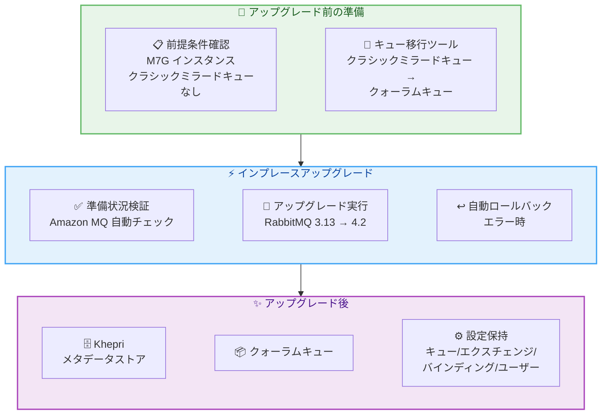

# Amazon MQ - RabbitMQ 4 インプレースメジャーバージョンアップグレード

**リリース日**: 2026年5月5日
**サービス**: Amazon MQ
**機能**: RabbitMQ ブローカーのインプレースメジャーバージョンアップグレード

📊 [このアップデートのインフォグラフィックを見る](https://takech9203.github.io/aws-news-summary/20260505-amazon-mq-inplace-upgrades-rabbitmq4.html)

## 概要

Amazon MQ が RabbitMQ ブローカーのインプレースメジャーバージョンアップグレードをサポートし、新しいブローカーの作成やデータ移行を行うことなく RabbitMQ 3.13 から 4.2 へのアップグレードが可能になった。AWS マネジメントコンソール、AWS CLI、または API から直接アップグレードを実行できる。

RabbitMQ 4.2 では、クラシックミラードキューの廃止や Mnesia から Khepri メタデータストアへの移行といった破壊的変更が導入されている。Amazon MQ はアップグレード前にブローカーの準備状況を自動的に検証し、重大なエラーが発生した場合は自動的にロールバックを行う。

**アップデート前の課題**

- RabbitMQ のメジャーバージョンアップグレードを行うには、新しいブローカーを作成してデータを移行する必要があった
- メジャーバージョン間の移行には手動での設定再構成やキュー再作成が必要だった
- 移行中のダウンタイムが長期化するリスクがあり、運用負荷が高かった

**アップデート後の改善**

- インプレースでブローカーの設定、キュー、エクスチェンジ、バインディング、ユーザー、ポリシーを保持したままアップグレードが可能になった
- Amazon MQ がアップグレード前の準備状況を自動検証し、エラー時は自動ロールバックを実行する
- クラスターデプロイメントではローリングアップグレード戦略によりクライアントへの影響を最小化できる

## アーキテクチャ図



Amazon MQ の RabbitMQ インプレースアップグレードの全体フロー。前提条件の確認からアップグレード実行、完了後の状態までを示している。

## サービスアップデートの詳細

### 主要機能

1. **インプレースメジャーバージョンアップグレード**
   - RabbitMQ 3.13 から 4.2 への直接アップグレード
   - 新しいブローカーの作成やデータ移行が不要
   - ブローカー設定、キュー、エクスチェンジ、バインディング、ユーザー、ポリシーを保持

2. **自動検証とロールバック**
   - アップグレード前にブローカーの準備状況を自動検証
   - 重大なエラーが発生した場合は自動ロールバック
   - アップグレードの安全性を確保

3. **ローリングアップグレード**
   - クラスターデプロイメントではローリングアップグレード戦略を採用
   - 一度に 1 ノードずつアップグレードを実行
   - クライアントへの影響を最小化

4. **キュー移行ツール**
   - クラシックミラードキューからクォーラムキューへの変換ツールを提供
   - アップグレード前に互換性のないキュータイプを移行可能
   - RabbitMQ 4.2 ではクラシックミラードキューが廃止されたため必須

## 技術仕様

### アップグレード要件

| 項目 | 詳細 |
|------|------|
| アップグレード元バージョン | RabbitMQ 3.13 |
| アップグレード先バージョン | RabbitMQ 4.2 |
| 必須インスタンスタイプ | M7G (Graviton) |
| キュー要件 | クラシックミラードキューが存在しないこと |
| パッチバージョン管理 | Amazon MQ が自動管理 |

### RabbitMQ 4.2 の主な変更点

| 変更内容 | 詳細 |
|----------|------|
| クラシックミラードキュー | 廃止 (削除) |
| メタデータストア | Mnesia から Khepri へ移行 |
| キュータイプ | クォーラムキューを推奨 |

### ダウンタイムの影響

| デプロイメントタイプ | ダウンタイム |
|----------------------|--------------|
| シングルインスタンス | アップグレード中はブローカーが利用不可 |
| クラスター | ローリングアップグレードにより影響を最小化 |

## 設定方法

### 前提条件

1. ブローカーが M7G (Graviton) インスタンスタイプで稼働していること
2. ブローカーにクラシックミラードキューが存在しないこと
3. クラシックミラードキューが存在する場合は、キュー移行ツールでクォーラムキューに変換済みであること

### 手順

#### ステップ 1: クラシックミラードキューの確認と移行

```bash
# クラシックミラードキューが存在する場合は、
# Amazon MQ が提供するキュー移行ツールを使用してクォーラムキューに変換する
# 詳細は Amazon MQ デベロッパーガイドを参照
```

クラシックミラードキューが存在するブローカーはアップグレード対象外となるため、事前にクォーラムキューへの変換が必要である。

#### ステップ 2: AWS マネジメントコンソールからのアップグレード

1. Amazon MQ コンソールでブローカー詳細ページを開く
2. **Edit** を選択
3. **Specifications** セクションで **Broker engine version** から **4.2** を選択
4. **Schedule modifications** を選択
5. 即時適用またはメンテナンスウィンドウでの適用を選択

コンソールから数クリックでアップグレードを開始できる。

#### ステップ 3: AWS CLI からのアップグレード

```bash
# ブローカーのエンジンバージョンを 4.2 に更新
aws mq update-broker --broker-id b-1234a5b6-78cd-901e-2fgh-3i45j6k178l9 --engine-version 4.2

# 即時適用する場合はブローカーをリブート
aws mq reboot-broker --broker-id b-1234a5b6-78cd-901e-2fgh-3i45j6k178l9
```

`update-broker` コマンドでエンジンバージョンを指定し、必要に応じて `reboot-broker` で即時適用する。リブートしない場合は次回のメンテナンスウィンドウで適用される。

## メリット

### ビジネス面

- **運用コスト削減**: 新しいブローカーの作成・データ移行が不要なため、移行に要する工数と時間を大幅に削減
- **ダウンタイム最小化**: クラスターデプロイメントではローリングアップグレードにより、サービス中断を最小限に抑制
- **リスク低減**: 自動検証とロールバック機能により、アップグレード失敗時のリスクを軽減

### 技術面

- **データ保全**: キュー、エクスチェンジ、バインディング、ユーザー、ポリシーがすべて保持される
- **最新機能の利用**: RabbitMQ 4.2 の Khepri メタデータストアやクォーラムキューの改善を活用可能
- **自動パッチ管理**: メジャー・マイナーバージョンの指定のみで、パッチバージョンは Amazon MQ が自動管理

## デメリット・制約事項

### 制限事項

- M7G (Graviton) インスタンスタイプでのみアップグレード可能。mq.t3 や mq.m5 では利用不可
- クラシックミラードキューが存在するブローカーはアップグレード不可
- シングルインスタンスブローカーはアップグレード中にダウンタイムが発生
- RabbitMQ Streams は Amazon MQ ではサポートされない

### 考慮すべき点

- RabbitMQ 4.2 の破壊的変更 (クラシックミラードキュー廃止、Khepri 移行) についてアプリケーション側の互換性確認が必要
- アップグレード前にクラシックミラードキューからクォーラムキューへの移行を完了する必要がある
- ローリングアップグレード中もクライアント接続に一時的な切断が発生する可能性がある

## ユースケース

### ユースケース 1: 本番環境の RabbitMQ メジャーバージョンアップグレード

**シナリオ**: RabbitMQ 3.13 で稼働中の本番メッセージングシステムを、ダウンタイムを最小限に抑えて RabbitMQ 4.2 にアップグレードしたい

**実装例**:
```bash
# 1. 現在のブローカーバージョンとインスタンスタイプを確認
aws mq describe-broker --broker-id b-1234a5b6-78cd-901e-2fgh-3i45j6k178l9

# 2. クラスターブローカーのエンジンバージョンを更新
aws mq update-broker --broker-id b-1234a5b6-78cd-901e-2fgh-3i45j6k178l9 --engine-version 4.2

# 3. メンテナンスウィンドウでの適用を待機（またはリブートで即時適用）
```

**効果**: 既存のキュー設定やメッセージデータを保持したまま、ローリングアップグレードにより本番環境への影響を最小化してアップグレードを完了できる。

### ユースケース 2: クラシックミラードキューからの移行

**シナリオ**: クラシックミラードキューを使用している既存ブローカーを RabbitMQ 4.2 にアップグレードしたい

**実装例**:
```bash
# 1. キュー移行ツールでクラシックミラードキューをクォーラムキューに変換
# (Amazon MQ デベロッパーガイドの手順に従う)

# 2. 移行完了後にバージョンアップグレードを実行
aws mq update-broker --broker-id b-1234a5b6-78cd-901e-2fgh-3i45j6k178l9 --engine-version 4.2
```

**効果**: RabbitMQ 4.2 で廃止されたクラシックミラードキューを事前にクォーラムキューに変換し、安全にメジャーバージョンアップグレードを実行できる。

### ユースケース 3: 開発・テスト環境での先行アップグレード検証

**シナリオ**: 本番アップグレード前に開発環境で RabbitMQ 4.2 の互換性を検証したい

**実装例**:
```bash
# 1. 開発環境のシングルインスタンスブローカーをアップグレード
aws mq update-broker --broker-id b-dev-broker-id --engine-version 4.2

# 2. 即時適用のためリブート
aws mq reboot-broker --broker-id b-dev-broker-id

# 3. アプリケーションの動作確認を実施
# - Khepri メタデータストアとの互換性確認
# - クォーラムキューの動作確認
# - クライアントライブラリの互換性確認
```

**効果**: 開発環境で事前にアップグレードの影響を確認し、本番環境でのリスクを軽減できる。自動ロールバック機能により、問題が発生しても安全に元のバージョンに戻せる。

## 料金

Amazon MQ for RabbitMQ の料金はインスタンスタイプとストレージ使用量に基づく。インプレースアップグレード自体に追加料金は発生しない。

### 料金例

| インスタンスタイプ | 時間料金 (米国東部) |
|--------------------|--------------------|
| mq.m7g.large | ブローカー料金に準拠 |
| mq.m7g.xlarge | ブローカー料金に準拠 |

※ 最新の料金情報は [Amazon MQ 料金ページ](https://aws.amazon.com/amazon-mq/pricing/)を参照。

## 利用可能リージョン

RabbitMQ 4 インスタンスが利用可能なすべてのリージョンでインプレースアップグレードが利用可能。RabbitMQ 4.2 は M7G (Graviton) インスタンスタイプでのみサポートされる。

## 関連サービス・機能

- **Amazon MQ for RabbitMQ**: マネージド RabbitMQ ブローカーサービス。今回のアップデートの対象
- **AWS Graviton (M7G)**: ARM ベースのプロセッサ。RabbitMQ 4.2 のアップグレードに必要なインスタンスタイプ
- **Amazon MQ for ActiveMQ**: Amazon MQ のもう一つのエンジンオプション。ActiveMQ ブローカーの管理サービス

## 参考リンク

- 📊 [インフォグラフィック](https://takech9203.github.io/aws-news-summary/20260505-amazon-mq-inplace-upgrades-rabbitmq4.html)
- [公式発表 (What's New)](https://aws.amazon.com/about-aws/whats-new/2026/05/amazon-mq-inplace-upgrades-rabbitmq4/)
- [Amazon MQ デベロッパーガイド - エンジンバージョンの管理](https://docs.aws.amazon.com/amazon-mq/latest/developer-guide/rabbitmq-version-management.html)
- [Amazon MQ デベロッパーガイド - ブローカーエンジンバージョンのアップグレード](https://docs.aws.amazon.com/amazon-mq/latest/developer-guide/upgrading-brokers.html)
- [料金ページ](https://aws.amazon.com/amazon-mq/pricing/)

## まとめ

Amazon MQ の RabbitMQ インプレースメジャーバージョンアップグレードにより、既存のブローカー設定やデータを保持したまま RabbitMQ 3.13 から 4.2 への安全なアップグレードが可能になった。自動検証とロールバック機能、クラスターでのローリングアップグレード戦略により運用リスクを最小化できる。M7G インスタンスを使用している RabbitMQ ブローカーの管理者は、キュー移行ツールでクラシックミラードキューをクォーラムキューに変換した上で、速やかに RabbitMQ 4.2 へのアップグレードを検討することを推奨する。
