# Amazon OpenSearch Service - Cluster Insights のバージョン拡大と Unused Index インサイトの追加

**リリース日**: 2026 年 5 月 5 日
**サービス**: Amazon OpenSearch Service
**機能**: Cluster Insights バージョン拡大および Unused Index インサイト

📊 [このアップデートのインフォグラフィックを見る](https://takech9203.github.io/aws-news-summary/20260505-amazon-opensearch-cluster-insights.html)

## 概要

Amazon OpenSearch Service の Cluster Insights が、対応バージョンを大幅に拡大しました。これまで OpenSearch 2.17 以降に限定されていた Cluster Insights が、OpenSearch 1.0 以降および Elasticsearch 6.8 以降のすべてのバージョンで利用可能になりました。これにより、より多くのユーザーがプロアクティブなクラスターヘルスおよびパフォーマンスの可視化機能を活用できるようになります。

さらに、新しい Unused Index インサイトが追加されました。このインサイトは、過去 30 日間に検索およびインデクシングのアクティビティがゼロのインデックスを自動的に検出し、コスト最適化のための具体的なアクションを推奨します。推奨されるアクションには、Warm ストレージや Cold ストレージへの移行、または不要な場合の削除が含まれます。

Cluster Insights は、AWS マネジメントコンソール、OpenSearch Service Notifications、OpenSearch UI、および Amazon EventBridge を通じて利用可能で、クラスターヘルスの即時可視化とアクション可能な推奨事項を提供します。

**アップデート前の課題**

- Cluster Insights は OpenSearch 2.17 以降のバージョンでのみ利用可能であり、それ以前のバージョンを使用しているユーザーはプロアクティブな監視ができなかった
- 使用されていないインデックスの特定には手動での調査が必要で、検索やインデクシングのアクティビティを個別に確認する必要があった
- コスト最適化のためにどのインデックスを Warm/Cold ストレージに移行すべきか、体系的に判断する手段がなかった

**アップデート後の改善**

- OpenSearch 1.0 以降および Elasticsearch 6.8 以降のすべてのバージョンで Cluster Insights が利用可能になった
- Unused Index インサイトにより、過去 30 日間アクティビティのないインデックスが自動的に検出される
- Warm/Cold ストレージへの移行や削除などの具体的なコスト最適化アクションが推奨される

## アーキテクチャ図

```mermaid
flowchart TD
    subgraph AWS["☁️ AWS"]
        subgraph OpenSearch["🔍 Amazon OpenSearch Service"]
            direction TB
            Cluster["📦 OpenSearch クラスター<br/>OpenSearch 1.0+ / Elasticsearch 6.8+"]
            CI["🔎 Cluster Insights<br/>ヘルス・パフォーマンス監視"]
            UI["📋 Unused Index インサイト<br/>30 日間アクティビティなし検出"]
            Cluster --> CI
            CI --> UI
        end

        subgraph Notifications["📢 通知・配信チャネル"]
            direction LR
            Console["🖥️ AWS マネジメントコンソール"]
            OSUI["📊 OpenSearch UI"]
            EB["⚡ Amazon EventBridge"]
            Notif["🔔 OpenSearch Service Notifications"]
            Console ~~~ OSUI ~~~ EB ~~~ Notif
        end

        subgraph Actions["🎯 推奨アクション"]
            direction LR
            Warm["🟡 Warm ストレージへ移行"]
            Cold["🔵 Cold ストレージへ移行"]
            Delete["🗑️ インデックス削除"]
            Warm ~~~ Cold ~~~ Delete
        end
    end

    CI --> Notifications
    UI --> Actions

    classDef cloud fill:none,stroke:#CCCCCC,stroke-width:2px,color:#666666
    classDef layer fill:none,stroke:#E1BEE7,stroke-width:2px,color:#666666
    classDef compute fill:#FFE0B2,stroke:#FFCC80,stroke-width:2px,color:#5D4037
    classDef storage fill:#DCEDC8,stroke:#C5E1A5,stroke-width:2px,color:#33691E
    classDef database fill:#E8EAF6,stroke:#C5CAE9,stroke-width:2px,color:#283593
    classDef user fill:#E3F2FD,stroke:#BBDEFB,stroke-width:2px,color:#1565C0
    classDef process fill:#FFFFFF,stroke:#4A90E2,stroke-width:2px,color:#333333

    class AWS cloud
    class OpenSearch,Notifications,Actions layer
    class Cluster database
    class CI,UI compute
    class Console,OSUI,EB,Notif process
    class Warm,Cold,Delete storage
```



Cluster Insights がクラスターを監視し、各通知チャネルを通じてインサイトを配信する流れを示しています。Unused Index インサイトは、検出されたインデックスに対して具体的なコスト最適化アクションを推奨します。

## サービスアップデートの詳細

### 主要機能

1. **Cluster Insights バージョン拡大**
   - OpenSearch 1.0 以降のすべてのバージョンに対応
   - Elasticsearch 6.8 以降のすべてのバージョンに対応
   - 以前は OpenSearch 2.17 以降に限定されていた
   - 追加コストなしで利用可能

2. **Unused Index インサイト**
   - 過去 30 日間に検索アクティビティがゼロのインデックスを検出
   - 過去 30 日間にインデクシングアクティビティがゼロのインデックスを検出
   - コスト最適化のためのアクション可能な推奨事項を提供
   - Warm ストレージ、Cold ストレージへの移行、または削除を推奨

3. **マルチチャネル配信**
   - AWS マネジメントコンソールでのインサイト確認
   - OpenSearch Service Notifications による通知
   - OpenSearch UI での詳細表示
   - Amazon EventBridge によるイベント駆動型自動化

## 技術仕様

### サポートバージョン

| 項目 | 詳細 |
|------|------|
| OpenSearch | バージョン 1.0 以降すべて |
| Elasticsearch | バージョン 6.8 以降すべて |
| 以前の要件 | OpenSearch 2.17 以降のみ |
| OpenSearch UI からのアクセス | OpenSearch 2.17 以降 |

### Unused Index インサイトの検出条件

| 項目 | 詳細 |
|------|------|
| 監視期間 | 過去 30 日間 |
| 検索アクティビティ | ゼロ |
| インデクシングアクティビティ | ゼロ |
| 推奨アクション | Warm/Cold ストレージへの移行、または削除 |

### API 変更履歴

| 日付 | サービス | 変更内容 |
|------|----------|----------|
| 2026/05/05 | [Amazon OpenSearch Service](https://awsapichanges.com/archive/changes/2d415e-es.html) | 10 updated api methods - VPC egress 対応 |

## 設定方法

### 前提条件

1. Amazon OpenSearch Service ドメインが OpenSearch 1.0 以降、または Elasticsearch 6.8 以降で稼働していること
2. AWS マネジメントコンソールへのアクセス権限があること
3. OpenSearch UI から詳細を確認する場合は管理者ロールが必要

### 手順

#### ステップ 1: AWS マネジメントコンソールからの確認

```bash
# AWS CLI でドメインの情報を確認
aws opensearch describe-domain --domain-name your-domain-name
```

AWS マネジメントコンソールで OpenSearch Service に移動し、対象ドメインの「Cluster health」タブを選択すると、Cluster Insights が表示されます。

#### ステップ 2: Unused Index インサイトの確認

Cluster Insights 一覧から「Unused Index」インサイトを選択すると、過去 30 日間にアクティビティのないインデックスのリストと、各インデックスに対する推奨アクションが表示されます。

#### ステップ 3: 推奨アクションの実行

```bash
# 使用されていないインデックスを Warm ストレージに移行する例
POST _ultrawarm/migration/your-unused-index/_warm

# 使用されていないインデックスを Cold ストレージに移行する例
POST _cold/migration/your-unused-index/_cold

# 不要なインデックスを削除する例
DELETE /your-unused-index
```

推奨事項に基づき、Warm/Cold ストレージへの移行や不要なインデックスの削除を実行します。

## メリット

### ビジネス面

- **コスト最適化**: Unused Index インサイトにより、使用されていないインデックスを低コストのストレージ層に移行でき、ストレージコストを削減可能
- **運用効率向上**: プロアクティブな監視により、問題がワークロードに影響を与える前に対処でき、ダウンタイムを最小化
- **幅広いユーザーカバレッジ**: バージョン拡大により、レガシーバージョンを使用している既存ユーザーも Cluster Insights の恩恵を受けられる

### 技術面

- **プロアクティブなリスク検出**: パフォーマンスや安定性に影響するリスクを事前に特定可能
- **自動化対応**: Amazon EventBridge 連携により、インサイトに基づく自動修復ワークフローを構築可能
- **統合監視**: コンソール、OpenSearch UI、通知、EventBridge の複数チャネルで一貫した情報を取得可能

## デメリット・制約事項

### 制限事項

- OpenSearch UI からの詳細メトリクス表示は引き続き OpenSearch 2.17 以降が必要
- Query View 機能は OpenSearch 2.19 以降でのみ利用可能
- Unused Index インサイトの検出期間は 30 日間で固定されており、カスタマイズ不可

### 考慮すべき点

- Unused Index として検出されたインデックスであっても、季節性のあるワークロードや定期的なバッチ処理で使用される可能性がある
- ストレージ層の移行には時間がかかる場合があり、再度アクティブに必要となった場合の復元時間を考慮する必要がある

## ユースケース

### ユースケース 1: ログ分析基盤のコスト最適化

**シナリオ**: 大量のログデータを OpenSearch に取り込んでいる組織で、古いインデックスが Hot ストレージに残り続けている

**実装例**:
```bash
# Unused Index インサイトで検出されたインデックスを確認
# 30 日以上アクセスのないログインデックスを Warm ストレージに移行
POST _ultrawarm/migration/logs-2026-01/_warm
POST _ultrawarm/migration/logs-2026-02/_warm
```

**効果**: Hot ストレージのコストを削減しながら、必要に応じてデータを参照可能な状態を維持

### ユースケース 2: レガシーバージョンでのプロアクティブ監視

**シナリオ**: Elasticsearch 7.x から OpenSearch への移行を計画中の組織が、移行前のクラスターでもヘルス監視を実施したい

**実装例**:
```bash
# Elasticsearch 6.8 以降のドメインで Cluster Insights を確認
# AWS マネジメントコンソールの Cluster health タブから確認
aws opensearch describe-domain --domain-name legacy-es-domain
```

**効果**: 移行前の段階からクラスターの安定性リスクを検出し、計画的な対応が可能

### ユースケース 3: EventBridge を活用した自動コスト管理

**シナリオ**: Unused Index インサイトのイベントを EventBridge で受信し、自動的に Lambda で Cold ストレージへの移行を実行

**実装例**:
```json
{
  "source": ["aws.opensearch"],
  "detail-type": ["OpenSearch Service Cluster Insight"],
  "detail": {
    "insightType": ["UNUSED_INDEX"]
  }
}
```

**効果**: 運用チームの介入なしに、使用されていないインデックスの自動移行パイプラインを構築可能

## 料金

Cluster Insights は追加コストなしで利用可能です。Amazon OpenSearch Service が利用可能なすべてのリージョンで、既存のドメインに対して自動的に提供されます。

ただし、推奨アクションとして実施する Warm/Cold ストレージへの移行には、それぞれのストレージ層の料金が適用されます。

### 料金例

| ストレージ層 | 特徴 |
|--------|------------------|
| Hot ストレージ | 高パフォーマンス、最高コスト |
| UltraWarm ストレージ | 読み取り専用、Hot の約 90% コスト削減 |
| Cold ストレージ | 最低コスト、アクセス時にアタッチが必要 |

## 利用可能リージョン

Amazon OpenSearch Service が利用可能なすべてのリージョンで Cluster Insights を利用できます。東京リージョン (ap-northeast-1) を含むすべての商用リージョンが対象です。

## 関連サービス・機能

- **Amazon EventBridge**: Cluster Insights のイベントを受信し、自動化ワークフローを構築可能
- **Amazon CloudWatch**: OpenSearch Service の標準メトリクス監視と組み合わせて使用
- **UltraWarm ストレージ**: 使用頻度の低いデータを低コストで保持するためのストレージ層
- **Cold ストレージ**: 最もコスト効率の高いストレージ層で、アーカイブ目的のデータに最適

## 参考リンク

- 📊 [インフォグラフィック](https://takech9203.github.io/aws-news-summary/20260505-amazon-opensearch-cluster-insights.html)
- [公式発表 (What's New)](https://aws.amazon.com/about-aws/whats-new/2026/05/amazon-opensearch-cluster-insights/)
- [ドキュメント - Cluster Insights](https://docs.aws.amazon.com/opensearch-service/latest/developerguide/cluster-insights.html)
- [料金ページ](https://aws.amazon.com/opensearch-service/pricing/)

## まとめ

今回のアップデートにより、Cluster Insights が OpenSearch 1.0 以降および Elasticsearch 6.8 以降のすべてのバージョンに拡大され、より多くのユーザーがプロアクティブなクラスター監視を活用できるようになりました。特に新しい Unused Index インサイトは、コスト最適化に直結する実用的な機能であり、使用されていないインデックスの特定とストレージ層の最適化を自動化することで、運用負荷の軽減とコスト削減を同時に実現できます。既存の OpenSearch Service ユーザーは、追加設定なしでこの機能を利用開始できるため、早期の活用を推奨します。
