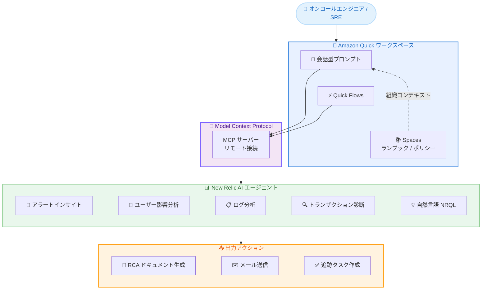

# Amazon Quick - New Relic AI エージェント統合によるオブザーバビリティ駆動型インシデント対応

**リリース日**: 2026 年 5 月 5 日
**サービス**: Amazon Quick
**機能**: New Relic AI エージェントとの統合

📊 [このアップデートのインフォグラフィックを見る](https://takech9203.github.io/aws-news-summary/20260505-amazon-quick-new-relic.html)

## 概要

Amazon Quick が New Relic の AI エージェントと統合されました。この統合により、オンコールエンジニア、SRE、エンジニアリングリーダーは Amazon Quick のワークスペースから離れることなく、インシデントの調査、根本原因分析 (RCA) ブリーフの生成、追跡タスクの作成が可能になります。

New Relic のリモート Model Context Protocol (MCP) サーバーに接続すると、Quick の会話型プロンプトから New Relic の AI エージェントを直接呼び出せます。利用可能な機能には、アラートインサイト、ユーザー影響分析、ログ分析、トランザクション診断、自然言語による NRQL クエリが含まれます。単一のチャットで、オブザーバビリティデータ全体にわたるインシデント調査、エビデンスリンク付きの RCA ドキュメント生成、メール添付としての送信までを完了できます。

さらに、Quick Flows を使用して New Relic AI エージェントを呼び出し、定期的なトリアージランブックやエスカレーションワークフローを自動化することも可能です。Quick は Spaces に保存されたエンタープライズナレッジ (ランブック、アーキテクチャドキュメント、オンコールポリシーなど) と連携してレスポンスを提示するため、ライブテレメトリと組織コンテキストの両方を反映した回答が得られます。

**アップデート前の課題**

- インシデント調査時に New Relic と他のツール間を頻繁に切り替える必要があり、コンテキストスイッチによる対応遅延が発生していた
- RCA ドキュメントの作成が手動で行われており、エビデンスの収集と文書化に時間がかかっていた
- オブザーバビリティデータの分析結果を組織のランブックやポリシーと照合する作業が分断されていた
- 定期的なトリアージやエスカレーションのワークフローを自動化する手段が限定的だった

**アップデート後の改善**

- Amazon Quick の単一インターフェースから New Relic の全 AI エージェント機能にアクセスできるようになった
- 会話型プロンプトでインシデント調査から RCA 生成、メール送信までを一連のフローで完了できるようになった
- Spaces に保存された組織ナレッジとライブテレメトリを組み合わせた文脈豊かな分析が可能になった
- Quick Flows による New Relic AI エージェントの自動化で、定期トリアージの工数が削減された

## アーキテクチャ図



Amazon Quick と New Relic の統合アーキテクチャを示しています。ユーザーは Quick の会話型プロンプトまたは Flows から MCP サーバー経由で New Relic の AI エージェントを呼び出し、分析結果を RCA ドキュメントやタスクとして出力します。

## サービスアップデートの詳細

### 主要機能

1. **New Relic AI エージェントの直接呼び出し**
   - Amazon Quick の会話型プロンプトから New Relic の AI エージェントを直接起動
   - リモート MCP サーバーを介したセキュアな接続
   - 複数の AI エージェント機能を単一のチャットセッションで利用可能

2. **オブザーバビリティ分析機能**
   - アラートインサイト: アクティブなアラートの状況把握と優先度判定
   - ユーザー影響分析: インシデントが及ぼすエンドユーザーへの影響範囲の特定
   - ログ分析: 関連ログの自動収集と異常パターンの検出
   - トランザクション診断: パフォーマンスボトルネックの特定
   - 自然言語 NRQL クエリ: 自然言語による New Relic データベースへのクエリ実行

3. **RCA ドキュメント自動生成**
   - インシデント調査結果を根本原因分析ドキュメントとして自動生成
   - エビデンスリンク付きの構造化されたレポート
   - メール添付または追跡タスクとしての出力

4. **Quick Flows による自動化**
   - 定期的なトリアージランブックの自動実行
   - エスカレーションワークフローの自動化
   - New Relic AI エージェントを含むマルチステップフローの構築

5. **組織コンテキストとの統合**
   - Spaces に保存されたランブック、アーキテクチャドキュメント、オンコールポリシーとの連携
   - ライブテレメトリと組織ナレッジを組み合わせた回答の生成

## 技術仕様

### MCP 接続要件

| 項目 | 詳細 |
|------|------|
| プロトコル | Model Context Protocol (MCP) |
| 接続方式 | リモート MCP サーバー |
| 認証 | New Relic アカウント認証が必要 |
| 前提条件 | New Relic のアクティブなサブスクリプション |
| 対象ユーザー | Amazon Quick へのアクセス権を持つ New Relic 顧客 |

### 利用可能な AI エージェント機能

| エージェント | 機能概要 |
|-------------|---------|
| Alert Insights | アクティブアラートの分析と優先度付け |
| User Impact Analysis | エンドユーザーへの影響範囲の特定 |
| Log Analysis | 関連ログの収集と異常検出 |
| Transaction Diagnostics | トランザクションのパフォーマンス分析 |
| Natural Language NRQL | 自然言語によるデータクエリ |

## 設定方法

### 前提条件

1. Amazon Quick へのアクセス権を持つ組織であること
2. New Relic のアクティブなアカウントとサブスクリプションがあること
3. New Relic MCP サーバーへの接続権限があること

### 手順

#### ステップ 1: New Relic MCP サーバーへの接続

Amazon Quick の管理画面から New Relic のリモート MCP サーバーへの接続を設定します。New Relic の認証情報を使用して接続を確立します。

#### ステップ 2: AI エージェントの呼び出し

接続が完了したら、Amazon Quick のチャットインターフェースから New Relic の AI エージェントを会話型プロンプトで呼び出します。

```text
例: 「過去1時間のアラートを分析して、影響を受けているユーザー数を教えてください」
```

上記のようなプロンプトで、アラートインサイトとユーザー影響分析エージェントが連携して結果を返します。

#### ステップ 3: RCA ドキュメントの生成と共有

インシデント調査の結果を基に、RCA ドキュメントの生成を指示します。

```text
例: 「この調査結果を RCA ドキュメントにまとめて、チームにメールで送信してください」
```

Quick が調査結果をエビデンスリンク付きの RCA ドキュメントとして整理し、メール添付または追跡タスクとして出力します。

#### ステップ 4: Quick Flows による自動化 (オプション)

定期的なトリアージやエスカレーションワークフローを Quick Flows として定義し、New Relic AI エージェントを自動的に呼び出すフローを構築します。

## メリット

### ビジネス面

- **MTTR の短縮**: インシデント調査から RCA 生成までの一連の作業を単一インターフェースで完結でき、平均復旧時間を短縮
- **運用コストの削減**: 手動でのコンテキストスイッチやドキュメント作成が不要になり、エンジニアの工数を削減
- **インシデント対応品質の向上**: 組織ナレッジとライブデータを統合した分析により、より正確で一貫性のある RCA を生成

### 技術面

- **MCP によるセキュアな統合**: リモート MCP サーバーを介した標準化されたプロトコルでの接続
- **マルチエージェント協調**: 複数の AI エージェント機能を単一セッションで組み合わせて利用可能
- **ワークフロー自動化**: Quick Flows による定期的なトリアージの完全自動化

## デメリット・制約事項

### 制限事項

- New Relic の有料サブスクリプションが必要 (Amazon Quick とは別途)
- Amazon Quick へのアクセス権を持つ組織のみが利用可能
- New Relic 側の API レート制限やデータ保持ポリシーに依存

### 考慮すべき点

- New Relic と Amazon Quick の両方の利用料金が発生するため、コスト面の検討が必要
- MCP サーバーへの接続設定に New Relic 側の管理者権限が必要となる場合がある
- オブザーバビリティデータの機密性に応じたアクセス制御の設計が必要

## ユースケース

### ユースケース 1: 深夜のインシデント対応

**シナリオ**: オンコールエンジニアが深夜にアラートを受け取り、迅速にインシデントの影響範囲と根本原因を特定する必要がある。

**実装例**:
```text
プロンプト: 「現在発生中のアラートの詳細を分析し、
影響を受けているユーザー数、関連するログエラー、
トランザクションの異常を調査してください。
結果を RCA ドキュメントにまとめてオンコールチームに送信してください」
```

**効果**: 複数のツール間を切り替えることなく、数分以内にインシデントの全体像を把握し、エビデンス付きの RCA をチームに共有できる。

### ユースケース 2: 定期的なシステムヘルスチェックの自動化

**シナリオ**: SRE チームが毎朝実施するシステムヘルスチェックを Quick Flows で自動化し、異常があればエスカレーションする。

**実装例**:
```text
Quick Flow 定義:
1. New Relic アラートインサイトで過去 8 時間の未解決アラートを取得
2. 各アラートのユーザー影響を分析
3. 影響が閾値を超える場合、RCA ブリーフを生成
4. 生成された RCA をチームの Slack チャネルに送信
```

**効果**: 毎朝のルーティン作業が自動化され、SRE チームは重大な問題への対応に集中できる。

### ユースケース 3: エンジニアリングリーダーへのインシデントサマリー

**シナリオ**: エンジニアリングリーダーが週次の振り返りミーティングに向けて、過去 1 週間のインシデントサマリーを準備する。

**実装例**:
```text
プロンプト: 「過去 1 週間に発生した P1/P2 インシデントのサマリーを作成してください。
各インシデントについて、影響範囲、根本原因、対応時間、再発防止策を含めてください。
レポートをメール添付として経営チームに送信してください」
```

**効果**: 手動での情報収集とレポート作成に数時間かかっていた作業が、数分の会話で完了する。

## 料金

Amazon Quick と New Relic の両方のサブスクリプションが必要です。

- **Amazon Quick**: Amazon Quick の料金体系に従う (詳細は Amazon Quick 料金ページを参照)
- **New Relic**: New Relic の既存サブスクリプションに含まれる (追加料金の有無は New Relic の契約内容に依存)
- **統合自体の追加料金**: New Relic MCP サーバーへの接続に対する追加料金は発表時点では言及なし

## 利用可能リージョン

Amazon Quick が利用可能なすべての AWS リージョンで利用可能です。Amazon Quick は以下のリージョンで提供されています。

- 米国東部 (バージニア北部) - us-east-1
- 米国西部 (オレゴン) - us-west-2
- 欧州 (フランクフルト) - eu-central-1
- 欧州 (ロンドン) - eu-west-2
- アジアパシフィック (東京) - ap-northeast-1

## 関連サービス・機能

- **Amazon Quick**: AI を活用したワークスペースおよびエージェントチームメイト。本統合のベースプラットフォーム
- **Amazon Quick Flows**: マルチステップの自動化ワークフローを構築する機能。New Relic エージェントの定期実行に活用
- **Amazon Quick Spaces**: エンタープライズナレッジを保存・管理する機能。ランブックやポリシーとの連携に使用
- **Model Context Protocol (MCP)**: AI エージェントとデータソース間の標準化された通信プロトコル。本統合の基盤技術
- **New Relic**: フルスタックオブザーバビリティプラットフォーム。テレメトリデータの提供元

## 参考リンク

- 📊 [インフォグラフィック](https://takech9203.github.io/aws-news-summary/20260505-amazon-quick-new-relic.html)
- [公式発表 (What's New)](https://aws.amazon.com/about-aws/whats-new/2026/05/amazon-quick-new-relic/)
- [Amazon Quick ウェブサイト](https://aws.amazon.com/quick/)
- [New Relic 統合ガイド](https://docs.aws.amazon.com/quick/latest/user-guide/integrations-new-relic.html)
- [Amazon Quick 統合一覧](https://aws.amazon.com/quick/integrations/)

## まとめ

Amazon Quick と New Relic の統合は、インシデント対応ワークフローを大幅に効率化するアップデートです。MCP を介した AI エージェントの直接呼び出しにより、オブザーバビリティデータの分析から RCA ドキュメント生成、タスク管理までを単一のインターフェースで完結できます。オンコールエンジニアや SRE チームは、New Relic のアカウントをお持ちであれば、Amazon Quick から接続設定を行うことですぐに利用を開始できます。
