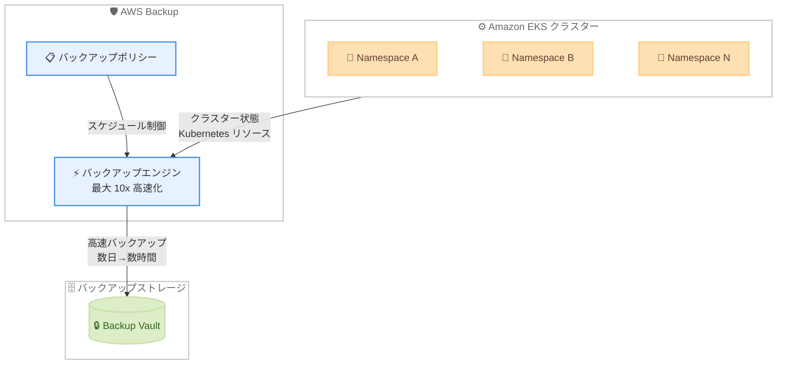

# AWS Backup - Amazon EKS クラスターバックアップのパフォーマンス改善

**リリース日**: 2026年5月5日
**サービス**: AWS Backup
**機能**: Amazon EKS クラスターバックアップのパフォーマンス向上 (最大 10 倍高速化)

[このアップデートのインフォグラフィックを見る](https://takech9203.github.io/aws-news-summary/20260505-aws-backup-amazon-eks-performance-improvement.html)

## 概要

AWS Backup for Amazon EKS において、クラスター状態のバックアップが最大 10 倍高速化されるパフォーマンス改善が発表された。この改善により、大量の Namespace と Kubernetes リソースを持つ Amazon EKS クラスターのバックアップが大幅に高速化され、最大規模のクラスターではバックアップウィンドウが数日から数時間に短縮される。

AWS Backup はポリシーベースのフルマネージド型でコスト効率の高いソリューションであり、Amazon EKS を含む AWS サービス全体のデータ保護を一元化・自動化できる。今回のパフォーマンス改善は、AWS Backup for Amazon EKS がサポートされているすべての AWS リージョンにおいて、追加コストなしで自動的に有効化される。

**アップデート前の課題**

- 大規模な EKS クラスター (多数の Namespace や Kubernetes リソースを含む) のバックアップに数日かかることがあった
- 長いバックアップウィンドウにより、運用上のスケジュール調整が困難だった
- バックアップ処理中のリソース消費が長時間にわたり発生していた

**アップデート後の改善**

- クラスター状態のバックアップが最大 10 倍高速化された
- 最大規模のクラスターでもバックアップウィンドウが数日から数時間に短縮された
- 追加コストなしで自動的に有効化されるため、設定変更は不要
- すべての対応リージョンで即座に利用可能

## アーキテクチャ図



AWS Backup が Amazon EKS クラスターの状態 (Namespace、Deployment、ConfigMap 等の Kubernetes リソース) を高速にバックアップし、Backup Vault に保存するフローを示している。エンジン部分のパフォーマンスが最大 10 倍改善された。

## サービスアップデートの詳細

### 主要機能

1. **バックアップ速度の 10 倍改善**
   - クラスター状態のバックアップ処理が最大 10 倍高速化
   - 大量の Namespace と Kubernetes リソースを持つクラスターで最も効果を発揮
   - 最大規模のクラスターではバックアップウィンドウが数日から数時間に短縮

2. **自動有効化**
   - 既存の AWS Backup for EKS ユーザーは設定変更不要
   - すべての対応リージョンで自動的に改善が適用
   - 追加コストなし

3. **一元的なデータ保護**
   - ポリシーベースのバックアップ管理
   - Amazon EKS を含むコンピュート、ストレージ、データベースサービス全体を一元管理
   - コンプライアンス要件への対応を支援

## 技術仕様

### バックアップ対象リソース

| 項目 | 詳細 |
|------|------|
| バックアップ対象 | EKS クラスター状態 (Kubernetes リソース) |
| 対象リソース例 | Namespace、Deployment、Service、ConfigMap、Secret 等 |
| 速度改善 | 最大 10 倍高速化 |
| 改善前 (大規模クラスター) | 数日 |
| 改善後 (大規模クラスター) | 数時間 |
| 追加コスト | なし |
| 有効化方法 | 自動 (設定変更不要) |

### バックアップ方式

| 項目 | 詳細 |
|------|------|
| 管理方式 | ポリシーベース |
| サービスタイプ | フルマネージド |
| バックアップスコープ | クラスター状態 (Kubernetes API オブジェクト) |
| 永続ボリューム | EBS スナップショットとして別途バックアップ |

## 設定方法

### 前提条件

1. Amazon EKS クラスターが稼働していること
2. AWS Backup サービスが有効化されていること
3. 適切な IAM ロールが設定されていること

### 手順

#### ステップ 1: AWS Backup コンソールでバックアッププランを作成

```bash
aws backup create-backup-plan --backup-plan '{
  "BackupPlanName": "EKS-Daily-Backup",
  "Rules": [
    {
      "RuleName": "DailyEKSBackup",
      "TargetBackupVaultName": "Default",
      "ScheduleExpression": "cron(0 2 * * ? *)",
      "StartWindowMinutes": 60,
      "CompletionWindowMinutes": 720,
      "Lifecycle": {
        "DeleteAfterDays": 30
      }
    }
  ]
}'
```

EKS クラスターの日次バックアッププランを作成するコマンド。バックアップは毎日 UTC 2:00 に開始され、30 日間保持される。

#### ステップ 2: EKS クラスターをバックアップリソースに割り当て

```bash
aws backup create-backup-selection --backup-plan-id <plan-id> --backup-selection '{
  "SelectionName": "EKS-Clusters",
  "IamRoleArn": "arn:aws:iam::<account-id>:role/AWSBackupDefaultServiceRole",
  "Resources": [
    "arn:aws:eks:<region>:<account-id>:cluster/<cluster-name>"
  ]
}'
```

バックアッププランに EKS クラスターを割り当てるコマンド。IAM ロールには AWS Backup が EKS クラスターにアクセスするための権限が必要。

#### ステップ 3: バックアップジョブの確認

```bash
aws backup list-backup-jobs --by-resource-type EKS --by-state COMPLETED
```

完了したバックアップジョブの一覧を確認するコマンド。パフォーマンス改善により、以前よりも大幅に短い時間でジョブが完了していることを確認できる。

## メリット

### ビジネス面

- **運用効率の向上**: バックアップウィンドウの短縮により、メンテナンス時間の削減と可用性の向上が実現
- **コンプライアンス対応の強化**: 短時間でバックアップが完了するため、より頻繁なバックアップスケジュールの設定が可能
- **コスト最適化**: 追加コストなしで即座にパフォーマンス改善の恩恵を受けられる

### 技術面

- **大規模クラスター対応**: 数千の Namespace や大量の Kubernetes リソースを持つクラスターでも実用的なバックアップ時間を実現
- **設定不要**: 自動的に有効化されるため、運用チームの作業負荷なし
- **RPO の改善**: バックアップ頻度を上げることが容易になり、Recovery Point Objective の短縮が可能

## デメリット・制約事項

### 制限事項

- パフォーマンス改善はクラスター状態 (Kubernetes リソース) のバックアップに適用される。永続ボリューム (EBS) のバックアップは別途管理が必要
- AWS Backup for Amazon EKS がサポートされているリージョンでのみ利用可能
- バックアップ対象は Kubernetes API オブジェクトであり、コンテナイメージ自体はバックアップに含まれない

### 考慮すべき点

- 大規模クラスターのリストア時間は今回のアップデートでは言及されていないため、リストア性能は別途検証が必要
- バックアップ中のクラスターへの負荷影響について、本番環境では事前にテストすることを推奨

## ユースケース

### ユースケース 1: 大規模マルチテナント EKS クラスターのバックアップ

**シナリオ**: 数百の Namespace を持つマルチテナント EKS クラスターを運用しており、以前はバックアップに数日かかっていたため、日次バックアップの実施が困難だった。

**実装例**:
```bash
aws backup create-backup-plan --backup-plan '{
  "BackupPlanName": "MultiTenant-EKS-Backup",
  "Rules": [
    {
      "RuleName": "FrequentBackup",
      "TargetBackupVaultName": "EKS-Vault",
      "ScheduleExpression": "cron(0 */6 * * ? *)",
      "Lifecycle": {
        "DeleteAfterDays": 7
      }
    }
  ]
}'
```

**効果**: バックアップが 6 時間ごとに実行可能となり、RPO を大幅に短縮。以前は数日かかっていたバックアップが数時間で完了するため、日中のバックアップも業務に影響なく実施可能。

### ユースケース 2: 災害復旧 (DR) 戦略の強化

**シナリオ**: 複数リージョンにまたがる DR 戦略において、EKS クラスター状態のバックアップを定期的にコピーする必要がある。バックアップの高速化により、RTO/RPO 要件を満たしやすくなる。

**実装例**:
```bash
aws backup create-backup-plan --backup-plan '{
  "BackupPlanName": "EKS-DR-Backup",
  "Rules": [
    {
      "RuleName": "DR-CrossRegion",
      "TargetBackupVaultName": "Primary-Vault",
      "ScheduleExpression": "cron(0 0 * * ? *)",
      "CopyActions": [
        {
          "DestinationBackupVaultArn": "arn:aws:backup:us-west-2:<account-id>:backup-vault:DR-Vault",
          "Lifecycle": {
            "DeleteAfterDays": 14
          }
        }
      ]
    }
  ]
}'
```

**効果**: バックアップの高速化により、日次でのクロスリージョンコピーが実用的に。DR リージョンへの最新状態の反映が迅速になり、障害発生時の復旧準備が向上。

### ユースケース 3: CI/CD パイプラインでのクラスター状態保護

**シナリオ**: 頻繁なデプロイを行う環境で、デプロイ前にクラスター状態のバックアップを取得し、問題発生時のロールバックに備えたい。

**実装例**:
```bash
# デプロイ前にオンデマンドバックアップを実行
aws backup start-backup-job \
  --resource-arn "arn:aws:eks:ap-northeast-1:<account-id>:cluster/production" \
  --iam-role-arn "arn:aws:iam::<account-id>:role/AWSBackupDefaultServiceRole" \
  --backup-vault-name "Pre-Deploy-Vault" \
  --lifecycle DeleteAfterDays=3
```

**効果**: パフォーマンス改善によりオンデマンドバックアップが短時間で完了するため、デプロイパイプラインへの組み込みが現実的に。問題発生時は直前の状態に迅速にロールバック可能。

## 料金

AWS Backup for Amazon EKS のパフォーマンス改善は追加コストなしで提供される。従来の AWS Backup for EKS の料金体系が引き続き適用される。

### 料金例

| 使用量 | 月額料金 (概算) |
|--------|------------------|
| EKS クラスター状態バックアップストレージ | $0.05/GB (リージョンにより異なる) |
| クロスリージョンコピー | データ転送量に応じた料金 |

※ 最新の料金情報は [AWS Backup 料金ページ](https://aws.amazon.com/backup/pricing/) を参照。

## 利用可能リージョン

AWS Backup for Amazon EKS がサポートされているすべての AWS リージョンで利用可能。東京リージョン (ap-northeast-1) を含む主要リージョンで利用できる。追加の設定は不要で、自動的に有効化される。

## 関連サービス・機能

- **Amazon EKS**: AWS 上で Kubernetes クラスターを運用するためのマネージドサービス。今回のバックアップ対象
- **AWS Backup Vault**: バックアップデータの保存先。暗号化やアクセス制御を提供
- **Amazon EBS**: EKS の永続ボリュームとして使用される。EBS スナップショットは AWS Backup で別途管理
- **AWS Organizations**: 組織全体のバックアップポリシーを一元管理する際に使用

## 参考リンク

- [インフォグラフィック](https://takech9203.github.io/aws-news-summary/20260505-aws-backup-amazon-eks-performance-improvement.html)
- [公式発表 (What's New)](https://aws.amazon.com/about-aws/whats-new/2026/05/aws-backup-amazon-eks-performance-improvement/)
- [AWS Backup ドキュメント](https://docs.aws.amazon.com/aws-backup/latest/devguide/whatisbackup.html)
- [AWS Backup for Amazon EKS ドキュメント](https://docs.aws.amazon.com/aws-backup/latest/devguide/working-with-other-services.html#working-with-eks)
- [AWS Backup 料金ページ](https://aws.amazon.com/backup/pricing/)

## まとめ

AWS Backup for Amazon EKS のパフォーマンスが最大 10 倍改善され、大規模クラスターのバックアップウィンドウが数日から数時間に短縮された。この改善は追加コストなし・設定変更なしで自動的に適用されるため、既存ユーザーは即座に恩恵を受けられる。大規模な EKS 環境を運用している組織では、より頻繁なバックアップスケジュールの設定や、DR 戦略の強化を検討することを推奨する。
