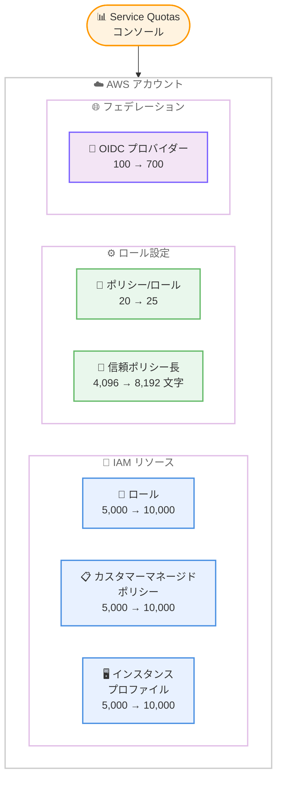

# AWS IAM - 最大クォータの引き上げ

**リリース日**: 2026年5月5日
**サービス**: AWS Identity and Access Management (IAM)
**機能**: IAM リソースの最大クォータ引き上げ (ロール、信頼ポリシー、インスタンスプロファイル、マネージドポリシー、ID プロバイダー)

[このアップデートのインフォグラフィックを見る](https://takech9203.github.io/aws-news-summary/20260505-aws-iam-increased-quotas.html)

## 概要

AWS Identity and Access Management (IAM) が 6 つのリソースに対する最大クォータを引き上げた。対象リソースは、カスタマーマネージドポリシー、インスタンスプロファイル、ロールあたりのマネージドポリシー、ロール信頼ポリシーの長さ、ロール、OpenID Connect プロバイダーの 6 項目である。

今回の変更は、AWS 環境の拡大に伴いスケーリングの制約に直面する顧客の課題に対応するものである。より高い最大クォータにより、IAM コントロールのカスタマイズや、IAM リソースの作成を必要とする追加ワークロードのサポートに柔軟性が向上する。

**アップデート前の課題**

- アカウントあたりのロール数が最大 5,000 に制限されており、大規模な環境ではクォータ上限に達することがあった
- ロールあたりのマネージドポリシーが 20 までに制限され、きめ細かい権限設計に限界があった
- ロール信頼ポリシーの長さが 4,096 文字までに制限され、複雑な信頼関係の記述が困難だった
- OpenID Connect プロバイダーが 100 までに制限され、多数の外部 IdP との連携に制約があった

**アップデート後の改善**

- アカウントあたりのロール、インスタンスプロファイル、カスタマーマネージドポリシーが最大 10,000 まで拡張可能になった
- ロールあたりのマネージドポリシーが 25 まで増加し、より細かい権限分離が可能になった
- ロール信頼ポリシーの長さが 8,192 文字まで拡張され、複雑な条件やプリンシパルの指定が容易になった
- OpenID Connect プロバイダーが 700 まで拡張され、大規模なフェデレーション環境に対応可能になった

## アーキテクチャ図



6 つの IAM リソースクォータが引き上げられ、Service Quotas コンソールからクォータの確認と増加リクエストが可能である。

## サービスアップデートの詳細

### 主要機能

1. **アカウントレベルのリソースクォータ引き上げ**
   - ロール数: 5,000 → 10,000
   - カスタマーマネージドポリシー数: 5,000 → 10,000
   - インスタンスプロファイル数: 5,000 → 10,000

2. **ロールレベルのクォータ引き上げ**
   - ロールあたりのマネージドポリシー数: 20 → 25
   - ロール信頼ポリシーの文字数上限: 4,096 → 8,192 文字

3. **フェデレーションクォータ引き上げ**
   - OpenID Connect プロバイダー数: 100 → 700

## 技術仕様

### クォータ変更一覧

| リソース | 変更前 | 変更後 | 増加率 |
|----------|--------|--------|--------|
| カスタマーマネージドポリシー/アカウント | 5,000 | 10,000 | 2 倍 |
| インスタンスプロファイル/アカウント | 5,000 | 10,000 | 2 倍 |
| マネージドポリシー/ロール | 20 | 25 | 1.25 倍 |
| ロール信頼ポリシーの長さ | 4,096 文字 | 8,192 文字 | 2 倍 |
| ロール/アカウント | 5,000 | 10,000 | 2 倍 |
| OpenID Connect プロバイダー/アカウント | 100 | 700 | 7 倍 |

### クォータ増加リクエスト

| リージョンタイプ | リクエスト方法 |
|------------------|----------------|
| AWS 商用リージョン | US East (N. Virginia) の Service Quotas コンソールから申請 |
| AWS GovCloud (US) | AWS Support を通じて申請 |
| 中国リージョン | AWS Support を通じて申請 |

## 設定方法

### 前提条件

1. AWS アカウントを保有していること
2. Service Quotas コンソールへのアクセス権限があること
3. 適切な IAM 権限 (servicequotas:RequestServiceQuotaIncrease) を持つユーザーまたはロールであること

### 手順

#### ステップ 1: 現在のクォータを確認する

```bash
# AWS CLI で現在の IAM クォータを確認
aws service-quotas get-service-quota \
  --service-code iam \
  --quota-code L-FE177D64 \
  --region us-east-1
```

IAM のクォータコードを指定して、現在の適用クォータ値を確認する。主なクォータコードは以下の通りである。
- `L-FE177D64`: ロール/アカウント
- `L-DBFB993F`: カスタマーマネージドポリシー/アカウント
- `L-6E65F259`: インスタンスプロファイル/アカウント

#### ステップ 2: クォータ増加をリクエストする

```bash
# Service Quotas でクォータ増加をリクエスト
aws service-quotas request-service-quota-increase \
  --service-code iam \
  --quota-code L-FE177D64 \
  --desired-value 10000 \
  --region us-east-1
```

US East (N. Virginia) リージョンで Service Quotas API を使用して、希望するクォータ値を指定してリクエストを送信する。

#### ステップ 3: リクエストステータスを確認する

```bash
# リクエストの履歴とステータスを確認
aws service-quotas list-requested-service-quota-change-history \
  --service-code iam \
  --region us-east-1
```

送信したクォータ増加リクエストの承認状況を確認する。

## メリット

### ビジネス面

- **大規模環境のスケーリング**: マイクロサービスアーキテクチャや多数のワークロードを持つ組織が、クォータ制限を気にせず拡張できる
- **マルチテナント対応の柔軟性**: SaaS プロバイダーが 1 つのアカウントでより多くのテナント用ロールやポリシーを管理できる
- **運用負荷の軽減**: クォータ上限に達するたびにサポートケースを起票する手間が削減される

### 技術面

- **きめ細かいアクセス制御**: ロールあたり 25 ポリシーにより、最小権限の原則をより厳密に適用できる
- **複雑な信頼関係の実現**: 8,192 文字の信頼ポリシーにより、複数の条件キーやプリンシパルを含む高度な信頼関係を記述できる
- **大規模フェデレーション**: 700 の OIDC プロバイダーにより、多数の外部 ID プロバイダーとの統合が可能になる

## デメリット・制約事項

### 制限事項

- クォータ値は「最大リクエスト可能値」であり、自動的に適用されるわけではない。Service Quotas を通じたリクエストが必要
- 商用リージョンのクォータ増加は US East (N. Virginia) からのみリクエスト可能
- GovCloud および中国リージョンでは Service Quotas コンソールではなく AWS Support を通じてリクエストする必要がある

### 考慮すべき点

- クォータの増加は即座に承認されるとは限らない。計画的にリクエストすることが推奨される
- 多数のロールやポリシーを管理する場合、IAM Access Analyzer や AWS Organizations のサービスコントロールポリシー (SCP) を活用して統制を維持することが重要
- アカウント統合戦略の見直し: これまでクォータ制限のためにマルチアカウント構成にしていた場合、統合の検討が可能になる

## ユースケース

### ユースケース 1: 大規模マイクロサービス環境

**シナリオ**: 数百のマイクロサービスを運用する企業が、各サービスに固有の IAM ロールを割り当てている。従来は 5,000 ロールの上限に近づき、アカウント分割を検討していた。

**実装例**:
```bash
# 各マイクロサービスに専用ロールを作成
aws iam create-role \
  --role-name microservice-payment-v2 \
  --assume-role-policy-document file://trust-policy.json

# ロールにきめ細かいポリシーを最大25個アタッチ
aws iam attach-role-policy \
  --role-name microservice-payment-v2 \
  --policy-arn arn:aws:iam::123456789012:policy/DynamoDBReadOnly
```

**効果**: 1 アカウントで最大 10,000 ロールを管理可能になり、アカウント分割の複雑さを回避できる

### ユースケース 2: SaaS マルチテナント環境

**シナリオ**: SaaS プロバイダーが各テナントに OIDC プロバイダーを設定し、テナント独自の IdP との連携を実現している。従来の 100 プロバイダー上限では対応できるテナント数に限界があった。

**実装例**:
```bash
# テナントごとに OIDC プロバイダーを作成
aws iam create-open-id-connect-provider \
  --url https://tenant-xyz.idp.example.com \
  --client-id-list "tenant-xyz-app" \
  --thumbprint-list "c3768084dfb3d2b68b7897bf5f565da8eEXAMPLE"
```

**効果**: 700 テナントまでの OIDC フェデレーションを 1 アカウントで管理可能になる

### ユースケース 3: 複雑なクロスアカウント信頼関係

**シナリオ**: 多数のアカウントや外部サービスからのアクセスを許可するロールの信頼ポリシーが、4,096 文字の上限に達していた。

**実装例**:
```json
{
  "Version": "2012-10-17",
  "Statement": [
    {
      "Effect": "Allow",
      "Principal": {
        "AWS": [
          "arn:aws:iam::111111111111:root",
          "arn:aws:iam::222222222222:root",
          "arn:aws:iam::333333333333:root"
        ]
      },
      "Action": "sts:AssumeRole",
      "Condition": {
        "StringEquals": {
          "aws:PrincipalOrgID": "o-exampleorgid"
        },
        "ArnLike": {
          "aws:PrincipalArn": "arn:aws:iam::*:role/CrossAccountRole-*"
        }
      }
    }
  ]
}
```

**効果**: 8,192 文字まで使用可能になり、多数のプリンシパルや詳細な条件を 1 つの信頼ポリシーに含めることが可能になる

## 料金

IAM リソースのクォータ引き上げに追加料金は発生しない。IAM 自体は無料で利用できるサービスであり、ロール、ポリシー、インスタンスプロファイル、OIDC プロバイダーの作成・管理に課金はない。

## 利用可能リージョン

すべての AWS 商用リージョン、AWS GovCloud (US) リージョン、および中国リージョンで利用可能。ただし、クォータ増加リクエストの方法はリージョンタイプにより異なる。

## 関連サービス・機能

- **AWS Service Quotas**: クォータの確認と増加リクエストを管理するサービス
- **AWS Organizations**: マルチアカウント環境でのクォータ管理と SCP によるガバナンス
- **AWS IAM Access Analyzer**: 増加したリソースに対するアクセス分析と最小権限の維持
- **AWS CloudTrail**: IAM リソースの変更を監査・追跡
- **AWS IAM Identity Center (SSO)**: フェデレーションアクセスの一元管理

## 参考リンク

- [インフォグラフィック](https://takech9203.github.io/aws-news-summary/20260505-aws-iam-increased-quotas.html)
- [公式発表 (What's New)](https://aws.amazon.com/about-aws/whats-new/2026/05/aws-iam-increased-quotas/)
- [IAM and AWS STS quotas ドキュメント](https://docs.aws.amazon.com/IAM/latest/UserGuide/reference_iam-quotas.html)
- [Service Quotas ユーザーガイド](https://docs.aws.amazon.com/servicequotas/latest/userguide/intro.html)
- [クォータ増加のリクエスト方法](https://docs.aws.amazon.com/servicequotas/latest/userguide/request-quota-increase.html)

## まとめ

今回の IAM クォータ引き上げは、大規模な AWS 環境を運用する組織にとって重要なアップデートである。特にロール数やポリシー数の倍増、OIDC プロバイダーの 7 倍増は、マイクロサービスアーキテクチャや SaaS マルチテナント環境のスケーリングに直接的な恩恵をもたらす。現在のクォータ使用率が高い環境では、Service Quotas コンソールから早期に増加リクエストを行うことを推奨する。
