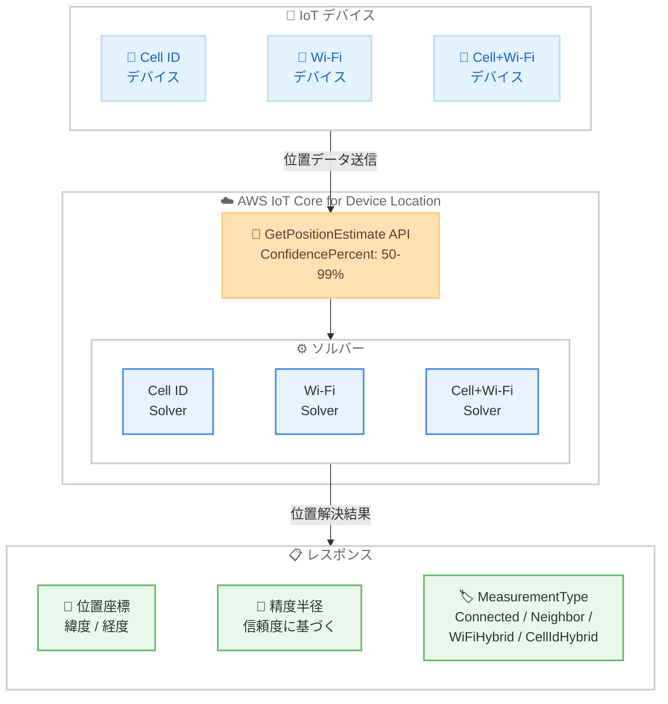

# AWS IoT Core for Device Location - 信頼度レベル設定と測定タイプサポートの追加

**リリース日**: 2026年5月5日
**サービス**: AWS IoT Core
**機能**: Device Location - Confidence Level Configuration / Measurement Type

📊 [このアップデートのインフォグラフィックを見る](https://takech9203.github.io/aws-news-summary/20260505-aws-iot-core-device-location.html)

## 概要

AWS IoT Core for Device Location に 2 つの重要な機能強化が追加された。開発者はデバイスの位置解決に対してより精密な制御が可能となり、解決された位置情報に関するリッチなメタデータを取得できるようになった。

1 つ目の強化は「信頼度レベル設定」で、Cell ID、Wi-Fi、または Cell+Wi-Fi ソルバーを使用する際に 50% から 99% の範囲で希望する信頼度レベルを指定できる。この信頼度レベルは、実際のデバイス位置が報告された精度半径内に存在する統計的確率を表す。2 つ目の強化は「測定タイプ」のレスポンスへの追加で、位置がどのような方法で解決されたかを示すメタデータが返されるようになった。

**アップデート前の課題**

- 位置解決時に信頼度レベルを指定できず、固定のデフォルト値でしか精度半径を取得できなかった
- 解決された位置データがどのソースに基づいているかを判断する方法がなかった
- ユースケースに応じた精度と確実性のバランス調整ができなかった

**アップデート後の改善**

- 50% から 99% の範囲で信頼度レベルを指定でき、精度半径と確実性のトレードオフを制御可能になった
- MeasurementType フィールドにより位置解決の方法 (Connected、Neighbor、WiFiHybrid、CellIdHybrid) が明示されるようになった
- HTTP ベースの位置解決リクエストにおいて、ビジネス要件に合わせた最適な設定が可能になった

## アーキテクチャ図



デバイスが位置データを送信すると、指定された信頼度レベルに基づいてソルバーが位置を解決し、座標・精度半径・測定タイプを含むレスポンスを返す。

## サービスアップデートの詳細

### 主要機能

1. **信頼度レベル設定 (Confidence Level Configuration)**
   - Cell ID、Wi-Fi、Cell+Wi-Fi ソルバーで利用可能
   - 50% から 99% の範囲で信頼度レベルを指定可能
   - 高い信頼度 (例: 95%) は精度半径が大きくなるが、デバイスがその範囲内に存在する確実性が高まる
   - 低い信頼度 (例: 50%) は精度半径が小さくなるが、確実性は低下する
   - HTTP ベースの位置解決でサポート

2. **測定タイプ (MeasurementType)**
   - すべてのソルバーのレスポンスに MeasurementType フィールドが追加
   - 位置データのソースを明示し、精度に関する判断を支援
   - 返される値: Connected、Neighbor、WiFiHybrid、CellIdHybrid

3. **AdvancedConfiguration パラメータ**
   - GetPositionEstimate API に AdvancedConfiguration オブジェクトが追加
   - WiFiCellular.ConfidencePercent フィールドで信頼度を指定

## 技術仕様

### 信頼度レベルの動作

| 信頼度レベル | 精度半径 | 確実性 | 推奨ユースケース |
|------|------|------|------|
| 50% | 小さい | 低い | 大まかな位置で十分な場合 |
| 68% | 中程度 | 中程度 | 標準的な追跡 |
| 95% | 大きい | 高い | 高い確実性が必要な場合 |
| 99% | 最大 | 非常に高い | 安全性重視のアプリケーション |

### MeasurementType の値

| タイプ | 説明 |
|------|------|
| Connected | 接続中のセルタワーに基づく位置解決 |
| Neighbor | 近隣のセルタワーに基づく位置解決 |
| WiFiHybrid | Wi-Fi とハイブリッド手法による位置解決 |
| CellIdHybrid | Cell ID とハイブリッド手法による位置解決 |

### API 変更履歴

| 日付 | サービス | 変更内容 |
|------|----------|----------|
| 2026/04/22 | [AWS IoT Wireless](https://awsapichanges.com/archive/changes/9e0cd6-api.iotwireless.html) | 1 updated api method - GetPositionEstimate に AdvancedConfiguration パラメータを追加 |

### API リクエスト例

```python
import boto3

client = boto3.client('iotwireless')

response = client.get_position_estimate(
    CellTowers={
        'Lte': [
            {
                'Mcc': 440,
                'Mnc': 10,
                'EutranCid': 12345678,
                'Tac': 1234
            }
        ]
    },
    AdvancedConfiguration={
        'WiFiCellular': {
            'ConfidencePercent': 95
        }
    }
)
```

## 設定方法

### 前提条件

1. AWS アカウントと適切な IAM 権限 (iotwireless:GetPositionEstimate)
2. AWS IoT Core for Device Location が有効化されていること
3. デバイスからセルタワーまたは Wi-Fi アクセスポイント情報を収集する仕組み

### 手順

#### ステップ 1: IAM ポリシーの設定

```json
{
    "Version": "2012-10-17",
    "Statement": [
        {
            "Effect": "Allow",
            "Action": [
                "iotwireless:GetPositionEstimate"
            ],
            "Resource": "*"
        }
    ]
}
```

IoT Wireless の GetPositionEstimate API を呼び出すための IAM 権限を付与する。

#### ステップ 2: 信頼度レベルを指定した位置解決リクエスト

```bash
aws iotwireless get-position-estimate \
    --cell-towers '{
        "Lte": [{
            "Mcc": 440,
            "Mnc": 10,
            "EutranCid": 12345678,
            "Tac": 1234
        }]
    }' \
    --advanced-configuration '{
        "WiFiCellular": {
            "ConfidencePercent": 95
        }
    }' \
    output.json
```

AdvancedConfiguration の WiFiCellular.ConfidencePercent に希望する信頼度レベル (50-99) を指定して位置解決を実行する。

#### ステップ 3: レスポンスの MeasurementType を確認

```python
import json

# レスポンスの GeoJSON ペイロードを解析
geo_data = json.loads(response['GeoJsonPayload'].read())

# 位置座標の取得
coordinates = geo_data['coordinates']
print(f"緯度: {coordinates[1]}, 経度: {coordinates[0]}")

# MeasurementType の確認
measurement_type = geo_data.get('properties', {}).get('MeasurementType')
print(f"測定タイプ: {measurement_type}")
```

レスポンスに含まれる MeasurementType を確認し、位置データの精度と信頼性を評価する。

## メリット

### ビジネス面

- **ユースケースに最適化された位置精度**: 信頼度レベルを調整することで、アセット追跡、ジオフェンシング、物流管理など各ユースケースに最適な精度と確実性のバランスを実現できる
- **運用判断の改善**: MeasurementType により位置データの品質を把握し、ビジネス判断の信頼性を向上できる
- **追加コストなし**: 既存の Device Location 料金体系内で利用可能な機能強化

### 技術面

- **精度制御の柔軟性**: 50-99% の範囲で信頼度を指定でき、システム要件に応じた精密な制御が可能
- **デバッグの効率化**: MeasurementType により位置解決の問題を迅速に特定・診断できる
- **データ品質の可視化**: 各位置データがどの方法で解決されたかが明示され、アプリケーションロジックの最適化に活用できる

## デメリット・制約事項

### 制限事項

- 信頼度レベル設定は HTTP ベースの位置解決のみでサポートされており、MQTT 経由のリクエストでは利用できない
- 信頼度レベルの範囲は 50% から 99% に限定されている
- 信頼度を高くすると精度半径が大きくなるため、狭い範囲での精密な位置特定には不向きな場合がある

### 考慮すべき点

- 信頼度レベルと精度半径はトレードオフの関係にあるため、ユースケースに応じた適切な値の選定が必要
- MeasurementType が Neighbor の場合、Connected と比較して位置精度が低い可能性がある

## ユースケース

### ユースケース 1: 物流アセット追跡

**シナリオ**: 物流会社が配送車両やコンテナの位置を追跡し、顧客にリアルタイムの配送状況を通知する。高い確実性で車両がエリア内にいることを保証したい。

**実装例**:
```python
response = client.get_position_estimate(
    CellTowers={'Lte': [cell_tower_data]},
    AdvancedConfiguration={
        'WiFiCellular': {
            'ConfidencePercent': 95
        }
    }
)
# 95% の信頼度で精度半径内にデバイスが存在することを保証
```

**効果**: 95% の信頼度により、顧客への配送通知の正確性が向上し、誤った到着通知を防止できる。

### ユースケース 2: ジオフェンシングによるセキュリティ管理

**シナリオ**: 工場内の高価な機器が指定エリア外に移動した場合にアラートを発行するセキュリティシステム。誤検知を最小限に抑えたい。

**実装例**:
```python
response = client.get_position_estimate(
    CellTowers={'Lte': [cell_tower_data]},
    WiFiAccessPoints=[wifi_data],
    AdvancedConfiguration={
        'WiFiCellular': {
            'ConfidencePercent': 99
        }
    }
)
# MeasurementType を確認してアラート判断に活用
measurement_type = get_measurement_type(response)
if measurement_type == 'Connected':
    # 接続セルに基づく高精度な位置 - アラート判断に利用
    check_geofence(coordinates, accuracy_radius)
```

**効果**: 99% の信頼度と MeasurementType の組み合わせにより、誤検知を大幅に削減しつつセキュリティを強化できる。

### ユースケース 3: IoT センサーの位置基盤データ分析

**シナリオ**: 都市部に設置された環境センサーの位置データを収集し、大まかなエリア分析を行う。精密な位置は不要だが、コンパクトな精度半径が望ましい。

**実装例**:
```python
response = client.get_position_estimate(
    CellTowers={'Lte': [cell_tower_data]},
    AdvancedConfiguration={
        'WiFiCellular': {
            'ConfidencePercent': 50
        }
    }
)
# 小さな精度半径でエリア分類に活用
# MeasurementType でデータ品質を分類
```

**効果**: 50% の信頼度で小さな精度半径を取得し、効率的なエリア分類とデータ分析が可能になる。

## 料金

AWS IoT Core Device Location の料金は位置解決リクエスト数に基づく従量課金制。信頼度レベル設定および MeasurementType の利用による追加料金は発生しない。

### 料金例

| 使用量 | 月額料金（概算） |
|--------|------------------|
| 最初の 1,000 回 (無料枠) | $0 (アカウント作成後 12 か月間) |
| 1,000 回/月 | $1.00 (1K リクエストあたり) |

※ 無料利用枠: アカウント作成後 12 か月間、月 1,000 回の位置解決が無料。AWS GovCloud (US) を除く全リージョンで利用可能。

## 利用可能リージョン

AWS IoT Core for Device Location がサポートされているすべてのリージョンで利用可能。主要なサポートリージョンは以下の通り。

- 米国東部 (バージニア北部)
- 米国西部 (オレゴン)
- 欧州 (フランクフルト)
- 欧州 (アイルランド)
- アジアパシフィック (シドニー)
- アジアパシフィック (東京)
- アジアパシフィック (ソウル)

## 関連サービス・機能

- **AWS IoT Core**: IoT デバイスとクラウド間の接続・メッセージング基盤
- **AWS IoT Core for LoRaWAN**: LoRaWAN プロトコルを使用するデバイスの接続と位置解決
- **AWS IoT Core for Amazon Sidewalk**: Sidewalk ネットワーク経由のデバイス接続と BLE 位置検索
- **Amazon Location Service**: 地図、ジオコーディング、ルーティング、ジオフェンシングなどの位置ベースサービス

## 参考リンク

- 📊 [インフォグラフィック](https://takech9203.github.io/aws-news-summary/20260505-aws-iot-core-device-location.html)
- [公式発表 (What's New)](https://aws.amazon.com/about-aws/whats-new/2026/05/aws-iot-core-device-location/)
- [AWS IoT Core Device Location ドキュメント](https://docs.aws.amazon.com/iot/latest/developerguide/iot-device-location.html)
- [AWS IoT Wireless 開発者ガイド](https://docs.aws.amazon.com/iot-wireless/latest/developerguide/)
- [AWS IoT Core 料金ページ](https://aws.amazon.com/iot-core/pricing/)
- [AWS IoT Core 機能ページ](https://aws.amazon.com/iot-core/features/)

## まとめ

今回のアップデートにより、AWS IoT Core for Device Location を利用する開発者はユースケースに応じた精度と確実性の最適なバランスを選択できるようになった。信頼度レベル設定は GPS を持たないデバイスの位置追跡において特に有用であり、MeasurementType メタデータはデータ品質の判断とデバッグの効率化に貢献する。既に Device Location を利用中の場合は、GetPositionEstimate API の AdvancedConfiguration パラメータを活用して、各ユースケースに最適な信頼度レベルの設定を検討することを推奨する。
