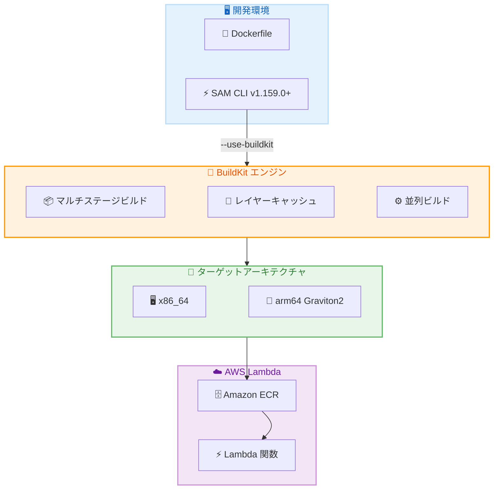

# AWS SAM CLI - BuildKit サポートによるコンテナイメージビルドの強化

**リリース日**: 2026年5月5日
**サービス**: AWS Serverless Application Model (SAM) CLI
**機能**: BuildKit サポート (コンテナイメージパッケージ Lambda 関数向け)

📊 [このアップデートのインフォグラフィックを見る](https://takech9203.github.io/aws-news-summary/20260505-aws-sam-cli-buildkit-aws-lambda.html)

## 概要

AWS SAM CLI が BuildKit をサポートし、Dockerfile からコンテナイメージをビルドする際に、より高速で効率的なビルドが可能になった。SAM CLI はサーバーレスアプリケーションをローカルでビルド、テスト、デバッグ、パッケージングするためのコマンドラインツールであり、今回の BuildKit 対応により、Lambda 関数をコンテナイメージとしてパッケージングする開発者のワークフローが大幅に改善される。

BuildKit は Docker の次世代ビルドエンジンであり、マルチステージビルド、改善されたキャッシング、ビルドステップの並列化、クロスアーキテクチャビルド、Docker シークレットなどの高度な機能を提供する。SAM CLI バージョン 1.159.0 以降で `--use-buildkit` フラグを使用することで、Docker および Finch の両方でこれらの機能を活用できる。

**アップデート前の課題**

- SAM CLI は BuildKit の機能をサポートしていなかったため、コンテナイメージビルドの最適化手段が限定的だった
- マルチステージビルドによる本番用イメージの軽量化が SAM CLI 経由では実現できなかった
- 異なる CPU アーキテクチャ (x86_64 と arm64) 向けのクロスビルドを同一マシンから行うことが困難だった
- ビルド時にシークレット情報を安全に扱う手段が限られていた

**アップデート後の改善**

- マルチステージビルドにより、開発依存関係を含まない軽量な本番イメージの作成が可能になった
- 改善されたキャッシング機構によりリビルド時間が短縮された
- ビルドステップの並列化により全体的なビルド速度が向上した
- クロスアーキテクチャビルドにより、同一開発マシンから x86_64 と arm64 (AWS Graviton2) の両方をターゲットにしたイメージをビルドできるようになった
- Docker シークレットの使用により、認証情報や API キーなどの機密データを最終イメージレイヤーから除外できるようになった

## アーキテクチャ図



SAM CLI が BuildKit エンジンを活用してコンテナイメージをビルドし、複数のアーキテクチャ向けに最適化されたイメージを Amazon ECR 経由で Lambda にデプロイする流れを示している。

## サービスアップデートの詳細

### 主要機能

1. **マルチステージビルド**
   - ビルドステージと実行ステージを分離し、最終イメージから開発ツールやビルド依存関係を除外
   - 本番イメージのサイズを大幅に削減可能
   - Lambda 関数のコールドスタート時間の短縮に貢献

2. **改善されたキャッシング**
   - BuildKit のインテリジェントなレイヤーキャッシュにより、変更のないステップの再実行を回避
   - 差分ビルドの高速化により開発サイクルが改善
   - CI/CD パイプラインでのビルド時間短縮

3. **ビルドステップの並列化**
   - 依存関係のないビルドステップを同時に実行
   - ビルドグラフの最適化により全体的なビルド時間を短縮

4. **クロスアーキテクチャビルド**
   - 同一開発マシンから x86_64 と arm64 の両アーキテクチャ向けイメージをビルド
   - AWS Graviton2 プロセッサ向けの Lambda 関数を Intel ベースの開発マシンから直接ビルド可能
   - アーキテクチャ固有のテスト環境が不要に

5. **Docker シークレット**
   - ビルド時に必要な認証情報や API キーを安全に注入
   - シークレットは最終イメージレイヤーに残らないため、セキュリティリスクを低減
   - プライベートリポジトリからの依存関係取得に活用可能

## 技術仕様

### 要件と互換性

| 項目 | 詳細 |
|------|------|
| 必要な SAM CLI バージョン | 1.159.0 以降 |
| 有効化フラグ | `--use-buildkit` |
| サポートするコンテナランタイム | Docker、Finch |
| ターゲットアーキテクチャ | x86_64、arm64 (Graviton2) |
| パッケージング形式 | コンテナイメージ (Dockerfile ベース) |

### 設定例

```yaml
# template.yaml (SAM テンプレート)
AWSTemplateFormatVersion: '2010-09-09'
Transform: AWS::Serverless-2016-10-31

Resources:
  MyFunction:
    Type: AWS::Serverless::Function
    Properties:
      PackageType: Image
      Architectures:
        - arm64
    Metadata:
      DockerTag: latest
      DockerContext: ./app
      Dockerfile: Dockerfile
```

## 設定方法

### 前提条件

1. SAM CLI バージョン 1.159.0 以降がインストールされていること
2. Docker または Finch がインストールされ、実行中であること
3. Lambda 関数がコンテナイメージとしてパッケージングされていること

### 手順

#### ステップ 1: SAM CLI のアップデート

```bash
# pip を使用してアップデート
pip install --upgrade aws-sam-cli

# バージョン確認
sam --version
```

SAM CLI を最新バージョンにアップデートし、1.159.0 以降であることを確認する。

#### ステップ 2: BuildKit を有効にしてビルド

```bash
# BuildKit フラグを指定してビルド
sam build --use-buildkit
```

`--use-buildkit` フラグを付与することで、BuildKit エンジンを使用したコンテナイメージのビルドが実行される。

#### ステップ 3: マルチステージビルドの Dockerfile 例

```dockerfile
# ビルドステージ
FROM public.ecr.aws/lambda/python:3.12 AS builder
COPY requirements.txt .
RUN pip install --no-cache-dir -r requirements.txt -t /opt/python

# 本番ステージ
FROM public.ecr.aws/lambda/python:3.12
COPY --from=builder /opt/python /opt/python
COPY app.py ${LAMBDA_TASK_ROOT}
CMD ["app.handler"]
```

マルチステージビルドにより、ビルドツールを含まない軽量な本番イメージが作成される。

#### ステップ 4: クロスアーキテクチャビルド

```bash
# arm64 向けビルド (Intel マシンから)
sam build --use-buildkit --parameter-overrides Architecture=arm64
```

Intel ベースの開発マシンから Graviton2 向けのコンテナイメージをビルドする。

#### ステップ 5: Docker シークレットの使用

```dockerfile
# Dockerfile 内でシークレットを使用
RUN --mount=type=secret,id=my_secret \
    pip install -r requirements.txt --extra-index-url $(cat /run/secrets/my_secret)
```

ビルド時にシークレットを安全にマウントし、最終イメージには含めずに使用する。

## メリット

### ビジネス面

- **開発効率の向上**: キャッシングと並列化により、ビルド時間が短縮され開発サイクルが加速する
- **コスト削減**: 軽量なイメージにより Lambda のコールドスタート時間が短縮され、実行コストが低減する
- **マルチアーキテクチャ対応の簡素化**: 単一の開発環境から複数アーキテクチャ向けにビルドでき、Graviton2 の価格性能メリットを活用しやすくなる

### 技術面

- **イメージサイズの最適化**: マルチステージビルドにより不要な依存関係を排除し、本番イメージを最小化できる
- **セキュリティ強化**: Docker シークレットにより、機密情報がイメージレイヤーに残留するリスクを排除できる
- **CI/CD パイプラインの高速化**: 効率的なキャッシングによりパイプライン全体の実行時間を短縮できる
- **Docker と Finch の両対応**: コンテナランタイムの選択肢が広がり、チームの要件に合わせて柔軟に選択可能

## デメリット・制約事項

### 制限事項

- BuildKit の利用には `--use-buildkit` フラグの明示的な指定が必要 (デフォルトでは無効)
- ZIP パッケージング形式の Lambda 関数には適用されない (コンテナイメージのみ)
- BuildKit 特有の Dockerfile 構文を使用する場合、BuildKit 非対応環境との互換性に注意が必要

### 考慮すべき点

- 既存の Dockerfile を BuildKit 向けに最適化する作業が必要になる場合がある
- クロスアーキテクチャビルドでは QEMU エミュレーションが使用されるため、ネイティブビルドと比較してビルド時間が長くなる可能性がある
- CI/CD 環境でのキャッシュ活用には、キャッシュストレージの適切な設定が必要

## ユースケース

### ユースケース 1: ML 推論用 Lambda 関数の軽量化

**シナリオ**: 機械学習モデルを含む Lambda 関数で、ビルド時に大量のコンパイルツールが必要だが、実行時には不要なケース。

**実装例**:
```dockerfile
# syntax=docker/dockerfile:1
FROM public.ecr.aws/lambda/python:3.12 AS builder
RUN yum install -y gcc gcc-c++ cmake
COPY requirements.txt .
RUN pip install --no-cache-dir -r requirements.txt -t /opt/python

FROM public.ecr.aws/lambda/python:3.12
COPY --from=builder /opt/python /opt/python
COPY model/ ${LAMBDA_TASK_ROOT}/model/
COPY handler.py ${LAMBDA_TASK_ROOT}
CMD ["handler.lambda_handler"]
```

**効果**: ビルドツールを最終イメージから除外することで、イメージサイズを 50% 以上削減し、コールドスタート時間を短縮できる。

### ユースケース 2: Graviton2 向けクロスビルドによるコスト最適化

**シナリオ**: 開発チームが Intel Mac を使用しているが、Lambda 関数を Graviton2 (arm64) で実行してコストを削減したいケース。

**実装例**:
```bash
# SAM テンプレートで arm64 を指定
sam build --use-buildkit

# ローカルテスト
sam local invoke MyFunction

# デプロイ
sam deploy
```

**効果**: arm64 アーキテクチャの Lambda は x86_64 と比較して最大 20% のコスト削減と優れたパフォーマンスを実現できる。

### ユースケース 3: プライベートパッケージリポジトリからの安全な依存関係取得

**シナリオ**: 社内のプライベート PyPI リポジトリから認証付きでパッケージを取得する必要があるが、認証情報をイメージに残したくないケース。

**実装例**:
```dockerfile
# syntax=docker/dockerfile:1
FROM public.ecr.aws/lambda/python:3.12
RUN --mount=type=secret,id=pip_token \
    pip install --no-cache-dir \
    --extra-index-url https://$(cat /run/secrets/pip_token)@private.pypi.example.com/simple/ \
    -r requirements.txt -t ${LAMBDA_TASK_ROOT}
COPY app.py ${LAMBDA_TASK_ROOT}
CMD ["app.handler"]
```

**効果**: 認証トークンが最終イメージのレイヤーに保存されないため、イメージが漏洩した場合でもプライベートリポジトリへのアクセスが保護される。

## 料金

SAM CLI は無料で使用できるオープンソースツールであり、BuildKit サポートの追加に伴う追加料金は発生しない。Lambda 関数の実行やコンテナイメージの保存 (Amazon ECR) に関する料金は通常の AWS サービス料金に従う。

## 利用可能リージョン

SAM CLI はローカル開発ツールであるため、リージョンに依存しない。ビルドしたコンテナイメージは、Lambda のコンテナイメージデプロイをサポートするすべての AWS リージョンにデプロイ可能。

## 関連サービス・機能

- **AWS Lambda**: コンテナイメージとしてパッケージングされた関数の実行環境
- **Amazon ECR**: ビルドしたコンテナイメージの保存先リポジトリ
- **AWS CodeBuild**: CI/CD パイプラインでの BuildKit 対応ビルド環境
- **AWS Graviton2**: arm64 アーキテクチャの Lambda 実行環境で、コスト効率の高い実行を提供
- **Amazon Finch**: AWS が提供するオープンソースのコンテナ開発ツール

## 参考リンク

- 📊 [インフォグラフィック](https://takech9203.github.io/aws-news-summary/20260505-aws-sam-cli-buildkit-aws-lambda.html)
- [公式発表 (What's New)](https://aws.amazon.com/about-aws/whats-new/2026/05/aws-sam-cli-buildkit-aws-lambda/)
- [AWS SAM CLI ドキュメント](https://docs.aws.amazon.com/serverless-application-model/latest/developerguide/serverless-sam-cli-command-reference.html)
- [AWS Lambda コンテナイメージサポート](https://docs.aws.amazon.com/lambda/latest/dg/images-create.html)
- [AWS SAM CLI GitHub リポジトリ](https://github.com/aws/aws-sam-cli)

## まとめ

AWS SAM CLI の BuildKit サポートは、Lambda 関数をコンテナイメージとしてパッケージングする開発者にとって重要な改善である。マルチステージビルド、並列化、キャッシング強化によるビルド効率の向上に加え、クロスアーキテクチャビルドにより Graviton2 の採用障壁が下がり、Docker シークレットによりセキュリティも強化される。SAM CLI を 1.159.0 以降にアップデートし、`--use-buildkit` フラグを活用することを推奨する。
