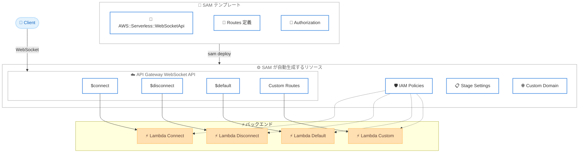

# AWS SAM - WebSocket API サポート

**リリース日**: 2026年5月5日
**サービス**: AWS Serverless Application Model (AWS SAM)
**機能**: WebSocket APIs for Amazon API Gateway

📊 [このアップデートのインフォグラフィックを見る](https://takech9203.github.io/aws-news-summary/20260505-aws-sam-websocket-apis-api-gateway.html)

## 概要

AWS Serverless Application Model (AWS SAM) が Amazon API Gateway の WebSocket API をネイティブサポートするようになった。新しい `AWS::Serverless::WebSocketApi` リソースタイプを SAM テンプレートに追加するだけで、最小限の設定でリアルタイム通信アプリケーションを構築できる。

WebSocket API はチャット、ライブダッシュボード、AI/LLM ストリーミング、IoT など、リアルタイムアプリケーションに不可欠な技術である。今回のアップデートにより、SAM がルート、インテグレーション、オーソライザー、IAM ポリシー、デプロイ設定などの基盤リソースを自動生成するため、開発者は複雑な CloudFormation 設定から解放される。

**アップデート前の課題**

- SAM が WebSocket API をサポートしておらず、AWS CloudFormation で全てのリソースを手動設定する必要があった
- Lambda 関数の IAM 権限の欠落など、一般的な問題のデバッグが困難だった
- WebSocket API のルート、インテグレーション、ステージ設定を個別に定義する必要があり、設定量が膨大だった

**アップデート後の改善**

- `AWS::Serverless::WebSocketApi` リソースタイプにより、簡潔な構文で WebSocket API を定義可能になった
- SAM が IAM ポリシー、リソース関係、デプロイ設定を自動生成するようになった
- Globals サポートにより、複数の WebSocket API 間で共通設定を共有できるようになった

## アーキテクチャ図



SAM テンプレートで WebSocket API を定義すると、SAM が API Gateway WebSocket API、ルートインテグレーション、IAM ポリシーなどの全てのリソースを自動生成し、Lambda 関数と連携する。

## サービスアップデートの詳細

### 主要機能

1. **AWS::Serverless::WebSocketApi リソースタイプ**
   - SAM テンプレートに新しいリソースタイプとして追加
   - `$connect`、`$disconnect`、`$default` ルートおよびカスタムルートを定義可能
   - Lambda 関数ハンドラーを指定するだけで、インテグレーションと権限を自動設定

2. **認証・認可サポート**
   - IAM 認証のサポート
   - Lambda オーソライザーのサポート
   - ルートごとに異なる認証方式を設定可能

3. **完全な機能パリティ**
   - API Gateway WebSocket API の全機能をカバー
   - カスタムドメイン設定
   - RouteSettings、Models、StageVariables のサポート
   - Globals による共通設定の一元管理

## 技術仕様

### サポートされる設定項目

| 項目 | 詳細 |
|------|------|
| リソースタイプ | `AWS::Serverless::WebSocketApi` |
| 組み込みルート | `$connect`、`$disconnect`、`$default` |
| カスタムルート | 任意のルートキーを定義可能 |
| 認証方式 | IAM、Lambda Authorizer |
| ドメイン | カスタムドメイン設定対応 |
| ステージ管理 | StageVariables、RouteSettings |
| Globals | 複数 WebSocket API 間で共通設定を共有 |

### 設定例

```yaml
AWSTemplateFormatVersion: '2010-09-09'
Transform: AWS::Serverless-2016-10-31

Resources:
  MyWebSocketApi:
    Type: AWS::Serverless::WebSocketApi
    Properties:
      StageName: prod

  ConnectFunction:
    Type: AWS::Serverless::Function
    Properties:
      Handler: connect.handler
      Runtime: nodejs20.x
      Events:
        ConnectRoute:
          Type: WebSocket
          Properties:
            ApiId: !Ref MyWebSocketApi
            Route: $connect

  DisconnectFunction:
    Type: AWS::Serverless::Function
    Properties:
      Handler: disconnect.handler
      Runtime: nodejs20.x
      Events:
        DisconnectRoute:
          Type: WebSocket
          Properties:
            ApiId: !Ref MyWebSocketApi
            Route: $disconnect

  DefaultFunction:
    Type: AWS::Serverless::Function
    Properties:
      Handler: default.handler
      Runtime: nodejs20.x
      Events:
        DefaultRoute:
          Type: WebSocket
          Properties:
            ApiId: !Ref MyWebSocketApi
            Route: $default

  SendMessageFunction:
    Type: AWS::Serverless::Function
    Properties:
      Handler: sendmessage.handler
      Runtime: nodejs20.x
      Events:
        SendMessageRoute:
          Type: WebSocket
          Properties:
            ApiId: !Ref MyWebSocketApi
            Route: sendmessage
```

## 設定方法

### 前提条件

1. AWS SAM CLI がインストールされていること
2. AWS 認証情報が設定されていること
3. SAM テンプレートの基本的な知識があること

### 手順

#### ステップ 1: SAM テンプレートの作成

```yaml
AWSTemplateFormatVersion: '2010-09-09'
Transform: AWS::Serverless-2016-10-31

Resources:
  ChatWebSocketApi:
    Type: AWS::Serverless::WebSocketApi
    Properties:
      StageName: prod
```

SAM テンプレートに `AWS::Serverless::WebSocketApi` リソースを追加し、ステージ名を指定する。

#### ステップ 2: ルートハンドラーの定義

```yaml
  ConnectHandler:
    Type: AWS::Serverless::Function
    Properties:
      Handler: app.connect_handler
      Runtime: python3.12
      Events:
        WebSocketConnect:
          Type: WebSocket
          Properties:
            ApiId: !Ref ChatWebSocketApi
            Route: $connect
```

各ルートに対応する Lambda 関数を定義する。SAM が自動的にインテグレーションと IAM 権限を設定する。

#### ステップ 3: デプロイ

```bash
sam build
sam deploy --guided
```

`sam build` でアプリケーションをビルドし、`sam deploy --guided` で対話形式のデプロイを実行する。SAM が必要な全リソースを自動的にプロビジョニングする。

## メリット

### ビジネス面

- **開発速度の向上**: WebSocket API の構築に必要な設定量が大幅に削減され、リアルタイム機能の実装が迅速になる
- **運用コストの削減**: 手動設定のミスが減少し、デバッグ時間が短縮される
- **市場投入の加速**: チャットや AI ストリーミングなどのリアルタイム機能を素早くプロトタイプおよびリリースできる

### 技術面

- **設定の簡素化**: CloudFormation で数十行必要だった設定が、SAM テンプレートで数行に簡素化される
- **IAM 権限の自動生成**: Lambda 関数に必要な権限が自動的に設定され、権限不足のエラーが解消される
- **一貫性のある構成管理**: Globals サポートにより、複数の WebSocket API で共通設定を統一的に管理できる

## デメリット・制約事項

### 制限事項

- WebSocket API は API Gateway の WebSocket API の制約に依存する (接続タイムアウト最大 2 時間、ペイロードサイズ最大 128 KB など)
- SAM テンプレートの Transform が `AWS::Serverless-2016-10-31` である必要がある
- 既存の CloudFormation で構築した WebSocket API から SAM への移行は手動作業が必要

### 考慮すべき点

- 複雑なカスタム認証フローが必要な場合は、Lambda オーソライザーの追加設定が必要
- 大規模なルート数を持つ WebSocket API では、テンプレートの可読性を維持するために適切な構造化が重要

## ユースケース

### ユースケース 1: リアルタイムチャットアプリケーション

**シナリオ**: マルチユーザーのチャットアプリケーションで、接続管理とメッセージのブロードキャストが必要

**実装例**:
```yaml
Resources:
  ChatApi:
    Type: AWS::Serverless::WebSocketApi
    Properties:
      StageName: prod

  ConnectFunction:
    Type: AWS::Serverless::Function
    Properties:
      Handler: chat.on_connect
      Runtime: python3.12
      Policies:
        - DynamoDBCrudPolicy:
            TableName: !Ref ConnectionsTable
      Events:
        Connect:
          Type: WebSocket
          Properties:
            ApiId: !Ref ChatApi
            Route: $connect

  SendMessageFunction:
    Type: AWS::Serverless::Function
    Properties:
      Handler: chat.send_message
      Runtime: python3.12
      Policies:
        - DynamoDBCrudPolicy:
            TableName: !Ref ConnectionsTable
      Events:
        SendMessage:
          Type: WebSocket
          Properties:
            ApiId: !Ref ChatApi
            Route: sendmessage
```

**効果**: 接続管理テーブルとメッセージルーティングを最小限の設定で構築でき、IAM 権限も自動設定される

### ユースケース 2: AI/LLM ストリーミングレスポンス

**シナリオ**: 生成 AI アプリケーションで、LLM の応答をリアルタイムにクライアントへストリーミング配信する

**実装例**:
```yaml
Resources:
  AIStreamApi:
    Type: AWS::Serverless::WebSocketApi
    Properties:
      StageName: prod

  StreamHandler:
    Type: AWS::Serverless::Function
    Properties:
      Handler: stream.handler
      Runtime: python3.12
      Timeout: 300
      Policies:
        - Statement:
            - Effect: Allow
              Action:
                - bedrock:InvokeModelWithResponseStream
              Resource: '*'
      Events:
        GenerateRoute:
          Type: WebSocket
          Properties:
            ApiId: !Ref AIStreamApi
            Route: generate
```

**効果**: Amazon Bedrock などの LLM サービスからのストリーミングレスポンスを、WebSocket 経由でクライアントにリアルタイム配信できる

### ユースケース 3: IoT リアルタイムダッシュボード

**シナリオ**: IoT デバイスからのセンサーデータをリアルタイムでダッシュボードに表示する

**実装例**:
```yaml
Resources:
  IoTDashboardApi:
    Type: AWS::Serverless::WebSocketApi
    Properties:
      StageName: prod

  SubscribeFunction:
    Type: AWS::Serverless::Function
    Properties:
      Handler: dashboard.subscribe
      Runtime: nodejs20.x
      Events:
        Subscribe:
          Type: WebSocket
          Properties:
            ApiId: !Ref IoTDashboardApi
            Route: subscribe

  DataPushFunction:
    Type: AWS::Serverless::Function
    Properties:
      Handler: dashboard.push_data
      Runtime: nodejs20.x
      Events:
        IoTRule:
          Type: IoTRule
          Properties:
            Sql: "SELECT * FROM 'sensors/+/data'"
```

**効果**: IoT ルールからのデータを Lambda 経由で WebSocket 接続中のクライアントにプッシュ配信する構成を、SAM テンプレートで一元管理できる

## 料金

WebSocket API の料金は Amazon API Gateway の標準料金に基づく。SAM 自体の利用に追加料金は発生しない。

### 料金例

| 使用量 | 月額料金 (概算、東京リージョン) |
|--------|-------------------------------|
| メッセージ 100 万件 | 約 $1.20 |
| 接続時間 100 万分 | 約 $0.29 |
| データ転送 1 GB | 約 $0.114 |

## 利用可能リージョン

AWS SAM の WebSocket API サポートは、Amazon API Gateway WebSocket API が利用可能な全リージョンで使用可能。東京リージョン (ap-northeast-1) を含む主要リージョンで利用できる。

## 関連サービス・機能

- **Amazon API Gateway**: WebSocket API のランタイム基盤を提供するマネージドサービス
- **AWS Lambda**: WebSocket ルートのバックエンドとして使用されるサーバーレスコンピューティングサービス
- **AWS CloudFormation**: SAM テンプレートの変換先となるインフラストラクチャ管理サービス
- **Amazon DynamoDB**: WebSocket 接続 ID の管理に頻繁に使用されるデータベースサービス

## 参考リンク

- 📊 [インフォグラフィック](https://takech9203.github.io/aws-news-summary/20260505-aws-sam-websocket-apis-api-gateway.html)
- [公式発表 (What's New)](https://aws.amazon.com/about-aws/whats-new/2026/05/aws-sam-websocket-apis-api-gateway/)
- [SAM WebSocketApi リソースリファレンス](https://docs.aws.amazon.com/serverless-application-model/latest/developerguide/sam-resource-websocketapi.html)
- [API Gateway WebSocket API 概要](https://docs.aws.amazon.com/apigateway/latest/developerguide/apigateway-websocket-api-overview.html)
- [AWS SAM 開発者ガイド](https://docs.aws.amazon.com/serverless-application-model/latest/developerguide/what-is-sam.html)
- [API Gateway 料金ページ](https://aws.amazon.com/api-gateway/pricing/)

## まとめ

AWS SAM の WebSocket API サポートにより、リアルタイムアプリケーションの構築が大幅に簡素化された。これまで CloudFormation で複雑な手動設定が必要だった WebSocket API を、SAM テンプレートの数行で定義でき、IAM 権限やデプロイ設定が自動生成される。チャット、AI ストリーミング、IoT ダッシュボードなどのリアルタイム機能を構築する開発者は、既存の SAM プロジェクトに `AWS::Serverless::WebSocketApi` リソースを追加して、すぐに利用を開始することを推奨する。
