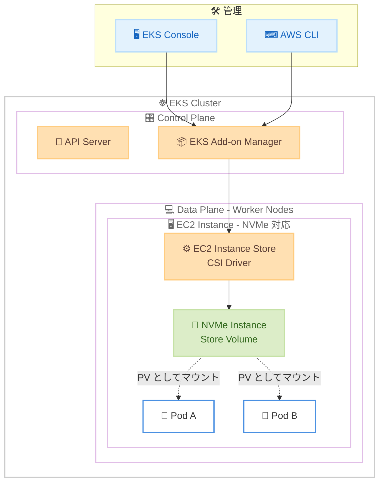

# Amazon EKS - EC2 Instance Store CSI ドライバーが EKS アドオンとして一般提供開始

**リリース日**: 2026 年 5 月 5 日
**サービス**: Amazon Elastic Kubernetes Service (Amazon EKS)
**機能**: EC2 Instance Store CSI Driver EKS Add-on

[このアップデートのインフォグラフィックを見る](https://takech9203.github.io/aws-news-summary/20260505-ec2-csi-eks.html)

## 概要

Amazon EKS が EC2 Instance Store CSI ドライバーを EKS アドオンとして正式にサポートを開始した。これにより、Amazon EKS コンソールおよび AWS CLI を使用して、EC2 インスタンスストアボリュームを Kubernetes クラスターにアタッチするための CSI ドライバーをインストール・管理できるようになった。

EC2 Instance Store CSI ドライバーは、EC2 インスタンスストアボリュームを Kubernetes で利用可能にするプラグインである。インスタンスストアボリュームは、ホストコンピュータに物理的に接続されたエフェメラル (一時的) なブロックレベルストレージを提供する。このドライバーは NVMe ストレージボリュームのライフサイクルを管理し、Kubernetes の Persistent Volume として利用可能にする。機械学習のトレーニング、ビッグデータ分析、ハイパフォーマンスコンピューティング (HPC) など、高性能なローカルストレージを必要とするワークロードに特に有用である。

**アップデート前の課題**

- Helm チャートまたは YAML マニフェストを使用して手動でドライバーをデプロイ・管理する必要があった
- オープンソースドライバーのバージョン管理やアップグレードを個別に追跡する必要があった
- インストールや設定に Kubernetes およびストレージの深い知識が必要だった

**アップデート後の改善**

- EKS コンソールから数クリックで CSI ドライバーをインストール可能になった
- AWS CLI を使用したプログラマティックなインストールと管理が可能になった
- EKS アドオンとしてのライフサイクル管理 (バージョン管理、更新) が自動化された

## アーキテクチャ図



EKS アドオンとして CSI ドライバーをインストールすると、ワーカーノード上で NVMe インスタンスストアボリュームが Kubernetes Persistent Volume として Pod に提供される構成を示す。

## サービスアップデートの詳細

### 主要機能

1. **EKS アドオンとしてのインストール**
   - Amazon EKS コンソールから GUI ベースで数クリックでインストール可能
   - AWS CLI によるコマンドラインでのインストール・管理に対応
   - EKS アドオンフレームワークによるバージョン管理と更新

2. **NVMe インスタンスストアボリュームの Kubernetes 統合**
   - EC2 インスタンスストアボリュームを Kubernetes Persistent Volume として公開
   - NVMe ストレージボリュームのライフサイクル管理を自動化
   - エフェメラルブロックレベルストレージへの簡易アクセス

3. **高性能ワークロードのサポート**
   - 機械学習トレーニングデータの一時キャッシュ
   - ビッグデータ分析における中間データの高速処理
   - HPC ワークロードのスクラッチスペース

## 技術仕様

### インスタンスストアの特性

| 項目 | 詳細 |
|------|------|
| ストレージタイプ | NVMe SSD (エフェメラル) |
| 永続性 | インスタンス停止・終了時にデータ消失 |
| Kubernetes リソース | Persistent Volume (PV) として公開 |
| ドライバータイプ | Container Storage Interface (CSI) |
| インストール方式 | EKS アドオン (マネージド) |

### 対応インスタンスタイプ

インスタンスストアボリュームを持つ EC2 インスタンスタイプで利用可能。代表的なインスタンスファミリーは以下の通り。

| インスタンスファミリー | ユースケース |
|------|------|
| i3, i3en, i4i | ストレージ最適化 |
| c5d, c6id, c7gd | コンピュート最適化 + ローカルストレージ |
| m5d, m6id, m7gd | 汎用 + ローカルストレージ |
| r5d, r6id, r7gd | メモリ最適化 + ローカルストレージ |
| p3dn, p4d, p5 | GPU + ローカルストレージ (ML 向け) |

## 設定方法

### 前提条件

1. Amazon EKS クラスターが作成済みであること
2. ワーカーノードがインスタンスストアボリュームを持つインスタンスタイプで起動されていること
3. kubectl および AWS CLI が設定済みであること

### 手順

#### ステップ 1: EKS アドオンとしてインストール (AWS CLI)

```bash
aws eks create-addon \
  --cluster-name my-cluster \
  --addon-name aws-ec2-instance-store-csi-driver \
  --region us-east-1
```

AWS CLI を使用して、指定した EKS クラスターに EC2 Instance Store CSI ドライバーをアドオンとしてインストールする。

#### ステップ 2: アドオンのステータス確認

```bash
aws eks describe-addon \
  --cluster-name my-cluster \
  --addon-name aws-ec2-instance-store-csi-driver \
  --region us-east-1
```

インストールしたアドオンのステータスが ACTIVE になっていることを確認する。

#### ステップ 3: StorageClass の作成

```yaml
apiVersion: storage.k8s.io/v1
kind: StorageClass
metadata:
  name: instance-store
provisioner: instance.store.csi.aws.com
volumeBindingMode: WaitForFirstConsumer
```

インスタンスストアボリュームを使用するための StorageClass を定義する。`volumeBindingMode: WaitForFirstConsumer` により、Pod がスケジュールされるノードに応じてボリュームがバインドされる。

#### ステップ 4: PersistentVolumeClaim の作成と Pod での使用

```yaml
apiVersion: v1
kind: PersistentVolumeClaim
metadata:
  name: instance-store-pvc
spec:
  accessModes:
    - ReadWriteOnce
  storageClassName: instance-store
  resources:
    requests:
      storage: 100Gi
---
apiVersion: v1
kind: Pod
metadata:
  name: ml-training-pod
spec:
  containers:
    - name: training
      image: my-ml-training:latest
      volumeMounts:
        - mountPath: /scratch
          name: local-storage
  volumes:
    - name: local-storage
      persistentVolumeClaim:
        claimName: instance-store-pvc
```

PersistentVolumeClaim を作成し、Pod にマウントすることでインスタンスストアボリュームを利用する。

## メリット

### ビジネス面

- **運用コスト削減**: Helm チャートや YAML マニフェストの手動管理が不要になり、運用負荷が軽減される
- **導入時間の短縮**: 数クリックでインストール可能なため、環境構築時間が大幅に短縮される
- **追加ストレージコスト不要**: インスタンスストアはインスタンス料金に含まれるため、EBS のような追加ストレージコストが発生しない

### 技術面

- **高 I/O パフォーマンス**: NVMe SSD による低レイテンシ・高スループットのローカルストレージを活用可能
- **一元管理**: EKS アドオンフレームワークによるバージョン管理・更新の統合管理
- **Kubernetes ネイティブ**: CSI 標準に準拠し、PV/PVC の Kubernetes ストレージモデルにシームレスに統合

## デメリット・制約事項

### 制限事項

- インスタンスストアはエフェメラルストレージのため、インスタンスの停止・終了時にデータが消失する
- インスタンスストアボリュームを持つインスタンスタイプのみで利用可能
- ボリュームサイズはインスタンスタイプに依存し、動的なサイズ変更は不可

### 考慮すべき点

- 永続的なデータ保存には EBS CSI ドライバーや EFS CSI ドライバーとの併用が必要
- ノード障害時のデータ復旧は不可能なため、重要なデータはレプリケーションまたはバックアップ戦略が必須
- Pod のスケジューリングがインスタンスストアを持つノードに制限される

## ユースケース

### ユースケース 1: 機械学習トレーニングの一時データキャッシュ

**シナリオ**: 大規模な ML トレーニングジョブで、S3 からダウンロードしたトレーニングデータを高速にアクセスしたい。

**実装例**:
```yaml
apiVersion: v1
kind: Pod
metadata:
  name: ml-training
spec:
  containers:
    - name: trainer
      image: pytorch-training:latest
      command: ["python", "train.py", "--data-dir", "/cache"]
      volumeMounts:
        - mountPath: /cache
          name: fast-cache
  volumes:
    - name: fast-cache
      persistentVolumeClaim:
        claimName: instance-store-pvc
```

**効果**: S3 から一度ダウンロードしたデータを NVMe SSD にキャッシュし、エポックごとのデータ読み込み速度を大幅に向上。EBS gp3 と比較して最大数倍のスループットが期待できる。

### ユースケース 2: Apache Spark によるビッグデータ分析のシャッフルスペース

**シナリオ**: EKS 上で Spark ジョブを実行する際、シャッフル操作の中間データを高速ストレージに書き込みたい。

**実装例**:
```yaml
apiVersion: v1
kind: Pod
metadata:
  name: spark-executor
spec:
  containers:
    - name: spark
      image: spark:3.5
      env:
        - name: SPARK_LOCAL_DIRS
          value: /scratch
      volumeMounts:
        - mountPath: /scratch
          name: shuffle-space
  volumes:
    - name: shuffle-space
      persistentVolumeClaim:
        claimName: instance-store-pvc
```

**効果**: シャッフル操作のボトルネックを解消し、大規模データ処理のジョブ完了時間を短縮。ネットワークストレージへの依存を排除できる。

### ユースケース 3: HPC ワークロードのスクラッチストレージ

**シナリオ**: 科学技術計算や数値シミュレーションで、計算中の一時ファイルを高速に読み書きしたい。

**実装例**:
```yaml
apiVersion: batch/v1
kind: Job
metadata:
  name: hpc-simulation
spec:
  template:
    spec:
      containers:
        - name: solver
          image: openfoam:latest
          volumeMounts:
            - mountPath: /tmp/simulation
              name: scratch
      volumes:
        - name: scratch
          persistentVolumeClaim:
            claimName: instance-store-pvc
      restartPolicy: Never
```

**効果**: シミュレーションの中間結果を NVMe SSD に書き込むことで、I/O 待ちを最小化し、計算効率を向上させる。

## 料金

EC2 Instance Store CSI ドライバー自体に追加料金は発生しない。

| 項目 | 料金 |
|------|------|
| CSI ドライバー (EKS アドオン) | 無料 |
| インスタンスストアボリューム | EC2 インスタンス料金に含まれる |
| EKS クラスター管理料金 | $0.10/時間 (別途) |

インスタンスストアは EC2 インスタンスの料金に含まれているため、EBS のような追加のストレージ料金は不要である。ただし、インスタンスストアボリュームを持つインスタンスタイプは通常、同等のインスタンスストアなしタイプと比較してやや高額になる場合がある。

## 利用可能リージョン

すべての AWS 商用リージョンで利用可能。

## 関連サービス・機能

- **Amazon EBS CSI Driver**: EBS ボリュームを Kubernetes で使用するための CSI ドライバー。永続ストレージが必要な場合に併用
- **Amazon EFS CSI Driver**: EFS ファイルシステムを Kubernetes で使用するための CSI ドライバー。複数 Pod 間での共有ストレージが必要な場合に使用
- **Amazon EKS Add-ons**: EKS クラスターの運用に必要なソフトウェアを一元管理するフレームワーク
- **Amazon EC2 Instance Store**: EC2 インスタンスに物理的にアタッチされた一時ストレージ

## 参考リンク

- [インフォグラフィック](https://takech9203.github.io/aws-news-summary/20260505-ec2-csi-eks.html)
- [公式発表 (What's New)](https://aws.amazon.com/about-aws/whats-new/2026/05/ec2-csi-eks/)
- [Amazon EKS ドキュメント - Instance Store CSI Driver](https://docs.aws.amazon.com/eks/latest/userguide/lis-csi.html)
- [Amazon EKS ドキュメント](https://docs.aws.amazon.com/eks/latest/userguide/what-is-eks.html)
- [Kubernetes Persistent Volumes](https://kubernetes.io/docs/concepts/storage/persistent-volumes/)

## まとめ

EC2 Instance Store CSI ドライバーが EKS アドオンとして一般提供されたことで、高性能なローカル NVMe ストレージの Kubernetes への統合が大幅に簡素化された。ML トレーニング、ビッグデータ分析、HPC など高 I/O ワークロードを EKS 上で運用しているチームは、手動の Helm デプロイから EKS マネージドアドオンへの移行を検討することを推奨する。
