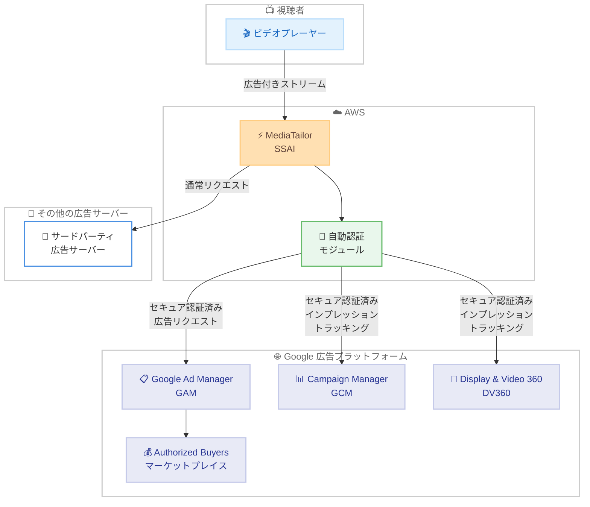

# AWS Elemental MediaTailor - Google 広告プラットフォームとの自動セキュアサーバー間統合

**リリース日**: 2026 年 5 月 5 日
**サービス**: AWS Elemental MediaTailor
**機能**: Google 広告プラットフォームとの自動サーバー間 (Server-to-Server) 統合

[このアップデートのインフォグラフィックを見る](https://takech9203.github.io/aws-news-summary/20260505-mediatailor-automatic-google-ad-platform-integration.html)

## 概要

AWS Elemental MediaTailor が、Google Ad Manager (GAM)、Google Campaign Manager (GCM)、Google Display & Video 360 (DV360) との安全なサーバー間接続を自動的に確立する機能を提供開始した。これにより、サーバーサイド広告挿入 (SSAI) ワークフローにおいて、手動設定なしで Google の広告プラットフォームとセキュアに連携できるようになった。

MediaTailor は、ビデオストリームにパーソナライズされた広告を挿入するサーバーサイド広告挿入サービスである。Google は SSAI プロバイダーに対して、広告リクエストやトラッキングイベントの送信時に認証済みのセキュア接続を要求している。今回のアップデートにより、MediaTailor が Google の広告サーバー宛のリクエストを自動検出し、必要なセキュア接続を自動的に確立するようになった。

**アップデート前の課題**

- Google 広告プラットフォームとの連携を有効化するために、AWS サポートケースを通じてリクエストを提出する必要があった
- 許可リスト (Allow List) への追加を待つ必要があり、統合までに時間がかかっていた
- 手動プロセスによる運用負荷と、設定ミスによる広告配信失敗のリスクがあった
- Google Authorized Buyers マーケットプレイスへのアクセスに必要な認証接続の設定が煩雑だった

**アップデート後の改善**

- Google 広告プラットフォームとのセキュア接続が自動的に確立され、顧客側のアクションが不要になった
- サポートケースの提出や許可リストへの追加待ちが不要になった
- 新規セットアップ時の Time-to-Value が大幅に短縮された
- 広告インプレッションの拒否やレポーティングの不正確さが軽減された

## アーキテクチャ図



MediaTailor が Google 広告プラットフォーム宛のリクエストを自動検出し、セキュアな認証済み接続を確立する。その他の広告サーバーへのリクエストは従来どおり変更なく動作する。

## サービスアップデートの詳細

### 主要機能

1. **Google Ad Manager (GAM) との自動セキュア接続**
   - Google の広告サーバーへのサーバーサイド広告リクエストが自動的にセキュア化される
   - Google Authorized Buyers (リアルタイム広告販売マーケットプレイスおよびアドエクスチェンジ) へのアクセスに必要な認証が自動的に行われる
   - パブリッシャー向けのプログラマティック広告収益化が即座に利用可能

2. **Google Campaign Manager (GCM) / DV360 との自動セキュア接続**
   - サーバーサイドインプレッショントラッキングリクエストが自動的に Google の認証済みエンドポイントを経由する
   - 広告主がこれらのプラットフォームでキャンペーンを実行する際のレポーティング精度が向上
   - 拒否されるインプレッションの削減

3. **透過的な自動検出と接続確立**
   - MediaTailor が Google 広告サーバー宛のリクエストを自動的に検出
   - 顧客側のアクションは一切不要
   - その他の広告リクエストには影響なし、変更なしで継続動作

## 技術仕様

### 対応する Google プラットフォーム

| プラットフォーム | 用途 | 自動セキュア化の対象 |
|------|------|------|
| Google Ad Manager (GAM) | パブリッシャー向け広告配信・収益化 | サーバーサイド広告リクエスト |
| Google Campaign Manager (GCM) | 広告主向けキャンペーン管理 | インプレッショントラッキングリクエスト |
| Display & Video 360 (DV360) | 広告主向けプログラマティック広告 | インプレッショントラッキングリクエスト |

### 動作仕様

| 項目 | 詳細 |
|------|------|
| 検出方式 | リクエスト先のドメインに基づく自動検出 |
| 認証方式 | Google が要求するサーバー間セキュア認証 |
| 既存設定への影響 | なし (既存の広告リクエストは変更不要) |
| 追加コスト | なし |
| 顧客操作 | 不要 (全自動) |

## 設定方法

### 前提条件

1. AWS Elemental MediaTailor のチャネルアセンブリまたはセッション初期化設定が構成済みであること
2. Google Ad Manager アカウントで MediaTailor の利用が許可されていること
3. 広告テンプレート URL が Google 広告プラットフォームのエンドポイントを指していること

### 手順

#### ステップ 1: 既存設定の確認

```bash
aws mediatailor describe-channel --channel-name my-channel
```

既存のチャネルまたはプレイバック設定を確認する。Google 広告プラットフォームとの連携に特別な設定変更は不要である。

#### ステップ 2: 広告リクエストの動作確認

MediaTailor が Google 広告サーバーへのリクエストを自動的にセキュア化しているため、以下を確認する。

- CloudWatch メトリクスで広告リクエストの成功率を確認
- Google Ad Manager 側で認証済みリクエストとして受信されていることを確認
- インプレッショントラッキングイベントが正常に記録されていることを確認

**重要**: 以前サポートケースを通じて手動で有効化していた顧客も、自動統合に移行されるため、追加の対応は不要である。

## メリット

### ビジネス面

- **運用コストの削減**: サポートケースの提出や手動設定が不要になり、運用負荷が大幅に軽減される
- **収益機会の迅速化**: Google Authorized Buyers マーケットプレイスへのアクセスが即座に可能になり、プログラマティック広告収入の獲得開始が早まる
- **広告収益の最大化**: インプレッションの拒否が減少し、正確なレポーティングにより広告収益が向上する

### 技術面

- **ゼロコンフィグレーション**: 顧客側でのセキュリティ設定や認証情報の管理が完全に不要
- **信頼性の向上**: 手動設定ミスによる接続障害のリスクが排除される
- **透過的な動作**: 既存のワークフローやその他の広告連携に一切影響を与えない

## デメリット・制約事項

### 制限事項

- Google 広告プラットフォーム側のアカウント設定や承認プロセスは依然として必要
- 自動検出は Google の広告サーバーに限定されており、他の認証が必要な広告プラットフォームには適用されない
- MediaTailor が利用可能なリージョンでのみ使用可能

### 考慮すべき点

- Google Ad Manager 側での SSAI パートナーとしての設定が別途必要な場合がある
- トラブルシューティング時、自動認証の詳細な動作を直接制御する手段は提供されていない
- Google 側のポリシー変更により、認証要件が変更される可能性がある

## ユースケース

### ユースケース 1: OTT ストリーミングサービスのプログラマティック広告

**シナリオ**: OTT プラットフォーム運営者が、Google Authorized Buyers を通じてリアルタイムビッディング (RTB) による広告収益を最大化したい。

**実装例**:
```
# MediaTailor の広告テンプレート URL に GAM エンドポイントを設定
AdDecisionServerUrl: https://pubads.g.doubleclick.net/gampad/ads?...

# MediaTailor が自動的にセキュア接続を確立
# 追加の認証設定は不要
```

**効果**: セットアップ時間の大幅短縮と、Authorized Buyers マーケットプレイスへの即時アクセスによる広告収益の向上。

### ユースケース 2: マルチプラットフォーム広告キャンペーンのトラッキング

**シナリオ**: 大手広告代理店が Google Campaign Manager で管理するキャンペーンのインプレッションを、MediaTailor を使用した SSAI 環境で正確にトラッキングしたい。

**実装例**:
```
# キャンペーンのインプレッショントラッキング URL が GCM/DV360 を指す場合
# MediaTailor が自動的にセキュアエンドポイント経由でトラッキングを送信

# CloudWatch で成功率を確認
aws cloudwatch get-metric-statistics \
  --namespace AWS/MediaTailor \
  --metric-name AdDecisionServer.Ads \
  --dimensions Name=ConfigurationName,Value=my-config
```

**効果**: インプレッションの拒否率が低下し、キャンペーンレポートの精度が向上する。

### ユースケース 3: 新規立ち上げのライブスポーツ配信

**シナリオ**: 新規に立ち上げるライブスポーツ配信サービスで、Google 広告エコシステムと迅速に統合し、初日から広告収益を得たい。

**実装例**:
```
# MediaTailor チャネルアセンブリの設定
aws mediatailor create-channel \
  --channel-name sports-live \
  --outputs '[{"ManifestName":"index","SourceGroup":"sg1","HlsPlaylistSettings":{}}]'

# 広告挿入は自動的に Google と認証済み接続で実行
# サポートケースの提出不要、許可リストへの追加待ち不要
```

**効果**: サービスローンチまでのリードタイムが短縮され、Day 1 から Google の広告マーケットプレイスにアクセス可能。

## 料金

この機能に対する追加料金は発生しない。MediaTailor の標準料金が適用される。

### 料金例

| 使用量 | 月額料金 (概算) |
|--------|------------------|
| 広告挿入トランザクション 100 万回 | 通常の MediaTailor SSAI 料金に含まれる |
| Google 連携の追加コスト | $0 (無料) |

## 利用可能リージョン

MediaTailor が利用可能な全リージョンで提供される。

- US East (Ohio, N. Virginia)
- US West (Oregon)
- Africa (Cape Town)
- Asia Pacific (Hyderabad, Malaysia, Melbourne, Mumbai, Osaka, Seoul, Singapore, Sydney, Tokyo)
- Canada (Central)
- Europe (Frankfurt, Ireland, London, Paris, Stockholm)
- Middle East (UAE)
- South America (Sao Paulo)

## 関連サービス・機能

- **AWS Elemental MediaLive**: ライブビデオエンコーディングサービス。MediaTailor と組み合わせてライブストリームに広告を挿入する
- **Amazon CloudFront**: コンテンツ配信ネットワーク。MediaTailor で広告挿入されたストリームの配信に使用する
- **Amazon CloudWatch**: MediaTailor の広告リクエスト成功率やインプレッショントラッキングのモニタリングに使用する
- **AWS Elemental MediaPackage**: メディアのパッケージングとオリジネーション。MediaTailor のソースとして使用する

## 参考リンク

- [インフォグラフィック](https://takech9203.github.io/aws-news-summary/20260505-mediatailor-automatic-google-ad-platform-integration.html)
- [公式発表 (What's New)](https://aws.amazon.com/about-aws/whats-new/2026/05/mediatailor-automatic-google-ad-platform-integration)
- [AWS Elemental MediaTailor ドキュメント](https://docs.aws.amazon.com/mediatailor/latest/ug/what-is.html)
- [AWS Elemental MediaTailor 料金](https://aws.amazon.com/mediatailor/pricing/)

## まとめ

AWS Elemental MediaTailor の Google 広告プラットフォーム自動統合は、SSAI ワークフローにおける Google との連携を大幅に簡素化するアップデートである。手動設定やサポートケースが不要になり、追加コストなしで利用できるため、動画配信事業者は即座に Google の広告エコシステムを活用した収益化を開始できる。MediaTailor を使用して Google 広告プラットフォームとの連携を検討している、または既に利用している全ての顧客に恩恵があるアップデートである。
