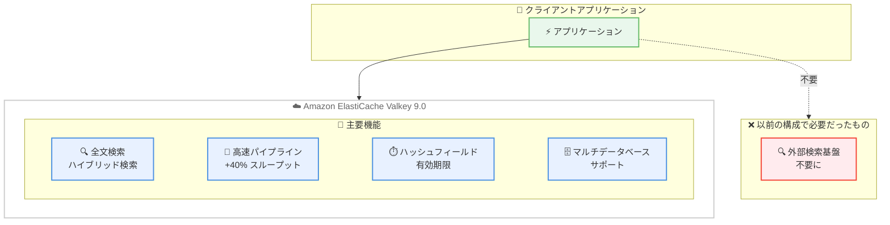

# Amazon ElastiCache - Valkey 9.0 サポート

**リリース日**: 2026 年 5 月 5 日
**サービス**: Amazon ElastiCache
**機能**: Valkey 9.0 エンジンサポート

[このアップデートのインフォグラフィックを見る](https://takech9203.github.io/aws-news-summary/20260505-valkey-amazon-elasticache.html)

## 概要

Amazon ElastiCache が Valkey 9.0 をサポートし、リアルタイムアプリケーション、AI 駆動型ワークロード、高スループットアプリケーションに新たな機能を提供する。Valkey 9.0 は、組み込みの全文検索・ハイブリッド検索、エンジンレベルのパフォーマンス最適化、ハッシュフィールド有効期限、クラスターモードでのマルチデータベースサポートなど、100 以上の機能強化を含むメジャーアップデートである。

Valkey は Redis の最も寛容なオープンソースかつベンダーニュートラルな代替であり、ElastiCache で推奨されるエンジンである。今回のアップデートにより、別途検索インフラを管理する必要がなくなり、マイクロ秒レベルのレイテンシーで毎秒数百万リクエストの全文検索が可能となる。

**アップデート前の課題**

- 全文検索やセマンティック検索を実現するために別途検索インフラ (Elasticsearch/OpenSearch 等) を管理する必要があった
- パイプライン処理のスループット上限により、過剰なプロビジョニングが必要だった
- ハッシュ内の個別フィールドに TTL を設定できず、データライフサイクル管理が複雑だった
- クラスターモードでマルチテナントアーキテクチャを実現するための回避策が必要だった

**アップデート後の改善**

- 組み込みの全文検索・ハイブリッド検索により、別途検索インフラが不要になった
- パイプラインワークロードで最大 40% のスループット向上を実現
- ハッシュフィールド単位の有効期限設定により、きめ細かなデータライフサイクル管理が可能になった
- クラスターモードでのマルチデータベースサポートにより、マルチテナント構成が簡素化された

## アーキテクチャ図



Valkey 9.0 により、全文検索を含む主要機能が ElastiCache に統合され、外部検索インフラが不要になるアーキテクチャを実現できる。

## サービスアップデートの詳細

### 主要機能

1. **全文検索・ハイブリッド検索**
   - 既存のベクトル類似性検索機能を拡張し、リアルタイム全文検索を追加
   - セマンティック検索、フィルタリング、集約をテラバイト規模のデータに対して実行可能
   - マイクロ秒レベルのレイテンシーと毎秒数百万リクエストのスループットを実現
   - [Valkey Search 1.2](https://valkey.io/blog/valkey-search-1_2/) として提供

2. **パイプラインメモリプリフェッチによるスループット向上**
   - パイプライン処理時のメモリプリフェッチ最適化
   - 高速なコマンドパース処理
   - パイプラインワークロードで最大 40% のスループット向上

3. **ハッシュフィールド有効期限**
   - ハッシュ内の個別フィールドに TTL を設定可能
   - きめ細かなデータライフサイクル管理を実現
   - セッション管理やキャッシュ無効化の柔軟性が向上

4. **クラスターモードでのマルチデータベースサポート**
   - クラスターモード有効時に複数の論理データベースを使用可能
   - 軽量な論理ネームスペースによるマルチテナント構成の簡素化
   - スタンドアロン環境からの移行を容易にする

5. **100 以上の追加機能強化**
   - パフォーマンス、機能性、運用柔軟性の全般的な改善
   - リアルタイムおよび AI 駆動型ワークロードに最適化

## 技術仕様

### パフォーマンス改善

| 項目 | 詳細 |
|------|------|
| パイプラインスループット | 最大 40% 向上 |
| 検索レイテンシー | マイクロ秒レベル |
| 検索スループット | 毎秒数百万リクエスト |
| 対応データ量 | テラバイト規模 |
| エンジン最適化 | コマンドパース高速化、メモリプリフェッチ改善 |

### 検索機能の仕様

| 機能 | 説明 |
|------|------|
| 全文検索 | テキストデータに対するリアルタイム検索 |
| ベクトル類似性検索 | 既存機能の拡張 |
| ハイブリッド検索 | 全文検索 + ベクトル検索の組み合わせ |
| フィルタリング | 検索結果の条件絞り込み |
| 集約 | データの集計処理 |

### データ管理機能

| 機能 | 説明 |
|------|------|
| ハッシュフィールド TTL | 個別フィールドレベルの有効期限設定 |
| マルチデータベース | クラスターモードでの論理ネームスペース |

## 設定方法

### 前提条件

1. AWS アカウントと適切な IAM 権限
2. 既存の ElastiCache クラスター (アップグレードの場合) または新規作成の権限
3. VPC とセキュリティグループの設定

### 手順

#### ステップ 1: 新規 Valkey 9.0 クラスターの作成

```bash
# AWS CLI で Valkey 9.0 クラスターを作成
aws elasticache create-cache-cluster \
  --cache-cluster-id my-valkey-cluster \
  --engine valkey \
  --engine-version 9.0 \
  --cache-node-type cache.r7g.large \
  --num-cache-nodes 1
```

新しい Valkey 9.0 エンジンを指定してクラスターを作成する。`--engine valkey` と `--engine-version 9.0` を指定する。

#### ステップ 2: 既存クラスターのアップグレード

```bash
# 既存のクラスターを Valkey 9.0 にアップグレード
aws elasticache modify-cache-cluster \
  --cache-cluster-id my-existing-cluster \
  --engine-version 9.0 \
  --apply-immediately
```

既存の Valkey クラスターを 9.0 にアップグレードする。`--apply-immediately` を指定すると即座に適用される。メンテナンスウィンドウでの適用も可能。

#### ステップ 3: サーバーレスキャッシュでの利用

```bash
# サーバーレスキャッシュの作成
aws elasticache create-serverless-cache \
  --serverless-cache-name my-valkey-serverless \
  --engine valkey \
  --major-engine-version 9
```

ElastiCache サーバーレスキャッシュでも Valkey 9.0 を利用可能。キャパシティ管理が自動化される。

## メリット

### ビジネス面

- **インフラコスト削減**: 別途検索インフラを管理する必要がなくなり、運用コストと複雑性を削減
- **パフォーマンス向上による UX 改善**: マイクロ秒レベルの検索レイテンシーにより、エンドユーザー体験が向上
- **マルチテナント運用の簡素化**: 論理ネームスペースにより、複数テナントの管理が効率化

### 技術面

- **統合検索基盤**: ベクトル検索と全文検索を単一のデータストアで実現し、アーキテクチャを簡素化
- **スループット 40% 向上**: パイプライン処理の最適化により、既存ワークロードが追加コストなしで高速化
- **きめ細かなデータ管理**: ハッシュフィールドレベルの TTL により、複雑なデータライフサイクルポリシーを実装可能

## デメリット・制約事項

### 制限事項

- 既存の Redis エンジンクラスターからの直接アップグレードパスについては、ドキュメントの確認が必要
- Valkey 9.0 固有の新機能を使用したデータは、旧バージョンとの互換性がない可能性がある
- 検索インデックスの作成・管理にはメモリリソースを追加で消費する

### 考慮すべき点

- アップグレード前に既存アプリケーションとの互換性テストを実施すること
- 全文検索機能の利用にはインデックス設計の検討が必要
- 大規模なデータセットに対する検索インデックスのメモリ使用量を事前に見積もること

## ユースケース

### ユースケース 1: AI アプリケーションの RAG パイプライン

**シナリオ**: AI チャットボットや推薦システムで、ベクトル類似性検索と全文検索を組み合わせたハイブリッド検索を実装する。

**実装例**:
```bash
# ベクトルインデックスの作成 (Valkey Search)
FT.CREATE idx:documents ON HASH PREFIX 1 doc: SCHEMA
  title TEXT
  content TEXT
  embedding VECTOR FLAT 6 DIM 1536 TYPE FLOAT32 DISTANCE_METRIC COSINE

# ハイブリッド検索クエリ
FT.SEARCH idx:documents "(@content:AWS) => [KNN 10 @embedding $query_vec]"
  PARAMS 2 query_vec "\x00\x01..."
```

**効果**: 外部の検索エンジンを廃止し、ElastiCache 単体でセマンティック検索 + 全文検索を実現。インフラ管理コストを大幅に削減。

### ユースケース 2: セッション管理とキャッシュの最適化

**シナリオ**: Web アプリケーションのセッション管理で、セッション内の個別データに異なる有効期限を設定する。

**実装例**:
```bash
# ユーザーセッションのハッシュフィールドに個別 TTL を設定
HSET session:user123 cart_data "{...}" auth_token "abc123"
HEXPIRE session:user123 3600 FIELDS 1 auth_token
HEXPIRE session:user123 86400 FIELDS 1 cart_data
```

**効果**: 認証トークンは 1 時間、カートデータは 24 時間と個別に有効期限を管理。不要なデータのメモリ消費を自動的に削減。

### ユースケース 3: マルチテナント SaaS アプリケーション

**シナリオ**: 複数のテナントが同一クラスターを共有する SaaS アプリケーションで、テナント間のデータ分離を実現する。

**実装例**:
```bash
# テナントごとに異なるデータベースを使用
SELECT 1  # テナント A
SET key1 "tenant_a_data"

SELECT 2  # テナント B
SET key1 "tenant_b_data"
```

**効果**: クラスターモードで論理データベースを使用し、テナント間のデータ分離を簡素化。別途クラスターを立てる必要がなく、コスト効率が向上。

## 料金

Valkey 9.0 は追加コストなしで利用可能。ElastiCache の標準料金が適用される。

### 料金例

| 構成 | 月額料金 (概算、東京リージョン) |
|------|-------------------------------|
| cache.r7g.large (1 ノード) | 約 $200 |
| cache.r7g.xlarge (1 ノード) | 約 $400 |
| サーバーレス (1 GB データ、100 万リクエスト/時) | 従量課金 |

※ 料金は東京リージョンの概算値。最新の料金は [ElastiCache 料金ページ](https://aws.amazon.com/elasticache/pricing/) を参照。

## 利用可能リージョン

Valkey 9.0 は以下のすべてのリージョンで利用可能。

- すべての商用 AWS リージョン
- AWS GovCloud (US) リージョン
- 中国リージョン

ノードベースクラスターおよびサーバーレスキャッシュの両方で利用可能。

## 関連サービス・機能

- **Amazon MemoryDB**: Valkey 互換の耐久性のあるインメモリデータベースサービス
- **Amazon OpenSearch Service**: より高度な検索・分析が必要な場合の代替/補完サービス
- **Amazon Bedrock**: AI/ML アプリケーションでの RAG パイプラインにおける連携
- **AWS Lambda**: サーバーレスアーキテクチャでの ElastiCache 連携

## 参考リンク

- [インフォグラフィック](https://takech9203.github.io/aws-news-summary/20260505-valkey-amazon-elasticache.html)
- [公式発表 (What's New)](https://aws.amazon.com/about-aws/whats-new/2026/05/valkey-amazon-elasticache/)
- [Amazon ElastiCache ドキュメント - バージョン管理](https://docs.aws.amazon.com/AmazonElastiCache/latest/dg/VersionManagement.HowTo.html)
- [Valkey 9.0 リリースノート](https://github.com/valkey-io/valkey/releases?q=valkey+9&expanded=true)
- [Valkey Search 1.2 ブログ](https://valkey.io/blog/valkey-search-1_2/)
- [Valkey 9.0 紹介ブログ](https://valkey.io/blog/introducing-valkey-9/)
- [ハッシュフィールド有効期限](https://valkey.io/blog/hash-fields-expiration/)
- [マルチデータベースサポート](https://valkey.io/blog/numbered-databases/)
- [ElastiCache 料金ページ](https://aws.amazon.com/elasticache/pricing/)

## まとめ

Amazon ElastiCache での Valkey 9.0 サポートは、インメモリデータストアの機能を大幅に拡張する重要なアップデートである。特に組み込みの全文検索・ハイブリッド検索機能は、これまで別途検索インフラを必要としていたアーキテクチャを簡素化し、運用コストの削減に直結する。リアルタイムアプリケーションや AI 駆動型ワークロードを構築している場合は、Valkey 9.0 へのアップグレードを検討することを推奨する。
