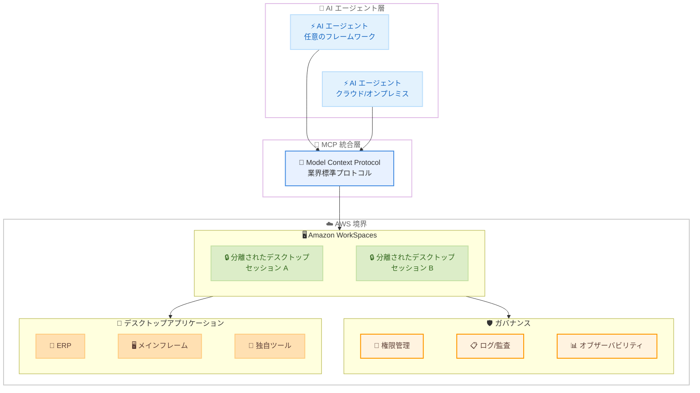

# Amazon WorkSpaces - AI エージェントによるデスクトップアプリケーション操作

**リリース日**: 2026年5月5日
**サービス**: Amazon WorkSpaces
**機能**: AI エージェントによるデスクトップアプリケーション操作 (Preview)

📊 [このアップデートのインフォグラフィックを見る](https://takech9203.github.io/aws-news-summary/20260505-workspaces-ai-agents.html)

## 概要

Amazon WorkSpaces が、AI エージェントによるデスクトップアプリケーションの安全な操作をサポートする新機能をプレビューとしてリリースした。AWS のフルマネージドクラウドデスクトップサービスである WorkSpaces 上で、AI エージェントが人間と同様にデスクトップアプリケーションを操作できるようになる。

多くの企業では、メインフレーム、ERP システム、独自ツールなどの重要なビジネスプロセスがデスクトップアプリケーション上で稼働しているが、これらのアプリケーションはモダンな API を持たず、AI エージェントにとっての「ラストマイルチャレンジ」となっていた。本機能により、アプリケーションのモダナイゼーションを必要とせずに、AI エージェントによるワークフローの自動化が可能になる。

業界標準の Model Context Protocol (MCP) を使用した統合により、任意のフレームワークで構築された AI エージェントが、クラウドホスト、オンプレミス、ハイブリッドを問わず、最小限のコードでビジネスアプリケーションに接続できる。

**アップデート前の課題**

- レガシーなデスクトップアプリケーションには API が存在せず、AI エージェントからの自動操作が困難だった
- デスクトップアプリケーションを AI エージェントが操作するためには、アプリケーション自体のモダナイゼーションが必要だった
- AI エージェントがデスクトップ操作を行う際のセキュリティ、ガバナンス、コンプライアンスの確保が課題だった

**アップデート後の改善**

- AI エージェントが WorkSpaces 上でデスクトップアプリケーションをポイント、クリック、ナビゲートできるようになった
- MCP 統合により、最小限のコードで AI エージェントをデスクトップアプリケーションに接続可能になった
- エンタープライズグレードのガバナンス、コンプライアンス、監査機能を維持したまま自動化を実現できるようになった

## アーキテクチャ図



AI エージェントが MCP を通じて WorkSpaces 上の分離されたデスクトップセッションに接続し、レガシーアプリケーションを操作する全体アーキテクチャを示す。各セッションは AWS 境界内で分離され、ガバナンス機能により監視される。

## サービスアップデートの詳細

### 主要機能

1. **MCP によるエージェント統合**
   - 業界標準の Model Context Protocol (MCP) を使用した統合
   - 任意のフレームワークで構築された AI エージェントが接続可能
   - クラウドホスト、オンプレミス、ハイブリッド環境から接続可能
   - 最小限のコードで実装でき、新しいインフラストラクチャの構築が不要

2. **分離されたデスクトップセッション**
   - 各 AI エージェントセッションが個別の WorkSpaces デスクトップで実行
   - 認証情報とビジネスデータが常にお客様の AWS 境界内に保持
   - 人間が操作する WorkSpaces 環境と同等のセキュリティコントロール

3. **エンタープライズガバナンスと可視性**
   - 集中化された権限管理、ログ記録、監査コントロール
   - スクリーンショットやメトリクスを含むエンタープライズオブザーバビリティ機能
   - エージェントのアクティビティに対する完全な可視性を提供

4. **デスクトップアプリケーション操作**
   - AI エージェントが人間と同様にポイント、クリック、ナビゲーションを実行
   - アプリケーションのモダナイゼーションなしで自動化を実現
   - メインフレーム、ERP システム、独自ツールなど幅広いアプリケーションに対応

## 技術仕様

### 対応環境とプロトコル

| 項目 | 詳細 |
|------|------|
| 接続プロトコル | Model Context Protocol (MCP) |
| エージェントフレームワーク | 任意のフレームワークに対応 |
| エージェント実行環境 | クラウド、オンプレミス、ハイブリッド |
| セッション分離 | エージェントごとに個別の WorkSpaces デスクトップ |
| データ境界 | お客様の AWS 境界内に保持 |
| 料金モデル | 従量課金制 (pay-as-you-go) |
| スケーリング | エラスティックスケール |
| ステータス | パブリックプレビュー |

### セキュリティとコンプライアンス

| 項目 | 詳細 |
|------|------|
| 認証情報の管理 | AWS 境界内で保持 |
| 監査ログ | 集中化されたログ記録 |
| 権限管理 | 人間の WorkSpaces 環境と同等 |
| オブザーバビリティ | スクリーンショット、メトリクス |
| セッション分離 | 各エージェントが個別デスクトップで実行 |

## 設定方法

### 前提条件

1. AWS アカウントと WorkSpaces へのアクセス権限
2. AI エージェントフレームワーク (MCP 対応)
3. 操作対象のデスクトップアプリケーション

### 手順

#### ステップ 1: WorkSpaces 環境の準備

```bash
# WorkSpaces for AI Agents の設定 (プレビュー)
# AWS マネジメントコンソールまたは CLI から WorkSpaces 環境を構成
aws workspaces create-workspace \
  --bundle-id <agent-enabled-bundle-id> \
  --directory-id <directory-id> \
  --workspace-properties '{"RunningMode":"AUTO_STOP"}'
```

WorkSpaces 環境を AI エージェント用に構成する。エージェント対応のバンドルを選択し、適切なディレクトリとプロパティを設定する。

#### ステップ 2: MCP エンドポイントの設定

```json
{
  "mcpServers": {
    "workspaces-desktop": {
      "transport": "streamable-http",
      "url": "https://workspaces.<region>.amazonaws.com/mcp/v1",
      "authentication": {
        "type": "aws-sigv4",
        "region": "<region>",
        "service": "workspaces"
      }
    }
  }
}
```

AI エージェントから WorkSpaces に接続するための MCP エンドポイントを設定する。AWS Signature V4 認証を使用して安全に接続する。

#### ステップ 3: AI エージェントからの接続

```python
# MCP を使用して WorkSpaces デスクトップを操作する例
import mcp_client

# WorkSpaces MCP サーバーに接続
session = mcp_client.connect("workspaces-desktop")

# デスクトップアプリケーションを操作
result = session.call_tool("navigate_application", {
    "application": "ERP System",
    "action": "click",
    "target": "submit_button"
})
```

MCP クライアントを使用して WorkSpaces 上のデスクトップアプリケーションを操作する。エージェントはポイント、クリック、テキスト入力などの操作を実行できる。

## メリット

### ビジネス面

- **レガシーシステムの活用**: API を持たない既存のデスクトップアプリケーションをそのまま自動化でき、モダナイゼーションコストを削減
- **業務効率化の加速**: 保険金請求処理、取引決済、候補者スクリーニング、バックオフィス業務などの日常ワークフローを大規模に自動化
- **迅速な導入**: 新しいインフラストラクチャを構築せずに短期間で価値を実現

### 技術面

- **エンタープライズセキュリティ**: 各エージェントセッションが分離され、データが AWS 境界内に保持されるため、規制産業の要件に適合
- **フレームワーク非依存**: MCP 標準プロトコルにより、任意の AI エージェントフレームワークとの統合が可能
- **エラスティックスケール**: AWS のグローバルインフラストラクチャ上の従量課金制により、需要に応じたスケーリングを実現

## デメリット・制約事項

### 制限事項

- パブリックプレビュー段階であり、本番環境での利用には注意が必要
- デスクトップアプリケーションの操作精度は AI エージェントの能力に依存
- レイテンシはネットワーク環境とアプリケーションの応答速度に影響される

### 考慮すべき点

- プレビュー段階のため、機能や API に変更が生じる可能性がある
- AI エージェントによる誤操作のリスクに対する適切な監視とガードレールの設定が推奨される
- 従量課金制のため、大量のエージェントセッションを長時間実行する場合のコスト管理が重要

## ユースケース

### ユースケース 1: 保険金請求処理の自動化

**シナリオ**: 保険会社が複数のレガシーシステムを使用して保険金請求を処理しており、手作業による入力とシステム間のデータ転記に多大な時間を費やしている。

**実装例**:
```python
# 保険金請求処理の自動化エージェント
agent.navigate("claims_system")
agent.input_field("claim_number", claim_data["id"])
agent.click("search_button")
agent.extract_data("claim_details")
agent.navigate("payment_system")
agent.input_field("amount", calculated_payment)
agent.click("approve_button")
```

**効果**: 請求処理時間を大幅に短縮し、人的エラーを削減。規制遵守を維持しながらスループットを向上。

### ユースケース 2: ERP システムでのバックオフィス業務自動化

**シナリオ**: 製造業企業が SAP などの ERP システムで発注処理、在庫管理、レポート生成を行っているが、API が限定的でバッチ処理に依存している。

**実装例**:
```python
# ERP バックオフィス自動化エージェント
agent.navigate("sap_gui")
agent.execute_transaction("ME21N")  # 発注伝票作成
agent.input_field("vendor", vendor_code)
agent.input_field("material", material_number)
agent.input_field("quantity", order_quantity)
agent.click("save")
```

**効果**: 発注処理のサイクルタイムを短縮し、24 時間 365 日の自動処理を実現。人的リソースをより付加価値の高い業務に再配分可能。

### ユースケース 3: 金融取引決済のワークフロー自動化

**シナリオ**: 金融機関が複数の取引プラットフォームとメインフレームシステムを使用しており、取引決済には複数のシステム間での手動データ入力が必要。

**実装例**:
```python
# 取引決済自動化エージェント
agent.navigate("trading_platform")
trades = agent.extract_pending_trades()
for trade in trades:
    agent.navigate("settlement_system")
    agent.input_trade_details(trade)
    agent.verify_counterparty(trade["counterparty"])
    agent.click("settle")
    agent.capture_confirmation()
```

**効果**: 決済処理の迅速化と正確性の向上。監査証跡が自動的に記録され、コンプライアンス要件への適合が容易に。

## 料金

従量課金制 (pay-as-you-go) の料金モデルを採用している。プレビュー段階のため、具体的な料金体系は今後公開される見込み。

### 料金の構成要素 (推定)

| 項目 | 説明 |
|------|------|
| WorkSpaces セッション時間 | エージェントが使用するデスクトップセッションの時間に基づく課金 |
| エラスティックスケール | 需要に応じたスケーリングによる最適化 |

既存の Amazon WorkSpaces の料金体系がベースとなると考えられるが、プレビュー期間中の正確な料金については AWS の公式ページを確認すること。

## 利用可能リージョン

パブリックプレビューとして提供開始。利用可能なリージョンの詳細については、AWS の公式ドキュメントを参照すること。

## 関連サービス・機能

- **Amazon Bedrock AgentCore**: AI エージェントを本番環境に導入するための包括的なプラットフォームで、WorkSpaces との組み合わせによりデスクトップ操作の自動化が可能
- **Model Context Protocol (MCP)**: AI エージェントとツールを接続するための業界標準プロトコルで、本機能の接続基盤として使用
- **Amazon WorkSpaces Desktop as a Service**: 本機能の基盤となるフルマネージドクラウドデスクトップサービス
- **AWS Mainframe Modernization**: メインフレームのモダナイゼーションサービスで、本機能はモダナイゼーション不要の代替アプローチを提供

## 参考リンク

- 📊 [インフォグラフィック](https://takech9203.github.io/aws-news-summary/20260505-workspaces-ai-agents.html)
- [公式発表 (What's New)](https://aws.amazon.com/about-aws/whats-new/2026/05/workspaces-ai-agents/)
- [ドキュメント](https://docs.aws.amazon.com/appstream2/latest/developerguide/agent-access.html)
- [Amazon WorkSpaces](https://aws.amazon.com/workspaces-family/workspaces/)
- [Amazon WorkSpaces 料金ページ](https://aws.amazon.com/workspaces/pricing/)

## まとめ

Amazon WorkSpaces による AI エージェントのデスクトップアプリケーション操作機能は、API を持たないレガシーシステムと AI エージェントの間の「ラストマイル」を埋める画期的なアップデートである。MCP 標準プロトコルによるフレームワーク非依存の統合と、AWS のエンタープライズグレードのセキュリティ・ガバナンス機能を組み合わせることで、規制産業を含む幅広い業界での業務自動化を加速する。プレビュー段階で評価を開始し、自社のレガシーアプリケーションに対する AI エージェント活用の可能性を検証することを推奨する。
