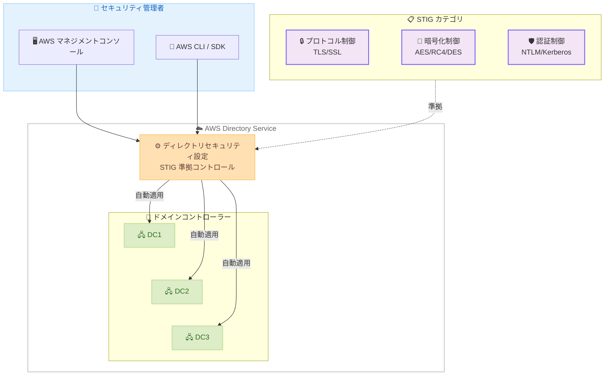

# AWS Directory Service - STIG 準拠セキュリティ設定の拡張

**リリース日**: 2026 年 5 月 6 日
**サービス**: AWS Directory Service
**機能**: AWS Managed Microsoft AD ディレクトリセキュリティ設定の STIG 準拠コントロール拡張

[このアップデートのインフォグラフィックを見る](https://takech9203.github.io/aws-news-summary/20260506-add-security-settings-stig-aws-microsoft-ad.html)

## 概要

AWS Directory Service for Microsoft Active Directory (AWS Managed Microsoft AD) が、ディレクトリセキュリティ設定を拡張し、STIG (Security Technical Implementation Guide) に準拠した高影響セキュリティ領域の設定を追加した。これにより、規制要件やセキュリティコンプライアンスを満たすためのディレクトリレベルのセキュリティ構成をセルフサービスで適用できるようになった。

この新しいセキュリティ設定は、米国防総省 (DoD) の Defense Information Systems Agency (DISA) が策定した Windows Server および Active Directory 向けの STIG に準拠している。規制産業や高いセキュリティ要件を持つ組織が、AWS マネジメントコンソールまたはプログラマティックに一貫したセキュリティ構成を宣言的に適用し、AWS が自動的に実装・維持する仕組みを提供する。

**アップデート前の課題**

- STIG 準拠のセキュリティ設定を AWS Managed Microsoft AD に適用するには、手動での構成管理やカスタムスクリプトが必要だった
- 複数のマネージドディレクトリ間でセキュリティ設定の一貫性を維持することが困難だった
- 新しいリージョンへの展開やドメインコントローラーのスケールアウト時に、セキュリティ設定を手動で再適用する必要があった

**アップデート後の改善**

- STIG 準拠のセキュリティ設定をセルフサービスインターフェースから宣言的に適用可能になった
- 複数のマネージドディレクトリに対して一貫したセキュリティ構成を自動的に維持できるようになった
- 新しいリージョンやドメインコントローラーの追加時に、設定が自動的に適用されるようになった

## アーキテクチャ図



セキュリティ管理者がコンソールまたは API 経由で STIG 準拠のセキュリティ設定を宣言すると、AWS Directory Service が全ドメインコントローラーに自動的に設定を適用・維持する。

## サービスアップデートの詳細

### 主要機能

1. **STIG 準拠セキュリティコントロール**
   - DISA STIG for Windows Server および Active Directory に準拠した設定項目の追加
   - 高影響 (High Impact) セキュリティ領域をカバー
   - 規制産業向けのコンプライアンス要件に対応

2. **宣言的セキュリティ設定**
   - 目的の構成を宣言すると AWS が実装・永続化
   - AWS マネジメントコンソールおよびプログラマティック (CLI/SDK) の両方で設定可能
   - 設定変更時のドメインコントローラー再起動を AWS が自動管理

3. **自動設定伝播**
   - 新規リージョンへの展開時に設定を自動適用
   - ドメインコントローラーのスケールアウト時に設定を自動適用
   - 複数ディレクトリ間での一貫した構成を維持

## 技術仕様

### セキュリティ設定カテゴリ

| カテゴリ | 設定例 | 説明 |
|----------|--------|------|
| 認証プロトコル | NTLM V1、NTLM SSP セッションセキュリティ | 認証プロトコルの有効化/無効化 |
| 暗号化 | FIPS アルゴリズムポリシー | FIPS 準拠の暗号アルゴリズムの強制 |
| セキュアチャネル暗号 | AES 128/128、DES 56/56、RC4、Triple DES 168/168 | 暗号スイートの個別制御 |
| セキュアチャネルプロトコル | PCT 1.0、SSL 2.0/3.0、TLS 1.0/1.1 | プロトコルバージョンの有効化/無効化 |
| ネットワーク堅牢化 | UNC Hardened Paths (NETLOGON、SYSVOL) | 共有フォルダアクセスのセキュリティ要件 |
| 証明書ベース認証 | 証明書強力バインディング、バックデート補正 | 証明書認証の強制モード設定 |

### 設定のデフォルト値

| 項目 | デフォルト |
|------|-----------|
| TLS 1.2 | 有効 (無効化不可) |
| AES 256/256 | 有効 (無効化不可) |
| レガシープロトコル (SSL 2.0、SSL 3.0、TLS 1.0) | 無効 |
| レガシー暗号 (RC4、DES) | 無効 |

### 設定の API 名

```json
{
  "DirectoryId": "d-1234567890",
  "Settings": [
    {
      "Name": "NTLM_V1",
      "Value": "Disable"
    },
    {
      "Name": "TLS_1_0",
      "Value": "Disable"
    },
    {
      "Name": "FIPS_ALGORITHM_POLICY",
      "Value": "Enable"
    },
    {
      "Name": "UNC_HARDENED_PATHS_NETLOGON",
      "Value": "Maximum Security"
    }
  ]
}
```

## 設定方法

### 前提条件

1. AWS Managed Microsoft AD ディレクトリが作成済みであること
2. ディレクトリの管理者権限を持つ IAM ユーザーまたはロール
3. AWS CLI v2 がインストール済みであること (プログラマティックに設定する場合)

### 手順

#### ステップ 1: コンソールからディレクトリセキュリティ設定を編集

AWS マネジメントコンソールの Directory Service コンソール (https://console.aws.amazon.com/directoryservicev2/) にサインインし、対象のディレクトリ ID を選択する。「Networking & security」セクションの「Directory settings」から「Edit settings」を選択する。

#### ステップ 2: STIG 準拠設定の適用

```bash
# AWS CLI を使用してセキュリティ設定を更新
aws ds update-settings \
  --directory-id d-1234567890 \
  --settings "Name=NTLM_V1,Value=Disable" \
              "Name=TLS_1_0,Value=Disable" \
              "Name=SSL_2_0,Value=Disable" \
              "Name=SSL_3_0,Value=Disable" \
              "Name=FIPS_ALGORITHM_POLICY,Value=Enable"
```

STIG 準拠に必要なレガシープロトコルの無効化と FIPS アルゴリズムポリシーの有効化を実行する。設定は全ドメインコントローラーに自動的に適用される。

#### ステップ 3: 設定状態の確認

```bash
# セキュリティ設定の状態を確認
aws ds describe-settings \
  --directory-id d-1234567890
```

設定のステータスが「Updating」から「Updated」に変わるまで待機する。失敗した場合は「Failed」と表示され、元の設定値が維持される。

## メリット

### ビジネス面

- **コンプライアンス対応の効率化**: DISA STIG 準拠のセキュリティ設定をワンクリックで適用でき、監査対応のコストを削減
- **運用負荷の軽減**: セキュリティ設定の維持管理を AWS に委任でき、手動管理の必要性を排除
- **スケーラビリティの確保**: 新規リージョン展開やスケールアウト時にもセキュリティ設定が自動で維持されるため、成長に伴うリスクを低減

### 技術面

- **宣言的設定管理**: 目的の状態を宣言するだけで AWS が実装を担当し、設定ドリフトを防止
- **一貫性の保証**: 全ドメインコントローラー間でセキュリティ設定の一貫性を自動的に維持
- **自動再起動管理**: 設定変更に伴うドメインコントローラーの再起動を AWS が適切にハンドリング

## デメリット・制約事項

### 制限事項

- TLS 1.2 および AES 256/256 はデフォルト設定であり、無効化できない
- 設定更新中は他の設定変更ができない (ステータスが「Updating」の間)
- 設定失敗時は手動で「Revert」または「Retry」操作が必要

### 考慮すべき点

- レガシープロトコルの無効化により、古いクライアントからの接続が失敗する可能性がある
- STIG 準拠設定の適用前に、既存のアプリケーションやクライアントとの互換性を十分にテストすること
- 設定変更はドメインコントローラーの再起動を伴うため、メンテナンスウィンドウでの実施を推奨

## ユースケース

### ユースケース 1: 政府機関・防衛関連のコンプライアンス対応

**シナリオ**: 米国政府機関と取引する企業が、FedRAMP High または DoD Impact Level 4/5 の認定を取得するために、Active Directory 環境の STIG 準拠が求められる。

**実装例**:
```bash
# STIG High 準拠設定の一括適用
aws ds update-settings \
  --directory-id d-1234567890 \
  --settings "Name=NTLM_V1,Value=Disable" \
              "Name=SSL_2_0,Value=Disable" \
              "Name=SSL_3_0,Value=Disable" \
              "Name=TLS_1_0,Value=Disable" \
              "Name=TLS_1_1,Value=Disable" \
              "Name=FIPS_ALGORITHM_POLICY,Value=Enable" \
              "Name=UNC_HARDENED_PATHS_NETLOGON,Value=Maximum Security" \
              "Name=UNC_HARDENED_PATHS_SYSVOL,Value=Maximum Security"
```

**効果**: DISA STIG チェックリストの Active Directory 関連項目を自動的に満たし、監査準備の時間を大幅に短縮。

### ユースケース 2: 金融機関のセキュリティ強化

**シナリオ**: 金融機関が PCI DSS や SOX 準拠のために、Active Directory のセキュリティ設定を強化し、レガシー暗号を無効化する必要がある。

**実装例**:
```bash
# レガシー暗号の無効化
aws ds update-settings \
  --directory-id d-1234567890 \
  --settings "Name=RC4_128_128,Value=Disable" \
              "Name=DES_56_56,Value=Disable" \
              "Name=RC2_40_128,Value=Disable" \
              "Name=RC2_56_128,Value=Disable"
```

**効果**: 暗号化の脆弱性を排除し、最新の暗号標準のみを使用することでセキュリティポスチャを向上。

### ユースケース 3: マルチリージョン展開での一貫したセキュリティ

**シナリオ**: グローバル企業が複数リージョンに AWS Managed Microsoft AD を展開しており、全リージョンで同一のセキュリティポリシーを維持したい。

**実装例**:
```bash
# リージョンごとにセキュリティ設定を宣言
for REGION in us-east-1 eu-west-1 ap-northeast-1; do
  aws ds update-settings \
    --region $REGION \
    --directory-id $(aws ds describe-directories --region $REGION --query 'DirectoryDescriptions[0].DirectoryId' --output text) \
    --settings "Name=NTLM_V1,Value=Disable" \
                "Name=FIPS_ALGORITHM_POLICY,Value=Enable"
done
```

**効果**: 新規ドメインコントローラー追加時にも設定が自動適用され、リージョン間でのセキュリティ設定のドリフトを防止。

## 料金

AWS Managed Microsoft AD のディレクトリセキュリティ設定機能の利用に追加料金は発生しない。通常の AWS Directory Service for Microsoft AD の料金のみが適用される。

### 料金例

| エディション | ドメインコントローラー数 | 月額料金 (概算、東京リージョン) |
|--------------|--------------------------|-------------------------------|
| Standard Edition | 2 (最小) | 約 $144 |
| Enterprise Edition | 2 (最小) | 約 $432 |

## 利用可能リージョン

AWS Managed Microsoft AD が提供されている全リージョンで利用可能。AWS Directory Service は主要な商用リージョンおよび GovCloud リージョンで提供されている。詳細は AWS リージョン表を参照。

## 関連サービス・機能

- **AWS IAM Identity Center**: AWS Managed Microsoft AD と統合してシングルサインオンを提供し、STIG 準拠の認証基盤として機能
- **AWS Security Hub**: ディレクトリのセキュリティ設定状態をモニタリングし、コンプライアンス状況を一元管理
- **AWS Config**: ディレクトリ設定の変更履歴を追跡し、コンプライアンス違反の検出を自動化
- **AWS CloudTrail**: ディレクトリセキュリティ設定の変更操作を監査ログとして記録

## 参考リンク

- [インフォグラフィック](https://takech9203.github.io/aws-news-summary/20260506-add-security-settings-stig-aws-microsoft-ad.html)
- [公式発表 (What's New)](https://aws.amazon.com/about-aws/whats-new/2026/05/add-security-settings-stig-aws-microsoft-ad/)
- [ドキュメント - Editing AWS Managed Microsoft AD directory security settings](https://docs.aws.amazon.com/directoryservice/latest/admin-guide/ms_ad_directory_settings.html)
- [AWS Directory Service 料金ページ](https://aws.amazon.com/directoryservice/pricing/)
- [DISA STIG](https://public.cyber.mil/stigs/)

## まとめ

AWS Managed Microsoft AD の STIG 準拠セキュリティ設定の拡張により、規制産業や高セキュリティ要件を持つ組織が、ディレクトリレベルのコンプライアンスをセルフサービスで効率的に達成できるようになった。特に政府機関との取引がある企業や、FedRAMP/DoD IL 認定を目指す組織にとって、運用負荷を増やすことなく STIG 準拠を実現できる点は大きな価値がある。既存の AWS Managed Microsoft AD 利用者は、追加コストなしでこの機能を活用し、セキュリティポスチャの強化を検討すべきである。
