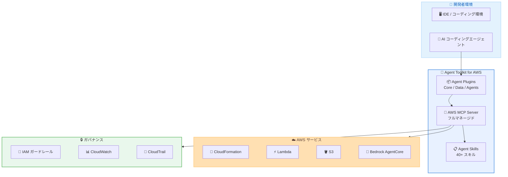

# Agent Toolkit for AWS - AI コーディングエージェント向け開発支援ツールキット

**リリース日**: 2026 年 5 月 6 日
**サービス**: AWS Developer Tools
**機能**: Agent Toolkit for AWS

📊 [このアップデートのインフォグラフィックを見る](https://takech9203.github.io/aws-news-summary/20260506-agent-toolkit.html)

## 概要

AWS は Agent Toolkit for AWS を発表した。これは AI コーディングエージェントが AWS 上で効果的にアプリケーションを構築するための、本番環境対応のツールスイートおよびガイダンスである。エラーの削減、トークンコストの低減、エンタープライズグレードのセキュリティ制御を提供し、AWS Labs で提供されていた MCP サーバー、プラグイン、スキルの後継として位置付けられている。

開発者が AWS 上でコーディングエージェントを使用する際、エージェントが複雑なマルチサービスワークフローに対応できない、AWS サービスの古い知識に依存する、ガバナンスが困難であるといった課題があった。Agent Toolkit for AWS は、エージェントスキル、フルマネージド MCP サーバー、簡単にインストール可能なプラグインを通じてこれらの課題を解決する。

**アップデート前の課題**

- AI コーディングエージェントが複雑なマルチサービスワークフローで正確に動作できなかった
- エージェントが AWS サービスの最新知識を持たず、古い情報や一般的な知識に基づいて動作していた
- エージェントのアクションに対するガバナンスが困難で、本番環境へのデプロイに躊躇する状況があった
- トークンの浪費や開発時間のロスが発生していた

**アップデート後の改善**

- 40 以上のスキルによりエージェントが検証済みのベストプラクティスに従って動作可能になった
- フルマネージド MCP サーバーにより IAM ベースのガードレールとオブザーバビリティが提供された
- プラグインにより MCP サーバーとスキルを単一のインストールで導入可能になった
- AWS リソースの使用料のみで追加料金なしに利用可能になった

## アーキテクチャ図



Agent Toolkit for AWS の全体アーキテクチャを示す。開発者の AI コーディングエージェントがプラグインを通じてフルマネージド MCP サーバーに接続し、スキルと AWS サービスを活用しながら、IAM ガードレールや CloudWatch / CloudTrail によるガバナンスの下で安全に動作する。

## サービスアップデートの詳細

### 主要機能

1. **Agent Skills**
   - AWS のベストプラクティスに基づく検証済みの手順をエージェントに提供
   - CloudFormation テンプレートの作成、データパイプラインの設定、サーバーレスアプリケーションの構築などのタスクに対応
   - Infrastructure-as-Code、ストレージ、分析、サーバーレス、コンテナ、AI サービスをカバーする 40 以上のスキルを初期リリース
   - 今後数週間でデータベース、ネットワーキング、IAM 向けスキルを追加予定
   - 各スキルはタスク完了の正確性と信頼性を確保するため厳密に評価済み

2. **AWS MCP Server (一般提供開始)**
   - コーディングエージェントが任意の AWS サービスと対話できるフルマネージド MCP サーバー
   - IAM ベースのガードレールによりエージェントが実行可能なアクションを制御
   - Amazon CloudWatch および AWS CloudTrail によるオブザーバビリティ
   - マルチステップ操作のためのサンドボックス化されたコード実行環境
   - 最新のドキュメントを効率的に検索・取得するツールを提供

3. **Agent Plugins**
   - AWS MCP Server とキュレーションされたスキルセットを単一のインストールにバンドル
   - 3 種類のプラグインを初期リリース:
     - **AWS Core**: アプリケーション開発者がフルスタックアプリケーションを構築・管理するためのプラグイン
     - **AWS Data Analytics**: データアナリストや BI エンジニアがデータパイプラインの作成やデータのロード・クエリを行うためのプラグイン
     - **AWS Agents**: AI エンジニアが Amazon Bedrock AgentCore を使用して本番環境対応のエージェントを構築するためのプラグイン

## 技術仕様

### コンポーネント構成

| コンポーネント | 説明 | 用途 |
|------|------|------|
| Agent Skills | 検証済みの手順セット | タスクごとのベストプラクティス提供 |
| AWS MCP Server | フルマネージドサーバー | AWS サービスとの対話、ドキュメント検索 |
| Agent Plugins | スキル + MCP Server のバンドル | ワンクリックインストール |
| IAM ガードレール | アクション制御 | エージェントの実行権限管理 |
| サンドボックス実行環境 | 隔離されたコード実行 | マルチステップ操作の安全な実行 |

### スキルカバレッジ

| カテゴリ | 状態 | 対象領域 |
|------|------|------|
| Infrastructure-as-Code | 利用可能 | CloudFormation テンプレート作成 |
| ストレージ | 利用可能 | S3 設定、データ管理 |
| 分析 | 利用可能 | データパイプライン構築 |
| サーバーレス | 利用可能 | Lambda、API Gateway 構成 |
| コンテナ | 利用可能 | ECS / EKS デプロイ |
| AI サービス | 利用可能 | Bedrock AgentCore 連携 |
| データベース | 近日公開 | RDS、DynamoDB 設定 |
| ネットワーキング | 近日公開 | VPC、セキュリティグループ設定 |
| IAM | 近日公開 | ポリシー作成、ロール管理 |

### API 変更履歴

| 日付 | サービス | 変更内容 |
|------|----------|----------|
| 2026/05/06 | [Amazon Bedrock AgentCore Control](https://awsapichanges.com/archive/changes/7068f3-bedrock-agentcore-control.html) | 7 updated methods - ファイルシステム設定のサポート追加 |
| 2026/05/04 | [Amazon Bedrock AgentCore Control](https://awsapichanges.com/archive/changes/f687cc-bedrock-agentcore-control.html) | 3 updated methods - MCP セッションとレスポンスストリーミング対応 |

### セキュリティとガバナンス

```json
{
  "Effect": "Allow",
  "Action": [
    "bedrock:InvokeModel",
    "cloudformation:CreateStack",
    "s3:PutObject"
  ],
  "Resource": "*",
  "Condition": {
    "StringEquals": {
      "aws:RequestedRegion": "us-east-1"
    }
  }
}
```

IAM ポリシーによりエージェントが実行可能なアクションを明示的に制御できる。上記は特定リージョンでの操作のみを許可する IAM ポリシーの例である。

## 設定方法

### 前提条件

1. AWS アカウントが有効であること
2. AI コーディングエージェント (Claude Code、Amazon Q Developer、Cursor 等) が利用可能であること
3. IAM ユーザーまたはロールに適切な権限が設定されていること

### 手順

#### ステップ 1: Agent Plugin のインストール

```bash
# AWS Core プラグインのインストール例
# IDE の設定画面から Agent Toolkit for AWS プラグインを追加
# または GitHub リポジトリからスキルファイルをダウンロード
```

Agent Plugin をインストールすることで、AWS MCP Server とキュレーションされたスキルセットが一括で利用可能になる。

#### ステップ 2: AWS MCP Server への接続設定

```json
{
  "mcpServers": {
    "aws": {
      "command": "aws-mcp-server",
      "args": ["--region", "us-east-1"],
      "env": {
        "AWS_PROFILE": "default"
      }
    }
  }
}
```

MCP Server 設定を IDE の設定ファイルに追加する。AWS 認証情報は既存の AWS プロファイルを使用できる。

#### ステップ 3: IAM ガードレールの設定

```bash
# エージェントが使用する IAM ロールに適切なポリシーをアタッチ
aws iam attach-role-policy \
  --role-name AgentToolkitRole \
  --policy-arn arn:aws:iam::aws:policy/AgentToolkitBasicAccess
```

エージェントが実行可能なアクションを IAM ポリシーで制限することで、安全な運用が可能になる。

## メリット

### ビジネス面

- **コスト削減**: トークン消費の削減により、AI コーディングエージェントの運用コストを低減
- **開発速度の向上**: ベストプラクティスに基づくスキルにより、試行錯誤の時間を短縮
- **本番環境への信頼性**: ガバナンス機能により、エージェントを本番環境で安心してデプロイ可能

### 技術面

- **正確性の向上**: 検証済みスキルにより、エージェントの出力品質が向上
- **最新知識の維持**: MCP Server 経由でドキュメントを常に最新の状態で参照可能
- **セキュリティ制御**: IAM ベースのガードレールとサンドボックス実行による多層防御
- **オブザーバビリティ**: CloudWatch と CloudTrail による完全な監査証跡

## デメリット・制約事項

### 制限事項

- AWS MCP Server の利用可能リージョンは US East (N. Virginia) と Europe (Frankfurt) の 2 リージョンのみ
- 初期リリースのスキルは 40 以上だが、データベース・ネットワーキング・IAM は今後追加予定
- MCP (Model Context Protocol) に対応した AI コーディングエージェントでのみ利用可能

### 考慮すべき点

- AWS Labs の既存ツールからの移行タイミングと互換性の確認が必要
- エージェントに付与する IAM 権限の最小権限設計を慎重に行う必要がある
- フルマネージド MCP サーバーの利用にはネットワーク接続が必要

## ユースケース

### ユースケース 1: サーバーレスアプリケーションの構築

**シナリオ**: 開発者が AI コーディングエージェントを使用して、API Gateway + Lambda + DynamoDB のサーバーレスアプリケーションを構築する。

**実装例**:
```
# エージェントへの指示例
「ユーザー認証付きの REST API を構築してください。
API Gateway、Lambda、DynamoDB を使用し、
CloudFormation テンプレートで Infrastructure-as-Code として管理してください。」
```

**効果**: エージェントが Agent Skills のサーバーレススキルと IaC スキルを活用し、ベストプラクティスに従った CloudFormation テンプレートを自動生成する。従来のように一般的な知識から推測するのではなく、検証済みの手順に基づいて構築するため、エラーが大幅に削減される。

### ユースケース 2: データパイプラインの設定

**シナリオ**: データアナリストが AI エージェントを使用して、S3 から Redshift へのデータパイプラインを構築する。

**実装例**:
```
# AWS Data Analytics プラグインを使用
「S3 バケットの CSV データを Glue で変換し、
Redshift にロードするパイプラインを作成してください。
スケジュール実行も設定してください。」
```

**効果**: AWS Data Analytics プラグインにより、データパイプライン構築に必要なスキルが一括で提供され、Glue ジョブの設定や Redshift のテーブル定義まで一貫してベストプラクティスに従った設定が行われる。

### ユースケース 3: 本番環境対応の AI エージェント構築

**シナリオ**: AI エンジニアが Amazon Bedrock AgentCore を使用して、カスタマーサポート用の AI エージェントを構築する。

**実装例**:
```
# AWS Agents プラグインを使用
「Bedrock AgentCore を使用して、FAQ 応答と
注文状況確認ができるカスタマーサポートエージェントを構築してください。
IAM ロールの設定と CloudWatch アラームも含めてください。」
```

**効果**: AWS Agents プラグインにより、Bedrock AgentCore のセットアップからデプロイまでの全工程でガイダンスが提供され、セキュリティ設定やモニタリングも含めた本番環境対応のエージェントが効率的に構築される。

## 料金

Agent Toolkit for AWS 自体は追加料金なしで利用可能である。エージェントが使用する AWS リソースの料金のみが発生する。

### 料金例

| 使用内容 | 月額料金 (概算) |
|--------|------------------|
| Agent Toolkit for AWS (ツールキット本体) | 無料 |
| AWS MCP Server 利用料 | AWS リソース使用料に含まれる |
| Lambda 実行 (エージェント経由) | 通常の Lambda 料金 |
| CloudWatch ログ・メトリクス | 通常の CloudWatch 料金 |

## 利用可能リージョン

AWS MCP Server は以下のリージョンで利用可能。

- US East (N. Virginia) - us-east-1
- Europe (Frankfurt) - eu-west-1

Agent Skills およびプラグインは GitHub 経由で提供されるため、リージョン制限なく利用可能である。

## 関連サービス・機能

- **Amazon Bedrock AgentCore**: AI エージェントの構築・デプロイプラットフォーム。AWS Agents プラグインで連携
- **AWS CloudFormation**: Infrastructure-as-Code サービス。Agent Skills で IaC テンプレートの作成を支援
- **Amazon Q Developer**: AWS の AI コーディングアシスタント。Agent Toolkit と組み合わせて利用可能
- **AWS CloudTrail**: API 呼び出しの監査ログ。エージェントのアクションを追跡
- **Amazon CloudWatch**: モニタリングとオブザーバビリティ。エージェントの実行状況を可視化

## 参考リンク

- 📊 [インフォグラフィック](https://takech9203.github.io/aws-news-summary/20260506-agent-toolkit.html)
- [公式発表 (What's New)](https://aws.amazon.com/about-aws/whats-new/2026/05/agent-toolkit/)
- [Agent Toolkit for AWS 製品ページ](https://aws.amazon.com/developer/agent-toolkit/)
- [GitHub リポジトリ](https://github.com/aws/agent-toolkit)
- [Quick Start ガイド](https://docs.aws.amazon.com/agent-toolkit/latest/userguide/quick-start.html)

## まとめ

Agent Toolkit for AWS は、AI コーディングエージェントを AWS 上で安全かつ効果的に活用するための包括的なソリューションである。40 以上の検証済みスキル、フルマネージド MCP サーバー、3 種類のプラグインにより、開発者はエージェントを本番環境で自信を持ってデプロイできるようになった。AWS 上でコーディングエージェントを活用している開発チームは、まず Quick Start ガイドからプラグインをインストールし、IAM ガードレールの設計を行った上で段階的に導入を進めることを推奨する。
