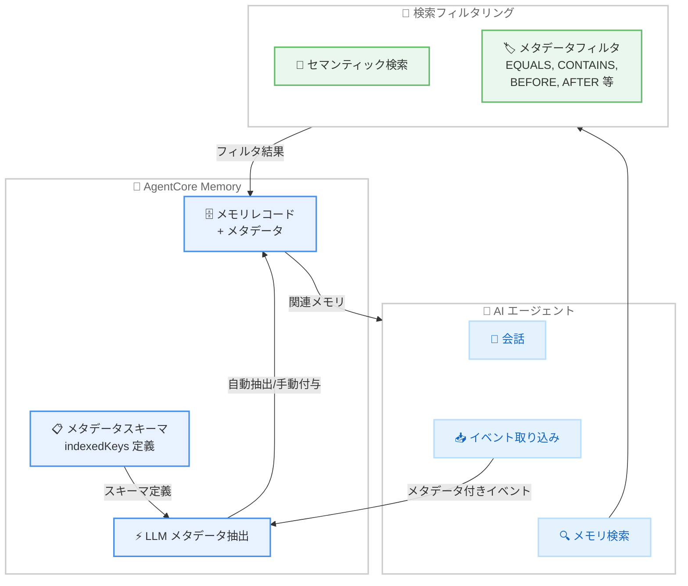

# Amazon Bedrock AgentCore Memory - 長期メモリのメタデータサポート

**リリース日**: 2026 年 5 月 6 日
**サービス**: Amazon Bedrock AgentCore Memory
**機能**: 長期メモリレコードへのメタデータ付与

📊 [このアップデートのインフォグラフィックを見る](https://takech9203.github.io/aws-news-summary/20260506-agentcore-longterm-memory-metadata.html)

## 概要

Amazon Bedrock AgentCore Memory に長期メモリ (LTM) レコードへのメタデータ付与機能が追加された。これにより、開発者はメモリエントリに構造化された属性を付加し、セマンティック検索に加えてメタデータベースのフィルタリングや検索を行うことが可能になる。

メモリリソースに対して最大 10 個のインデックスキーを定義でき、STRING、NUMBER、STRING_LIST の 3 つのデータ型がサポートされている。取得時には各種オペレーターを使用してフィルタリングを行い、関連性の高いメモリレコードのみを精度良く検索できる。

メタデータはイベント取り込み時に手動で付与する方法と、メモリリソースに定義した抽出指示に基づいて LLM が会話コンテンツから自動推論する方法の 2 通りで設定できる。

**アップデート前の課題**

- エージェントのメモリ検索がセマンティック検索のみに依存しており、構造化された属性での絞り込みができなかった
- チケット番号、優先度、日付などの特定属性でメモリを検索する場合、関連性の低い結果が混在する可能性があった
- メモリレコードの分類・整理を行うための標準的な仕組みが提供されていなかった

**アップデート後の改善**

- メモリレコードにメタデータを付与し、構造化属性での正確なフィルタリングが可能になった
- セマンティック検索とメタデータフィルタリングを組み合わせた高精度なメモリ検索が実現した
- LLM による自動メタデータ抽出により、手動設定の負荷を軽減できるようになった

## アーキテクチャ図



メモリリソースにメタデータスキーマを定義し、イベント取り込み時に LLM が自動でメタデータを抽出する。検索時はセマンティック検索とメタデータフィルタを組み合わせて精度の高い結果を取得する。

## サービスアップデートの詳細

### 主要機能

1. **メタデータスキーマ定義**
   - メモリリソースに最大 10 個のインデックスキーを定義可能
   - サポートするデータ型: STRING、NUMBER、STRING_LIST
   - キーごとに許可値 (allowedValues) のバリデーション設定が可能
   - NUMBER 型には最小値・最大値のバリデーションを設定可能

2. **LLM ベースの自動メタデータ抽出**
   - メモリリソースに抽出指示 (extractionInstruction) を定義
   - 会話コンテンツから LLM がメタデータを自動推論・付与
   - キーごとに抽出定義 (definition) と抽出指示 (llmExtractionInstruction) を設定
   - イベント取り込み時に自動的に処理される

3. **メタデータフィルタリング検索**
   - セマンティック検索と併用可能なメタデータフィルタ
   - 複数のオペレーターによる柔軟な条件指定
   - 複数フィルタの組み合わせによる複合条件検索が可能

4. **バッチ操作でのメタデータサポート**
   - `BatchCreateMemoryRecords` でメタデータ付きレコードの一括作成
   - `BatchUpdateMemoryRecords` で既存レコードのメタデータ更新

## 技術仕様

### メタデータ型と対応オペレーター

| データ型 | 説明 | 対応オペレーター |
|----------|------|------------------|
| STRING | 文字列値 | EQUALS_TO, EXISTS, NOT_EXISTS, CONTAINS |
| NUMBER | 数値 | EQUALS_TO, EXISTS, NOT_EXISTS, GREATER_THAN, GREATER_THAN_OR_EQUALS, LESS_THAN, LESS_THAN_OR_EQUALS |
| STRING_LIST | 文字列リスト | EQUALS_TO, EXISTS, NOT_EXISTS, CONTAINS |
| DATETIME | タイムスタンプ (ISO 8601 UTC) | BEFORE, AFTER |

### メタデータスキーマ構造

| 項目 | 詳細 |
|------|------|
| 最大インデックスキー数 | メモリリソースあたり 10 個 |
| キー定義要素 | key (名前), type (型), extractionConfig (抽出設定) |
| バリデーション | stringValidation, stringListValidation, numberValidation |
| 抽出設定 | llmExtractionConfig (definition, llmExtractionInstruction, validation) |

### API 変更履歴

| 日付 | サービス | 変更内容 |
|------|----------|----------|
| 2026/04/30 | [Amazon Bedrock AgentCore](https://awsapichanges.com/archive/changes/7084f0-bedrock-agentcore.html) | 6 updated api methods - メモリレコードのメタデータサポート追加 |
| 2026/04/30 | [Amazon Bedrock AgentCore Control](https://awsapichanges.com/archive/changes/7084f0-bedrock-agentcore-control.html) | 14 updated api methods - メモリリソースのメタデータスキーマ定義サポート |

### メタデータフィルタ構造

```json
{
  "searchCriteria": {
    "searchQuery": "ユーザーの好みに関する記録",
    "memoryStrategyId": "strategy-id",
    "topK": 10,
    "metadataFilters": [
      {
        "left": {
          "metadataKey": "priority"
        },
        "operator": "EQUALS_TO",
        "right": {
          "metadataValue": {
            "stringValue": "high"
          }
        }
      },
      {
        "left": {
          "metadataKey": "ticket_count"
        },
        "operator": "GREATER_THAN",
        "right": {
          "metadataValue": {
            "numberValue": 5
          }
        }
      }
    ]
  }
}
```

## 設定方法

### 前提条件

1. Amazon Bedrock AgentCore Memory が利用可能なリージョンの AWS アカウント
2. AgentCore Memory リソースが作成済みであること
3. 適切な IAM 権限 (`bedrock-agentcore:CreateMemory`, `bedrock-agentcore:UpdateMemory`, `bedrock-agentcore:RetrieveMemoryRecords` 等)

### 手順

#### ステップ 1: メタデータスキーマ付きメモリリソースの作成

```python
import boto3

client = boto3.client('bedrock-agentcore-control')

response = client.create_memory(
    name='customer-support-memory',
    description='カスタマーサポート用メモリ',
    indexedKeys=[
        {'key': 'ticket_number', 'type': 'STRING'},
        {'key': 'priority', 'type': 'STRING'},
        {'key': 'category', 'type': 'STRING_LIST'},
        {'key': 'score', 'type': 'NUMBER'}
    ],
    memoryStrategies={
        'semanticMemoryStrategy': {
            'memoryRecordSchema': {
                'metadataSchema': [
                    {
                        'key': 'priority',
                        'type': 'STRING',
                        'extractionConfig': {
                            'llmExtractionConfig': {
                                'definition': 'チケットの優先度レベル',
                                'llmExtractionInstruction': '会話から優先度を判断し、high/medium/low のいずれかを設定',
                                'validation': {
                                    'stringValidation': {
                                        'allowedValues': ['high', 'medium', 'low']
                                    }
                                }
                            }
                        }
                    }
                ]
            }
        }
    }
)
```

メモリリソースにインデックスキーとメタデータスキーマを定義する。`extractionConfig` で LLM による自動メタデータ抽出のルールを指定する。

#### ステップ 2: メタデータ付きメモリレコードの作成

```python
runtime_client = boto3.client('bedrock-agentcore')

response = runtime_client.batch_create_memory_records(
    memoryId='memory-id',
    records=[
        {
            'requestIdentifier': 'record-001',
            'namespaces': ['support', 'billing'],
            'content': {
                'text': 'ユーザーは請求に関する問題を報告。優先度高。'
            },
            'timestamp': '2026-05-06T10:00:00Z',
            'memoryStrategyId': 'strategy-id',
            'metadata': {
                'ticket_number': {'stringValue': 'TICKET-12345'},
                'priority': {'stringValue': 'high'},
                'category': {'stringListValue': ['billing', 'dispute']},
                'score': {'numberValue': 9.5}
            }
        }
    ]
)
```

メモリレコード作成時に `metadata` フィールドでキー・値ペアを明示的に指定する。LLM 自動抽出を設定している場合は、このフィールドを省略しても自動的にメタデータが付与される。

#### ステップ 3: メタデータフィルタを使用した検索

```python
response = runtime_client.retrieve_memory_records(
    memoryId='memory-id',
    searchCriteria={
        'searchQuery': '請求に関する問題',
        'memoryStrategyId': 'strategy-id',
        'topK': 5,
        'metadataFilters': [
            {
                'left': {'metadataKey': 'priority'},
                'operator': 'EQUALS_TO',
                'right': {'metadataValue': {'stringValue': 'high'}}
            },
            {
                'left': {'metadataKey': 'category'},
                'operator': 'CONTAINS',
                'right': {'metadataValue': {'stringListValue': ['billing']}}
            }
        ]
    }
)
```

セマンティック検索クエリとメタデータフィルタを組み合わせて、関連性が高くかつ特定条件に合致するメモリレコードのみを取得する。

## メリット

### ビジネス面

- **応答精度の向上**: メタデータフィルタにより無関係なコンテキストを排除し、エージェントの応答品質が向上する
- **運用効率の改善**: チケット番号や優先度での正確なメモリ検索により、カスタマーサポートの対応速度が向上する
- **スケーラブルなメモリ管理**: 大量のメモリレコードを構造的に分類・管理でき、エージェントの拡張性が向上する

### 技術面

- **ハイブリッド検索**: セマンティック検索とメタデータフィルタリングの組み合わせにより、検索精度と再現率の両立を実現
- **自動メタデータ抽出**: LLM ベースの抽出により、手動でのメタデータ付与の負荷を大幅に削減
- **型安全なフィルタリング**: STRING、NUMBER、STRING_LIST、DATETIME の型定義とバリデーションにより、データの一貫性を保証

## デメリット・制約事項

### 制限事項

- インデックスキーはメモリリソースあたり最大 10 個まで
- サポートされるデータ型は STRING、NUMBER、STRING_LIST の 3 種類 (DATETIME は検索フィルタで対応)
- LLM 自動抽出の精度は抽出指示の品質に依存し、複雑な推論が必要な場合は精度が低下する可能性がある

### 考慮すべき点

- メタデータスキーマの設計は事前にユースケースを十分に検討する必要がある (後からのスキーマ変更は既存レコードに影響する可能性)
- LLM による自動抽出を使用する場合、処理時間とコストが増加する可能性がある
- 複雑なフィルタ条件の組み合わせが検索パフォーマンスに与える影響を考慮する必要がある

## ユースケース

### ユースケース 1: カスタマーサポートエージェント

**シナリオ**: 顧客からの問い合わせに対応するエージェントが、過去のチケット履歴をメタデータで効率的に検索する。

**実装例**:
```python
# 特定の顧客の高優先度チケットを検索
response = client.retrieve_memory_records(
    memoryId='support-memory',
    searchCriteria={
        'searchQuery': '顧客の過去の問い合わせ',
        'metadataFilters': [
            {
                'left': {'metadataKey': 'customer_id'},
                'operator': 'EQUALS_TO',
                'right': {'metadataValue': {'stringValue': 'CUST-789'}}
            },
            {
                'left': {'metadataKey': 'priority'},
                'operator': 'EQUALS_TO',
                'right': {'metadataValue': {'stringValue': 'high'}}
            }
        ]
    }
)
```

**効果**: 特定顧客の重要な問い合わせ履歴のみを正確に取得し、コンテキストに基づいた的確な対応が可能になる。

### ユースケース 2: プロジェクト管理アシスタント

**シナリオ**: 複数のプロジェクトを横断して進捗状況や決定事項を管理するエージェントが、プロジェクト別・期間別にメモリを検索する。

**実装例**:
```python
# 特定プロジェクトの最近の決定事項を検索
response = client.retrieve_memory_records(
    memoryId='project-memory',
    searchCriteria={
        'searchQuery': 'アーキテクチャに関する決定事項',
        'metadataFilters': [
            {
                'left': {'metadataKey': 'project_name'},
                'operator': 'EQUALS_TO',
                'right': {'metadataValue': {'stringValue': 'platform-migration'}}
            },
            {
                'left': {'metadataKey': 'record_date'},
                'operator': 'AFTER',
                'right': {'metadataValue': {'dateTimeValue': '2026-04-01T00:00:00Z'}}
            }
        ]
    }
)
```

**効果**: プロジェクト横断での情報検索において、メタデータフィルタにより他プロジェクトのノイズを排除し、関連する決定事項のみを正確に取得できる。

### ユースケース 3: パーソナライズドレコメンデーション

**シナリオ**: ユーザーの過去の行動や好みを記憶し、カテゴリやスコアに基づいてパーソナライズされた提案を行うエージェント。

**実装例**:
```python
# 高スコアの特定カテゴリの好みを検索
response = client.retrieve_memory_records(
    memoryId='preference-memory',
    searchCriteria={
        'searchQuery': 'ユーザーの好みと関心',
        'metadataFilters': [
            {
                'left': {'metadataKey': 'interest_score'},
                'operator': 'GREATER_THAN_OR_EQUALS',
                'right': {'metadataValue': {'numberValue': 8.0}}
            },
            {
                'left': {'metadataKey': 'category'},
                'operator': 'CONTAINS',
                'right': {'metadataValue': {'stringListValue': ['technology']}}
            }
        ]
    }
)
```

**効果**: ユーザーの強い関心を示す高スコアレコードを特定カテゴリで絞り込み、精度の高いレコメンデーションを実現する。

## 料金

Amazon Bedrock AgentCore Memory の料金体系に準拠する。メタデータ機能の追加料金は公式ドキュメントで確認が必要。

### 料金要素

| 項目 | 詳細 |
|------|------|
| メモリストレージ | メモリレコードの保存量に応じた課金 |
| API リクエスト | メモリレコードの作成・更新・検索の API コール数 |
| LLM 推論 | メタデータ自動抽出時の LLM 推論コスト |

## 利用可能リージョン

Amazon Bedrock AgentCore Memory がサポートされている全ての AWS リージョンで利用可能。

## 関連サービス・機能

- **Amazon Bedrock AgentCore**: AI エージェントの構築・デプロイ・管理を行う統合プラットフォーム
- **Amazon Bedrock Agents**: 基盤モデルを活用したエージェントの作成・実行環境
- **Amazon Bedrock Knowledge Bases**: 外部データソースとの連携による RAG 実装

## 参考リンク

- 📊 [インフォグラフィック](https://takech9203.github.io/aws-news-summary/20260506-agentcore-longterm-memory-metadata.html)
- [公式発表 (What's New)](https://aws.amazon.com/about-aws/whats-new/2026/05/agentcore-longterm-memory-metadata)
- [Amazon Bedrock AgentCore Memory ドキュメント](https://docs.aws.amazon.com/bedrock/latest/userguide/agentcore-memory.html)
- [Amazon Bedrock 料金ページ](https://aws.amazon.com/bedrock/pricing/)

## まとめ

Amazon Bedrock AgentCore Memory の長期メモリへのメタデータサポートは、AI エージェントのメモリ検索精度を大幅に向上させる重要なアップデートである。セマンティック検索とメタデータフィルタリングのハイブリッド検索により、エージェントは関連性の高いコンテキストのみを取得できるようになる。カスタマーサポート、プロジェクト管理、パーソナライゼーションなど、構造化された情報検索が求められるユースケースで特に有効なため、既存のエージェントメモリ設計へのメタデータスキーマの追加を推奨する。
