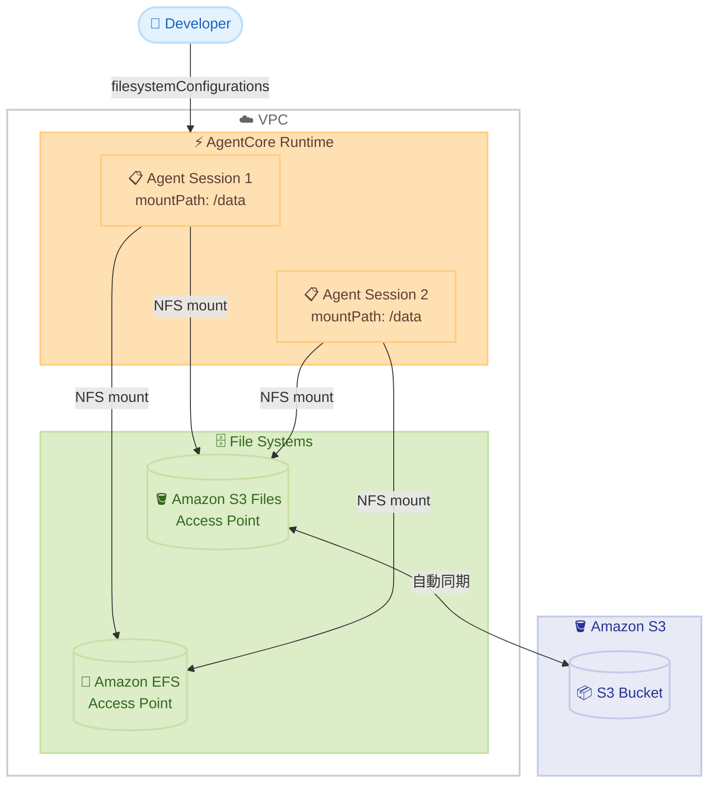

# Amazon Bedrock AgentCore Runtime - Bring-Your-Own ファイルシステムサポート

**リリース日**: 2026 年 5 月 6 日
**サービス**: Amazon Bedrock AgentCore Runtime
**機能**: Bring-Your-Own File System (Amazon S3 Files / Amazon EFS)

📊 [このアップデートのインフォグラフィックを見る](https://takech9203.github.io/aws-news-summary/20260506-amazon-bedrock-agentcore-runtime.html)

## 概要

Amazon Bedrock AgentCore Runtime が Bring-Your-Own ファイルシステム機能をサポートし、開発者が Amazon S3 Files および Amazon EFS のアクセスポイントをエージェントランタイムに直接アタッチできるようになった。AgentCore Runtime はファイルシステムを指定されたパスにセッションごとにマウントし、エージェントは標準的なファイル操作でデータの読み書きが可能となる。カスタムマウントコード、特権コンテナ、事前ダウンロードのオーケストレーションは一切不要である。

この機能は、既存のマネージドセッションストレージ (パブリックプレビュー中) を補完するものである。Bring-Your-Own ファイルシステムは、既に所有しているデータをセッション間、microVM ライフサイクル間、または複数エージェント間で共有する用途に設計されている。スキル、ツールライブラリ、リファレンスデータセット、ナレッジベース、プロジェクトファイルなどを複数のセッションやエージェントで利用できる。

**アップデート前の課題**

- エージェントがファイルにアクセスするために、セッション開始前にダウンロードオーケストレーションを構築する必要があった
- セッション間やエージェント間でデータを共有するための仕組みが複雑だった
- 長時間ワークフローで中間結果を永続化し、将来のセッションで再開することが困難だった
- カスタムマウントコードや特権コンテナが必要で、セキュリティリスクが増加していた

**アップデート後の改善**

- アクセスポイント ARN を指定するだけで、ファイルシステムが自動的にマウントされる
- 標準的なファイル操作 (read/write) でデータにアクセス可能になった
- 複数エージェントやセッション間でデータを透過的に共有できるようになった
- S3 Files ではファイルシステムと S3 バケット間の変更が自動同期される
- サブミリ秒のレイテンシと NFS close-to-open 一貫性が提供される

## アーキテクチャ図



AgentCore Runtime がセッション起動時に S3 Files または EFS アクセスポイントを NFS マウントし、複数のエージェントセッションが同じファイルシステムを共有するアーキテクチャを示している。

## サービスアップデートの詳細

### 主要機能

1. **Amazon S3 Files アクセスポイントのマウント**
   - S3 Files ファイルシステムをエージェントセッションにマウント
   - 標準ファイル操作と S3 API の両方でデータにアクセス可能
   - ファイルシステムと S3 バケット間の変更が自動同期される
   - サブミリ秒レイテンシで NFS close-to-open 一貫性を提供

2. **Amazon EFS アクセスポイントのマウント**
   - 専用の共有 NFS ファイルシステムとしてマウント
   - 複数エージェント間でのリアルタイムデータ共有
   - EFS の既存アクセス制御とセキュリティモデルを活用
   - サブミリ秒レイテンシで NFS close-to-open 一貫性を提供

3. **マネージドセッションストレージとの併用**
   - 既存のマネージドセッションストレージ (パブリックプレビュー) と組み合わせ可能
   - セッション固有の一時データにはセッションストレージを使用
   - 共有データには Bring-Your-Own ファイルシステムを使用
   - 用途に応じた使い分けが可能

## 技術仕様

### ファイルシステム設定

| 項目 | Amazon S3 Files | Amazon EFS |
|------|-----------------|------------|
| アクセス方式 | アクセスポイント ARN | アクセスポイント ARN |
| マウント方式 | NFS マウント | NFS マウント |
| レイテンシ | サブミリ秒 | サブミリ秒 |
| 一貫性モデル | NFS close-to-open | NFS close-to-open |
| S3 API アクセス | 対応 | 非対応 |
| 自動同期 | S3 バケットと同期 | N/A |
| 前提条件 | VPC 設定が必要 | VPC 設定が必要 |

### API 変更履歴

| 日付 | サービス | 変更内容 |
|------|----------|----------|
| 2026/05/06 | [bedrock-agentcore-control](https://awsapichanges.com/archive/changes/7068f3-bedrock-agentcore-control.html) | 7 updated api methods - filesystemConfigurations パラメータの追加 |

### filesystemConfigurations の構造

```json
{
  "filesystemConfigurations": [
    {
      "sessionStorage": {
        "mountPath": "/tmp/session"
      },
      "s3FilesAccessPoint": {
        "accessPointArn": "arn:aws:s3:us-east-1:123456789012:accesspoint/my-s3-files-ap",
        "mountPath": "/mnt/s3files"
      },
      "efsAccessPoint": {
        "accessPointArn": "arn:aws:elasticfilesystem:us-east-1:123456789012:access-point/fsap-0123456789abcdef0",
        "mountPath": "/mnt/efs"
      }
    }
  ]
}
```

### 更新された API メソッド

| メソッド名 | 説明 |
|-----------|------|
| CreateAgentRuntime | ランタイム作成時にファイルシステム設定を指定 |
| UpdateAgentRuntime | 既存ランタイムのファイルシステム設定を更新 |
| GetAgentRuntime | ファイルシステム設定情報を取得 |
| CreateHarness | Harness 作成時にファイルシステム設定を指定 |
| UpdateHarness | 既存 Harness のファイルシステム設定を更新 |
| GetHarness | Harness のファイルシステム設定情報を取得 |
| DeleteHarness | ファイルシステム設定を含む Harness の削除 |

## 設定方法

### 前提条件

1. AgentCore Runtime が VPC モードで構成されていること
2. Amazon S3 Files アクセスポイントまたは Amazon EFS アクセスポイントが作成済みであること
3. AgentCore Runtime の IAM ロールに適切なアクセス権限が付与されていること

### 手順

#### ステップ 1: S3 Files アクセスポイントの作成

```bash
aws s3control create-access-point \
  --account-id 123456789012 \
  --name my-agent-files-ap \
  --bucket my-agent-data-bucket \
  --vpc-configuration VpcId=vpc-0123456789abcdef0
```

S3 Files 用のアクセスポイントを VPC 内に作成する。エージェントがアクセスするバケットを指定する。

#### ステップ 2: AgentCore Runtime の作成

```bash
aws bedrock-agentcore-control create-agent-runtime \
  --agent-runtime-name "my-file-agent" \
  --agent-runtime-artifact '{"containerConfiguration":{"containerUri":"123456789012.dkr.ecr.us-east-1.amazonaws.com/my-agent:latest"}}' \
  --role-arn "arn:aws:iam::123456789012:role/AgentCoreRuntimeRole" \
  --network-configuration '{"networkMode":"VPC","networkModeConfig":{"securityGroups":["sg-xxx"],"subnets":["subnet-xxx"]}}' \
  --filesystem-configurations '[{"s3FilesAccessPoint":{"accessPointArn":"arn:aws:s3:us-east-1:123456789012:accesspoint/my-agent-files-ap","mountPath":"/mnt/data"}}]'
```

VPC モードで AgentCore Runtime を作成し、S3 Files アクセスポイントを `/mnt/data` にマウントする設定を行う。

#### ステップ 3: EFS アクセスポイントの利用

```bash
aws bedrock-agentcore-control update-agent-runtime \
  --agent-runtime-id "agent-runtime-id" \
  --filesystem-configurations '[{"efsAccessPoint":{"accessPointArn":"arn:aws:elasticfilesystem:us-east-1:123456789012:access-point/fsap-0123456789abcdef0","mountPath":"/mnt/shared"}}]'
```

既存のランタイムに EFS アクセスポイントを追加する。`/mnt/shared` パスで EFS にアクセスできるようになる。

## メリット

### ビジネス面

- **開発速度の向上**: ファイルアクセスのためのカスタムオーケストレーションコードが不要になり、エージェント開発に集中できる
- **運用コストの削減**: マネージドマウントにより、ファイルシステム管理のオーバーヘッドが削減される
- **マルチエージェント協調の実現**: 複数エージェントがデータを共有し、パイプライン型ワークフローを容易に構築できる

### 技術面

- **サブミリ秒レイテンシ**: アクティブデータへのアクセスが高速で、エージェントのレスポンスタイムに影響しない
- **NFS close-to-open 一貫性**: 複数セッション間でのデータ整合性が保証される
- **ゼロコードマウント**: カスタムマウントコードや特権コンテナが不要で、セキュリティリスクが低減
- **S3 デュアルアクセス**: S3 Files を使用する場合、NFS と S3 API の両方でアクセス可能

## デメリット・制約事項

### 制限事項

- VPC モードでの構成が必須であり、PUBLIC ネットワークモードでは利用できない
- アクセスポイント ARN の事前作成が必要
- IAM ロールに適切な権限設定が必要

### 考慮すべき点

- VPC 設定に伴うネットワーク構成の複雑さが増加する可能性がある
- S3 Files と EFS の選択にあたり、ユースケースに応じた適切なストレージ選定が必要
- NFS close-to-open 一貫性モデルの特性を理解した上で、同時書き込みシナリオの設計が必要

## ユースケース

### ユースケース 1: 共有スキルライブラリ

**シナリオ**: 複数のエージェントが共通のプロンプトテンプレートやツール定義を使用する環境で、更新を一元管理したい。

**実装例**:
```json
{
  "filesystemConfigurations": [
    {
      "s3FilesAccessPoint": {
        "accessPointArn": "arn:aws:s3:us-east-1:123456789012:accesspoint/shared-skills",
        "mountPath": "/opt/skills"
      }
    }
  ]
}
```

**効果**: スキルの更新を S3 バケットにアップロードするだけで、すべてのエージェントセッションに即座に反映される。再デプロイやセッション再起動が不要。

### ユースケース 2: 長時間ワークフローの中間結果永続化

**シナリオ**: データ分析エージェントが大規模データセットを処理し、中間結果を保存して翌日のセッションで作業を継続する必要がある。

**実装例**:
```json
{
  "filesystemConfigurations": [
    {
      "efsAccessPoint": {
        "accessPointArn": "arn:aws:elasticfilesystem:us-east-1:123456789012:access-point/fsap-workflow",
        "mountPath": "/workspace"
      }
    }
  ]
}
```

**効果**: エージェントは `/workspace` に中間結果を書き込み、セッションが終了しても EFS 上にデータが永続化される。次回セッション開始時に即座に前回の状態から作業を再開可能。

### ユースケース 3: マルチエージェントパイプライン

**シナリオ**: データ収集エージェントが出力したファイルを、別の分析エージェントが入力として消費するパイプラインを構築する。

**実装例**:
```json
{
  "filesystemConfigurations": [
    {
      "s3FilesAccessPoint": {
        "accessPointArn": "arn:aws:s3:us-east-1:123456789012:accesspoint/pipeline-data",
        "mountPath": "/pipeline"
      }
    }
  ]
}
```

**効果**: 収集エージェントが `/pipeline/output/` に書き込んだデータを、分析エージェントが `/pipeline/output/` から即座に読み取り可能。S3 API 経由での外部システムとの連携も同時に実現。

## 料金

AgentCore Runtime のファイルシステムマウント機能自体に追加料金は発生しない。ただし、使用するストレージサービスの料金が別途適用される。

### 料金例

| 項目 | 料金 |
|------|------|
| Amazon S3 Files | S3 ストレージ料金 + リクエスト料金に準拠 |
| Amazon EFS | EFS ストレージ料金 (Standard/IA) + スループット料金に準拠 |
| AgentCore Runtime | 既存の AgentCore Runtime 料金に含まれる |

## 利用可能リージョン

AgentCore Runtime がサポートされている全 15 リージョンで利用可能。詳細は [Supported AWS Regions](https://docs.aws.amazon.com/bedrock/latest/userguide/agentcore-supported-regions.html) を参照。

## 関連サービス・機能

- **Amazon S3 Files**: S3 バケットに NFS 互換のファイルシステムインターフェースを提供するサービス
- **Amazon EFS**: フルマネージドの NFS ファイルシステムサービス
- **Amazon Bedrock AgentCore**: AI エージェントのデプロイと管理を行うマネージドサービス
- **AgentCore Session Storage**: セッション固有の一時ストレージ (パブリックプレビュー)

## 参考リンク

- 📊 [インフォグラフィック](https://takech9203.github.io/aws-news-summary/20260506-amazon-bedrock-agentcore-runtime.html)
- [公式発表 (What's New)](https://aws.amazon.com/about-aws/whats-new/2026/05/amazon-bedrock-agentcore-runtime/)
- [ドキュメント - File system configurations in AgentCore Runtime](https://docs.aws.amazon.com/bedrock/latest/userguide/agentcore-runtime-filesystem.html)
- [API 変更履歴](https://awsapichanges.com/archive/changes/7068f3-bedrock-agentcore-control.html)

## まとめ

Amazon Bedrock AgentCore Runtime の Bring-Your-Own ファイルシステムサポートにより、AI エージェントが既存のデータに簡単かつ高速にアクセスできるようになった。VPC モードで構成されたランタイムにアクセスポイント ARN を指定するだけで、S3 Files や EFS がセッションにマウントされるため、エージェント開発の大幅な簡素化とマルチエージェント協調パターンの実現が可能となる。既存のデータ資産を AI エージェントで活用したい組織にとって、早期に検証を開始することを推奨する。
