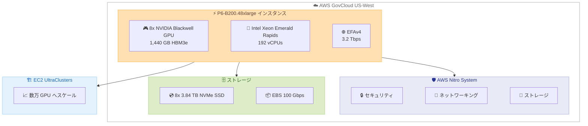

# Amazon EC2 P6-B200 - AWS GovCloud (US-West) リージョンでの提供開始

**リリース日**: 2026 年 5 月 6 日
**サービス**: Amazon EC2
**機能**: P6-B200 インスタンスの AWS GovCloud (US-West) リージョン対応

📊 [このアップデートのインフォグラフィックを見る](https://takech9203.github.io/aws-news-summary/20260506-amazon-ec2-p6-b200-aws-govcloud.html)

## 概要

Amazon EC2 P6-B200 インスタンスが AWS GovCloud (US-West) リージョンで利用可能になった。P6-B200 インスタンスは NVIDIA Blackwell GPU を搭載し、AI トレーニングおよび推論ワークロードにおいて P5en インスタンスと比較して最大 2 倍のパフォーマンスを提供する。

P6-B200 インスタンスは、8 基の NVIDIA Blackwell GPU、1,440 GB の高帯域幅 GPU メモリ、P5en 比 60% 増の GPU メモリ帯域幅、第 5 世代 Intel Xeon プロセッサ (Emerald Rapids)、最大 3.2 テラビット/秒の Elastic Fabric Adapter (EFAv4) ネットワーキングを搭載する。AWS Nitro System を基盤とし、Amazon EC2 UltraClusters 内で数万の GPU に安全にスケールすることが可能である。

政府機関や規制対象ワークロードを扱う組織が、GovCloud リージョンで最新の GPU コンピューティング能力を活用して大規模な AI/ML ワークロードを実行できるようになった。

**アップデート前の課題**

- GovCloud リージョンでは最新世代の GPU インスタンスが利用できず、AI トレーニング/推論性能に制約があった
- 政府機関や規制対象産業において、コンプライアンス要件を満たしながら高性能な AI ワークロードを実行する選択肢が限られていた
- GovCloud で大規模言語モデルのトレーニングや推論を行うには、利用可能な GPU メモリや帯域幅が不足していた

**アップデート後の改善**

- GovCloud (US-West) で NVIDIA Blackwell GPU を搭載した P6-B200 インスタンスが利用可能になった
- P5en 比最大 2 倍の AI トレーニング/推論パフォーマンスを GovCloud 環境で享受できるようになった
- 1,440 GB の GPU メモリにより、大規模モデルの処理が GovCloud 内で完結可能になった

## アーキテクチャ図



P6-B200 インスタンスのアーキテクチャ構成図。AWS Nitro System を基盤とし、8 基の NVIDIA Blackwell GPU と高速ネットワーキングを備え、EC2 UltraClusters を通じて大規模分散トレーニングに対応する。

## サービスアップデートの詳細

### 主要機能

1. **NVIDIA Blackwell GPU**
   - 8 基の NVIDIA Blackwell GPU を搭載
   - 第 2 世代 Transformer Engine を搭載し、FP4 などの新しい精度フォーマットをサポート
   - 第 5 世代 NVLink により GPU あたり最大 1.8 TB/秒の帯域幅を実現
   - 1,440 GB (1,432 GB HBM3e) の高帯域幅 GPU メモリ

2. **高性能ネットワーキング (EFAv4)**
   - 最大 3.2 テラビット/秒の Elastic Fabric Adapter (EFAv4) ネットワーキング
   - Scalable Reliable Datagram (SRD) プロトコルによるインテリジェントなトラフィックルーティング
   - 輻輳時や障害時でもスムーズな運用を維持

3. **AWS Nitro System**
   - 専用ハードウェアおよびファームウェアによる機密 AI ワークロードとデータの保護
   - ネットワーキング、ストレージ、その他の I/O 機能を処理
   - 運用中にファームウェアアップデートやバグ修正を適用可能

4. **EC2 UltraClusters 対応**
   - ペタビットスケールのノンブロッキングネットワーク内で数万の GPU にスケール
   - 効率的な分散トレーニングを実現

## 技術仕様

### P6-B200 インスタンスの仕様

| 項目 | 詳細 |
|------|------|
| インスタンスサイズ | p6-b200.48xlarge |
| Blackwell GPU | 8 基 |
| GPU メモリ | 1,432 GB HBM3e |
| vCPUs | 192 |
| システムメモリ | 2,048 GiB |
| インスタンスストレージ | 8 x 3.84 TB NVMe SSD |
| ネットワーク帯域幅 | 3.2 Tbps |
| EBS 帯域幅 | 100 Gbps |
| EC2 UltraServers | 非対応 |
| プロセッサ | 第 5 世代 Intel Xeon (Emerald Rapids) |

### P5en との比較

| 項目 | P6-B200 | P5en (前世代) | 改善率 |
|------|---------|---------------|--------|
| AI トレーニング/推論性能 | - | - | 最大 2 倍 |
| GPU メモリ帯域幅 | - | - | 60% 増 |
| GPU メモリ容量 | 1,432 GB | - | 大幅増 |

### P6 ファミリーの比較

| インスタンス | GPU | GPU メモリ | vCPUs | メモリ | ネットワーク |
|-------------|-----|-----------|-------|--------|-------------|
| p6-b200.48xlarge | 8 Blackwell | 1,432 GB | 192 | 2,048 GiB | 3.2 Tbps |
| p6-b300.48xlarge | 8 Blackwell Ultra | 2,144 GB | 192 | 4,096 GiB | 6.4 Tbps |
| p6e-gb200.36xlarge | 4 (Superchip) | 740 GB | 144 | 960 GiB | 3.2 Tbps |

## 設定方法

### 前提条件

1. AWS GovCloud (US-West) リージョンのアカウントを保有していること
2. P6-B200 インスタンスのサービスクォータが割り当てられていること
3. 適切な IAM 権限が設定されていること

### 手順

#### ステップ 1: サービスクォータの確認と引き上げリクエスト

```bash
# P6-B200 インスタンスのクォータを確認
aws service-quotas get-service-quota \
  --service-code ec2 \
  --quota-code L-XXXXXXXX \
  --region us-gov-west-1
```

P6-B200 インスタンスは高性能 GPU インスタンスのため、デフォルトのクォータが 0 の場合がある。必要に応じてクォータの引き上げをリクエストする。

#### ステップ 2: P6-B200 インスタンスの起動

```bash
# P6-B200 インスタンスを起動
aws ec2 run-instances \
  --instance-type p6-b200.48xlarge \
  --image-id ami-xxxxxxxx \
  --key-name my-key-pair \
  --security-group-ids sg-xxxxxxxx \
  --subnet-id subnet-xxxxxxxx \
  --region us-gov-west-1
```

AWS Deep Learning AMI (DLAMI) や Deep Learning Containers を使用することで、ML フレームワークがプリインストールされた環境で迅速に開始できる。

#### ステップ 3: EFA の有効化 (分散トレーニング)

```bash
# EFA を有効にしてインスタンスを起動
aws ec2 run-instances \
  --instance-type p6-b200.48xlarge \
  --image-id ami-xxxxxxxx \
  --network-interfaces "DeviceIndex=0,SubnetId=subnet-xxxxxxxx,Groups=sg-xxxxxxxx,InterfaceType=efa" \
  --region us-gov-west-1
```

分散トレーニングを行う場合は、Elastic Fabric Adapter (EFA) を有効にしたネットワークインターフェースを設定する。

## メリット

### ビジネス面

- **コンプライアンス対応**: FedRAMP High、DoD SRG IL2/4/5 などの規制要件を満たしながら、最新の GPU コンピューティングを利用可能
- **AI イノベーションの加速**: 政府機関や規制対象産業において、最先端の AI/ML 能力を活用した新サービス開発が可能
- **コスト効率**: P5en 比 2 倍の性能により、同等ワークロードの処理時間短縮とコスト削減を実現

### 技術面

- **高い GPU メモリ容量**: 1,440 GB の GPU メモリにより、大規模言語モデルの推論やファインチューニングが可能
- **高帯域幅ネットワーキング**: 3.2 Tbps の EFAv4 により効率的な分散トレーニングを実現
- **セキュリティ**: AWS Nitro System による機密データの保護と分離
- **スケーラビリティ**: EC2 UltraClusters で数万の GPU への水平スケールが可能

## デメリット・制約事項

### 制限事項

- 利用可能なインスタンスサイズは p6-b200.48xlarge のみ
- EC2 UltraServers としての利用は非対応 (UltraServer が必要な場合は P6e-GB200 を検討)
- GovCloud リージョンではサービスクォータの引き上げに時間がかかる場合がある

### 考慮すべき点

- P6-B200 は高コストなインスタンスであるため、ワークロードの要件に応じて適切なインスタンスタイプを選択する必要がある
- 分散トレーニングを行う場合は EFA 対応のセキュリティグループやサブネットの事前設定が必要
- NVIDIA Blackwell GPU に対応した CUDA ドライバーおよび ML フレームワークのバージョンを使用する必要がある

## ユースケース

### ユースケース 1: 政府機関向け大規模言語モデルのファインチューニング

**シナリオ**: 防衛関連機関が機密文書の分析のために大規模言語モデルをカスタマイズする必要がある。データは GovCloud 内に保持しなければならない。

**実装例**:
```bash
# SageMaker HyperPod を使用したトレーニングジョブ
aws sagemaker create-training-job \
  --training-job-name gov-llm-finetune \
  --resource-config "InstanceType=ml.p6-b200.48xlarge,InstanceCount=4,VolumeSizeInGB=500" \
  --region us-gov-west-1
```

**効果**: 機密データを GovCloud 外に出すことなく、最新の GPU 性能でモデルのファインチューニングが完了する。

### ユースケース 2: リアルタイム AI 推論サービス

**シナリオ**: 政府機関が画像認識や自然言語処理の AI 推論サービスを GovCloud 内で運用する必要がある。

**実装例**:
```bash
# EKS を使用した推論サービスのデプロイ
kubectl apply -f - <<EOF
apiVersion: v1
kind: Pod
metadata:
  name: ai-inference
spec:
  containers:
  - name: inference
    image: your-ecr-repo/inference-server:latest
    resources:
      limits:
        nvidia.com/gpu: 8
  nodeSelector:
    node.kubernetes.io/instance-type: p6-b200.48xlarge
EOF
```

**効果**: 1,440 GB の GPU メモリにより、大規模モデルを分割することなく単一インスタンスでホスティングでき、推論レイテンシーを最小化できる。

### ユースケース 3: 大規模分散トレーニング

**シナリオ**: 研究機関が国家安全保障に関連する AI モデルを数百 GPU で分散トレーニングする必要がある。

**実装例**:
```bash
# AWS Parallel Computing Service (PCS) を使用したクラスタ構成
aws pcs create-compute-node-group \
  --cluster-identifier my-hpc-cluster \
  --instance-configs "InstanceType=p6-b200.48xlarge" \
  --scaling-configuration "MinInstanceCount=8,MaxInstanceCount=32" \
  --region us-gov-west-1
```

**効果**: EC2 UltraClusters と EFAv4 により、256 GPU (32 インスタンス) までスケールした分散トレーニングが効率的に実行可能。

## 料金

P6-B200 インスタンスの料金は GovCloud リージョンの EC2 料金ページで確認可能。一般的に GovCloud リージョンの料金は商用リージョンより高い傾向にある。

### 料金例

| 料金モデル | 概要 |
|-----------|------|
| オンデマンド | 時間単位の従量課金 (GovCloud 料金適用) |
| リザーブドインスタンス | 1 年または 3 年契約で大幅割引 |
| Savings Plans | コンピューティング使用量のコミットメントによる割引 |

※ 最新の料金情報は [Amazon EC2 料金ページ](https://aws.amazon.com/ec2/pricing/) を参照。

## 利用可能リージョン

| リージョン | 利用可否 |
|-----------|---------|
| US West (Oregon) - us-west-2 | 利用可能 |
| US East (N. Virginia) - us-east-1 | 利用可能 |
| US East (Ohio) - us-east-2 | 利用可能 |
| AWS GovCloud (US-West) - us-gov-west-1 | **新規追加** |

## 関連サービス・機能

- **Amazon SageMaker HyperPod**: 大規模 GPU クラスタでのモデルトレーニングを簡素化 (P6e-GB200 サポートは近日対応)
- **AWS Deep Learning AMI (DLAMI)**: ML フレームワークがプリインストールされた AMI
- **AWS Deep Learning Containers**: Docker イメージとして提供される DL フレームワーク環境
- **Amazon EKS / Amazon ECS**: コンテナオーケストレーションによる P6-B200 ワークロード管理
- **AWS Parallel Computing Service (PCS)**: Slurm を使用した HPC ワークロードの管理
- **Amazon FSx for Lustre**: 大規模 AI トレーニング/推論に必要な高スループットファイルシステム

## 参考リンク

- 📊 [インフォグラフィック](https://takech9203.github.io/aws-news-summary/20260506-amazon-ec2-p6-b200-aws-govcloud.html)
- [公式発表 (What's New)](https://aws.amazon.com/about-aws/whats-new/2026/05/amazon-ec2-p6-b200-aws-govcloud)
- [Amazon EC2 P6 インスタンスタイプ](https://aws.amazon.com/ec2/instance-types/p6/)
- [Amazon EC2 料金](https://aws.amazon.com/ec2/pricing/)
- [AWS GovCloud (US) リージョン](https://aws.amazon.com/govcloud-us/)

## まとめ

Amazon EC2 P6-B200 インスタンスの AWS GovCloud (US-West) リージョンでの提供開始により、政府機関や規制対象産業の組織が FedRAMP などのコンプライアンス要件を満たしながら、NVIDIA Blackwell GPU の最先端 AI コンピューティング能力を活用できるようになった。P5en 比 2 倍のパフォーマンスと 1,440 GB の GPU メモリにより、大規模言語モデルのトレーニング・推論が GovCloud 環境内で効率的に実行可能である。GovCloud で AI/ML ワークロードを実行している組織は、P6-B200 インスタンスへの移行を検討することを推奨する。
