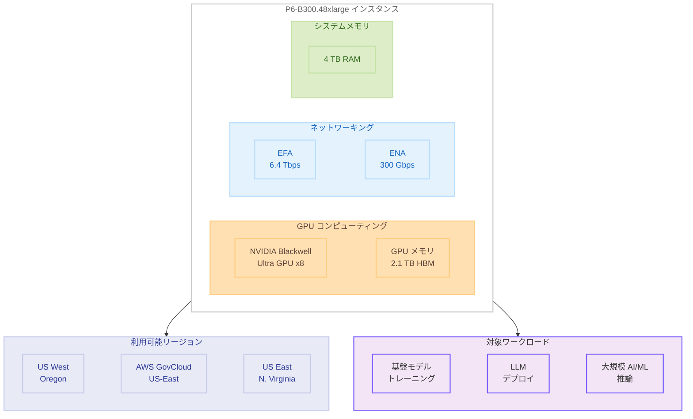

# Amazon EC2 P6-B300 インスタンス - US East (N. Virginia) リージョンでの提供開始

**リリース日**: 2026 年 5 月 6 日
**サービス**: Amazon EC2
**機能**: P6-B300 インスタンスの US East (N. Virginia) リージョン拡大

📊 [このアップデートのインフォグラフィックを見る](https://takech9203.github.io/aws-news-summary/20260506-amazon-ec2-p6-b300-us-east.html)

## 概要

Amazon EC2 P6-B300 インスタンスが US East (N. Virginia) リージョンで利用可能になりました。P6-B300 インスタンスは、8 基の NVIDIA Blackwell Ultra GPU を搭載し、2.1 TB の高帯域幅 GPU メモリ、6.4 Tbps の EFA ネットワーキング、300 Gbps の専用 ENA スループット、4 TB のシステムメモリを提供する最上位の GPU インスタンスです。

P6-B300 インスタンスは、P6-B200 インスタンスと比較して 2 倍のネットワーク帯域幅、1.5 倍の GPU メモリサイズ、1.5 倍の GPU TFLOPS (FP4、スパーシティなし) を実現します。これにより、数兆パラメータ規模の基盤モデル (FM) や大規模言語モデル (LLM) のトレーニングとデプロイに最適化されており、高度なテクニックを活用した AI ワークロードにおいて、より速いトレーニング時間とより多くのトークンスループットを提供します。

今回の US East (N. Virginia) リージョンへの拡大により、P6-B300 インスタンスは US West (Oregon)、AWS GovCloud (US-East) と合わせて 3 リージョンで利用可能となり、東海岸に拠点を持つ組織にとってレイテンシーの低いアクセスが可能になります。

**アップデート前の課題**

- P6-B300 インスタンスは US West (Oregon) と AWS GovCloud (US-East) の 2 リージョンでのみ利用可能であり、東海岸のユーザーにとってネットワークレイテンシーが課題であった
- US East (N. Virginia) リージョンで大規模 AI/ML ワークロードを実行する際、P6-B300 の性能を活用できなかった
- 多くの企業やスタートアップが集中する東海岸エリアからのアクセスにおいて、最高性能の GPU リソースへの地理的制約があった

**アップデート後の改善**

- US East (N. Virginia) リージョンで P6-B300 インスタンスが利用可能になり、東海岸のユーザーが低レイテンシーで最高性能の GPU コンピューティングにアクセスできるようになった
- 既存の US East (N. Virginia) リージョンのインフラストラクチャやデータセットと組み合わせて、大規模 AI/ML ワークロードをシームレスに実行可能になった
- 3 リージョンでの利用が可能となり、ワークロードの分散配置や災害復旧の選択肢が広がった

## アーキテクチャ図



P6-B300 インスタンスのアーキテクチャ構成と利用可能リージョンを示しています。8 基の NVIDIA Blackwell Ultra GPU、2.1 TB の GPU メモリ、6.4 Tbps の EFA ネットワーキング、300 Gbps の ENA スループット、4 TB のシステムメモリを搭載し、今回の US East (N. Virginia) 追加により 3 リージョンで利用可能です。

## サービスアップデートの詳細

### 主要機能

1. **NVIDIA Blackwell Ultra GPU**
   - 8 基の NVIDIA Blackwell Ultra GPU を搭載
   - FP4 (スパーシティなし) で P6-B200 比 1.5 倍の GPU TFLOPS を提供
   - 数兆パラメータ規模のモデルのトレーニングとデプロイに最適化

2. **大容量 GPU メモリ**
   - 2.1 TB の高帯域幅 GPU メモリ (HBM)
   - P6-B200 と比較して 1.5 倍の GPU メモリサイズ
   - 大規模モデルのメモリ内保持が可能で、モデル並列化の必要性を低減

3. **高速ネットワーキング**
   - 6.4 Tbps の Elastic Fabric Adapter (EFA) ネットワーキング
   - 300 Gbps の専用 Elastic Network Adapter (ENA) スループット
   - P6-B200 と比較して 2 倍のネットワーク帯域幅で分散トレーニングを加速

4. **大容量システムメモリ**
   - 4 TB のシステムメモリ
   - データの前処理やモデルのロード、大規模データセットのバッファリングに十分な容量

## 技術仕様

### インスタンス仕様

| 項目 | P6-B300 | P6-B200 (参考) |
|------|---------|----------------|
| GPU | NVIDIA Blackwell Ultra x8 | NVIDIA Blackwell x8 |
| GPU メモリ | 2.1 TB HBM | 1.4 TB HBM |
| EFA ネットワーク帯域幅 | 6.4 Tbps | 3.2 Tbps |
| ENA スループット | 300 Gbps | 150 Gbps |
| システムメモリ | 4 TB | - |
| インスタンスサイズ | p6-b300.48xlarge | p6-b200.48xlarge |

### P6-B200 との性能比較

| 項目 | 向上率 |
|------|--------|
| ネットワーク帯域幅 | 2 倍 |
| GPU メモリサイズ | 1.5 倍 |
| GPU TFLOPS (FP4、スパーシティなし) | 1.5 倍 |

### インスタンスの起動

```bash
aws ec2 run-instances \
  --instance-type p6-b300.48xlarge \
  --image-id ami-xxxxxxxx \
  --region us-east-1 \
  --key-name my-key-pair \
  --subnet-id subnet-xxxxxxxx \
  --security-group-ids sg-xxxxxxxx
```

## 設定方法

### 前提条件

1. US East (N. Virginia) リージョンへのアクセス権限を持つ AWS アカウント
2. P6-B300 インスタンスのサービスクォータが承認済みであること
3. EFA を使用する場合は、EFA 対応の AMI とセキュリティグループの設定が必要
4. 適切な VPC とサブネットの構成

### 手順

#### ステップ 1: サービスクォータの確認と申請

```bash
aws service-quotas get-service-quota \
  --service-code ec2 \
  --quota-code L-417A185B \
  --region us-east-1
```

P6-B300 インスタンスの vCPU クォータが十分であることを確認します。不足している場合は、Service Quotas コンソールまたは CLI からクォータの引き上げをリクエストしてください。

#### ステップ 2: EFA 対応セキュリティグループの作成

```bash
aws ec2 create-security-group \
  --group-name p6-b300-efa-sg \
  --description "Security group for P6-B300 with EFA" \
  --vpc-id vpc-xxxxxxxx \
  --region us-east-1

aws ec2 authorize-security-group-ingress \
  --group-id sg-xxxxxxxx \
  --protocol -1 \
  --source-group sg-xxxxxxxx \
  --region us-east-1
```

EFA を使用するためにセキュリティグループを作成し、同じセキュリティグループ内のインスタンス間での全トラフィックを許可します。

#### ステップ 3: インスタンスの起動

```bash
aws ec2 run-instances \
  --instance-type p6-b300.48xlarge \
  --image-id ami-xxxxxxxx \
  --key-name my-key-pair \
  --network-interfaces "DeviceIndex=0,SubnetId=subnet-xxxxxxxx,Groups=sg-xxxxxxxx,InterfaceType=efa" \
  --region us-east-1
```

EFA ネットワークインターフェースを指定してインスタンスを起動します。AMI は NVIDIA ドライバーと EFA ドライバーがプリインストールされた Deep Learning AMI の使用を推奨します。

## メリット

### ビジネス面

- **東海岸からの低レイテンシーアクセス**: US East (N. Virginia) リージョンでの提供により、東海岸に拠点を持つ企業やスタートアップが低レイテンシーで最高性能の GPU コンピューティングにアクセス可能
- **トレーニング時間の短縮**: P6-B200 比で大幅に向上したスペックにより、大規模モデルのトレーニング時間を短縮し、AI 開発のイテレーションを加速
- **リージョン選択の柔軟性**: 3 リージョンでの利用が可能となり、コスト、レイテンシー、コンプライアンス要件に応じた最適なリージョン選択が可能

### 技術面

- **大規模モデル対応**: 2.1 TB の GPU メモリにより、数兆パラメータ規模のモデルをメモリ内に保持してトレーニングおよび推論が可能
- **高速分散トレーニング**: 6.4 Tbps の EFA ネットワーキングにより、マルチノードトレーニングにおけるノード間通信のボトルネックを解消
- **高スループット推論**: 300 Gbps の専用 ENA スループットにより、大量の推論リクエストを低レイテンシーで処理可能

## デメリット・制約事項

### 制限事項

- インスタンスサイズは p6-b300.48xlarge のみで、より小さなサイズは提供されていない
- 利用可能リージョンは US West (Oregon)、AWS GovCloud (US-East)、US East (N. Virginia) の 3 リージョンに限定されており、東京リージョンなどアジア太平洋地域では未提供
- GPU インスタンスのサービスクォータの引き上げが必要になる場合があり、承認まで時間がかかる可能性がある

### 考慮すべき点

- P6-B300 は最大級のインスタンスタイプであるため、コストが高額になる (オンデマンド料金は非公開だが P5 世代の料金から大幅に上昇する可能性がある)
- NVIDIA Blackwell Ultra GPU のドライバーとソフトウェアスタック (CUDA、cuDNN、NCCL) の互換性を事前に確認する必要がある
- EFA を最大限に活用するには、プレースメントグループの設定や適切なネットワーク構成が不可欠

## ユースケース

### ユースケース 1: 大規模基盤モデルの分散トレーニング

**シナリオ**: AI スタートアップが数兆パラメータ規模の基盤モデルを US East (N. Virginia) リージョンで分散トレーニングする。既存のデータパイプラインや S3 バケットが同リージョンにあるため、データ転送コストを最小化したい。

**実装例**:
```bash
# プレースメントグループの作成
aws ec2 create-placement-group \
  --group-name p6-b300-training-cluster \
  --strategy cluster \
  --region us-east-1

# P6-B300 クラスターでの分散トレーニング起動
aws ec2 run-instances \
  --instance-type p6-b300.48xlarge \
  --count 8 \
  --image-id ami-deep-learning-base \
  --placement "GroupName=p6-b300-training-cluster" \
  --network-interfaces "DeviceIndex=0,SubnetId=subnet-xxx,Groups=sg-xxx,InterfaceType=efa" \
  --region us-east-1
```

**効果**: 8 ノード x 8 GPU = 64 GPU で 16.8 TB の合計 GPU メモリを活用し、数兆パラメータ規模のモデルを効率的にトレーニング可能。EFA 6.4 Tbps のノード間通信により、データ並列・モデル並列の双方で高いスケーリング効率を実現。

### ユースケース 2: 大規模 LLM の推論サービング

**シナリオ**: 企業がトリリオンパラメータ規模の LLM を本番環境でデプロイし、リアルタイムの推論サービスを提供する。US East (N. Virginia) リージョンのエンドユーザーに低レイテンシーで応答を返す必要がある。

**実装例**:
```bash
aws ec2 run-instances \
  --instance-type p6-b300.48xlarge \
  --image-id ami-deep-learning-inference \
  --network-interfaces "DeviceIndex=0,SubnetId=subnet-xxx,Groups=sg-xxx,InterfaceType=efa" \
  --region us-east-1 \
  --tag-specifications "ResourceType=instance,Tags=[{Key=Purpose,Value=LLM-Inference}]"
```

**効果**: 2.1 TB の GPU メモリにより超大規模モデルを単一インスタンスにロードして推論を実行でき、300 Gbps の ENA スループットにより大量のリクエストを高スループットで処理可能。

### ユースケース 3: マルチリージョンでの AI ワークロード分散

**シナリオ**: グローバル企業が US West (Oregon) と US East (N. Virginia) の両リージョンで P6-B300 インスタンスを使用し、地理的な冗長性を持つ AI プラットフォームを構築する。

**効果**: 2 つの商用リージョンにわたるワークロード分散により、リージョン障害時のフェイルオーバーやピーク時の負荷分散が可能になる。また、エンドユーザーの地理的位置に基づいたルーティングにより、全体的なレイテンシーを最適化できる。

## 料金

P6-B300 インスタンスの料金は、オンデマンド、Reserved Instances、Savings Plans の各購入オプションで利用可能です。具体的な料金については、[Amazon EC2 料金ページ](https://aws.amazon.com/ec2/pricing/)を参照してください。

P6-B300 は最上位の GPU インスタンスであるため、コスト最適化のために以下の購入オプションを検討することを推奨します。

| 購入オプション | 特徴 |
|---------------|------|
| オンデマンド | 初期費用なし、時間課金、短期ワークロードに適合 |
| Reserved Instances | 1 年または 3 年コミットで最大 72% の割引 |
| Savings Plans | 柔軟なコミットメント割引 |

## 利用可能リージョン

P6-B300 インスタンス (p6-b300.48xlarge) は、以下の AWS リージョンで利用可能です。

- US West (Oregon) - us-west-2
- AWS GovCloud (US-East) - us-gov-east-1
- US East (N. Virginia) - us-east-1 **[NEW]**

## 関連サービス・機能

- **NVIDIA Blackwell Ultra GPU**: 最新世代の NVIDIA GPU アーキテクチャで、AI/ML ワークロードに最適化された高性能コンピューティングを提供
- **Elastic Fabric Adapter (EFA)**: HPC および ML アプリケーション向けの高スループット、低レイテンシーのネットワークインターフェース
- **Amazon EC2 P6-B200 インスタンス**: P6-B300 の前世代にあたる NVIDIA Blackwell GPU 搭載インスタンス
- **AWS ParallelCluster**: P6-B300 インスタンスを使用した HPC クラスターの構築と管理を簡素化するサービス
- **Amazon SageMaker**: ML モデルの構築、トレーニング、デプロイを支援するフルマネージドサービス

## 参考リンク

- 📊 [インフォグラフィック](https://takech9203.github.io/aws-news-summary/20260506-amazon-ec2-p6-b300-us-east.html)
- [公式発表 (What's New)](https://aws.amazon.com/about-aws/whats-new/2026/05/amazon-ec2-p6-b300-us-east)
- [Amazon EC2 P6 インスタンス](https://aws.amazon.com/ec2/instance-types/p6/)
- [Amazon EC2 料金](https://aws.amazon.com/ec2/pricing/)
- [Elastic Fabric Adapter](https://aws.amazon.com/hpc/efa/)

## まとめ

Amazon EC2 P6-B300 インスタンスが US East (N. Virginia) リージョンで利用可能になり、P6-B300 は 3 リージョン (US West Oregon、GovCloud US-East、US East N. Virginia) での提供となりました。8 基の NVIDIA Blackwell Ultra GPU、2.1 TB の GPU メモリ、6.4 Tbps の EFA ネットワーキングを搭載した P6-B300 は、数兆パラメータ規模の基盤モデルのトレーニングやデプロイに最適です。US East (N. Virginia) リージョンに既存のワークロードやデータを持つ組織は、低レイテンシーアクセスとデータ転送コストの削減の観点から、本リージョンでの P6-B300 利用を検討することを推奨します。
