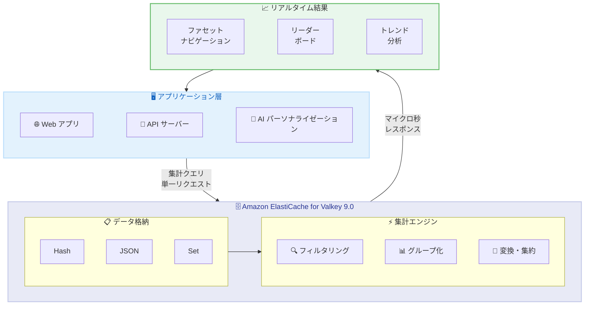

# Amazon ElastiCache - リアルタイム集計クエリのサポート

**リリース日**: 2026 年 5 月 6 日
**サービス**: Amazon ElastiCache
**機能**: リアルタイム集計 (Aggregations)

📊 [このアップデートのインフォグラフィックを見る](https://takech9203.github.io/aws-news-summary/20260506-amazon-elasticache-aggregations.html)

## 概要

Amazon ElastiCache がリアルタイム集計クエリをサポートしました。この機能により、キャッシュ内のデータに対してフィルタリング、グループ化、変換、集約を単一のクエリで直接実行できるようになります。開発者はテラバイト規模のデータに対してマイクロ秒レベルのレイテンシーで集計処理を行い、完了した書き込みを即座に反映した結果を取得できます。

ElastiCache のインメモリ上で直接集計を実行することで、別途分析エンジンを用意することなくアーキテクチャの複雑さを軽減し、レスポンスタイムを改善できます。ファセットナビゲーション、カテゴリカウント、ロールアップ、リーダーボード、トレンドコンテンツ、AI パーソナライゼーション、運用ダッシュボードなど、幅広いリアルタイムアプリケーションで活用できます。

本機能はすべての商用 AWS リージョン、AWS GovCloud (US) リージョン、China リージョンで、ElastiCache バージョン 9.0 for Valkey を実行するノードベースクラスターに対して追加料金なしで利用可能です。

**アップデート前の課題**

- キャッシュデータの集計処理にはアプリケーション側でデータを取得した後に集計ロジックを実装する必要があった
- リアルタイム分析には別途 Redis 以外の分析エンジンやストリーム処理基盤が必要だった
- 複数のキーやデータ構造をまたいだ横断的なクエリが困難で、複数のコマンドを組み合わせる必要があった
- データの鮮度とクエリパフォーマンスのトレードオフが存在し、最新データに基づく集計が困難だった

**アップデート後の改善**

- 単一のクエリでキャッシュデータのフィルタリング、グループ化、変換、集約が可能になった
- 別途分析エンジンを用意する必要がなくなり、アーキテクチャの複雑さが大幅に軽減された
- テラバイト規模のデータに対してマイクロ秒レベルのレスポンスを実現
- 完了した書き込みが即座に反映されるため、常に最新のデータに基づいた集計結果を取得可能

## アーキテクチャ図



アプリケーションから ElastiCache に対して単一の集計クエリを発行し、インメモリでフィルタリング・グループ化・変換を実行後、マイクロ秒レベルのレイテンシーでリアルタイム結果を返却するデータフローを示しています。

## サービスアップデートの詳細

### 主要機能

1. **単一クエリでの集計処理**
   - キャッシュ内データに対してフィルタリング、グループ化、変換、集約を 1 回のクエリで実行可能
   - 複数のコマンドを組み合わせる必要がなく、開発者の生産性が向上
   - 完了した書き込みを即座に反映した一貫性のある結果を返却

2. **マイクロ秒レベルのレイテンシー**
   - テラバイト規模のデータに対してもマイクロ秒レベルのレスポンスを実現
   - インメモリ処理による高速な集計でリアルタイムユースケースに対応
   - 従来の分析エンジンと比較して大幅なレイテンシー改善

3. **幅広いユースケース対応**
   - ファセットナビゲーション、カテゴリカウント、ロールアップ
   - リーダーボード、トレンドコンテンツ、人気カテゴリ表示
   - AI パーソナライゼーション向けの検索結果サマリー
   - 運用ダッシュボード、ビジネスアナリティクス

## 技術仕様

### 要件と互換性

| 項目 | 詳細 |
|------|------|
| 対応エンジン | Valkey 9.0 以上 |
| クラスタータイプ | ノードベースクラスター |
| 追加料金 | なし |
| レイテンシー | マイクロ秒レベル |
| データ規模 | テラバイトスケール対応 |
| データ一貫性 | 完了した書き込みを即座に反映 |

### Valkey について

Valkey は Redis の最もオープンでベンダーニュートラルな OSS 代替であり、ElastiCache で推奨されるエンジンです。Linux Foundation の下で開発されており、既存の Redis OSS クライアントとの互換性を維持しています。

## 設定方法

### 前提条件

1. AWS アカウントへのアクセス権限
2. ElastiCache の操作権限 (IAM ポリシー)
3. VPC 内のサブネットグループの設定

### 手順

#### ステップ 1: 新しい Valkey 9.0 クラスターの作成

```bash
aws elasticache create-replication-group \
  --replication-group-id my-valkey-cluster \
  --replication-group-description "Valkey 9.0 with aggregations" \
  --engine valkey \
  --engine-version 9.0 \
  --cache-node-type cache.r7g.large \
  --num-cache-clusters 3
```

新しいノードベースクラスターを Valkey 9.0 エンジンで作成します。集計機能は Valkey 9.0 以上で自動的に利用可能になります。

#### ステップ 2: 既存クラスターのアップグレード

```bash
aws elasticache modify-replication-group \
  --replication-group-id my-existing-cluster \
  --engine-version 9.0 \
  --apply-immediately
```

既存のクラスターを Valkey 9.0 にアップグレードします。アップグレード後、集計クエリが利用可能になります。

#### ステップ 3: 集計クエリの実行

```
FT.AGGREGATE my-index "*"
  GROUPBY 1 @category
  REDUCE COUNT 0 AS count
  SORTBY 2 @count DESC
  LIMIT 0 10
```

上記は Valkey の集計コマンドの例です。インデックスに対してフィルタリング、グループ化、カウント集計、ソートを 1 つのクエリで実行しています。

## メリット

### ビジネス面

- **アーキテクチャ簡素化によるコスト削減**: 別途分析エンジンやストリーム処理基盤を維持する必要がなくなり、運用コストとインフラコストを削減
- **リアルタイムなユーザー体験の実現**: マイクロ秒レベルのレスポンスにより、エンドユーザーに即座にパーソナライズされた結果を提供可能
- **追加料金なしの新機能**: 既存の ElastiCache 利用料金内で集計機能を利用でき、新たな費用負担が不要

### 技術面

- **レイテンシーの大幅な改善**: インメモリ処理により、外部分析エンジンへのネットワークラウンドトリップが不要
- **データ一貫性の保証**: 完了した書き込みが即座に反映され、常に最新のデータに基づく集計が可能
- **スケーラビリティ**: テラバイト規模のデータに対応し、ノードベースクラスターのスケーリングにより処理能力を拡張可能

## デメリット・制約事項

### 制限事項

- ノードベースクラスターのみ対応 (Serverless クラスターは現時点で対象外)
- Valkey 9.0 以上が必要 (既存の古いバージョンからのアップグレードが必要)
- Memcached や Redis OSS エンジンでは利用不可

### 考慮すべき点

- 既存の Redis OSS ベースのクラスターから Valkey への移行が必要な場合がある
- 集計クエリの複雑さによっては、ノードの CPU 使用率に影響を与える可能性がある
- インデックスの作成とデータモデルの設計が集計パフォーマンスに影響するため、適切な設計が重要

## ユースケース

### ユースケース 1: EC サイトのファセットナビゲーション

**シナリオ**: 大規模な EC サイトで商品検索結果にカテゴリ別のカウントやフィルター条件を動的に表示したい場合

**実装例**:
```
FT.AGGREGATE products-index "@brand:{Nike}"
  GROUPBY 1 @category
  REDUCE COUNT 0 AS product_count
  SORTBY 2 @product_count DESC
```

**効果**: 別途 Elasticsearch 等の検索エンジンを用意することなく、キャッシュ内で直接ファセットカウントを取得でき、マイクロ秒レベルのレスポンスで商品一覧ページを表示可能

### ユースケース 2: リアルタイムリーダーボード

**シナリオ**: ゲームやストリーミングサービスで、リアルタイムのランキングやトレンドコンテンツを表示したい場合

**実装例**:
```
FT.AGGREGATE content-index "*"
  APPLY "hour(@timestamp)" AS hour
  GROUPBY 2 @content_id @hour
  REDUCE SUM 1 @views AS total_views
  SORTBY 2 @total_views DESC
  LIMIT 0 20
```

**効果**: 直近のデータに基づいたリアルタイムランキングを、追加のストリーム処理パイプラインなしで実現可能

### ユースケース 3: AI パーソナライゼーション向けデータサマリー

**シナリオ**: AI ベースの推薦エンジンに対して、ユーザーの行動データや商品属性のサマリーを高速に提供したい場合

**実装例**:
```
FT.AGGREGATE user-activity-index "@user_id:{user123}"
  GROUPBY 1 @item_category
  REDUCE COUNT 0 AS interaction_count
  REDUCE AVG 1 @rating AS avg_rating
  SORTBY 2 @interaction_count DESC
  LIMIT 0 5
```

**効果**: AI モデルへの入力データをキャッシュから直接集計して提供することで、推薦レスポンスのレイテンシーを大幅に削減

## 料金

集計機能自体に追加料金は発生しません。既存の Amazon ElastiCache ノードベースクラスターの料金体系がそのまま適用されます。

### 料金例

| インスタンスタイプ | 月額料金 (概算、us-east-1) |
|--------|------------------|
| cache.r7g.large (3 ノード) | 約 $450 |
| cache.r7g.xlarge (3 ノード) | 約 $900 |

※ 集計機能の利用に伴う追加費用はなし。料金はノードタイプ、ノード数、リージョンにより異なります。

## 利用可能リージョン

すべての商用 AWS リージョン、AWS GovCloud (US) リージョン、および China リージョンで利用可能です。

## 関連サービス・機能

- **Amazon MemoryDB**: 永続性を備えたインメモリデータベース。集計機能の対応状況は今後の発表に注目
- **Amazon OpenSearch Service**: 全文検索と分析エンジン。ElastiCache 集計は OpenSearch に比べてレイテンシーが低いが、全文検索機能は限定的
- **Amazon DynamoDB**: NoSQL データベース。DynamoDB Streams と組み合わせて ElastiCache の集計用データを同期するパターンが有効

## 参考リンク

- 📊 [インフォグラフィック](https://takech9203.github.io/aws-news-summary/20260506-amazon-elasticache-aggregations.html)
- [公式発表 (What's New)](https://aws.amazon.com/about-aws/whats-new/2026/05/amazon-elasticache-aggregations/)
- [ElastiCache ドキュメント](https://docs.aws.amazon.com/AmazonElastiCache/latest/dg/WhatIs.html)
- [ElastiCache 料金ページ](https://aws.amazon.com/elasticache/pricing/)

## まとめ

Amazon ElastiCache のリアルタイム集計機能は、キャッシュレイヤーに分析処理能力を追加する重要なアップデートです。別途分析エンジンを用意する必要がなくなり、テラバイト規模のデータに対してマイクロ秒レベルのレスポンスで集計結果を取得できます。EC サイト、ゲーム、AI アプリケーションなど、リアルタイム性が求められるワークロードを持つユーザーは、Valkey 9.0 へのアップグレードを検討することを推奨します。
