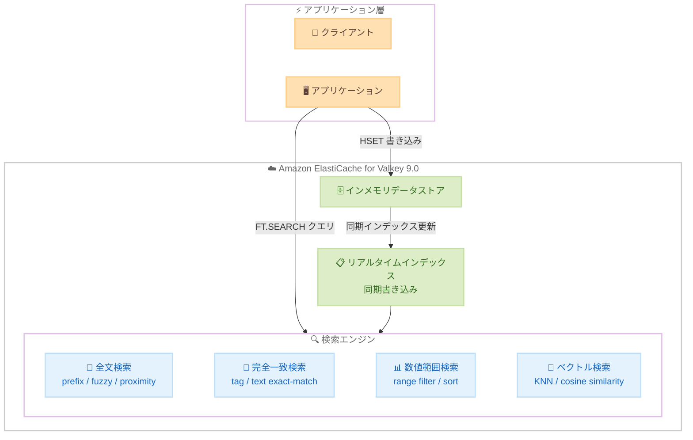

# Amazon ElastiCache - リアルタイム全文検索、完全一致検索、数値範囲検索

**リリース日**: 2026年5月6日
**サービス**: Amazon ElastiCache
**機能**: リアルタイム全文検索、完全一致検索、数値範囲検索

📊 [このアップデートのインフォグラフィックを見る](https://takech9203.github.io/aws-news-summary/20260506-amazon-elasticache-enchanced-search.html)

## 概要

Amazon ElastiCache が、キャッシュ内で直接リアルタイムの全文検索 (full-text search)、完全一致検索 (exact-match search)、数値範囲検索 (numeric range search) をサポートするようになった。別途検索サービスを用意する必要なく、テラバイト規模のデータに対してマイクロ秒レベルのレイテンシと毎秒数百万回の検索オペレーションスループットを実現する。

開発者はこれらの検索タイプを単一のクエリで組み合わせ、頻繁に変更されるデータに対してリアルタイムかつスケーラブルな検索を実行できる。さらに、ベクトル類似検索と組み合わせたハイブリッドクエリにより、正確な条件指定とセマンティックな意図の両方を捉えた高精度な検索結果を提供する。

本機能は ElastiCache バージョン 9.0 for Valkey で利用可能であり、追加費用なしで提供される。Valkey は Redis のオープンソースかつベンダー中立な代替エンジンであり、ElastiCache で推奨されるエンジンである。

**アップデート前の課題**

- ElastiCache はキーバリューストアとしてのみ機能し、複雑な検索には Amazon OpenSearch Service 等の別サービスが必要だった
- キャッシュ内のデータを属性ベースで検索するには、アプリケーション側でのロジック実装やデータの二重管理が必要だった
- リアルタイムデータに対する低レイテンシ検索と高スループットの両立が困難で、アーキテクチャが複雑化していた

**アップデート後の改善**

- 別途検索サービスを構築・管理する必要がなくなり、キャッシュ内で直接検索が可能になった
- 書き込み完了と同時にデータが検索可能になる read-after-write 一貫性により、常に最新データを検索できる
- 全文検索、完全一致検索、数値範囲検索、ベクトル検索を単一クエリで組み合わせたハイブリッド検索が可能になった

## アーキテクチャ図



アプリケーションが ElastiCache にデータを書き込むと同期的にインデックスが更新され、即座に全文検索、完全一致検索、数値範囲検索、ベクトル検索が利用可能になる。

## サービスアップデートの詳細

### 主要機能

1. **全文検索 (Full-text Search)**
   - プレフィックスマッチング: ユーザーがタイプする際のリアルタイムサジェスト (type-ahead)
   - ファジーマッチング: タイプミスに対する許容検索 (edit distance ベース)
   - 近接マッチング (SLOP): 複数語の距離を制御したフレーズ検索
   - `TextField` 属性に対して動作

2. **完全一致検索 (Exact-match Search)**
   - ユーザー名、コンテンツ ID、ジャンル、ブランド名などの正確な値でドキュメントを即座にルックアップ
   - `TagField` 属性に対して動作
   - ストリーミングやゲームアプリケーションでのコンテンツ検索に最適

3. **数値範囲検索 (Numeric Range Search)**
   - トランザクション額、日付範囲、プレイヤースコアなどの数値属性によるフィルタリング
   - `NumericField` 属性に対して動作しソート可能
   - 金融アプリケーションやリーダーボードでの利用に最適

4. **ハイブリッド検索 (Hybrid Search)**
   - テキスト、タグ、数値フィルタとベクトル類似検索を単一クエリで組み合わせ
   - セマンティックな関連性とビジネス制約の両方を満たす結果を取得
   - レコメンデーションエンジン、エージェントメモリに最適

5. **リアルタイムインデックス**
   - 書き込み完了と同時に検索可能 (read-after-write consistency)
   - マルチスレッドによる並行インデックス処理
   - マルチキートランザクションや Lua スクリプトでも一貫性を保証

## 技術仕様

### パフォーマンスベンチマーク

1 シャード、cache.r7g.2xlarge ノード 1 台、レプリカなし、1.3M ドキュメント (約 1GB) での測定結果:

| クエリタイプ | P50 レイテンシ (1 client) | P99 レイテンシ (1 client) | QPS (300 clients) |
|------|------|------|------|
| テキスト検索 (完全一致) | 0.135 ms | 0.255 ms | 60,000 |
| プレフィックスマッチング | 0.135 ms | 0.279 ms | 57,692 |
| 数値範囲検索 | 0.175 ms | 0.199 ms | 24,087 |
| ハイブリッドクエリ (テキスト + 数値) | 0.135 ms | 0.295 ms | 52,632 |

### インデックスフィールドタイプ

| フィールドタイプ | 用途 | 検索方法 |
|------|------|------|
| TextField | タイトル、説明文 | 全文検索、プレフィックス、ファジー |
| TagField | ブランド、カテゴリ、色 | 完全一致検索 |
| NumericField | 価格、評価、在庫数 | 範囲フィルタ、ソート |
| VectorField | 埋め込みベクトル | KNN 類似検索 |

### 対応コマンド

| コマンド | 用途 |
|------|------|
| FT.CREATE | インデックス作成 |
| FT.SEARCH | 検索実行 |
| FT.DROPINDEX | インデックス削除 |
| FT.INFO | インデックス情報の取得 |

### スケーリング

- レプリカ追加: シャードあたり最大 5 レプリカ (結果整合性)
- シャード追加: メモリ容量拡張 (クライアントコード変更不要)
- シングルスロットインデックス: ファンアウトオーバーヘッド排除で最低レイテンシ実現

## 設定方法

### 前提条件

1. AWS アカウントと AWS CLI が設定済みであること
2. ElastiCache レプリケーショングループを作成する IAM 権限
3. ElastiCache クラスターと同じ VPC 内の EC2 インスタンスまたは接続可能なアプリケーション
4. Python 3.9 以降と valkey-py バージョン 6.1.1 以降

### 手順

#### ステップ 1: ElastiCache for Valkey 9.0 クラスターの作成

```bash
aws elasticache create-replication-group \
  --replication-group-id my-search-cluster \
  --replication-group-description "Valkey cluster with search" \
  --engine valkey \
  --engine-version 9.0 \
  --transit-encryption-enabled \
  --cache-node-type cache.r7g.large \
  --replicas-per-node-group 0
```

ElastiCache バージョン 9.0 for Valkey のクラスターを作成する。検索機能はこのバージョン以降で利用可能である。

#### ステップ 2: 検索インデックスの作成

```python
import valkey
from valkey.commands.search.field import TextField, TagField, NumericField, VectorField
from valkey.commands.search.indexDefinition import IndexDefinition, IndexType

client = valkey.Valkey(
    host="your-cluster-endpoint.cache.amazonaws.com",
    port=6379,
    decode_responses=False,
    ssl=True,
    ssl_cert_reqs="required"
)

# インデックス作成
client.ft("products_index").create_index(
    fields=[
        TextField("title"),
        TextField("description"),
        TagField("brand", separator=","),
        NumericField("price"),
        NumericField("rating"),
        VectorField("embedding", "FLAT", {
            "TYPE": "FLOAT32",
            "DIM": 64,
            "DISTANCE_METRIC": "COSINE"
        })
    ],
    definition=IndexDefinition(
        prefix=["product:"],
        index_type=IndexType.HASH
    )
)
```

`FT.CREATE` コマンドで検索インデックスを定義する。プレフィックスに一致するハッシュキーが自動的にインデックスされる。

#### ステップ 3: 検索の実行

```python
from valkey.commands.search.query import Query

# 全文検索 (プレフィックスマッチ)
results = client.ft("products_index").search(
    Query("wire*").return_fields("title").paging(0, 5)
)

# ハイブリッドクエリ (テキスト + 数値範囲)
results = client.ft("products_index").search(
    Query("@title:headphones @price:[50 150] @rating:[4.0 5.0]")
    .return_fields("title", "brand", "price", "rating")
    .paging(0, 5)
)

# ファジーマッチング (タイプミス許容)
results = client.ft("products_index").search(
    Query("%wireles% %headphoens%")
    .return_fields("title", "brand", "price")
    .paging(0, 5)
)
```

`FT.SEARCH` コマンドで各種検索を実行する。プレフィックス (`*`)、ファジー (`%`)、フィールド指定 (`@field:`) 等のクエリ構文を組み合わせて利用する。

## メリット

### ビジネス面

- **インフラコスト削減**: 別途検索サービスを運用する必要がなくなり、インフラの複雑さとコストを削減
- **開発生産性向上**: 単一のデータストアでキャッシュと検索を統合し、アーキテクチャを簡素化
- **リアルタイム体験の実現**: マイクロ秒レベルのレイテンシにより、ユーザーに即座にフィードバックを返す体験を構築可能

### 技術面

- **read-after-write 一貫性**: 書き込み即検索可能で、データの鮮度を保証
- **高スループット**: マルチスレッド処理とレプリカスケーリングにより毎秒数百万 QPS を実現
- **柔軟なクエリ**: 全文、完全一致、数値範囲、ベクトルを組み合わせたハイブリッド検索を単一クエリで実行

## デメリット・制約事項

### 制限事項

- ノードベースクラスターのみで利用可能 (サーバーレスでの利用可否は要確認)
- ElastiCache バージョン 9.0 for Valkey 以降が必須 (既存クラスターはアップグレードが必要)
- レプリカからの検索は結果整合性 (read-after-write 一貫性はプライマリノードのみ)
- ファジーマッチングは計算コストが高く、フォールバックとしての利用が推奨される

### 考慮すべき点

- 既存の Redis エンジンからの移行には Valkey エンジンへの変更が必要
- インデックスサイズがメモリ容量に影響するため、キャパシティプランニングが重要
- 大規模データセットでのインデックス再構築時間の考慮が必要

## ユースケース

### ユースケース 1: E コマースの商品検索エンジン

**シナリオ**: オンライン小売プラットフォームで、数百万の商品カタログに対してタイプアヘッド検索、ファセット絞り込み、類似商品レコメンデーションを提供する。

**実装例**:
```python
# ファセット検索: カテゴリ + 価格範囲 + 評価でフィルタ
results = client.ft("products_index").search(
    Query("@title:headphones @brand:{Sony} @price:[50 200] @rating:[4.0 5.0]")
    .return_fields("title", "brand", "price", "rating")
    .paging(0, 10)
)
```

**効果**: 別途 OpenSearch 等を構築せずに、マイクロ秒レベルの応答速度で商品検索体験を提供。インフラ運用コストの削減とユーザー体験の向上を両立。

### ユースケース 2: AI エージェントのメモリシステム

**シナリオ**: AI エージェントが過去のインタラクションから学習し、フル会話履歴を再生せずにコンテキストに応じた応答を提供する。スコープ属性とセマンティック関連性でメモリを検索する。

**実装例**:
```python
# ハイブリッド検索: スコープフィルタ + ベクトル類似検索
results = client.ft("memory_index").search(
    Query("@user_id:{user123} @session:{active} =>[KNN 5 @embedding $vec AS score]")
    .return_fields("memory_text", "timestamp", "score")
    .dialect(2),
    query_params={"vec": current_context_embedding}
)
```

**効果**: 会話パス上の低レイテンシ要件を満たしながら、書き込み直後のメモリを即座に検索可能。トークンコスト削減と応答品質向上を実現。

### ユースケース 3: リアルタイムリーダーボードと金融取引フィルタリング

**シナリオ**: ゲームプラットフォームでのスコアランキングや、金融プラットフォームでの取引額・期間による取引検索を低レイテンシで実現する。

**実装例**:
```python
# 数値範囲: スコア帯でのリーダーボード検索
results = client.ft("leaderboard_index").search(
    Query("@region:{asia} @score:[9000 +inf]")
    .return_fields("player_name", "score", "rank")
    .sort_by("score", asc=False)
    .paging(0, 100)
)
```

**効果**: スコア更新が即座にリーダーボードに反映され、リージョンやスコア帯によるリアルタイムフィルタリングが可能。

## 料金

本検索機能は追加費用なしで利用可能。通常の ElastiCache for Valkey のノード料金のみが適用される。

### 料金例

| ノードタイプ | 月額料金 (概算、東京リージョン) |
|--------|------------------|
| cache.r7g.large (2 vCPU, 13.07 GiB) | 約 $200 |
| cache.r7g.xlarge (4 vCPU, 26.32 GiB) | 約 $400 |
| cache.r7g.2xlarge (8 vCPU, 52.82 GiB) | 約 $800 |

※ インデックスデータは通常のメモリ容量を消費するため、検索ワークロードに応じたノードサイズの選定が必要。

## 利用可能リージョン

すべての商用 AWS リージョン、AWS GovCloud (US) リージョン、中国リージョンで利用可能。

## 関連サービス・機能

- **Amazon ElastiCache for Valkey ベクトル検索**: 同じ Valkey 9.0 エンジンで提供されるベクトル類似検索機能。ハイブリッド検索と組み合わせて利用可能
- **Amazon OpenSearch Service**: フルマネージド検索・分析サービス。より高度な検索機能が必要な場合の選択肢
- **Amazon MemoryDB**: 永続性を持つインメモリデータベース。データの耐久性が必要な場合の代替
- **Amazon Bedrock AgentCore Memory**: フルマネージドの AI エージェントメモリサービス。自前管理が不要な場合の選択肢
- **ElastiCache Aggregations**: 同じ Valkey 9.0 で提供されるサーバーサイド集計機能。リアルタイム分析とレポーティング向け

## 参考リンク

- 📊 [インフォグラフィック](https://takech9203.github.io/aws-news-summary/20260506-amazon-elasticache-enchanced-search.html)
- [公式発表 (What's New)](https://aws.amazon.com/about-aws/whats-new/2026/05/amazon-elasticache-enchanced-search/)
- [AWS Blog - Enhanced search for Amazon ElastiCache](https://aws.amazon.com/blogs/database/enhanced-search-for-amazon-elasticache/)
- [ドキュメント - Search in ElastiCache](https://docs.aws.amazon.com/AmazonElastiCache/latest/dg/search.html)
- [料金ページ](https://aws.amazon.com/elasticache/pricing/)
- [ElastiCache サンプルコード (GitHub)](https://github.com/aws-samples/amazon-elasticache-samples)

## まとめ

Amazon ElastiCache for Valkey 9.0 への全文検索、完全一致検索、数値範囲検索の追加により、キャッシュと検索を単一サービスで統合できるようになった。別途検索サービスを運用する必要がなくなり、アーキテクチャの簡素化とコスト削減が可能である。追加費用なしで利用可能なため、既存の ElastiCache ユーザーは Valkey 9.0 へのアップグレードを検討し、検索ワークロードの統合を評価することを推奨する。
