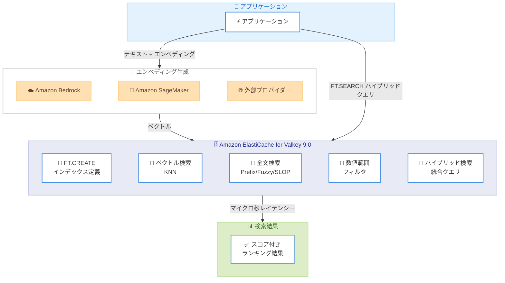

# Amazon ElastiCache - リアルタイムハイブリッド検索

**リリース日**: 2026年5月6日
**サービス**: Amazon ElastiCache
**機能**: リアルタイムハイブリッド検索 (ベクトル検索 + 全文検索)

📊 [このアップデートのインフォグラフィックを見る](https://takech9203.github.io/aws-news-summary/20260506-amazon-elasticache-hybrid-search.html)

## 概要

Amazon ElastiCache がリアルタイムハイブリッド検索をサポートし、ベクトル類似検索と全文検索を単一のクエリで組み合わせることが可能になった。別途検索サービスを用意することなく、セマンティックな意味と正確なキーワードマッチングを統合し、どちらか単独よりも関連性の高い検索結果を提供できる。

ElastiCache for Valkey 9.0 上で動作し、Amazon Bedrock、Amazon SageMaker、Anthropic、OpenAI などの主要プロバイダーからの数十億のエンベディングに対して、マイクロ秒レベルのレイテンシーと最大 99% のリコール率でハイブリッド検索を実行できる。書き込み完了と同時にデータが検索可能となるリアルタイム性も大きな特徴である。

**アップデート前の課題**

- ベクトル検索と全文検索を組み合わせるには、別途 OpenSearch などの検索サービスを構築・運用する必要があった
- 複数のサービス間でデータ同期を行う際のレイテンシー増加とアーキテクチャの複雑化
- キャッシュ層に保存済みのデータに対して、キーバリュー以外の柔軟な検索ができなかった

**アップデート後の改善**

- 単一の ElastiCache クラスターでベクトル検索、全文検索、完全一致検索、数値範囲検索を統合実行可能
- 書き込み即座にインデックス化される read-after-write 一貫性により、常に最新のデータを検索可能
- 追加コストなしでハイブリッド検索を利用でき、別途検索サービスの運用が不要に

## アーキテクチャ図



ElastiCache for Valkey 9.0 のハイブリッド検索アーキテクチャ。アプリケーションがエンベディングプロバイダーでベクトルを生成し、ElastiCache 上で全文検索とベクトル類似検索を単一クエリで実行する流れを示している。

## サービスアップデートの詳細

### 主要機能

1. **ハイブリッド検索**
   - ベクトル類似検索と全文検索を単一クエリで組み合わせ
   - テキストプレフィルタ + ベクトル KNN スコアリングによるランキング
   - セマンティックな意味と正確なキーワードの両方を捕捉

2. **全文検索**
   - プレフィックスマッチング: タイプアヘッド (入力補完) に対応
   - ファジーマッチング: タイプミスを自動補正 (編集距離ベース)
   - 近接マッチング (SLOP): 複数語句間の距離を制御

3. **完全一致検索とタグ検索**
   - テキスト、タグ、数値属性に対する正確な値のマッチング
   - 商品名、カテゴリ、ユーザー ID、注文番号での即座の検索
   - カンマ区切りのタグフィールドによるフィルタリング

4. **数値範囲検索**
   - 価格帯、日付範囲、トランザクション額、評価スコアによるフィルタリング
   - ソート可能な数値属性の定義

5. **リアルタイムインデクシング**
   - 書き込み完了と同時に検索可能 (read-after-write 一貫性)
   - マルチスレッドでのインデクシング処理
   - マルチキートランザクションや Lua スクリプトでも一貫性を保証

## 技術仕様

### パフォーマンス特性

| 項目 | 詳細 |
|------|------|
| エンジン | ElastiCache for Valkey 9.0 |
| レイテンシー | マイクロ秒レベル (P50: 0.135ms テキスト検索) |
| リコール率 | 最大 99% (95%+ リコールで最高スループット) |
| スループット | 数百万 QPS (シャード・レプリカ追加でスケール) |
| インデクシング | 同期的 (write 確認前にインデックス完了) |
| 一貫性 | read-after-write 一貫性 |

### ベンチマーク結果 (cache.r7g.2xlarge、1 シャード、133 万ドキュメント)

| クエリタイプ | P50 (1 クライアント) | P99 (1 クライアント) | QPS (300 クライアント) |
|-------------|---------------------|---------------------|----------------------|
| テキスト検索 (完全一致) | 0.135 ms | 0.255 ms | 60,000 |
| プレフィックスマッチ | 0.135 ms | 0.279 ms | 57,692 |
| 数値範囲 | 0.175 ms | 0.199 ms | 24,087 |
| ハイブリッド (テキスト + 数値範囲) | 0.135 ms | 0.295 ms | 52,632 |

### インデックス定義

```python
from valkey.commands.search.field import TextField, TagField, NumericField, VectorField
from valkey.commands.search.indexDefinition import IndexDefinition, IndexType

client.ft("products_vec_index").create_index(
    fields=[
        TextField("title"),
        TextField("description"),
        TagField("brand", separator=","),
        TagField("color", separator=","),
        NumericField("price"),
        NumericField("rating"),
        NumericField("stock"),
        VectorField("embedding", "FLAT", {
            "TYPE": "FLOAT32",
            "DIM": 64,
            "DISTANCE_METRIC": "COSINE"
        })
    ],
    definition=IndexDefinition(prefix=["pv:"], index_type=IndexType.HASH)
)
```

## 設定方法

### 前提条件

1. AWS アカウントと AWS CLI の設定
2. ElastiCache レプリケーショングループを作成できる IAM ロール
3. ElastiCache クラスターと同じ VPC 内の EC2 インスタンスまたはアプリケーション
4. Python 3.9 以降と valkey-py 6.1.1 以降

### 手順

#### ステップ 1: ElastiCache for Valkey 9.0 クラスターの作成

```bash
aws elasticache create-replication-group \
  --replication-group-id my-hybrid-search-cluster \
  --replication-group-description "Hybrid search cluster" \
  --engine valkey \
  --engine-version 9.0 \
  --transit-encryption-enabled \
  --cache-node-type cache.r7g.large \
  --replicas-per-node-group 0
```

ElastiCache for Valkey 9.0 のクラスターを作成する。検索機能はバージョン 9.0 以降で利用可能であるため、`--engine-version 9.0` を指定する。

#### ステップ 2: インデックスの作成

```python
import valkey

client = valkey.Valkey(
    host="your-cluster.clustercfg.use1.cache.amazonaws.com",
    port=6379,
    decode_responses=False,
    ssl=True,
    ssl_cert_reqs="required"
)

# FT.CREATE でインデックスを定義
client.ft("my_index").create_index(
    fields=[
        TextField("title"),
        TextField("description"),
        TagField("category", separator=","),
        NumericField("price"),
        VectorField("embedding", "FLAT", {
            "TYPE": "FLOAT32",
            "DIM": 64,
            "DISTANCE_METRIC": "COSINE"
        })
    ],
    definition=IndexDefinition(prefix=["doc:"], index_type=IndexType.HASH)
)
```

検索対象のフィールドとベクトルインデックスを定義する。`prefix` パラメータで対象となるキーのプレフィックスを指定する。

#### ステップ 3: ハイブリッド検索の実行

```python
from valkey.commands.search.query import Query

# テキストフィルタ + ベクトル KNN によるハイブリッド検索
results = client.ft("my_index").search(
    Query("@title:headphones =>[KNN 5 @embedding $vec AS score]")
    .return_fields("title", "category", "price", "score")
    .dialect(2),
    query_params={"vec": product_embedding}
)
```

`@title:headphones` で全文検索のプレフィルタを適用し、`KNN 5` でベクトル類似度によるトップ 5 のランキングを実行する。`dialect(2)` はハイブリッド検索に必要なクエリ方言である。

## メリット

### ビジネス面

- **インフラコスト削減**: 別途 OpenSearch 等の検索サービスを運用する必要がなくなり、インフラコストと運用負荷を軽減
- **ユーザー体験向上**: マイクロ秒レベルのレスポンスにより、リアルタイムなタイプアヘッド検索やパーソナライズされたレコメンデーションを提供
- **開発速度向上**: 単一サービスで検索とキャッシュを統合し、データ同期の複雑性を排除

### 技術面

- **read-after-write 一貫性**: 書き込み直後から検索可能で、結果整合性の問題を回避
- **スケーラビリティ**: レプリカ追加で読み取りスループットを拡張し、シャード追加でメモリ容量を拡張
- **追加コストなし**: ElastiCache for Valkey 9.0 の既存料金内で利用可能

## デメリット・制約事項

### 制限事項

- ElastiCache for Valkey 9.0 以降が必須 (既存クラスターはアップグレードが必要)
- ノードベースのクラスターのみサポート (サーバーレスは記載なし)
- レプリカからの読み取りは結果整合性 (eventually consistent)

### 考慮すべき点

- ファジーマッチングは完全一致より計算コストが高く、フォールバックとしての使用が推奨される
- ベクトル次元数やインデックスタイプ (FLAT/HNSW) の選択がパフォーマンスに影響
- マルチシャード構成ではファンアウトオーバーヘッドが発生するため、低レイテンシー優先の場合はシングルスロットインデックスを検討

## ユースケース

### ユースケース 1: E コマースカタログ検索

**シナリオ**: オンライン小売プラットフォームで、ユーザーがキーワード検索とフィルタを組み合わせて商品を発見し、閲覧中の商品に類似したアイテムのレコメンデーションを受ける。

**実装例**:
```python
# ファセット検索: テキスト + 価格帯 + 評価フィルタ
results = client.ft("products_index").search(
    Query("@title:headphones @price:[50 150] @rating:[4.0 5.0]")
    .return_fields("title", "brand", "price", "rating")
    .paging(0, 10)
)
```

**効果**: タイプアヘッド検索がマイクロ秒で返却され、ブランド・価格・評価によるファセット絞り込みとベクトルベースの類似商品レコメンデーションを単一クエリで実現。

### ユースケース 2: AI エージェントメモリ

**シナリオ**: AI エージェントが過去のインタラクションから学習し、ユーザー、エージェント、セッションのスコープ属性とセマンティック類似度を組み合わせて関連するメモリを即座に検索する。

**実装例**:
```python
# エージェントメモリ: スコープフィルタ + ベクトル類似度
results = client.ft("memory_index").search(
    Query("@user_id:{user123} @scope:{long_term} =>[KNN 10 @embedding $vec AS relevance]")
    .return_fields("content", "timestamp", "relevance")
    .dialect(2),
    query_params={"vec": current_context_embedding}
)
```

**効果**: 会話履歴全体を再生することなく関連コンテキストを取得し、トークンコストを削減しながら応答の関連性を向上。read-after-write 一貫性により、直前に保存されたメモリも即座に検索可能。

### ユースケース 3: RAG システムの検索強化

**シナリオ**: 生成 AI アプリケーションが、正確な用語とセマンティックな意味の両方でドキュメントチャンクを検索し、LLM に渡すコンテキストの品質を向上させる。

**実装例**:
```python
# RAG: キーワードフィルタ + ベクトル類似検索
results = client.ft("docs_index").search(
    Query("@content:ElastiCache =>[KNN 5 @embedding $vec AS score]")
    .return_fields("content", "source", "score")
    .dialect(2),
    query_params={"vec": query_embedding}
)
```

**効果**: キーワード一致のみ、またはベクトル類似度のみよりも関連性の高いコンテキストを取得し、生成 AI の応答品質を向上させながらハルシネーションを低減。

## 料金

ハイブリッド検索は ElastiCache for Valkey 9.0 の既存料金に含まれ、追加コストは発生しない。

### 料金例

| 構成 | 月額料金 (概算、us-east-1) |
|------|--------------------------|
| cache.r7g.large (1 ノード) | 約 $146/月 |
| cache.r7g.2xlarge (1 ノード) | 約 $583/月 |

※ 検索機能自体に追加課金なし。標準の ElastiCache ノード料金のみ。

## 利用可能リージョン

すべての商用 AWS リージョン、AWS GovCloud (US) リージョン、および中国リージョンで利用可能。

## 関連サービス・機能

- **Amazon Bedrock**: エンベディング生成プロバイダーとして利用可能。Titan Embeddings や Claude と組み合わせて RAG を構築
- **Amazon SageMaker**: カスタムエンベディングモデルのホスティングに利用
- **Amazon OpenSearch Service**: より高度な検索機能が必要な場合の代替。ElastiCache はレイテンシーとスループット優先のユースケース向け
- **Amazon Bedrock AgentCore Memory**: フルマネージドなエージェントメモリが必要な場合の代替
- **ElastiCache Aggregations**: 同時にリリースされたリアルタイム分析・集計機能

## 参考リンク

- 📊 [インフォグラフィック](https://takech9203.github.io/aws-news-summary/20260506-amazon-elasticache-hybrid-search.html)
- [公式発表 (What's New)](https://aws.amazon.com/about-aws/whats-new/2026/05/amazon-elasticache-hybrid-search/)
- [AWS Blog - Full-text, exact-match, range, and hybrid search on Amazon ElastiCache](https://aws.amazon.com/blogs/database/enhanced-search-for-amazon-elasticache/)
- [ドキュメント - ElastiCache Search](https://docs.aws.amazon.com/AmazonElastiCache/latest/dg/search.html)
- [ドキュメント - Agentic Memory](https://docs.aws.amazon.com/AmazonElastiCache/latest/dg/agentic-memory.html)
- [料金ページ](https://aws.amazon.com/elasticache/pricing/)

## まとめ

Amazon ElastiCache for Valkey 9.0 のハイブリッド検索は、ベクトル類似検索と全文検索を単一サービスで統合し、マイクロ秒レベルのレイテンシーで read-after-write 一貫性を提供する。AI エージェントメモリ、RAG、E コマース検索など、低レイテンシーかつ高スループットな検索が求められるユースケースに最適であり、追加コストなしで利用可能である。既存の ElastiCache 利用者は Valkey 9.0 へのアップグレードを検討することを推奨する。
