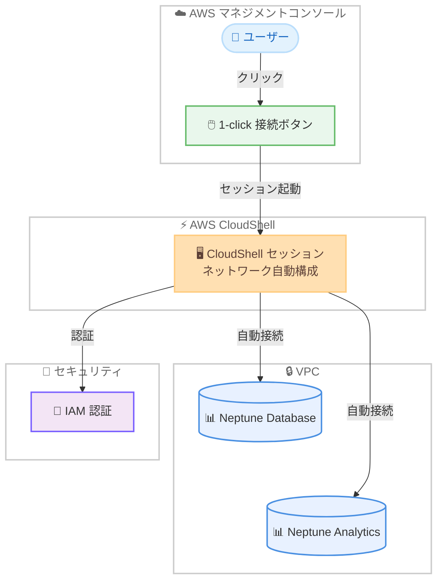

# Amazon Neptune - CloudShell による 1-click 接続サポート

**リリース日**: 2026 年 05 月 06 日
**サービス**: Amazon Neptune
**機能**: 1-click connect with CloudShell

📊 [このアップデートのインフォグラフィックを見る](https://takech9203.github.io/aws-news-summary/20260506-amazon-neptune-cloudshell.html)

## 概要

Amazon Neptune が CloudShell を使用した 1-click 接続機能を提供開始した。この機能により、Neptune Database および Neptune Analytics に対して、AWS マネジメントコンソールから直接かつ即座に接続できるようになる。

従来、Neptune リソースへの接続にはネットワーク設定やアクセス権限の手動構成が必要であり、データベース管理者、開発者、データアナリストにとって時間のかかる作業だった。1-click 接続では、手動のネットワーク構成なしに即座に Neptune リソースへのクエリを開始でき、セットアップ時間と技術的な複雑さを大幅に削減する。この機能は VPC 内のリソースを含むさまざまなネットワーク構成で動作する。

**アップデート前の課題**

- Neptune リソースへの接続にはネットワーク設定の手動構成が必要だった
- アクセス権限の設定に時間がかかり、迅速なクエリ実行が困難だった
- VPC 内のリソースへの接続には追加のネットワーク構成 (VPN、踏み台サーバーなど) が必要だった
- Neptune を初めて利用するユーザーにとって、グラフデータの探索を始めるまでのハードルが高かった

**アップデート後の改善**

- コンソールから 1 クリックで Neptune Database および Neptune Analytics に接続可能になった
- 手動のネットワーク構成が不要になり、セットアップ時間が大幅に短縮された
- VPC 内のリソースを含む多様なネットワーク構成で動作する
- 追加料金なしで利用可能

## アーキテクチャ図



AWS マネジメントコンソールから 1-click 接続を使用した Neptune へのアクセスフローを示す。ユーザーが接続ボタンをクリックすると、CloudShell セッションが自動的に起動し、ネットワーク構成を自動で行い、VPC 内の Neptune Database または Neptune Analytics に接続する。

## サービスアップデートの詳細

### 主要機能

1. **1-click 接続**
   - コンソールから 1 クリックで Neptune リソースに接続
   - 手動のネットワーク構成が不要
   - セットアップ時間を大幅に短縮

2. **Neptune Database サポート**
   - グラフデータベースへの即座のクエリ実行
   - Gremlin および openCypher クエリ言語に対応
   - 既存のデータベースクラスターに直接接続

3. **Neptune Analytics サポート**
   - グラフ分析ワークロードへの即座のアクセス
   - 分析クエリの迅速な実行とテスト
   - データ探索のハードルを低減

4. **VPC 内リソースへの対応**
   - VPC 内に配置された Neptune リソースへの透過的な接続
   - CloudShell がネットワーク経路を自動的に構成
   - 踏み台サーバーや VPN 接続が不要

## 技術仕様

### 対応構成

| 項目 | 詳細 |
|------|------|
| 対応サービス | Neptune Database、Neptune Analytics |
| 接続方式 | AWS CloudShell 経由 |
| ネットワーク | VPC 内リソースを含む各種構成に対応 |
| 認証 | IAM 認証 |
| クエリ言語 | Gremlin、openCypher、SPARQL |
| 追加料金 | なし |

### 前提条件

- Neptune Database クラスターまたは Neptune Analytics グラフが作成済みであること
- 適切な IAM 権限が付与されていること
- CloudShell へのアクセス権限があること

## 設定方法

### 前提条件

1. Amazon Neptune Database クラスターまたは Neptune Analytics グラフが稼働中であること
2. IAM ユーザーまたはロールに Neptune および CloudShell へのアクセス権限が付与されていること
3. AWS マネジメントコンソールへのアクセスが可能であること

### 手順

#### ステップ 1: Neptune コンソールにアクセス

AWS マネジメントコンソールにサインインし、Amazon Neptune のコンソールページに移動する。

#### ステップ 2: 接続先リソースを選択

Neptune Database の場合はクラスター一覧から対象のクラスターを選択する。Neptune Analytics の場合はグラフ一覧から対象のグラフを選択する。

#### ステップ 3: 1-click 接続を実行

```bash
# コンソール上で「Connect」または「1-click connect」ボタンをクリック
# CloudShell セッションが自動的に起動し、Neptune エンドポイントに接続される
```

接続ボタンをクリックすると、CloudShell が自動的に起動し、必要なネットワーク構成が行われ、Neptune リソースへの接続が確立される。

#### ステップ 4: クエリの実行

```bash
# Gremlin クエリの例
g.V().limit(10)

# openCypher クエリの例
MATCH (n) RETURN n LIMIT 10
```

CloudShell セッション内で、接続先の Neptune リソースに対してクエリを直接実行できる。

## メリット

### ビジネス面

- **導入時間の短縮**: ネットワーク設定の手動構成が不要になり、数分以内に Neptune の利用を開始できる
- **学習コストの低減**: Neptune を初めて利用するユーザーでも、即座にグラフデータの探索を始められる
- **運用効率の向上**: トラブルシューティングや開発時の接続作業が効率化される

### 技術面

- **ネットワーク構成の自動化**: VPC 内リソースへの接続経路を CloudShell が自動的に構成
- **セキュリティの維持**: IAM 認証により既存のセキュリティポリシーを維持したまま接続可能
- **追加インフラ不要**: 踏み台サーバーや VPN 接続などの追加インフラストラクチャが不要

## デメリット・制約事項

### 制限事項

- CloudShell のセッションタイムアウト (アイドル状態で 20 分) の制約を受ける
- CloudShell で利用可能なストレージは 1 GB に制限される
- 長時間のバッチ処理やプロダクションワークロードには適さない

### 考慮すべき点

- 本番環境での定常的なクエリ実行には、アプリケーションからの直接接続を推奨
- CloudShell は開発、テスト、トラブルシューティング用途に最適化されている
- 複雑なクエリツールやカスタム環境が必要な場合は、EC2 インスタンスや Neptune Workbench の利用を検討

## ユースケース

### ユースケース 1: 開発環境での迅速なプロトタイピング

**シナリオ**: 開発者が新しいグラフデータモデルを検証するために、Neptune に対してクエリを試行したい。

**実装例**:
```gremlin
// CloudShell から直接 Gremlin クエリを実行
g.addV('person').property('name', 'Alice').property('age', 30)
g.addV('person').property('name', 'Bob').property('age', 25)
g.addE('knows').from(g.V().has('name', 'Alice')).to(g.V().has('name', 'Bob'))
g.V().has('name', 'Alice').out('knows').values('name')
```

**効果**: ネットワーク設定を行うことなく、数秒でクエリの実行とデータモデルの検証が可能になる。

### ユースケース 2: インシデント時のトラブルシューティング

**シナリオ**: データベース管理者が、Neptune クラスターのデータ整合性の問題を迅速に調査する必要がある。

**実装例**:
```cypher
// データの整合性チェック
MATCH (n) RETURN labels(n) AS label, count(n) AS count
ORDER BY count DESC

// 特定のリレーションシップの確認
MATCH (a)-[r]->(b)
WHERE type(r) = 'REFERENCES'
RETURN a, r, b LIMIT 20
```

**効果**: VPN 接続や踏み台サーバーの設定を待つことなく、即座にデータベースの状態を確認できる。

### ユースケース 3: Neptune 初期評価

**シナリオ**: 技術チームが Neptune の導入を検討しており、グラフデータベースの機能を評価したい。

**実装例**:
```gremlin
// サンプルデータの投入と基本的なトラバーサル
g.V().count()
g.E().count()
g.V().groupCount().by(label)
g.V().has('name', 'example').repeat(out()).times(3).path()
```

**効果**: 環境構築のオーバーヘッドなしに Neptune の機能を体験でき、導入判断を迅速に行える。

## 料金

1-click 接続機能自体は追加料金なしで利用可能。以下の通常料金が適用される。

| 項目 | 料金 |
|------|------|
| 1-click 接続機能 | 無料 |
| CloudShell 利用 | 無料 |
| Neptune Database | 通常のインスタンス料金およびストレージ料金 |
| Neptune Analytics | 通常のプロビジョニング料金 |

## 利用可能リージョン

Amazon Neptune が現在提供されている全リージョンで利用可能。主要なリージョンは以下の通り。

- 米国東部 (バージニア北部、オハイオ)
- 米国西部 (オレゴン)
- 欧州 (アイルランド、フランクフルト、ロンドン)
- アジアパシフィック (東京、シンガポール、シドニー、ソウル、ムンバイ)
- カナダ (中部)

## 関連サービス・機能

- **AWS CloudShell**: ブラウザベースのシェル環境。認証済みの AWS CLI アクセスを提供し、Neptune への接続基盤として機能
- **Amazon Neptune Database**: フルマネージドグラフデータベースサービス。Gremlin、openCypher、SPARQL をサポート
- **Amazon Neptune Analytics**: グラフ分析エンジン。大規模グラフデータに対する分析クエリを高速に実行
- **Amazon Neptune Workbench**: Neptune 用のノートブック環境。より高度なクエリ開発や可視化に対応

## 参考リンク

- 📊 [インフォグラフィック](https://takech9203.github.io/aws-news-summary/20260506-amazon-neptune-cloudshell.html)
- [公式発表 (What's New)](https://aws.amazon.com/about-aws/whats-new/2026/05/amazon-neptune-cloudshell/)
- [Amazon Neptune ドキュメント](https://docs.aws.amazon.com/neptune/latest/userguide/)
- [Amazon Neptune 料金](https://aws.amazon.com/neptune/pricing/)
- [AWS CloudShell ドキュメント](https://docs.aws.amazon.com/cloudshell/latest/userguide/)

## まとめ

Amazon Neptune の 1-click 接続機能は、グラフデータベースへのアクセスを大幅に簡素化するアップデートである。特に開発・テスト環境でのプロトタイピング、トラブルシューティング、および Neptune の初期評価において即座に価値を発揮する。追加料金なしで全リージョンで利用可能であり、Neptune を利用している全てのユーザーがすぐに活用を開始することを推奨する。
