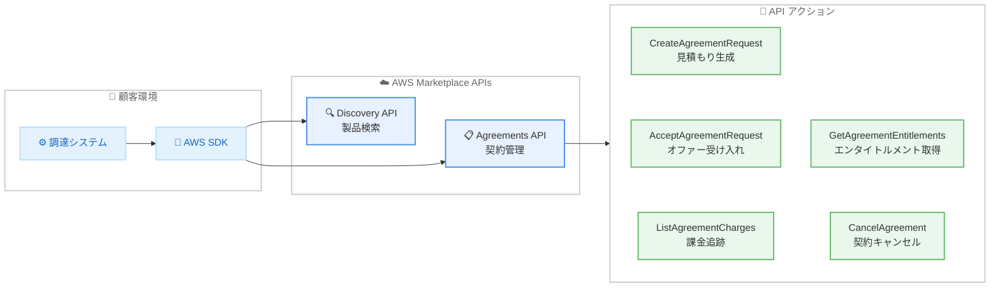

# AWS Marketplace - Agreements API によるプログラマティック調達

**リリース日**: 2026 年 5 月 6 日
**サービス**: AWS Marketplace
**機能**: Agreements API (プログラマティック調達)

[このアップデートのインフォグラフィックを見る](https://takech9203.github.io/aws-news-summary/20260506-aws-marketplace-agreements-api.html)

## 概要

AWS Marketplace が Agreements API を発表し、AWS Marketplace 製品の調達と契約管理をプログラマティックに実行できるようになった。この API により、見積もりの生成、オファーの受け入れ、課金とエンタイトルメントの追跡、購入注文の更新、契約管理を既存のツールやワークフロー内で完結できる。

Discovery API と組み合わせることで、製品の検索から購入までのエンドツーエンドの調達ジャーニーを API で実現できる。これらの API を既存の調達システムに統合し、組織全体でカスタムワークフローを構築してオペレーションを効率化することが可能になった。また、パートナーはこれらの API を使用してカスタムストアフロントを構築し、顧客に統合された調達体験を提供できる。

**アップデート前の課題**

- AWS Marketplace での製品調達には AWS Marketplace Web サイトまたは AWS Management Console へのアクセスが必要だった
- 調達ワークフローの自動化が困難で、手動操作が多く発生していた
- 既存の社内調達システムとの統合が限定的だった
- 大規模な組織での調達プロセスのスケーリングに課題があった

**アップデート後の改善**

- API 経由で調達プロセス全体をプログラマティックに実行可能になった
- 既存の調達システムやツールに API を統合してカスタムワークフローを構築できる
- Discovery API との連携により、製品検索から購入までを完全に自動化できる
- パートナーがカスタムストアフロントを構築し、統合された調達体験を提供できる

## アーキテクチャ図



顧客は AWS SDK を通じて Discovery API で製品を検索し、Agreements API で契約の作成から管理までを一連の API コールで実行できる。

## サービスアップデートの詳細

### 主要機能

1. **契約リクエストの作成と受け入れ**
   - `CreateAgreementRequest` で見積もりを生成し、料金サマリーや税金見積もりを取得
   - `AcceptAgreementRequest` でオファーを受け入れ、契約を確定
   - 新規契約、修正、置換の 3 つのインテントをサポート

2. **課金とエンタイトルメントの管理**
   - `ListAgreementCharges` で契約に関連する課金情報を一覧取得
   - `GetAgreementEntitlements` でプロビジョニング状態やライセンス情報を確認
   - `GetAgreementTerms` で契約条件の詳細を取得

3. **契約ライフサイクル管理**
   - `CancelAgreement` で契約をキャンセル
   - `AcceptAgreementCancellationRequest` / `RejectAgreementCancellationRequest` でキャンセルリクエストの承認・拒否
   - `AcceptAgreementPaymentRequest` / `RejectAgreementPaymentRequest` で支払いリクエストの管理

4. **購入注文の管理**
   - `UpdatePurchaseOrders` で購入注文参照情報を更新
   - 課金ごとに購入注文を関連付け可能

## 技術仕様

### API メソッド一覧

| メソッド名 | 用途 |
|------|------|
| CreateAgreementRequest | 契約リクエストの作成と見積もり生成 |
| AcceptAgreementRequest | オファーの受け入れと契約確定 |
| GetAgreementTerms | 契約条件の取得 |
| GetAgreementEntitlements | エンタイトルメントの取得 |
| ListAgreementCharges | 課金一覧の取得 |
| CancelAgreement | 契約のキャンセル |
| AcceptAgreementCancellationRequest | キャンセルリクエストの承認 |
| RejectAgreementCancellationRequest | キャンセルリクエストの拒否 |
| AcceptAgreementPaymentRequest | 支払いリクエストの承認 |
| RejectAgreementPaymentRequest | 支払いリクエストの拒否 |
| UpdatePurchaseOrders | 購入注文の更新 |

### API 変更履歴

| 日付 | サービス | 変更内容 |
|------|----------|----------|
| 2026/05/05 | [AWS Marketplace Agreement Service](https://awsapichanges.com/archive/changes/2d415e-agreement-marketplace.html) | 10 new 1 updated api methods - プログラマティック調達のための API を追加 |

### CreateAgreementRequest のリクエスト例

```python
import boto3

client = boto3.client('marketplace-agreement', region_name='us-east-1')

response = client.create_agreement_request(
    clientToken='unique-token-string',
    intent='NEW',
    requestedTerms=[
        {
            'id': 'term-id-string',
            'configuration': {
                'configurableUpfrontPricingTermConfiguration': {
                    'selectorValue': 'selected-option',
                    'dimensions': [
                        {
                            'dimensionKey': 'users',
                            'dimensionValue': 100
                        },
                    ]
                },
                'renewalTermConfiguration': {
                    'enableAutoRenew': True
                }
            }
        },
    ],
    agreementProposalIdentifier='proposal-id',
    taxConfiguration={
        'taxEstimation': 'ENABLED'
    }
)

# レスポンスから見積もり情報を取得
charge_summary = response['chargeSummary']
print(f"合計金額: {charge_summary['newAgreementValue']} {charge_summary['currencyCode']}")
print(f"税込金額: {charge_summary['newAgreementValueAfterTax']} {charge_summary['currencyCode']}")
```

### IAM ポリシー例

```json
{
    "Version": "2012-10-17",
    "Statement": [
        {
            "Effect": "Allow",
            "Action": [
                "aws-marketplace:CreateAgreementRequest",
                "aws-marketplace:AcceptAgreementRequest",
                "aws-marketplace:GetAgreementTerms",
                "aws-marketplace:GetAgreementEntitlements",
                "aws-marketplace:ListAgreementCharges",
                "aws-marketplace:CancelAgreement",
                "aws-marketplace:UpdatePurchaseOrders"
            ],
            "Resource": "*"
        }
    ]
}
```

## 設定方法

### 前提条件

1. AWS アカウントと適切な IAM 権限の設定
2. AWS SDK のインストール (Python boto3、Java SDK、CLI など)
3. AWS Marketplace での購入者アカウントの設定

### 手順

#### ステップ 1: IAM 権限の設定

```bash
# IAM ポリシーを作成してユーザーまたはロールにアタッチ
aws iam create-policy \
    --policy-name MarketplaceAgreementsAPIPolicy \
    --policy-document file://marketplace-agreements-policy.json
```

Agreements API を使用するために必要な IAM アクションの権限をアカウントに付与する。

#### ステップ 2: SDK の設定と API コール

```python
import boto3

# Agreements API クライアントを作成
client = boto3.client('marketplace-agreement', region_name='us-east-1')

# 契約リクエストを作成して見積もりを取得
response = client.create_agreement_request(
    clientToken='my-unique-token',
    intent='NEW',
    agreementProposalIdentifier='proposal-123',
    requestedTerms=[
        {
            'id': 'term-001',
            'configuration': {
                'renewalTermConfiguration': {
                    'enableAutoRenew': True
                }
            }
        }
    ]
)

agreement_request_id = response['agreementRequestId']
```

AWS SDK を使用して Agreements API クライアントを初期化し、契約リクエストを作成する。

#### ステップ 3: 契約の受け入れ

```python
# 見積もり確認後、契約を受け入れ
accept_response = client.accept_agreement_request(
    agreementRequestId=agreement_request_id
)

agreement_id = accept_response['agreementId']
print(f"契約 ID: {agreement_id}")
```

作成した契約リクエストの見積もり内容を確認後、`AcceptAgreementRequest` で契約を確定する。

## メリット

### ビジネス面

- **調達プロセスの自動化**: 手動での Web サイト操作が不要になり、調達にかかる時間とコストを削減できる
- **コンプライアンスの強化**: プログラマティックな承認フローにより、組織の調達ポリシーに準拠した購入を強制できる
- **スケーラビリティ**: 大規模組織での数百件の契約管理を API で効率的に処理できる

### 技術面

- **システム統合**: 既存の ERP、調達管理システム、チケットシステムとの連携が容易になる
- **エンドツーエンド自動化**: Discovery API との組み合わせにより、検索から購入までの完全自動化パイプラインを構築できる
- **監査とトレーサビリティ**: API コールのログにより、すべての調達アクションの追跡が可能になる

## デメリット・制約事項

### 制限事項

- 利用可能リージョンが US East (N. Virginia) のみに限定されている
- API の利用には適切な IAM 権限の設定が必要
- 一部の複雑な契約条件やカスタム条項には対応していない可能性がある

### 考慮すべき点

- 既存の手動調達プロセスからの移行にはワークフローの再設計が必要
- API のレート制限やスロットリングの確認が必要
- 税金計算の精度は地域や製品タイプによって異なる場合がある

## ユースケース

### ユースケース 1: エンタープライズ調達の自動化

**シナリオ**: 大規模企業で、複数の部門が AWS Marketplace から SaaS 製品を購入する際、社内承認フローと連携した自動調達システムを構築する。

**実装例**:
```python
import boto3

client = boto3.client('marketplace-agreement', region_name='us-east-1')

# 1. 見積もりを生成
estimate = client.create_agreement_request(
    clientToken='dept-finance-req-001',
    intent='NEW',
    agreementProposalIdentifier='offer-abc123',
    requestedTerms=[{'id': 'term-1', 'configuration': {}}],
    taxConfiguration={'taxEstimation': 'ENABLED'}
)

# 2. 社内承認システムに見積もり情報を送信
charge_summary = estimate['chargeSummary']
# submit_for_approval(charge_summary)

# 3. 承認後に契約を確定
approved_response = client.accept_agreement_request(
    agreementRequestId=estimate['agreementRequestId']
)
```

**効果**: 調達リードタイムを数日から数分に短縮し、コンプライアンスを自動的に担保できる。

### ユースケース 2: パートナーカスタムストアフロントの構築

**シナリオ**: AWS パートナーが顧客向けに統合された調達ポータルを構築し、複数の AWS Marketplace 製品を一元管理する。

**実装例**:
```python
import boto3

client = boto3.client('marketplace-agreement', region_name='us-east-1')

# 顧客の契約状況を一覧取得
charges = client.list_agreement_charges(
    agreementId='agr-12345',
    agreementType='PurchaseAgreement'
)

# エンタイトルメントの確認
entitlements = client.get_agreement_entitlements(
    agreementId='agr-12345'
)

for ent in entitlements['agreementEntitlements']:
    print(f"リソース: {ent['resource']['id']} - 状態: {ent['status']}")
```

**効果**: 顧客に対してブランド化された統一的な調達体験を提供でき、パートナーの付加価値を高められる。

### ユースケース 3: 契約ライフサイクルの自動管理

**シナリオ**: 契約の更新、キャンセル、支払い承認を自動化し、管理工数を削減する。

**実装例**:
```python
import boto3

client = boto3.client('marketplace-agreement', region_name='us-east-1')

# 自動更新の設定を含む契約の作成
response = client.create_agreement_request(
    clientToken='renewal-auto-001',
    intent='AMEND',
    sourceAgreementIdentifier='agr-existing-123',
    requestedTerms=[
        {
            'id': 'renewal-term',
            'configuration': {
                'renewalTermConfiguration': {
                    'enableAutoRenew': True
                }
            }
        }
    ]
)

# 支払いリクエストの自動承認
client.accept_agreement_payment_request(
    paymentRequestId='pay-req-456',
    agreementId='agr-existing-123',
    purchaseOrderReference='PO-2026-001'
)
```

**効果**: 契約管理の工数を大幅に削減し、更新漏れや支払い遅延を防止できる。

## 料金

Agreements API 自体の利用に追加料金は発生しない。AWS Marketplace での製品購入に対する通常の料金が適用される。

## 利用可能リージョン

US East (N. Virginia) リージョンで利用可能。

## 関連サービス・機能

- **AWS Marketplace Discovery API**: 製品の検索と詳細情報の取得に使用し、Agreements API と組み合わせてエンドツーエンドの調達を実現
- **AWS Identity and Access Management (IAM)**: API アクセスの権限管理に使用
- **AWS Marketplace Catalog API**: 出品者向けの製品カタログ管理 API
- **AWS Organizations**: マルチアカウント環境での一括調達管理

## 参考リンク

- [インフォグラフィック](https://takech9203.github.io/aws-news-summary/20260506-aws-marketplace-agreements-api.html)
- [公式発表 (What's New)](https://aws.amazon.com/about-aws/whats-new/2026/05/aws-marketplace-agreements-api/)
- [ドキュメント - AWS Marketplace Agreement APIs](https://docs.aws.amazon.com/marketplace/latest/APIReference/agreement-apis.html)
- [AWS Marketplace](https://aws.amazon.com/marketplace/)

## まとめ

AWS Marketplace Agreements API の発表により、これまで手動操作が必要だった AWS Marketplace での調達プロセスを完全にプログラマティックに実行できるようになった。Discovery API との組み合わせにより、製品検索から購入、契約管理までのエンドツーエンドの自動化が可能となり、エンタープライズの調達効率を大幅に改善できる。大規模な組織や調達プロセスの自動化を検討している場合は、IAM 権限の設定から始めて段階的に API 統合を進めることを推奨する。
