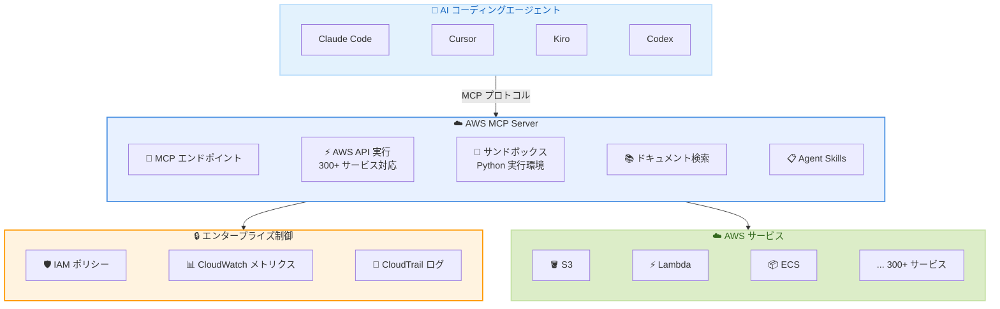

# AWS MCP Server - 一般提供開始

**リリース日**: 2026年5月6日
**サービス**: Agent Toolkit for AWS
**機能**: AWS MCP Server (Model Context Protocol)

📊 [このアップデートのインフォグラフィックを見る](https://takech9203.github.io/aws-news-summary/20260506-aws-mcp-server.html)

## 概要

AWS は、AWS MCP Server の一般提供 (GA) を発表した。AWS MCP Server は、AI コーディングエージェントに対して Model Context Protocol (MCP) を通じて AWS サービスへのセキュアかつ監査可能なアクセスを提供するマネージドサーバーである。Agent Toolkit for AWS の中核コンポーネントとして、コーディングエージェントが AWS 上でより効果的にアプリケーションを構築・デプロイ・管理できるよう支援する。

AWS MCP Server は re:Invent 2025 でのプレビュー開始以降、複数の機能が追加された。エージェントは単一のツールを通じて任意の AWS API を呼び出すことが可能となり、ファイルアップロードや長時間実行を必要とする操作にも対応している。また、サンドボックス化されたスクリプト実行環境では、ローカルファイルシステムやシェルツールへのアクセスなしに Python コードを AWS サービスに対して実行できる。さらに、Agent Skills が導入され、エージェントは必要に応じてキュレートされたガイダンスを検出・ロードすることで、コンテキストウィンドウの使用量を低く抑えつつ複雑なタスクを遂行できるようになった。

対象ユーザーは、Claude Code、Cursor、Kiro、Codex などの AI コーディングエージェントを使用して AWS 上でアプリケーションを構築する開発者およびエンタープライズチームである。

**アップデート前の課題**

- AI コーディングエージェントが AWS サービスを操作する際、エージェントのアクションと人間のアクションを区別できず、監査が困難だった
- エージェントの AWS に関する知識がトレーニングデータの時点で古く、最新のサービスや機能に対応できなかった
- エージェントが正しい API を呼び出すまでに試行錯誤を繰り返し、トークンと時間を浪費していた
- 組織全体でエージェントの操作に対するガードレールやポリシーを適用する手段がなかった

**アップデート後の改善**

- IAM ベースのアクセス制御と CloudTrail ログにより、エージェントのアクションを監査・制御可能になった
- リアルタイムのドキュメント検索により、最新の AWS サービス情報にアクセス可能になった
- キュレートされた Agent Skills により、エージェントが初回から正しい手順でタスクを完了できるようになった
- サンドボックス環境での Python スクリプト実行により、安全にマルチステップ操作を実行可能になった
- ドキュメント検索とスキル検出に AWS 認証情報が不要となり、導入障壁が低下した

## アーキテクチャ図



AI コーディングエージェントが MCP プロトコルを通じて AWS MCP Server に接続し、IAM ベースのアクセス制御下で AWS サービスを操作するアーキテクチャを示している。

## サービスアップデートの詳細

### 主要機能

1. **フル AWS API カバレッジ**
   - 300 以上の AWS サービス、15,000 以上の API アクションに単一ツールからアクセス可能
   - ローカルに AWS CLI をインストールする必要がない
   - ファイルアップロードや長時間実行を必要とする操作にも対応

2. **サンドボックス化されたスクリプト実行**
   - 隔離された環境で Python スクリプトを実行可能
   - マルチステップ操作、データ処理、複雑なワークフローのオーケストレーションに対応
   - ローカルファイルシステムやネットワークへのアクセスは不可

3. **リアルタイムドキュメントアクセス**
   - 最新の AWS ドキュメント、ユーザーガイド、API リファレンスを検索・取得可能
   - モデルのトレーニングカットオフ後にリリースされたサービスにも対応
   - AWS 認証情報なしで利用可能

4. **Agent Skills**
   - キュレートされたタスク実行手順をオンデマンドで検出・ロード
   - サービス選定ガイド、ステップバイステップ手順、トラブルシューティングガイドを含む
   - コンテキストウィンドウの使用量を最小限に抑制
   - エンドツーエンド評価により品質を保証

5. **エンタープライズ制御**
   - CloudWatch メトリクスによるエージェントアクティビティの監視
   - IAM コンテキストキー (`aws:CalledViaAWSMCP`) によるエージェント固有のポリシー適用
   - CloudTrail によるすべてのリクエストの監査ログ

## 技術仕様

### MCP サーバー構成

| 項目 | 詳細 |
|------|------|
| プロトコル | Model Context Protocol (MCP) |
| サーバータイプ | マネージドリモートサーバー |
| エンドポイント | `https://mcp.us-east-1.amazonaws.com` |
| プロキシ | `mcp-proxy-for-aws@latest` (uvx 経由) |
| 認証 | IAM 認証情報 (ドキュメント検索・スキル検出は認証不要) |
| ソースコード | オープンソース (GitHub) |

### IAM コンテキストキー

| キー | 用途 |
|------|------|
| `aws:CalledViaAWSMCP` | MCP 経由のリクエストを識別し、エージェント固有のポリシーを適用 |

### API 変更履歴

| 日付 | サービス | 変更内容 |
|------|----------|----------|
| 2026/05/04 | [Amazon Bedrock AgentCore Control](https://awsapichanges.com/archive/changes/f687cc-bedrock-agentcore-control.html) | 3 updated methods - MCP Sessions と MCP ターゲットからのレスポンスストリーミングのサポート追加 |

### MCP サーバー設定例

```json
{
  "mcpServers": {
    "aws": {
      "command": "uvx",
      "args": ["mcp-proxy-for-aws@latest", "https://mcp.us-east-1.amazonaws.com"]
    }
  }
}
```

## 設定方法

### 前提条件

1. uv がシステムにインストールされていること (MCP プロキシに必要)
2. AWS アカウントと IAM 認証情報がローカルマシンに設定されていること (API 実行・スクリプト実行に必要。ドキュメント検索・スキル検出には不要)
3. MCP 対応の AI コーディングエージェント (Claude Code、Cursor、Kiro、Codex など)

### 手順

#### ステップ 1: プラグインのインストール

**Claude Code の場合:**

```bash
/plugin marketplace add aws/agent-toolkit-for-aws
/plugin install aws-core@agent-toolkit-for-aws
/reload-plugins
```

Claude Code 内でプラグインマーケットプレイスから Agent Toolkit for AWS を追加し、aws-core プラグインをインストールする。

**Codex の場合:**

```bash
codex plugin marketplace add aws/agent-toolkit-for-aws
```

ターミナルでプラグインを追加後、Codex を起動して `/plugins` コマンドで aws-core プラグインをインストールする。

**その他の MCP 対応エージェントの場合:**

```json
{
  "mcpServers": {
    "aws": {
      "command": "uvx",
      "args": ["mcp-proxy-for-aws@latest", "https://mcp.us-east-1.amazonaws.com"]
    }
  }
}
```

エージェントの MCP 設定ファイルに上記の設定を追加する (例: Kiro CLI の場合は `~/.kiro/settings/mcp.json`)。

#### ステップ 2: 接続の確認

```
エージェントに「What AWS Regions are available?」と質問する
```

AWS リージョンのリストが返される場合、接続は正常に動作している。認証エラーが表示される場合は、IAM 認証情報の設定を確認する。

#### ステップ 3: 動作テスト

```
「Create an S3 bucket with versioning enabled and a lifecycle policy
that transitions objects to Glacier after 90 days.」
```

エージェントが関連する Agent Skills を自動的に検出し、AWS のベストプラクティスに従ってタスクを実行する。

## メリット

### ビジネス面

- **コスト削減**: エージェントの試行錯誤が減少し、トークン消費と開発時間を削減
- **セキュリティ強化**: IAM ポリシーによりエージェントの操作を制限し、組織のセキュリティポリシーを適用可能
- **監査・コンプライアンス**: CloudTrail と CloudWatch によるエージェントアクティビティの完全な可視性
- **導入障壁の低さ**: 追加料金なし、ドキュメント検索は認証不要で即座に利用開始可能

### 技術面

- **プロダクションレディな出力**: Well-Architected ベストプラクティスに基づくインフラ構成をエージェントが生成
- **最新情報へのアクセス**: モデルのトレーニングカットオフに依存しない最新のサービス情報を取得可能
- **安全なスクリプト実行**: サンドボックス環境により、ローカル環境への影響なしに複雑な操作を実行
- **オープンソース**: GitHub でソースコードが公開されており、透明性とカスタマイズ性を確保

## デメリット・制約事項

### 制限事項

- 利用可能リージョンが US East (N. Virginia) と Europe (Frankfurt) の 2 リージョンに限定
- サンドボックス実行環境ではローカルファイルシステムやネットワークにアクセスできない
- AWS API 実行にはローカルマシンに IAM 認証情報の設定が必要
- MCP プロキシの実行に uv のインストールが必要

### 考慮すべき点

- エージェントが実行する AWS API 呼び出しに対して通常の AWS 利用料金が発生する
- IAM ポリシーの適切な設計が必要 (エージェントに過剰な権限を付与しないよう注意)
- AWS Labs MCP サーバーからの移行計画を検討する必要がある (AWS Labs は引き続き動作するが、今後 Agent Toolkit for AWS に統合予定)

## ユースケース

### ユースケース 1: AWS 上でのアプリケーション構築・デプロイ

**シナリオ**: 開発チームが AI コーディングエージェントを使用して、サーバーレスアプリケーションを AWS 上にデプロイする。

**実装例**:
```
エージェントへの指示:
「API Gateway + Lambda + DynamoDB を使用したサーバーレス REST API を
構築してください。認証には Cognito を使用し、CloudWatch でモニタリング
を設定してください。」
```

**効果**: エージェントが Agent Skills を使用して適切なサービスを選択し、Well-Architected ベストプラクティスに基づいたインフラを自動構成する。

### ユースケース 2: カスタム AI エージェントへの AWS アクセス付与

**シナリオ**: Strands、LangChain、Bedrock AgentCore などのフレームワークで構築された自律エージェントに AWS サービスへのアクセスを提供する。

**実装例**:
```json
{
  "mcpServers": {
    "aws": {
      "command": "uvx",
      "args": ["mcp-proxy-for-aws@latest", "https://mcp.us-east-1.amazonaws.com"]
    }
  }
}
```

**効果**: MCP プロトコルを通じた標準化されたインターフェースにより、カスタムエージェントが安全に AWS API を呼び出し可能になる。

### ユースケース 3: 運用トラブルシューティング

**シナリオ**: デプロイの失敗、エラー率の急上昇、予期しないコスト増加の原因調査をエージェントに依頼する。

**実装例**:
```
エージェントへの指示:
「CloudFormation スタック my-app-stack のデプロイが失敗しています。
CloudWatch ログとスタックイベントを確認して、原因を診断し修正案を
提示してください。」
```

**効果**: エージェントが CloudWatch ログ・メトリクス、CloudFormation スタックステータスを確認し、トラブルシューティング Skills を活用して問題を診断する。

## 料金

AWS MCP Server 自体は追加料金なしで利用可能。エージェントがプロビジョニングまたは操作する AWS リソースに対して、標準の AWS 料金が適用される。

### 料金例

| 項目 | 料金 |
|------|------|
| AWS MCP Server 利用料 | 無料 |
| Agent Skills / ドキュメント検索 | 無料 |
| エージェントが実行する AWS API 呼び出し | 各サービスの標準料金 |

## 利用可能リージョン

現時点で以下の 2 リージョンで利用可能。

- US East (N. Virginia) - us-east-1
- Europe (Frankfurt) - eu-west-1

## 関連サービス・機能

- **Amazon Bedrock AgentCore**: AI エージェントの構築・デプロイ基盤。MCP Server と連携してエージェントに AWS アクセスを提供
- **AWS IAM**: MCP Server へのアクセス制御とエージェント固有のポリシー適用に使用
- **Amazon CloudWatch**: エージェントアクティビティのメトリクス監視に使用
- **AWS CloudTrail**: エージェントによるすべての API 呼び出しの監査ログを記録
- **Model Context Protocol (MCP)**: Linux Foundation 傘下の Agentic AI Foundation が管理するオープンスタンダード。AWS は設立メンバー

## 参考リンク

- 📊 [インフォグラフィック](https://takech9203.github.io/aws-news-summary/20260506-aws-mcp-server.html)
- [公式発表 (What's New)](https://aws.amazon.com/about-aws/whats-new/2026/05/aws-mcp-server/)
- [Agent Toolkit for AWS 製品ページ](https://aws.amazon.com/products/developer-tools/agent-toolkit-for-aws/)
- [クイックスタートガイド](https://docs.aws.amazon.com/agent-toolkit/latest/userguide/quick-start.html)

## まとめ

AWS MCP Server の GA リリースにより、AI コーディングエージェントが AWS サービスをセキュアかつ効率的に操作するための標準化されたインフラが整った。IAM による細粒度のアクセス制御、CloudWatch/CloudTrail による監査、Agent Skills による品質保証という 3 つの柱により、エンタープライズ環境でも安心してエージェントに AWS 操作を委任できる。AWS 上でコーディングエージェントを活用している開発チームは、まず AWS Labs MCP サーバーからの移行を検討し、Agent Toolkit for AWS のプラグインインストールから始めることを推奨する。
