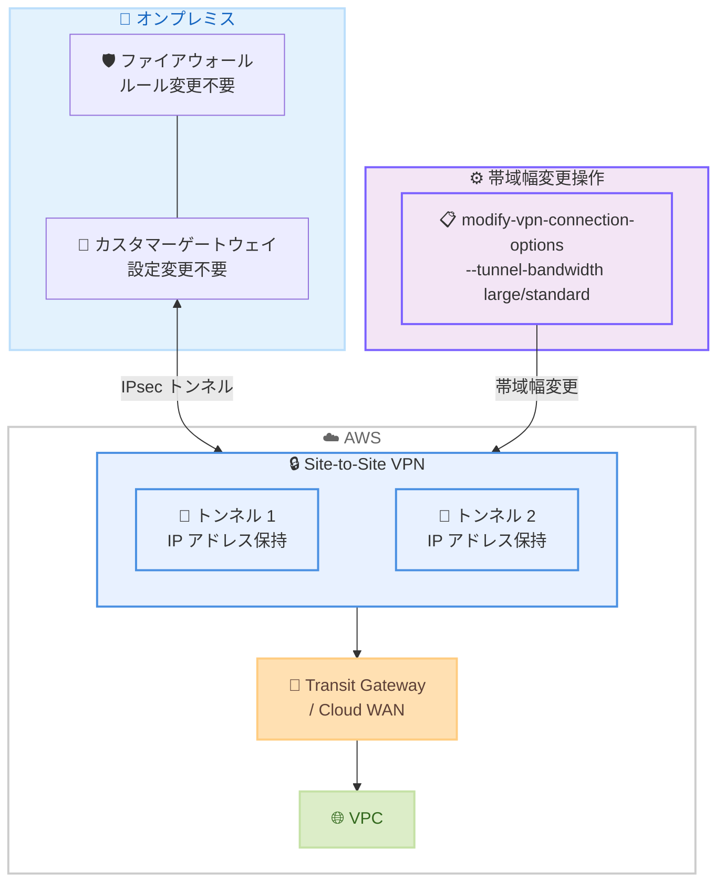

# AWS Site-to-Site VPN - 既存 VPN 接続のトンネル帯域幅変更

**リリース日**: 2026年5月6日
**サービス**: AWS Site-to-Site VPN
**機能**: 既存 VPN 接続でのトンネル帯域幅変更 (Modify Tunnel Bandwidth)

:bar_chart: [このアップデートのインフォグラフィックを見る](https://takech9203.github.io/aws-news-summary/20260506-aws-site-to-site-vpn-modify-bandwidth.html)

## 概要

AWS Site-to-Site VPN で、既存の VPN 接続のトンネル帯域幅を standard (最大 1.25 Gbps) と large (最大 5 Gbps) の間で変更できるようになった。これにより、組織のネットワーク要件の変化に応じて、接続を削除・再作成することなく帯域幅を柔軟にスケールできる。

このアップデートは、ハイブリッドクラウド環境でネットワーク帯域幅の要件が変動する企業にとって重要な運用改善である。帯域幅の変更時にトンネルの IP アドレス、CIDR ブロック、事前共有鍵、およびすべての設定が保持されるため、オンプレミス VPN デバイスの再設定が不要になる。

**アップデート前の課題**

- トンネル帯域幅を変更するには、VPN 接続を削除して再作成する必要があった
- 再作成時に新しいトンネル IP アドレスが生成されるため、オンプレミス VPN デバイスの設定更新が必要だった
- ファイアウォールルールの変更が必要となり、セキュリティチームとの調整コストが発生していた
- 帯域幅変更に伴うダウンタイムとオペレーションの複雑さにより、迅速なスケーリングが困難だった

**アップデート後の改善**

- 既存の VPN 接続上で `modify-vpn-connection-options` コマンドを使用して帯域幅を直接変更可能になった
- トンネル IP アドレス、CIDR ブロック、事前共有鍵、およびすべての設定が保持される
- オンプレミス VPN デバイスやファイアウォールルールの変更が不要になった
- 運用オーバーヘッドの削減により、ビジネス要件に応じた迅速な帯域幅スケーリングが可能になった

## アーキテクチャ図



管理者が `modify-vpn-connection-options` コマンドで帯域幅を変更すると、既存のトンネル IP アドレスや設定を保持したまま帯域幅がアップグレードまたはダウングレードされる。オンプレミス側のカスタマーゲートウェイやファイアウォールの設定変更は不要。

## サービスアップデートの詳細

### 主要機能

1. **インプレース帯域幅変更**
   - 既存の VPN 接続を削除せずに帯域幅を standard から large、または large から standard に変更可能
   - 両方のトンネルが同じ帯域幅設定でなければならない (片方だけの変更は不可)
   - Transit Gateway または Cloud WAN にアタッチされた VPN 接続でのみ利用可能

2. **設定の完全保持**
   - トンネル IP アドレスが変更されない
   - CIDR ブロック (トンネル内部 IP) が保持される
   - 事前共有鍵 (Pre-Shared Key) が維持される
   - ルーティング設定、IKE/IPsec パラメータなどすべての設定が継続

3. **帯域幅オプション**
   - standard: トンネルあたり最大 1.25 Gbps (デフォルト)
   - large: トンネルあたり最大 5 Gbps (Large Bandwidth Tunnel)
   - 2 本のトンネルで合計最大 10 Gbps の帯域幅を実現

## 技術仕様

### 帯域幅オプション比較

| 項目 | standard | large |
|------|----------|-------|
| トンネルあたり最大帯域幅 | 1.25 Gbps | 5 Gbps |
| 接続あたり最大帯域幅 | 2.5 Gbps | 10 Gbps |
| 対応アタッチメント | Transit Gateway / Cloud WAN / Virtual Private Gateway | Transit Gateway / Cloud WAN のみ |
| Accelerated VPN | サポート | 非サポート |
| MTU | 1,500 bytes | 1,500 bytes |
| 接続料金 | 標準料金 | $0.60/hr |

### 制約事項

| 項目 | 制約 |
|------|------|
| アタッチメント | Transit Gateway または Cloud WAN 必須 |
| トンネル設定 | 両トンネルとも同一帯域幅 |
| カスタマーゲートウェイ | 固定 IP アドレスのみ (IP なし CGW は非対応) |
| Accelerated VPN | Large Bandwidth Tunnel では非対応 |
| NAT-T ポート | トンネル確立中の変更非対応 |
| フラグメンテーション | 断片化が必要なパケットはパフォーマンス低下の可能性あり |

### 設定パラメータ

```bash
# 帯域幅変更コマンド
aws ec2 modify-vpn-connection-options \
    --vpn-connection-id vpn-1234567890abcdef0 \
    --tunnel-bandwidth large
```

## 設定方法

### 前提条件

1. 既存の Site-to-Site VPN 接続が Transit Gateway または Cloud WAN にアタッチされていること
2. カスタマーゲートウェイに固定 IP アドレスが設定されていること
3. IAM ユーザーまたはロールに `ec2:ModifyVpnConnectionOptions` 権限があること

### 手順

#### ステップ 1: 現在の VPN 接続設定を確認

```bash
aws ec2 describe-vpn-connections \
    --vpn-connection-ids vpn-1234567890abcdef0 \
    --query 'VpnConnections[0].Options.TunnelOptions[].TunnelBandwidth'
```

現在のトンネル帯域幅設定 (standard または large) を確認する。

#### ステップ 2: 帯域幅を変更

```bash
aws ec2 modify-vpn-connection-options \
    --vpn-connection-id vpn-1234567890abcdef0 \
    --tunnel-bandwidth large
```

`--tunnel-bandwidth` パラメータに `standard` または `large` を指定して帯域幅を変更する。両トンネルの帯域幅が同時に変更される。

#### ステップ 3: 変更結果の確認

```bash
aws ec2 describe-vpn-connections \
    --vpn-connection-ids vpn-1234567890abcdef0 \
    --query 'VpnConnections[0].{State:State,TunnelBandwidth:Options.TunnelOptions[0].TunnelBandwidth,Tunnel1IP:VgwTelemetry[0].OutsideIpAddress,Tunnel2IP:VgwTelemetry[1].OutsideIpAddress}'
```

帯域幅が正常に変更され、トンネル IP アドレスが維持されていることを確認する。

## メリット

### ビジネス面

- **運用コスト削減**: VPN 接続の再作成に伴う計画的メンテナンスウィンドウやチーム間調整が不要になり、運用コストを大幅に削減
- **ダウンタイム最小化**: 接続の再作成が不要なため、帯域幅変更に伴うサービス中断リスクが低減
- **俊敏なスケーリング**: ビジネスイベントや季節変動に応じて、迅速に帯域幅を増減可能

### 技術面

- **設定の一貫性**: IP アドレスや暗号化パラメータが保持されるため、ネットワーク構成の整合性が維持される
- **ECMP 代替**: Large Bandwidth Tunnel により、複雑な ECMP 設定なしで高帯域幅を実現可能
- **オペレーション簡素化**: 単一の API コールで帯域幅変更が完了し、オンプレミス側の変更が不要

## デメリット・制約事項

### 制限事項

- Virtual Private Gateway にアタッチされた VPN 接続では利用不可 (Transit Gateway または Cloud WAN が必須)
- 両トンネルが同一帯域幅である必要があり、片方だけのアップグレードはできない
- IP アドレスなしのカスタマーゲートウェイでは Large Bandwidth Tunnel を使用できない
- Accelerated VPN との併用は不可

### 考慮すべき点

- Large Bandwidth Tunnel は standard に比べて接続料金が高い ($0.60/hr vs 標準料金)
- 帯域幅変更中にトンネルの短時間の中断が発生する可能性があるため、冗長構成の確認を推奨
- MTU は 1,500 bytes のままであり、フラグメンテーションが必要なパケットではパフォーマンスが低下する可能性がある

## ユースケース

### ユースケース 1: 季節変動への対応

**シナリオ**: EC サイトのブラックフライデーやセール期間中に、オンプレミスのデータセンターと AWS 間のデータ転送量が大幅に増加する。

**実装例**:
```bash
# セール開始前に帯域幅を拡大
aws ec2 modify-vpn-connection-options \
    --vpn-connection-id vpn-1234567890abcdef0 \
    --tunnel-bandwidth large

# セール終了後に帯域幅を縮小してコスト最適化
aws ec2 modify-vpn-connection-options \
    --vpn-connection-id vpn-1234567890abcdef0 \
    --tunnel-bandwidth standard
```

**効果**: オンプレミス側の設定変更なしで、ピーク時に最大 10 Gbps の帯域幅を確保し、通常時はコストを抑制できる。

### ユースケース 2: Direct Connect バックアップの強化

**シナリオ**: 10 Gbps の Direct Connect 接続をプライマリとして使用し、Site-to-Site VPN をバックアップとして構成している環境で、フェイルオーバー時の帯域幅を確保したい。

**実装例**:
```bash
# Direct Connect 障害検知時に VPN 帯域幅をアップグレード
aws ec2 modify-vpn-connection-options \
    --vpn-connection-id vpn-backup-connection \
    --tunnel-bandwidth large

# Direct Connect 復旧後にコスト最適化のため standard に戻す
aws ec2 modify-vpn-connection-options \
    --vpn-connection-id vpn-backup-connection \
    --tunnel-bandwidth standard
```

**効果**: Direct Connect 障害時にも高帯域幅のバックアップ接続を動的に確保し、ビジネス継続性を維持できる。

### ユースケース 3: 段階的なクラウド移行

**シナリオ**: 大規模なデータ移行プロジェクトで、移行フェーズに応じてオンプレミスから AWS への転送帯域幅を段階的に増やしたい。

**実装例**:
```bash
# 移行開始時: 帯域幅をアップグレード
aws ec2 modify-vpn-connection-options \
    --vpn-connection-id vpn-migration \
    --tunnel-bandwidth large

# 現在の帯域幅設定を確認
aws ec2 describe-vpn-connections \
    --vpn-connection-ids vpn-migration \
    --query 'VpnConnections[0].Options.TunnelOptions[].TunnelBandwidth'
```

**効果**: 移行期間中のみ高帯域幅を確保し、移行完了後は standard に戻すことで、コストを最適化しながら移行スケジュールを短縮できる。

## 料金

Site-to-Site VPN の帯域幅に応じた料金体系は以下の通り。

### 料金例

| 帯域幅設定 | 接続料金 (時間あたり) | 月額概算 (730 時間) |
|-----------|----------------------|-------------------|
| standard (最大 1.25 Gbps) | 標準 VPN 接続料金 | リージョンにより異なる |
| large (最大 5 Gbps) | $0.60/hr | 約 $438/月 |

- データ転送料金は別途発生 (EC2 オンデマンド料金ページの Data Transfer Out 料金に準拠)
- 帯域幅変更操作自体に追加料金は発生しない

## 利用可能リージョン

以下の AWS リージョンで利用可能。

- **米国**: US East (N. Virginia, Ohio), US West (N. California)
- **ガバメント**: AWS GovCloud (US-West)
- **ヨーロッパ**: Europe (Frankfurt, London, Paris, Spain, Stockholm)
- **アジアパシフィック**: Asia Pacific (Hong Kong, Hyderabad, Jakarta, Malaysia, Mumbai, New Zealand, Osaka, Seoul, Sydney, Taipei, Thailand, Tokyo)
- **アフリカ**: Africa (Cape Town)
- **中南米**: Mexico (Central), South America (Sao Paulo)

**東京リージョン (ap-northeast-1) で利用可能。**

## 関連サービス・機能

- **AWS Transit Gateway**: Large Bandwidth Tunnel を利用するために必要なルーティングハブ。複数 VPC と VPN 接続を集約管理
- **AWS Cloud WAN**: グローバルネットワークを構築・管理するサービス。Large Bandwidth Tunnel の接続先として利用可能
- **AWS Direct Connect**: 専用線接続サービス。Site-to-Site VPN と組み合わせて冗長性を確保するアーキテクチャで使用
- **VPN CloudWatch メトリクス**: トンネルの帯域幅使用率を監視し、スケーリング判断に活用

## 参考リンク

- :bar_chart: [インフォグラフィック](https://takech9203.github.io/aws-news-summary/20260506-aws-site-to-site-vpn-modify-bandwidth.html)
- [公式発表 (What's New)](https://aws.amazon.com/about-aws/whats-new/2026/05/aws-site-to-site-vpn-modify-bandwidth/)
- [AWS Site-to-Site VPN ドキュメント - トンネルオプション](https://docs.aws.amazon.com/vpn/latest/s2svpn/VPNTunnels.html)
- [AWS CLI リファレンス - modify-vpn-connection-options](https://docs.aws.amazon.com/cli/latest/reference/ec2/modify-vpn-connection-options.html)
- [AWS VPN 料金ページ](https://aws.amazon.com/vpn/pricing/)

## まとめ

AWS Site-to-Site VPN の既存接続に対するトンネル帯域幅のインプレース変更は、ハイブリッドネットワーク運用を大幅に簡素化するアップデートである。従来は接続の再作成が必要だった帯域幅変更が、単一の API コールで実行可能になり、IP アドレスや設定が完全に保持される。東京リージョンを含む広範なリージョンで利用可能であり、Transit Gateway または Cloud WAN を使用している環境では、速やかに帯域幅のスケーリング運用を見直すことを推奨する。
