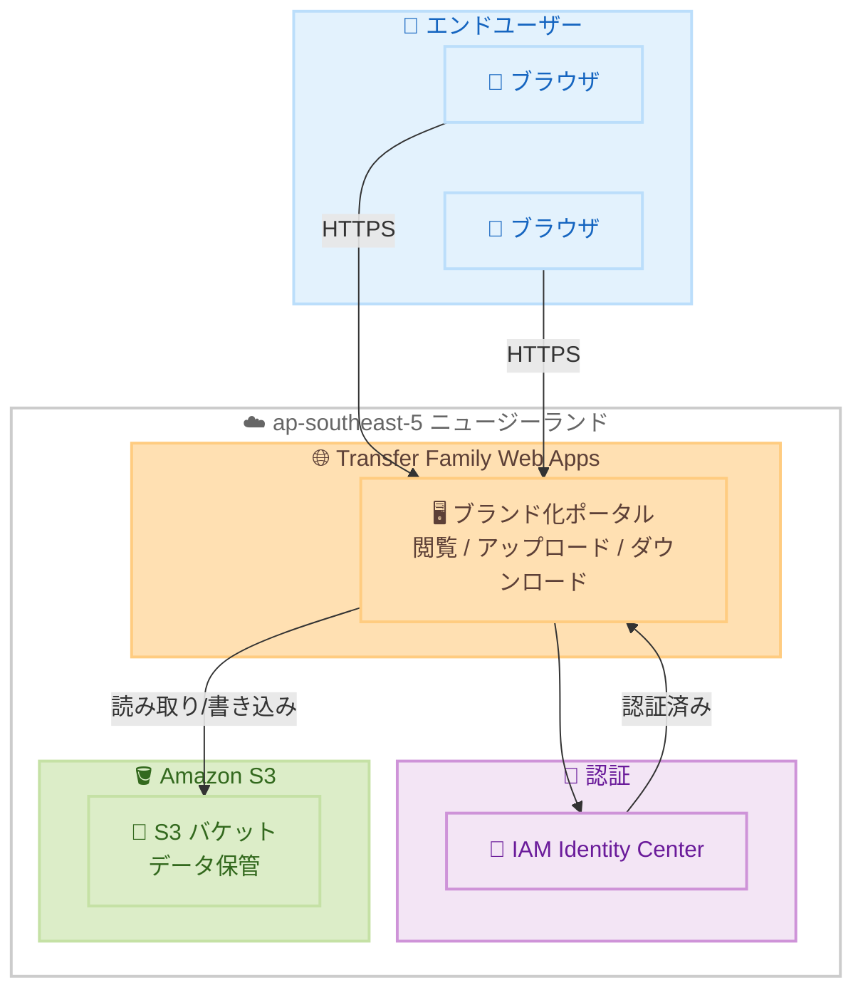

# AWS Transfer Family Web Apps - アジアパシフィック (ニュージーランド) リージョンで利用可能に

**リリース日**: 2026年5月6日
**サービス**: AWS Transfer Family
**機能**: Web Apps のアジアパシフィック (ニュージーランド) リージョンでの提供開始

:bar_chart: [このアップデートのインフォグラフィックを見る](https://takech9203.github.io/aws-news-summary/20260506-aws-transfer-family-asia-pacific.html)

## 概要

AWS Transfer Family Web Apps が、アジアパシフィック (ニュージーランド) リージョン (ap-southeast-5) で利用可能になりました。これにより、ニュージーランドの顧客は、ローカルリージョンでフルマネージドのブランド化可能な Web ポータルを通じて、Amazon S3 のデータをブラウザ経由で閲覧、アップロード、ダウンロードできるようになります。

AWS Transfer Family Web Apps は、エンドユーザーがブラウザから Amazon S3 のデータに安全にアクセスするためのシンプルなインターフェースを提供します。組織は、ワークフォース向けにブランド化されたセキュアなポータルを構築し、技術的な知識がないユーザーでも簡単に S3 のデータを操作できる環境を提供できます。

**アップデート前の課題**

- ニュージーランドの顧客は Transfer Family Web Apps を利用するために他のリージョンを使用する必要があった
- リージョン外の Web Apps へのアクセスはレイテンシーが高く、ユーザーエクスペリエンスが低下していた
- データソブリンティ要件により、ニュージーランド国内にデータを保持する必要がある顧客にとって選択肢が限られていた

**アップデート後の改善**

- ニュージーランドリージョンで Transfer Family Web Apps を直接デプロイ可能になった
- ローカルリージョンの利用により低レイテンシーでのアクセスが実現
- データソブリンティ要件を満たしながら、セキュアな Web ベースのファイル転送ポータルを構築可能に

## アーキテクチャ図



この図は、ニュージーランドリージョンにデプロイされた Transfer Family Web Apps のアーキテクチャを示しています。エンドユーザーはブラウザから Web ポータルにアクセスし、IAM Identity Center で認証された後、S3 バケット内のデータを操作できます。

## サービスアップデートの詳細

### 主要機能

1. **フルマネージド Web ポータル**
   - インフラストラクチャの管理が不要
   - ブランド化可能なカスタム UI
   - ブラウザベースでのファイル操作 (閲覧、アップロード、ダウンロード)

2. **セキュアなアクセス制御**
   - AWS IAM Identity Center との統合
   - 既存のアイデンティティプロバイダー (Active Directory、Okta 等) を活用可能
   - Amazon S3 Access Grants による細かいアクセス権限管理

3. **ニュージーランドリージョンでのデータ保持**
   - データソブリンティ要件への対応
   - 低レイテンシーでのアクセス
   - リージョン間データ転送コストの削減

## 技術仕様

### Transfer Family Web Apps の構成要素

| 項目 | 詳細 |
|------|------|
| リージョン | ap-southeast-5 (アジアパシフィック - ニュージーランド) |
| エンドポイントタイプ | パブリック / VPC |
| 認証 | AWS IAM Identity Center |
| ストレージバックエンド | Amazon S3 |
| プロトコル | HTTPS (ブラウザベース) |
| IP アドレスタイプ | IPv4 / デュアルスタック (IPv4 + IPv6) |

### API 変更履歴

| 日付 | サービス | 変更内容 |
|------|----------|----------|
| 2026/04/24 | [AWS Transfer Family](https://awsapichanges.com/archive/changes/435c9a-transfer.html) | 2 updated api methods - VPC エンドポイントの IP アドレスタイプ設定をサポート |

### VPC エンドポイントの設定例

```json
{
  "EndpointDetails": {
    "Vpc": {
      "SubnetIds": ["subnet-xxxxxxxx"],
      "VpcId": "vpc-xxxxxxxx",
      "SecurityGroupIds": ["sg-xxxxxxxx"],
      "IpAddressType": "IPV4"
    }
  }
}
```

## 設定方法

### 前提条件

1. AWS アカウントを持っていること
2. AWS IAM Identity Center が有効化されていること
3. Amazon S3 バケットがニュージーランドリージョンに作成されていること
4. 適切な IAM 権限を持っていること

### 手順

#### ステップ 1: IAM Identity Center の設定

```bash
# IAM Identity Center のインスタンスを確認
aws sso-admin list-instances --region ap-southeast-5
```

IAM Identity Center が有効化されていることを確認します。未設定の場合は、AWS コンソールから有効化してください。

#### ステップ 2: Web App の作成

```bash
# Transfer Family Web App を作成
aws transfer create-web-app \
  --identity-provider-details '{"IdentityCenterConfig": {"InstanceArn": "arn:aws:sso:::instance/ssoins-xxxxxxxxx", "Role": "arn:aws:iam::123456789012:role/TransferWebAppRole"}}' \
  --access-endpoint "https://my-portal.transfer.ap-southeast-5.amazonaws.com" \
  --region ap-southeast-5
```

このコマンドは、IAM Identity Center と統合された Transfer Family Web App を作成します。

#### ステップ 3: S3 Access Grants の設定

```bash
# S3 Access Grants インスタンスの作成
aws s3control create-access-grants-instance \
  --account-id 123456789012 \
  --identity-center-arn "arn:aws:sso:::instance/ssoins-xxxxxxxxx" \
  --region ap-southeast-5
```

S3 Access Grants を設定し、ユーザーごとの細かいアクセス制御を有効にします。

## メリット

### ビジネス面

- **データソブリンティ対応**: ニュージーランド国内のデータ保持要件を満たすことが可能
- **ユーザーエクスペリエンス向上**: 低レイテンシーにより、ファイルの閲覧やアップロードが高速化
- **導入の簡素化**: 技術的な知識がないユーザーでも Web ブラウザからデータにアクセス可能

### 技術面

- **低レイテンシー**: ローカルリージョンの利用により、ニュージーランドからのアクセスが高速化
- **フルマネージド**: インフラストラクチャの管理が不要で、運用負荷を削減
- **セキュリティ**: IAM Identity Center と S3 Access Grants による多層的なアクセス制御

## デメリット・制約事項

### 制限事項

- IAM Identity Center が事前に有効化されている必要がある
- ストレージバックエンドは Amazon S3 のみ (EFS は Web Apps では非サポート)
- Web Apps の料金は起動時間に基づくため、常時稼働の場合はコストに注意が必要

### 考慮すべき点

- ニュージーランドリージョンは比較的新しいリージョンのため、他のリージョンと比較して利用可能なサービスに差がある場合がある
- 既存の Web App を他のリージョンからニュージーランドリージョンに移行する場合は、新規作成が必要

## ユースケース

### ユースケース 1: ニュージーランド国内のデータ共有ポータル

**シナリオ**: ニュージーランドの企業が、社内のワークフォースに対してプロジェクトドキュメントやレポートを安全に共有するための Web ポータルを提供したい。

**実装例**:
```bash
# ブランド化された Web App を作成
aws transfer create-web-app \
  --identity-provider-details '{"IdentityCenterConfig": {"InstanceArn": "arn:aws:sso:::instance/ssoins-xxxxxxxxx", "Role": "arn:aws:iam::123456789012:role/TransferWebAppRole"}}' \
  --region ap-southeast-5
```

**効果**: 従業員がブラウザから安全にドキュメントにアクセスでき、データはニュージーランド国内に保持されます。

### ユースケース 2: 規制対応のためのローカルデータ管理

**シナリオ**: ニュージーランドの金融機関が、規制要件に基づきデータをニュージーランド国内に保持しながら、パートナー企業とファイルを交換したい。

**実装例**:
```bash
# VPC エンドポイントを使用してプライベートアクセスを設定
aws transfer create-web-app \
  --identity-provider-details '{"IdentityCenterConfig": {"InstanceArn": "arn:aws:sso:::instance/ssoins-xxxxxxxxx", "Role": "arn:aws:iam::123456789012:role/TransferWebAppRole"}}' \
  --endpoint-details '{"Vpc": {"SubnetIds": ["subnet-xxx"], "VpcId": "vpc-xxx", "SecurityGroupIds": ["sg-xxx"], "IpAddressType": "IPV4"}}' \
  --region ap-southeast-5
```

**効果**: VPC エンドポイントにより、プライベートネットワーク経由でのセキュアなファイル交換が実現し、データソブリンティ要件を満たします。

### ユースケース 3: メディア・コンテンツの配布

**シナリオ**: ニュージーランドのメディア企業が、チーム間で大容量の動画ファイルや画像アセットを共有する必要がある。

**実装例**:
```bash
# Web App を作成し、S3 Access Grants でチームごとのアクセスを制御
aws transfer create-web-app \
  --identity-provider-details '{"IdentityCenterConfig": {"InstanceArn": "arn:aws:sso:::instance/ssoins-xxxxxxxxx", "Role": "arn:aws:iam::123456789012:role/TransferWebAppRole"}}' \
  --region ap-southeast-5
```

**効果**: ローカルリージョンの利用により、大容量ファイルのアップロード/ダウンロードが高速化され、制作チームの生産性が向上します。

## 料金

Transfer Family Web Apps の料金は、Web App の起動時間に基づきます。

### 料金例

| 項目 | 料金 (概算) |
|------|------------|
| Web App 起動時間 | $0.30/時間 |
| データ転送 (S3 へのアップロード) | S3 の標準料金に準拠 |
| データ転送 (S3 からのダウンロード) | S3 の標準料金に準拠 |

*注: 正確な料金は [AWS Transfer Family 料金ページ](https://aws.amazon.com/aws-transfer-family/pricing/) を参照してください。リージョンにより料金が異なる場合があります。

## 利用可能リージョン

Transfer Family Web Apps は、アジアパシフィック (ニュージーランド) リージョンを含む複数のリージョンで利用可能です。

主要な利用可能リージョン:
- 米国東部 (バージニア北部)
- 米国西部 (オレゴン)
- 欧州 (アイルランド、フランクフルト、ロンドン)
- アジアパシフィック (東京、シドニー、シンガポール、ニュージーランド)

最新のリージョン情報は [AWS リージョンテーブル](https://aws.amazon.com/about-aws/global-infrastructure/regional-product-services/) を参照してください。

## 関連サービス・機能

- **AWS IAM Identity Center**: フェデレーション認証とユーザー管理を提供
- **Amazon S3 Access Grants**: ユーザーおよびグループ単位の細かいアクセス権限制御
- **Amazon S3**: Web Apps のバックエンドストレージ
- **AWS Transfer Family**: SFTP、FTPS、FTP プロトコルでのファイル転送もサポート

## 参考リンク

- :bar_chart: [インフォグラフィック](https://takech9203.github.io/aws-news-summary/20260506-aws-transfer-family-asia-pacific.html)
- [公式発表 (What's New)](https://aws.amazon.com/about-aws/whats-new/2026/05/aws-transfer-family-asia-pacific/)
- [Transfer Family Web Apps ユーザーガイド](https://docs.aws.amazon.com/transfer/latest/userguide/web-apps.html)
- [AWS Transfer Family 料金ページ](https://aws.amazon.com/aws-transfer-family/pricing/)
- [AWS Transfer Family 製品ページ](https://aws.amazon.com/aws-transfer-family/)

## まとめ

AWS Transfer Family Web Apps のアジアパシフィック (ニュージーランド) リージョンでの提供開始により、ニュージーランドの顧客はローカルリージョンでフルマネージドの Web ベースファイル転送ポータルを構築できるようになりました。データソブリンティ要件を満たしながら、低レイテンシーで安全なデータアクセスを提供できます。IAM Identity Center と S3 Access Grants を活用することで、既存のアイデンティティプロバイダーと連携した細かいアクセス制御も実現可能です。
