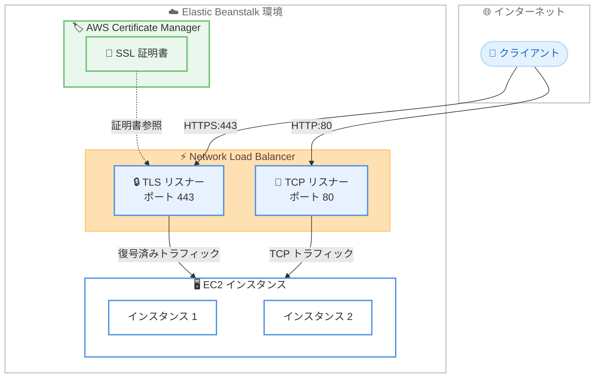

# AWS Elastic Beanstalk - Network Load Balancer 向け TLS リスナーサポート

**リリース日**: 2026 年 5 月 6 日
**サービス**: AWS Elastic Beanstalk
**機能**: Network Load Balancer (NLB) の TLS リスナー設定

[このアップデートのインフォグラフィックを見る](https://takech9203.github.io/aws-news-summary/20260506-elastic-beanstalk-tls-support.html)

## 概要

AWS Elastic Beanstalk が Network Load Balancer (NLB) 環境で TLS リスナーをサポートするようになった。これにより、Elastic Beanstalk のコンソールまたは CLI から直接 TLS リスナーの設定が可能になり、NLB レベルでの TLS 終端を構成できる。SSL 証明書とセキュリティポリシーを指定して、ロードバランサーで暗号化接続を処理し、復号済みトラフィックをインスタンスに転送する構成が実現する。

従来、Elastic Beanstalk の NLB 環境ではマネージド設定オプションとして TLS リスナーがサポートされていなかったため、NLB レベルでの TLS 終端を実現するには Elastic Beanstalk の管理外で個別に設定を行う必要があった。今回のアップデートにより、Elastic Beanstalk の統合された管理体験の中で TLS 設定を完結できるようになった。

**アップデート前の課題**

- Elastic Beanstalk の NLB 環境ではマネージド設定として TLS リスナーを構成できなかった
- NLB で TLS 終端を行うには、Elastic Beanstalk 外で手動設定が必要だった
- TLS 設定を Elastic Beanstalk の環境設定と一元管理できず、運用の複雑さが増していた

**アップデート後の改善**

- Elastic Beanstalk コンソールまたは CLI から NLB の TLS リスナーを直接設定可能になった
- SSL 証明書とセキュリティポリシーを Elastic Beanstalk の設定として管理できるようになった
- NLB レベルでの TLS 終端がマネージド設定として統合され、運用が簡素化された

## アーキテクチャ図



Elastic Beanstalk 環境内の NLB に TLS リスナーを設定することで、クライアントからの HTTPS トラフィックを NLB で復号し、バックエンドインスタンスには平文で転送するアーキテクチャを実現する。

## サービスアップデートの詳細

### 主要機能

1. **TLS リスナーの設定**
   - NLB 環境で TLS リスナーを追加可能
   - ポート番号とプロトコル (TLS) を指定して設定
   - 複数のリスナーを同時に構成可能

2. **SSL 証明書の指定**
   - AWS Certificate Manager (ACM) で管理された証明書を使用可能
   - TLS リスナーに証明書を関連付けて TLS 終端を実現
   - 証明書の更新も ACM 経由で管理

3. **セキュリティポリシーの設定**
   - TLS プロトコルバージョンと暗号スイートを制御するセキュリティポリシーを選択可能
   - AWS が提供する事前定義されたポリシーから選択
   - セキュリティ要件に応じた適切なポリシーの適用が可能

## 技術仕様

### 設定パラメータ

| 項目 | 詳細 |
|------|------|
| 対象ロードバランサー | Network Load Balancer (NLB) |
| プロトコル | TLS |
| 証明書ソース | AWS Certificate Manager (ACM) |
| 設定方法 | Elastic Beanstalk コンソール、CLI |
| TLS 終端位置 | NLB レイヤー |

### NLB リスナー設定の比較

| リスナータイプ | プロトコル | TLS 終端 | ユースケース |
|---------------|-----------|----------|-------------|
| TCP リスナー | TCP | なし | 平文通信、パススルー |
| TLS リスナー | TLS | NLB で終端 | HTTPS 通信の復号とオフロード |
| UDP リスナー | UDP | なし | UDP ベースのアプリケーション |

## 設定方法

### 前提条件

1. Elastic Beanstalk 環境が Network Load Balancer を使用するよう設定されていること
2. AWS Certificate Manager (ACM) で有効な SSL/TLS 証明書が発行済みであること
3. 適切な IAM 権限が付与されていること

### 手順

#### ステップ 1: ACM で SSL 証明書を準備

```bash
# ACM で証明書をリクエスト
aws acm request-certificate \
  --domain-name "example.com" \
  --validation-method DNS \
  --subject-alternative-names "*.example.com"
```

ACM で使用するドメインの SSL/TLS 証明書を発行する。DNS 検証を使用してドメインの所有権を確認する。

#### ステップ 2: Elastic Beanstalk 環境設定で TLS リスナーを構成

```yaml
# .ebextensions/nlb-tls.config
option_settings:
  aws:elbv2:listener:443:
    ListenerEnabled: true
    Protocol: TLS
    SSLCertificateArns: arn:aws:acm:region:account-id:certificate/certificate-id
    SSLPolicy: ELBSecurityPolicy-TLS13-1-2-2021-06
```

`.ebextensions` 設定ファイルでリスナーのプロトコルを TLS に設定し、ACM 証明書の ARN とセキュリティポリシーを指定する。

#### ステップ 3: 環境をデプロイ

```bash
# Elastic Beanstalk CLI でデプロイ
eb deploy
```

設定変更を含む環境のデプロイを実行する。NLB に TLS リスナーが追加される。

#### ステップ 4: コンソールから設定する場合

Elastic Beanstalk コンソールで環境を選択し、「設定」から「ロードバランサー」セクションを開く。リスナーの追加で「TLS」プロトコルを選択し、証明書とセキュリティポリシーを指定する。

## メリット

### ビジネス面

- **運用コスト削減**: NLB の TLS 設定を Elastic Beanstalk のマネージド設定として管理できるため、個別設定の手間が省ける
- **コンプライアンス対応の簡素化**: TLS 暗号化をロードバランサーレベルで統一的に適用でき、セキュリティ基準への準拠が容易になる
- **デプロイの効率化**: 環境設定と TLS 設定を同時にデプロイでき、設定のドリフトを防止できる

### 技術面

- **TLS オフロード**: TLS 終端を NLB で処理することで、バックエンドインスタンスの CPU 負荷を軽減
- **一元管理**: Elastic Beanstalk の設定ファイルで TLS 設定をインフラストラクチャ as コードとして管理可能
- **セキュリティポリシーの柔軟性**: AWS が提供する最新のセキュリティポリシーを選択でき、暗号化の強度を制御可能

## デメリット・制約事項

### 制限事項

- Network Load Balancer を使用する環境のみが対象 (Application Load Balancer とは設定方法が異なる)
- TLS 終端は NLB レベルのみで、エンドツーエンド暗号化が必要な場合はバックエンドへの再暗号化を別途構成する必要がある
- セキュリティポリシーは AWS が事前定義したものから選択する形式

### 考慮すべき点

- ACM 証明書は NLB と同じリージョンに存在する必要がある
- TLS リスナーの追加により NLB の処理オーバーヘッドが若干増加する可能性がある
- 既存の TCP パススルー構成から TLS 終端に切り替える場合、バックエンドアプリケーションの構成変更が必要になる場合がある

## ユースケース

### ユースケース 1: Web アプリケーションの HTTPS 対応

**シナリオ**: Elastic Beanstalk で運用している Web アプリケーションに HTTPS を導入したいが、各インスタンスでの証明書管理を避けたい。

**実装例**:
```yaml
# .ebextensions/nlb-tls.config
option_settings:
  aws:elbv2:listener:443:
    ListenerEnabled: true
    Protocol: TLS
    SSLCertificateArns: arn:aws:acm:ap-northeast-1:123456789012:certificate/abc-123
    SSLPolicy: ELBSecurityPolicy-TLS13-1-2-2021-06
  aws:elbv2:listener:80:
    ListenerEnabled: true
    Protocol: TCP
```

**効果**: NLB で TLS を終端し、バックエンドインスタンスは平文通信のみ処理するため、証明書管理の複雑さを排除しつつ HTTPS を実現。

### ユースケース 2: マイクロサービス間の安全な通信

**シナリオ**: TCP ベースの高パフォーマンスが必要なマイクロサービスで、サービス間通信を暗号化する必要がある。

**実装例**:
```yaml
# .ebextensions/nlb-tls-microservice.config
option_settings:
  aws:elbv2:listener:8443:
    ListenerEnabled: true
    Protocol: TLS
    SSLCertificateArns: arn:aws:acm:ap-northeast-1:123456789012:certificate/xyz-456
    SSLPolicy: ELBSecurityPolicy-TLS-1-2-2017-01
```

**効果**: NLB のレイヤー 4 の高パフォーマンスを維持しつつ、TLS による通信の暗号化を実現。ALB を使用する場合と比べてレイテンシーを最小化。

### ユースケース 3: コンプライアンス要件への対応

**シナリオ**: PCI DSS や HIPAA などの規制要件により、転送中のデータ暗号化が必須。最新の TLS バージョンとセキュリティポリシーを適用する必要がある。

**実装例**:
```yaml
# .ebextensions/nlb-tls-compliance.config
option_settings:
  aws:elbv2:listener:443:
    ListenerEnabled: true
    Protocol: TLS
    SSLCertificateArns: arn:aws:acm:ap-northeast-1:123456789012:certificate/compliance-cert
    SSLPolicy: ELBSecurityPolicy-TLS13-1-2-2021-06
```

**効果**: TLS 1.3 を優先するセキュリティポリシーを適用し、規制要件に準拠した暗号化通信を Elastic Beanstalk のマネージド設定として実現。

## 料金

TLS リスナー機能自体の追加料金は発生しない。以下の既存料金が適用される。

### 料金例

| 項目 | 料金 |
|------|------|
| NLB 時間料金 | $0.0225/時間 (東京リージョン) |
| NLB LCU 料金 | $0.006/LCU 時間 (東京リージョン) |
| ACM パブリック証明書 | 無料 |

TLS 処理により NLB の新規接続数 (LCU) が増加する場合があるが、基本的な料金構造は変わらない。

## 利用可能リージョン

Elastic Beanstalk と Network Load Balancer の両方をサポートするすべての AWS リージョンで利用可能。東京リージョン (ap-northeast-1) を含む。

## 関連サービス・機能

- **AWS Certificate Manager (ACM)**: TLS リスナーで使用する SSL/TLS 証明書の発行と管理
- **Elastic Load Balancing (NLB)**: TLS リスナーが動作するロードバランサー基盤
- **AWS Elastic Beanstalk**: アプリケーションのデプロイと環境管理プラットフォーム
- **Application Load Balancer (ALB)**: レイヤー 7 で TLS 終端を行う代替選択肢 (Elastic Beanstalk では従来からサポート)

## 参考リンク

- [このアップデートのインフォグラフィック](https://takech9203.github.io/aws-news-summary/20260506-elastic-beanstalk-tls-support.html)
- [公式発表 (What's New)](https://aws.amazon.com/about-aws/whats-new/2026/04/elastic-beanstalk-tls-support/)
- [Configuring a Network Load Balancer - AWS Elastic Beanstalk Developer Guide](https://docs.aws.amazon.com/elasticbeanstalk/latest/dg/environments-cfg-nlb.html)
- [Elastic Load Balancing - TLS Listeners](https://docs.aws.amazon.com/elasticloadbalancing/latest/network/create-tls-listener.html)
- [AWS Certificate Manager](https://aws.amazon.com/certificate-manager/)
- [Elastic Beanstalk 料金](https://aws.amazon.com/elasticbeanstalk/pricing/)

## まとめ

AWS Elastic Beanstalk で NLB 環境における TLS リスナーがマネージド設定として利用可能になったことで、NLB を使用する環境でも Elastic Beanstalk の管理体験の中で TLS 終端を簡単に構成できるようになった。高パフォーマンスな TCP/TLS 通信が必要でありながら、HTTPS によるセキュアな接続も求められるワークロードにおいて、運用の簡素化とセキュリティの両立を実現するアップデートである。
