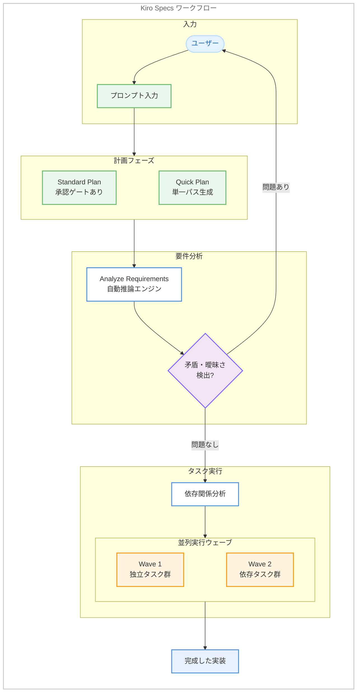

# Kiro IDE - Parallel Task Execution, Quick Plan, and Requirements Analysis

**リリース日**: 2026 年 5 月 6 日
**サービス**: Kiro (AWS AI-powered IDE)
**機能**: Parallel Task Execution / Quick Plan / Analyze Requirements (IDE v0.12.155)

[このアップデートのインフォグラフィックを見る](https://takech9203.github.io/aws-news-summary/20260506-kiro-changelog-2026-05-06.html)

## 概要

Kiro IDE v0.12.155 では、Specs ワークフローの開始から完了までを大幅に高速化する 3 つの機能が追加された。独立タスクの並列実行、承認ゲートをスキップする Quick Plan モード、そして要件の論理的矛盾を事前に検出する Requirements Analysis である。

このリリースのテーマは「Specs をより速く開始し、より速く完了し、より正確にする」ことである。従来の逐次実行モデルからの脱却、計画フェーズの簡素化、そして要件定義段階での品質向上により、開発者の生産性を多角的に改善する。

**アップデート前の課題**

- タスクは依存関係の有無にかかわらず 1 つずつ逐次実行されており、独立タスクが多い Spec では待ち時間が無駄に発生していた
- Spec セッションでは Requirements、Design、Tasks の各フェーズ間に承認ゲートがあり、スコープが明確な場合でも毎回承認が必要だった
- 要件定義の論理的矛盾や曖昧さは、Design や実装フェーズに進んでから発覚することが多く、手戻りが発生していた

**アップデート後の改善**

- 独立したタスクが自動的に並列実行され、4 つ以上の独立タスクがある場合は最大 4 倍の高速化を実現
- Quick Plan モードにより、スコープが明確な場合は単一パスで全成果物を生成し、タスクリストに直接到達可能になった
- 自動推論を活用した要件分析により、曖昧な言語、矛盾する制約、論理的ギャップを実装前に検出可能になった

## アーキテクチャ図



Kiro Specs の新しいワークフローを示す。Quick Plan による高速計画、Analyze Requirements による要件検証、そして Parallel Task Execution による並列実行の 3 つの機能が連携して動作する。

## サービスアップデートの詳細

### 主要機能

1. **Parallel Task Execution (並列タスク実行)**
   - `Run all Tasks` をクリックするだけで、独立したタスクが自動的に並列実行される
   - Kiro がタスクリストの依存関係を分析し、独立タスクを並列ウェーブにグループ化する
   - 各タスクは独自の分離されたコンテキストで実行される
   - 4 つ以上の独立タスクがある Spec では、実行時間を最大 4 倍短縮可能
   - 追加の設定は不要

2. **Quick Plan (クイックプラン)**
   - スコープが明確な場合に承認ゲートをスキップする新しい Spec セッションモード
   - スコープ、制約、エッジケースに関する明確化質問を事前に行い、Requirements、Design、Tasks の 3 つの成果物を単一パスで生成
   - タスクリストに直接到達でき、すぐにビルドを開始可能
   - Specs が提供するトレーサビリティと正確性を維持しつつ、よりタイトなフィードバックループを実現

3. **Analyze Requirements (要件分析)**
   - 要件の論理的矛盾、曖昧さ、相反する制約、ギャップを検出する深い分析パス
   - 自動推論 (automated reasoning) を使用して、通読では発見困難な問題を発見
   - 検出された問題は、チャット内で解決可能な明確化質問として表示される
   - Design フェーズに進む前に要件の品質を確保

## 技術仕様

### 機能比較

| 項目 | Parallel Task Execution | Quick Plan | Analyze Requirements |
|------|------------------------|------------|---------------------|
| 対象 | Kiro IDE v0.12.155 以降 | Kiro IDE v0.12.155 以降 | Kiro IDE v0.12.155 以降 |
| 動作 | 自動 (設定不要) | ユーザーが選択 | ユーザーが実行 |
| 適用フェーズ | タスク実行 | 計画全体 | 要件定義 |
| 主な効果 | 実行時間の短縮 | 計画時間の短縮 | 要件品質の向上 |

### Parallel Task Execution の動作詳細

| 項目 | 詳細 |
|------|------|
| トリガー | `Run all Tasks` ボタンのクリック |
| 分析対象 | タスクリスト内の依存関係 |
| 実行単位 | 並列ウェーブ (独立タスクのグループ) |
| コンテキスト | 各タスクが分離されたコンテキストで実行 |
| 最大効果 | 4 つ以上の独立タスクで最大 4 倍高速化 |
| 設定 | 不要 (自動動作) |

### Quick Plan のワークフロー

| ステップ | 内容 |
|----------|------|
| 1 | ユーザーが Quick Plan モードを選択 |
| 2 | Kiro が明確化質問を事前に提示 |
| 3 | ユーザーがスコープ・制約・エッジケースに回答 |
| 4 | Requirements, Design, Tasks を単一パスで生成 |
| 5 | タスクリストに直接到達 |

## 設定方法

### 前提条件

1. Kiro IDE v0.12.155 以降がインストールされていること
2. 有効な Kiro アカウントでサインインしていること
3. Specs 機能が利用可能なプロジェクトが開かれていること

### 手順

#### ステップ 1: Parallel Task Execution の利用

Parallel Task Execution は追加設定不要で自動的に有効化される。

1. Spec のタスクリストを開く
2. `Run all Tasks` ボタンをクリック
3. Kiro が自動的に依存関係を分析し、独立タスクを並列実行する

#### ステップ 2: Quick Plan の利用

1. 新しい Spec セッションを開始
2. セッションモードとして Quick Plan を選択
3. Kiro からの明確化質問に回答
4. Requirements、Design、Tasks が単一パスで生成される

#### ステップ 3: Analyze Requirements の利用

1. Spec の Requirements フェーズで要件を定義
2. Analyze Requirements を実行
3. 検出された矛盾や曖昧さがチャット内に表示される
4. 明確化質問に回答して要件を改善

## メリット

### ビジネス面

- **開発速度の向上**: 独立タスクの並列実行により、大規模な Spec の実行時間を最大 4 倍短縮し、リリースサイクルを加速
- **計画フェーズの効率化**: Quick Plan により、スコープが明確なタスクでは計画フェーズの時間と認知的負荷を大幅に削減
- **手戻りコストの削減**: 要件段階での矛盾検出により、Design や実装フェーズでの手戻りを防止し、開発コストを低減

### 技術面

- **コンテキスト分離**: 並列実行される各タスクが独立したコンテキストを持つため、タスク間の干渉を防止
- **自動推論による検証**: 人間のレビューでは見落としやすい論理的矛盾を自動検出し、要件の品質を向上
- **依存関係の自動分析**: ユーザーが手動で依存関係を指定する必要がなく、Kiro が自動的に最適な実行順序を決定

## デメリット・制約事項

### 制限事項

- Parallel Task Execution の効果は独立タスクの数に依存する。全タスクが順序依存の場合は効果が限定的
- Quick Plan は明確なスコープを持つタスクに最適であり、探索的な開発には従来の段階的承認モードが適している場合がある
- Analyze Requirements は要件テキストの品質に依存し、記述が極端に曖昧な場合は有用な分析結果を生成できない可能性がある

### 考慮すべき点

- 並列実行時のリソース消費が増加する可能性がある (複数の分離コンテキストが同時実行)
- Quick Plan で生成された成果物は、Standard モードと比較して中間段階でのレビュー機会が少ない
- Requirements Analysis の結果を無視して進行した場合、後続フェーズで問題が顕在化する可能性がある

## ユースケース

### ユースケース 1: マイクロサービスの並列実装

**シナリオ**: 複数の独立したマイクロサービスエンドポイントを一度に実装する場合

**実装例**:
```
Spec: "ユーザー管理 API を実装する"
- Task 1: GET /users エンドポイント (独立)
- Task 2: POST /users エンドポイント (独立)
- Task 3: GET /users/:id エンドポイント (独立)
- Task 4: バリデーションミドルウェア (Task 2 に依存)

→ Task 1, 2, 3 が Wave 1 で並列実行
→ Task 4 が Wave 2 で実行
```

**効果**: 3 つの独立エンドポイントが同時に実装され、従来の 4 タスク逐次実行と比較して約 3 倍の速度で完了。

### ユースケース 2: プロトタイプの迅速な構築

**シナリオ**: ハッカソンやプロトタイピングで、明確な要件を素早く実装に移したい場合

**実装例**:
```
Quick Plan モードを選択
プロンプト: "React で TODO アプリを作成。LocalStorage 保存、フィルタリング、ドラッグ&ドロップ対応"

Kiro の質問: "完了状態のフィルタリング種別は?" → "全て/未完了/完了済み"
Kiro の質問: "ドラッグ&ドロップの並び替えは永続化する?" → "はい"

→ 単一パスで Requirements, Design, Tasks を生成
→ 即座にタスク実行開始
```

**効果**: 従来 3 回の承認ステップが必要だった計画フェーズが、質問への回答のみで完了。アイデアから実装開始までの時間を大幅に短縮。

### ユースケース 3: 複雑な業務要件の事前検証

**シナリオ**: ECサイトの割引ルールなど、複雑なビジネスロジックの要件定義で矛盾を検出したい場合

**実装例**:
```
Requirements:
- "新規ユーザーには初回購入 20% 割引を適用する"
- "全商品に対して最大割引率は 15% とする"
- "クーポンコードによる割引と併用可能とする"

Analyze Requirements 実行結果:
⚠️ 矛盾検出: 初回購入割引 20% が最大割引率 15% を超過
⚠️ 曖昧さ: クーポン併用時の割引上限が未定義
```

**効果**: 実装前に論理的矛盾を検出し、ステークホルダーと事前に解決。実装後のバグ修正や仕様変更を防止。

## 利用可能リージョン

Kiro はグローバルサービスとして提供されており、リージョンの制約なく利用可能。

## 関連サービス・機能

- **Kiro Specs**: 要件から実装までをトレーサブルに管理するワークフロー機能。今回の 3 機能全てが Specs ワークフローの改善
- **Kiro Subagents**: 並列タスク実行の基盤となるサブエージェント機能。各タスクが分離コンテキストで動作する仕組みを提供
- **Kiro CLI**: ヘッドレスモードでの Spec 実行に対応しており、並列実行の恩恵を CI/CD パイプラインでも享受可能

## 参考リンク

- [インフォグラフィック](https://takech9203.github.io/aws-news-summary/20260506-kiro-changelog-2026-05-06.html)
- [Kiro Changelog](https://kiro.dev/changelog/)
- [Kiro Changelog - IDE v0.12](https://kiro.dev/changelog/ide/0-12/)
- [Kiro Specs ドキュメント - 並列実行](https://kiro.dev/docs/specs/#running-tasks-in-parallel)
- [Kiro ドキュメント](https://kiro.dev/docs/)

## まとめ

Kiro IDE v0.12.155 は、Specs ワークフローの 3 つのボトルネック (逐次実行、承認待ち、要件品質) を同時に解消するリリースである。Parallel Task Execution による最大 4 倍の高速化、Quick Plan による計画フェーズの効率化、Analyze Requirements による要件品質の事前担保により、アイデアから実装完了までの時間を総合的に短縮する。特に大規模な Spec や明確なスコープを持つプロジェクトで効果が大きいため、Kiro IDE ユーザーは v0.12.155 へのアップデートを推奨する。
