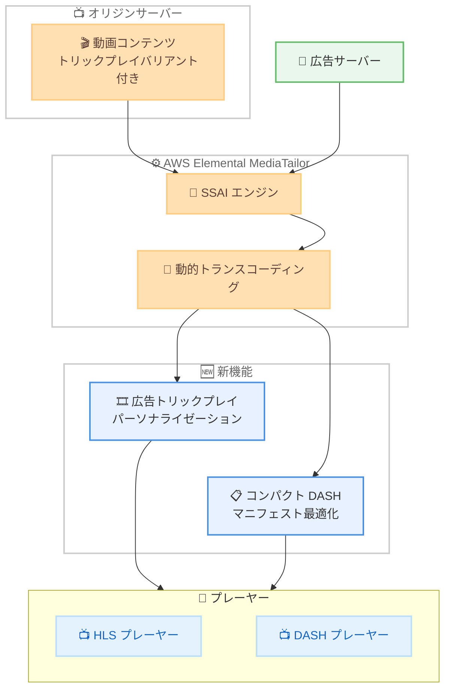

# AWS Elemental MediaTailor - 広告トリックプレイパーソナライゼーションとコンパクト DASH マニフェスト最適化

**リリース日**: 2026 年 5 月 6 日
**サービス**: AWS Elemental MediaTailor
**機能**: 広告トリックプレイパーソナライゼーションおよびコンパクト DASH マニフェスト最適化 (動的トランスコーディング経由)

[このアップデートのインフォグラフィックを見る](https://takech9203.github.io/aws-news-summary/20260506-mediatail-ad-trickplay-and-compact-dash-manifest-optimization.html)

## 概要

AWS Elemental MediaTailor が、動的トランスコーディングを通じた広告トリックプレイパーソナライゼーションとコンパクト DASH マニフェスト最適化をサポートした。これにより、HLS および DASH ストリーミングワークフローにおける広告視聴体験の向上と、マニフェスト配信の効率化が実現する。

MediaTailor はサーバーサイド広告挿入 (SSAI) を提供し、動画ストリーム内の広告をパーソナライズするサービスである。ストリーミングプラットフォームがトリックプレイナビゲーション (早送り・巻き戻し) を広くサポートする中、広告がトリックプレイバリアントと関連するイメージストリームを含むことが、シームレスな視聴体験の提供に不可欠となっている。今回のアップデートにより、これらの機能がカスタムトランスコードプロファイルなしでネイティブに利用可能になった。

**アップデート前の課題**

- 広告のトリックプレイパーソナライゼーションを実現するには、カスタムトランスコードプロファイルの作成と管理が必要だった
- DASH マニフェストのコンパクト化にもカスタムトランスコードプロファイルが必須で、運用負荷が高かった
- カスタムプロファイルの設定ミスにより、広告とオリジンコンテンツのトリックプレイ仕様が不一致になるリスクがあった
- DASH マニフェストサイズが大きくなり、帯域幅の無駄遣いやプレーヤーとの互換性問題が発生する場合があった

**アップデート後の改善**

- 動的トランスコーディングにより、HLS と DASH の両方でトリックプレイパーソナライゼーションがネイティブにサポートされた
- カスタムトランスコードプロファイルが不要になり、設定と運用が大幅に簡素化された
- コンパクト DASH マニフェストにより SegmentTemplate が AdaptationSet レベルに集約され、マニフェストサイズが削減された
- 追加コストなしで利用可能

## アーキテクチャ図



MediaTailor の動的トランスコーディングが、オリジンコンテンツの仕様に合わせて広告にトリックプレイバリアントを自動付与し、最適化された DASH マニフェストとして配信する流れを示している。

## サービスアップデートの詳細

### 主要機能

1. **広告トリックプレイパーソナライゼーション**
   - HLS および DASH ワークフローの両方で、動的トランスコーディングを通じたトリックプレイパーソナライゼーションマッチングを完全サポート
   - 広告にトリックプレイバリアントおよび関連するイメージストリームを自動的に含め、オリジンコンテンツの仕様と整合させる
   - 視聴者が早送りや巻き戻しを行った際にも一貫した視聴体験を提供
   - カスタムトランスコードプロファイルが不要

2. **コンパクト DASH マニフェストサポート**
   - 動的トランスコーディングを通じたコンパクト DASH マニフェストをサポート
   - SegmentTemplate 要素を個別の Representation レベルから AdaptationSet レベルに引き上げ
   - マニフェスト全体のサイズを削減し、効率的な配信を実現
   - コンパクトマニフェスト構造に依存するプレーヤーやワークフローとの互換性を向上

3. **動的トランスコーディングによるネイティブサポート**
   - 従来カスタムトランスコードプロファイルが必要だった機能をネイティブ化
   - 設定の簡素化により運用負荷を軽減
   - 追加コストなし

## 技術仕様

### サポート形式

| 項目 | 詳細 |
|------|------|
| トリックプレイ対応フォーマット | HLS、DASH |
| コンパクトマニフェスト対応フォーマット | DASH |
| トランスコーディング方式 | 動的トランスコーディング (カスタムプロファイル不要) |
| SegmentTemplate 配置 | AdaptationSet レベル (コンパクト DASH) |
| 追加コスト | なし |

### API 変更履歴

| 日付 | サービス | 変更内容 |
|------|----------|----------|
| 2026/05/05 | [mediatailor](https://awsapichanges.com/archive/changes/2d415e-api.mediatailor.html) | 4 new 4 updated api methods - Monetization Functions のサポート追加 |

### DASH マニフェスト構造の変更

コンパクト DASH マニフェスト最適化により、以下のような構造変更が行われる。

**最適化前** (Representation レベルに SegmentTemplate):
```xml
<AdaptationSet>
  <Representation id="1" bandwidth="500000">
    <SegmentTemplate timescale="90000" media="seg_$Number$.m4s" initialization="init.m4s"/>
  </Representation>
  <Representation id="2" bandwidth="1000000">
    <SegmentTemplate timescale="90000" media="seg_$Number$.m4s" initialization="init.m4s"/>
  </Representation>
</AdaptationSet>
```

**最適化後** (AdaptationSet レベルに SegmentTemplate を集約):
```xml
<AdaptationSet>
  <SegmentTemplate timescale="90000" media="seg_$Number$.m4s" initialization="init.m4s"/>
  <Representation id="1" bandwidth="500000"/>
  <Representation id="2" bandwidth="1000000"/>
</AdaptationSet>
```

## 設定方法

### 前提条件

1. AWS アカウントと MediaTailor へのアクセス権限
2. 既存の MediaTailor プレイバック設定
3. トリックプレイバリアントを含むオリジンコンテンツ

### 手順

#### ステップ 1: 動的トランスコーディングの確認

```bash
aws mediatailor get-playback-configuration \
  --name my-playback-config
```

既存のプレイバック設定で動的トランスコーディングが有効になっていることを確認する。

#### ステップ 2: カスタムトランスコードプロファイルの確認

今回のアップデートにより、トリックプレイパーソナライゼーションおよびコンパクト DASH マニフェストのために作成していたカスタムトランスコードプロファイルは不要になる。動的トランスコーディングがこれらの機能をネイティブに処理する。

#### ステップ 3: 動作確認

```bash
# HLS ストリームのテスト再生で、トリックプレイ時の広告表示を確認
curl -s "https://<mediatailor-endpoint>/v1/session/<session-id>/manifest.m3u8" | head -30
```

マニフェストにトリックプレイバリアントが含まれていることを確認する。広告セグメントにもオリジンコンテンツと整合するトリックプレイイメージストリームが含まれる。

## メリット

### ビジネス面

- **運用コスト削減**: カスタムトランスコードプロファイルの作成・管理が不要になり、運用コストが削減される
- **広告収益の最大化**: トリックプレイ時にも広告が適切に表示されるため、広告インプレッションの損失を防止
- **視聴体験の向上**: シームレスなトリックプレイ体験により視聴者の満足度が向上し、離脱率が低下

### 技術面

- **設定の簡素化**: ネイティブサポートにより、カスタムプロファイルの設計・テスト・デバッグが不要
- **マニフェスト配信の効率化**: コンパクト DASH マニフェストにより帯域幅消費が削減され、読み込み速度が向上
- **プレーヤー互換性の改善**: コンパクトマニフェスト構造への対応により、幅広いプレーヤーとの互換性が確保

## デメリット・制約事項

### 制限事項

- コンパクト DASH マニフェスト最適化は DASH フォーマットのみに適用され、HLS には適用されない
- トリックプレイパーソナライゼーションが正しく機能するには、オリジンコンテンツにトリックプレイバリアントが含まれている必要がある
- 既存のカスタムトランスコードプロファイルとの併用時の動作については、ドキュメントを確認する必要がある

### 考慮すべき点

- オリジンコンテンツのトリックプレイ仕様が変更された場合、動的トランスコーディングが自動的に追従するか確認が必要
- 大規模なライブ配信環境では、動的トランスコーディングのレイテンシへの影響を検証することが推奨される

## ユースケース

### ユースケース 1: ライブスポーツ配信の広告最適化

**シナリオ**: スポーツ中継のライブ配信において、視聴者がハイライトシーンを巻き戻す際にも広告が適切に表示される必要がある。

**実装例**:
```bash
# MediaTailor のプレイバック設定 (動的トランスコーディング有効)
aws mediatailor put-playback-configuration \
  --name sports-live-config \
  --ad-decision-server-url "https://ads.example.com/vast" \
  --video-content-source-url "https://origin.example.com/live"
```

**効果**: カスタムトランスコードプロファイルなしで、早送り・巻き戻し時にもトリックプレイ対応の広告が自動的に挿入され、広告インプレッションが維持される。

### ユースケース 2: VOD プラットフォームの DASH マニフェスト最適化

**シナリオ**: VOD サービスで多数のアダプティブビットレートを提供しており、DASH マニフェストのサイズがプレーヤーの起動時間に影響を与えている。

**実装例**:
```bash
# DASH コンテンツのプレイバック設定
aws mediatailor put-playback-configuration \
  --name vod-dash-config \
  --ad-decision-server-url "https://ads.example.com/vast" \
  --video-content-source-url "https://origin.example.com/vod" \
  --dash-configuration '{"MpdLocation":"EMT_DEFAULT"}'
```

**効果**: コンパクト DASH マニフェストにより SegmentTemplate が集約され、マニフェストサイズが削減。プレーヤーのパース時間が短縮され、起動時間が改善される。

### ユースケース 3: マルチデバイス配信サービス

**シナリオ**: テレビ、モバイル、Web など複数のデバイスに対応する OTT サービスで、HLS と DASH の両方のフォーマットで一貫したトリックプレイ広告体験を提供する必要がある。

**実装例**:
```bash
# HLS/DASH 両対応のプレイバック設定
aws mediatailor put-playback-configuration \
  --name multidevice-config \
  --ad-decision-server-url "https://ads.example.com/vast" \
  --video-content-source-url "https://origin.example.com/content"
```

**効果**: 動的トランスコーディングが HLS と DASH の両方でトリックプレイパーソナライゼーションを自動処理するため、デバイスごとの個別設定が不要になり、統一された広告体験を提供できる。

## 料金

今回のアップデートによる追加コストは発生しない。AWS Elemental MediaTailor の標準料金体系が適用される。

### 料金例

| 使用量 | 月額料金 (概算) |
|--------|------------------|
| 広告挿入 (1,000 件あたり) | $0.00350 |
| チャネルアセンブリ (1 時間あたり) | $0.10 |

## 利用可能リージョン

AWS Elemental MediaTailor が利用可能な全リージョンで提供される。

- US East (Ohio)
- US East (N. Virginia)
- US West (Oregon)
- Africa (Cape Town)
- Asia Pacific (Hyderabad, Malaysia, Melbourne, Mumbai, Osaka, Seoul, Singapore, Sydney, Tokyo)
- Canada (Central)
- Europe (Frankfurt, Ireland, London, Paris, Stockholm)
- Middle East (UAE)
- South America (Sao Paulo)

## 関連サービス・機能

- **AWS Elemental MediaLive**: ライブ動画エンコーディング。MediaTailor と組み合わせてライブストリームへの広告挿入に使用
- **AWS Elemental MediaPackage**: 動画オリジネーションとパッケージング。MediaTailor のコンテンツソースとして機能
- **Amazon CloudFront**: CDN。MediaTailor で処理されたストリームの配信に使用

## 参考リンク

- [インフォグラフィック](https://takech9203.github.io/aws-news-summary/20260506-mediatail-ad-trickplay-and-compact-dash-manifest-optimization.html)
- [公式発表 (What's New)](https://aws.amazon.com/about-aws/whats-new/2026/05/mediatail-ad-trickplay-and-compact-dash-manifest-optimization)
- [ドキュメント](https://docs.aws.amazon.com/mediatailor/latest/ug/what-is.html)
- [料金ページ](https://aws.amazon.com/mediatailor/pricing/)

## まとめ

AWS Elemental MediaTailor の広告トリックプレイパーソナライゼーションとコンパクト DASH マニフェスト最適化は、ストリーミング配信事業者にとって運用の簡素化と視聴体験の向上を同時に実現する重要なアップデートである。カスタムトランスコードプロファイルが不要になることで設定負荷が大幅に軽減され、追加コストなしで利用できる点も評価できる。MediaTailor を利用している場合は、既存のカスタムプロファイルの見直しと、動的トランスコーディングへの移行を検討することを推奨する。
