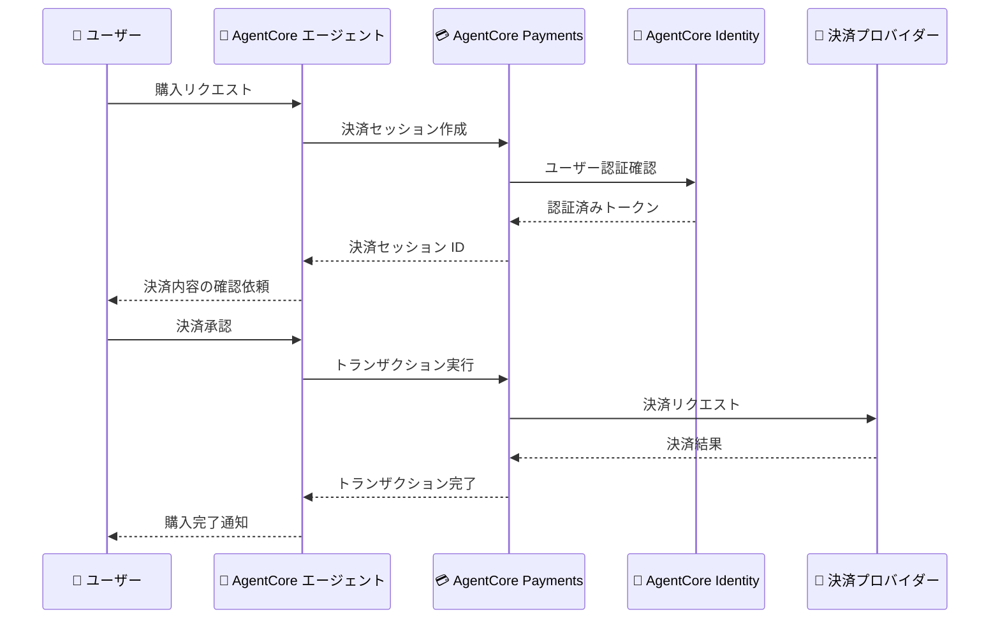

# Amazon Bedrock AgentCore - Payments (プレビュー)

**リリース日**: 2026年5月7日
**サービス**: Amazon Bedrock AgentCore
**機能**: Payments (プレビュー)

📊 [このアップデートのインフォグラフィックを見る](https://takech9203.github.io/aws-news-summary/20260507-amazon-bedrock-agentcore-payments-preview.html)

## 概要

Amazon Bedrock AgentCore に Payments 機能がプレビューとして追加されました。この機能により、AI エージェントがユーザーに代わって決済トランザクションを処理できるようになります。従来、AI エージェントは情報検索や会話に限定されていましたが、AgentCore Payments によりエージェントが実際の金銭的取引を安全に実行できる新しいパラダイムが実現します。

AgentCore Payments は、AgentCore Identity の OBO (On-Behalf-Of) トークン交換と組み合わせて動作し、ユーザーの認証情報と同意に基づいてエージェントが決済プロバイダーに対してトランザクションを実行します。決済フローにおけるユーザーの承認、トランザクションの検証、セキュリティ制御が組み込まれており、エンタープライズレベルのコンプライアンス要件を満たすことができます。

この機能は、EC サイト、旅行予約、サブスクリプション管理、経費精算などの分野で AI エージェントを活用したい開発者やビジネスに向けたものです。

**アップデート前の課題**

- AI エージェントは決済処理を直接実行できず、ユーザーが手動で決済画面に遷移する必要があった
- エージェントが推奨した商品やサービスの購入には、別途ユーザーが決済フローを完了する必要があり、体験が分断されていた
- 決済を含むワークフローの自動化には、カスタムの決済統合コードを開発・保守する必要があった

**アップデート後の改善**

- AI エージェントがユーザーの同意を得た上で、決済トランザクションを直接実行できるようになった
- 会話フロー内でシームレスに決済を完了でき、ユーザー体験が大幅に向上した
- AgentCore のマネージドな決済インフラにより、PCI DSS 準拠の決済処理を開発者が容易に実装できるようになった

## アーキテクチャ図



ユーザーが AI エージェントに購入を依頼し、AgentCore Payments がユーザーの明示的な承認を得た上で決済プロバイダーに対してトランザクションを実行するフローを示しています。

## サービスアップデートの詳細

### 主要機能

1. **決済トランザクション処理**
   - AI エージェントがユーザーに代わって決済を実行する機能
   - 注文の作成、支払い処理、払い戻しなどの基本的な決済オペレーションをサポート
   - トランザクションの状態管理とイベント通知を提供

2. **ユーザー同意と承認フロー**
   - エージェントが決済を実行する前に、ユーザーの明示的な承認を取得するメカニズム
   - 金額、支払先、支払い方法をユーザーに提示して確認を得る
   - 承認レベルの設定により、少額決済の自動承認なども構成可能

3. **セキュリティと制御**
   - AgentCore Identity との統合による認証・認可
   - トランザクション金額の上限設定
   - 不正検知と異常トランザクションの自動ブロック
   - 監査ログによる全トランザクションのトレーサビリティ確保

4. **決済プロバイダー統合**
   - 主要な決済サービスプロバイダー (PSP) との統合をサポート
   - AgentCore Gateway を介したセキュアな接続
   - 複数の決済手段に対応可能な拡張性のある設計

## 技術仕様

### 決済セッション構成

| 項目 | 詳細 |
|------|------|
| ステータス | プレビュー |
| 決済モデル | ユーザー承認型の委任決済 |
| 認証方式 | AgentCore Identity OBO トークン交換 |
| セキュリティ | PCI DSS 準拠のトークナイゼーション |
| トランザクション上限 | 設定可能 (プレビュー期間中はアカウントごとに制限あり) |
| 対応通貨 | 主要通貨 (USD, EUR, GBP, JPY 等) |

### API 変更履歴

| 日付 | サービス | 変更内容 |
|------|----------|----------|
| 2026/05/06 | [Amazon Bedrock AgentCore Control](https://awsapichanges.com/archive/changes/7068f3-bedrock-agentcore-control.html) | 7 updated api methods - ファイルシステム設定サポート追加 |
| 2026/04/30 | [Amazon Bedrock AgentCore Control](https://awsapichanges.com/archive/changes/7084f0-bedrock-agentcore-control.html) | 14 updated api methods - OBO トークン交換 OAuth2 サポート追加 |

### 決済設定例

```json
{
  "paymentConfiguration": {
    "paymentProvider": {
      "providerType": "STRIPE",
      "credentials": {
        "secretArn": "arn:aws:secretsmanager:<region>:<account>:secret:stripe-api-key"
      }
    },
    "transactionLimits": {
      "maxAmountPerTransaction": 10000,
      "maxTransactionsPerDay": 50,
      "currency": "USD"
    },
    "approvalPolicy": {
      "requireExplicitApproval": true,
      "autoApproveThreshold": 0
    }
  }
}
```

## 設定方法

### 前提条件

1. Amazon Bedrock AgentCore が利用可能なリージョンの AWS アカウント
2. AgentCore Gateway が設定済みであること
3. AgentCore Identity でユーザー認証が構成済みであること
4. 決済プロバイダーのアカウントと API キーが用意されていること
5. プレビューへのアクセスが承認されていること

### 手順

#### ステップ 1: 決済プロバイダーの認証情報を Secrets Manager に保存

```bash
aws secretsmanager create-secret \
  --name "agentcore-payment-provider-key" \
  --secret-string '{"api_key": "sk_live_xxxx", "webhook_secret": "whsec_xxxx"}'
```

決済プロバイダーの API キーとウェブフックシークレットを AWS Secrets Manager に安全に保存します。

#### ステップ 2: AgentCore Payments の設定を作成

```bash
aws bedrock-agentcore-control create-payment-configuration \
  --name "my-payment-config" \
  --provider-type "STRIPE" \
  --credentials-secret-arn "arn:aws:secretsmanager:<region>:<account>:secret:agentcore-payment-provider-key" \
  --transaction-limits '{
    "maxAmountPerTransaction": 10000,
    "maxTransactionsPerDay": 50,
    "currency": "USD"
  }' \
  --approval-policy '{
    "requireExplicitApproval": true,
    "autoApproveThreshold": 0
  }'
```

決済プロバイダーとの接続設定、トランザクション制限、承認ポリシーを定義します。

#### ステップ 3: エージェントに決済機能を追加

```bash
aws bedrock-agentcore-control update-agent-runtime \
  --agent-runtime-id "my-agent-runtime" \
  --tools '[{
    "type": "agentcore_payments",
    "name": "payment-processor",
    "config": {
      "paymentConfigurationArn": "arn:aws:bedrock-agentcore:<region>:<account>:payment-config/my-payment-config",
      "allowedOperations": ["CREATE_PAYMENT", "REFUND"],
      "outboundAuth": {
        "oauth": {
          "providerArn": "arn:aws:bedrock-agentcore:<region>:<account>:oauth-provider/my-provider",
          "scopes": ["payments.create", "payments.refund"],
          "grantType": "TOKEN_EXCHANGE"
        }
      }
    }
  }]'
```

エージェントランタイムに決済ツールを追加し、許可する操作と認証設定を構成します。

## メリット

### ビジネス面

- **コンバージョン率の向上**: 会話フロー内でシームレスに決済が完了するため、購入離脱を大幅に削減できる
- **運用コスト削減**: エージェントが決済処理を自動化することで、手動の注文処理やカスタマーサポートコストを削減できる
- **新しい収益チャネル**: AI エージェントを通じた商品推奨から決済までの一貫した体験により、アップセルやクロスセルの機会が増加する

### 技術面

- **マネージドセキュリティ**: PCI DSS 準拠の決済処理が AgentCore レベルで提供され、開発者がセキュリティ実装を個別に行う必要がない
- **統合の簡素化**: AgentCore Gateway と Identity との統合により、複雑な決済統合コードが不要になる
- **スケーラビリティ**: AgentCore のマネージドインフラ上で動作するため、トラフィック増加に対して自動スケーリングが適用される

## デメリット・制約事項

### 制限事項

- プレビュー段階であり、本番環境での使用は推奨されない
- 対応する決済プロバイダーが限定されている可能性がある
- トランザクション金額の上限がプレビュー期間中は制限される
- プレビューへのアクセスには事前申請が必要

### 考慮すべき点

- 決済を伴うエージェントの動作には十分なテストと検証が必要であり、意図しない決済の防止策を講じる必要がある
- ユーザーの同意取得フローの UX 設計が重要であり、エージェントの提案に対して明確な承認/拒否の選択肢を提供する必要がある
- 決済に関連する法規制やコンプライアンス要件はリージョンやビジネスドメインによって異なるため、事前確認が必要
- 障害時のトランザクション復旧やべき等性の確保について設計段階で考慮が必要

## ユースケース

### ユースケース 1: EC サイトのパーソナルショッピングエージェント

**シナリオ**: ユーザーが AI ショッピングアシスタントに「先月買ったランニングシューズに合うスポーツウェアを探して購入して」と依頼する。エージェントが購入履歴を参照し、商品を推奨して決済まで完了する。

**実装例**:
```json
{
  "tools": [
    {
      "type": "agentcore_payments",
      "name": "ecommerce-payment",
      "config": {
        "paymentConfigurationArn": "arn:aws:bedrock-agentcore:us-east-1:123456789012:payment-config/ecommerce",
        "allowedOperations": ["CREATE_PAYMENT"],
        "outboundAuth": {
          "oauth": {
            "providerArn": "arn:aws:bedrock-agentcore:us-east-1:123456789012:oauth-provider/shop",
            "scopes": ["orders.create", "payments.process"],
            "grantType": "TOKEN_EXCHANGE"
          }
        }
      }
    }
  ]
}
```

**効果**: ユーザーは会話の中で商品選択から購入までを完結でき、購入フローの離脱率を大幅に削減できる。

### ユースケース 2: 旅行予約エージェント

**シナリオ**: ユーザーが「来週の大阪出張のフライトとホテルを予約して」と依頼する。エージェントが最適なオプションを提示し、ユーザーの承認を得た上で予約と決済を完了する。

**実装例**:
```json
{
  "tools": [
    {
      "type": "agentcore_payments",
      "name": "travel-booking-payment",
      "config": {
        "paymentConfigurationArn": "arn:aws:bedrock-agentcore:ap-northeast-1:123456789012:payment-config/travel",
        "allowedOperations": ["CREATE_PAYMENT", "REFUND"],
        "outboundAuth": {
          "oauth": {
            "providerArn": "arn:aws:bedrock-agentcore:ap-northeast-1:123456789012:oauth-provider/travel-api",
            "scopes": ["bookings.create", "payments.process", "refunds.create"],
            "grantType": "TOKEN_EXCHANGE"
          }
        }
      }
    }
  ]
}
```

**効果**: 出張手配の工数を大幅に削減し、企業の旅費規程に準拠した予約をエージェントが自動で行える。

### ユースケース 3: サブスクリプション管理エージェント

**シナリオ**: カスタマーサポートエージェントが「プランをプレミアムにアップグレードして、差額を日割りで決済して」というユーザーのリクエストを処理する。

**実装例**:
```json
{
  "tools": [
    {
      "type": "agentcore_payments",
      "name": "subscription-payment",
      "config": {
        "paymentConfigurationArn": "arn:aws:bedrock-agentcore:us-east-1:123456789012:payment-config/subscription",
        "allowedOperations": ["CREATE_PAYMENT", "REFUND"],
        "outboundAuth": {
          "oauth": {
            "providerArn": "arn:aws:bedrock-agentcore:us-east-1:123456789012:oauth-provider/billing",
            "scopes": ["subscriptions.update", "payments.process"],
            "grantType": "TOKEN_EXCHANGE"
          }
        }
      }
    }
  ]
}
```

**効果**: プラン変更や解約に伴う決済処理をエージェントが自動化し、カスタマーサポートの対応時間を短縮できる。

## 料金

プレビュー期間中の料金体系は以下の通りです (正式な料金は GA 時に発表される予定です)。

| 項目 | 料金 |
|------|------|
| 決済トランザクションリクエスト | プレビュー期間中は無料 (GA 後に課金開始予定) |
| AgentCore Runtime 利用料 | 通常の AgentCore Runtime 料金が適用 |
| Secrets Manager | シークレットの保管・アクセスに対する通常料金 |

**注意**: 決済プロバイダー側の手数料 (Stripe, PayPal 等) は別途発生します。

## 利用可能リージョン

プレビュー期間中は以下のリージョンで利用可能です。

| リージョン | コード |
|-----------|--------|
| US East (N. Virginia) | us-east-1 |
| US West (Oregon) | us-west-2 |
| Europe (Ireland) | eu-west-1 |

## 関連サービス・機能

- **Amazon Bedrock AgentCore Identity**: ユーザー認証と OBO トークン交換を提供。Payments 機能のセキュアな認証基盤として使用
- **Amazon Bedrock AgentCore Gateway**: 決済プロバイダーへのセキュアな接続を仲介するゲートウェイ
- **Amazon Bedrock AgentCore Runtime**: エージェントの実行環境。Payments ツールを含むエージェントの実行基盤
- **AWS Secrets Manager**: 決済プロバイダーの API キーを安全に保管するためのシークレット管理サービス
- **AWS Payment Cryptography**: 決済データの暗号化処理に使用可能な暗号化サービス

## 参考リンク

- 📊 [インフォグラフィック](https://takech9203.github.io/aws-news-summary/20260507-amazon-bedrock-agentcore-payments-preview.html)
- [公式発表 (What's New)](https://aws.amazon.com/about-aws/whats-new/2026/05/amazon-bedrock-agentcore-payments-preview/)
- [Amazon Bedrock AgentCore ドキュメント](https://docs.aws.amazon.com/bedrock/latest/userguide/agentcore.html)
- [Amazon Bedrock AgentCore 料金](https://aws.amazon.com/bedrock/agentcore/pricing/)

## まとめ

Amazon Bedrock AgentCore Payments (プレビュー) は、AI エージェントが実際の決済トランザクションを処理できるようにする画期的な機能です。AgentCore Identity との統合によるセキュアな認証、ユーザーの明示的な承認フロー、トランザクション制限などの安全機構を備えており、EC サイト、旅行予約、サブスクリプション管理など幅広いユースケースでエージェント主導のコマースを実現できます。プレビュー段階での評価を行い、GA リリースに向けてユースケースの検証と設計を進めることを推奨します。
