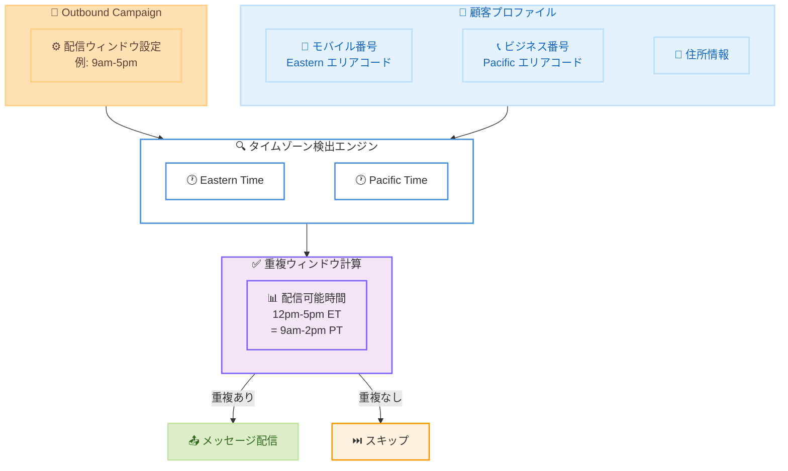

# Amazon Connect Outbound Campaigns - マルチコンタクトタイムゾーン検出

**リリース日**: 2026年5月7日
**サービス**: Amazon Connect
**機能**: Outbound Campaigns マルチコンタクトタイムゾーン検出

📊 [このアップデートのインフォグラフィックを見る](https://takech9203.github.io/aws-news-summary/20260507-amazon-connect-campaign-multitimezone.html)

## 概要

Amazon Connect Outbound Campaigns に、顧客プロファイル上のすべての電話番号と住所を使用してタイムゾーンを検出するマルチコンタクトタイムゾーン検出機能が追加された。従来はプライマリ電話番号のみからタイムゾーンを判定していたが、今回のアップデートにより、顧客プロファイルに登録されたすべての連絡先情報からタイムゾーンを検出し、複数のタイムゾーンにまたがる場合は最も厳格な配信ウィンドウを適用する。

この機能により、アウトバウンドキャンペーンのコンプライアンス遵守がより確実になり、顧客に対して不適切な時間帯にメッセージを送信するリスクが大幅に低減される。追加料金なしで、Amazon Connect Outbound Campaigns が提供されているすべての AWS リージョンで利用可能である。

**アップデート前の課題**

- プライマリ電話番号のみでタイムゾーンを検出していたため、複数のタイムゾーンにまたがる顧客を正確に識別できなかった
- モバイル番号のエリアコードと実際の居住地が異なる顧客に対して、不適切な時間帯に連絡してしまうリスクがあった
- TCPA (Telephone Consumer Protection Act) などの規制への準拠が不完全になる可能性があった

**アップデート後の改善**

- 顧客プロファイル上のすべての電話番号と住所からタイムゾーンを検出するようになった
- 複数タイムゾーンが検出された場合、設定された配信ウィンドウがすべてのタイムゾーンで許容範囲内となる時間帯のみに配信を制限する
- 重複するウィンドウが存在しない場合はプロファイルをスキップし、規制違反を防止する

## アーキテクチャ図



この図は、顧客プロファイル上の複数の連絡先情報からタイムゾーンを検出し、すべてのタイムゾーンで許容される重複ウィンドウを計算してメッセージ配信を制御するフローを示している。

## サービスアップデートの詳細

### 主要機能

1. **マルチコンタクトタイムゾーン検出**
   - 顧客プロファイルに登録されたすべての電話番号 (モバイル、自宅、ビジネスなど) からエリアコードを分析
   - 登録された住所情報 (ZIP コード) からもタイムゾーンを判定
   - プライマリ連絡先に限定せず、包括的なタイムゾーン検出を実現

2. **重複ウィンドウの自動計算**
   - 検出されたすべてのタイムゾーンに対して、設定済みの配信ウィンドウとの重複時間を自動計算
   - すべてのタイムゾーンで許容される時間帯のみにメッセージを配信
   - 例: Eastern と Pacific の両方が検出された場合、9am-5pm の設定では 12pm-5pm ET のみ配信

3. **スキップロジック**
   - 検出された複数タイムゾーン間で有効な重複ウィンドウが存在しない場合、そのプロファイルへの配信をスキップ
   - 規制違反のリスクを完全に排除
   - スキップされたプロファイルはキャンペーンレポートで確認可能

## 技術仕様

### タイムゾーン検出方法

| 検出方法 | ソース | 精度 |
|----------|--------|------|
| エリアコード | 電話番号の市外局番 | 高 (NANP 地域) |
| ZIP コード | 住所情報 | 高 |
| 複合判定 | 全連絡先情報の統合 | 最高 |

### communicationTimeConfig の設定構造

```json
{
  "communicationTimeConfig": {
    "localTimeZoneConfig": {
      "defaultTimeZone": "America/New_York",
      "localTimeZoneDetection": [
        "ZIP_CODE",
        "AREA_CODE"
      ]
    },
    "telephony": {
      "openHours": {
        "dailyHours": {
          "MONDAY": [
            {
              "startTime": "09:00",
              "endTime": "17:00"
            }
          ]
        }
      }
    }
  }
}
```

### API 変更履歴

| 日付 | サービス | 変更内容 |
|------|----------|----------|
| 2026/04/17 | [AmazonConnectCampaignServiceV2](https://awsapichanges.com/archive/changes/2da070-connect-campaigns.html) | 2 new 3 updated api methods - キャンペーンエントリ制限設定と更新頻度の追加 |

### localTimeZoneDetection パラメータ

`localTimeZoneDetection` 配列で検出方法を指定する。

| 値 | 説明 |
|------|------|
| `ZIP_CODE` | 住所の ZIP コードからタイムゾーンを検出 |
| `AREA_CODE` | 電話番号のエリアコードからタイムゾーンを検出 |

今回のアップデートでは、`AREA_CODE` によるタイムゾーン検出がプライマリ電話番号だけでなく、プロファイル上のすべての電話番号に適用されるようになった。

## 設定方法

### 前提条件

1. Amazon Connect インスタンスが作成済みであること
2. Amazon Connect Outbound Campaigns が有効化されていること
3. Amazon Connect Customer Profiles が設定済みで、顧客の連絡先情報が登録されていること

### 手順

#### ステップ 1: キャンペーンの communicationTimeConfig を設定

```bash
aws connectcampaignsv2 create-campaign \
  --name "multi-timezone-campaign" \
  --connect-instance-id "arn:aws:connect:us-east-1:123456789012:instance/abc-def" \
  --channel-subtype-config '{"telephony": {"capacity": 1.0, "outboundMode": {"agentless": {}}}}' \
  --communication-time-config '{
    "localTimeZoneConfig": {
      "defaultTimeZone": "America/New_York",
      "localTimeZoneDetection": ["ZIP_CODE", "AREA_CODE"]
    },
    "telephony": {
      "openHours": {
        "dailyHours": {
          "MONDAY": [{"startTime": "09:00", "endTime": "17:00"}],
          "TUESDAY": [{"startTime": "09:00", "endTime": "17:00"}],
          "WEDNESDAY": [{"startTime": "09:00", "endTime": "17:00"}],
          "THURSDAY": [{"startTime": "09:00", "endTime": "17:00"}],
          "FRIDAY": [{"startTime": "09:00", "endTime": "17:00"}]
        }
      }
    }
  }' \
  --type MANAGED
```

`localTimeZoneDetection` に `ZIP_CODE` と `AREA_CODE` の両方を指定することで、すべての連絡先情報からタイムゾーンを包括的に検出する。

#### ステップ 2: Customer Profiles に複数の連絡先情報を登録

```bash
aws customer-profiles put-profile-object \
  --domain-name "my-domain" \
  --object-type-name "_phone" \
  --object '{"PhoneNumber": "+12125551234", "Type": "MOBILE"}' \
  --profile-id "profile-123"
```

顧客プロファイルにモバイル番号、自宅番号、ビジネス番号などの複数の電話番号を登録する。登録されたすべての電話番号がタイムゾーン検出に使用される。

#### ステップ 3: キャンペーンの実行と結果確認

キャンペーン実行後、タイムゾーン検出の結果とスキップされたプロファイルの情報はキャンペーンメトリクスで確認できる。

## メリット

### ビジネス面

- **コンプライアンス強化**: TCPA などの消費者保護規制への準拠がより確実になり、法的リスクを低減
- **顧客体験の向上**: 不適切な時間帯での連絡を防止し、顧客満足度の維持に貢献
- **追加コスト不要**: 既存の Outbound Campaigns 料金内で利用可能であり、追加投資なしでコンプライアンスを改善

### 技術面

- **設定変更不要**: 既存の `localTimeZoneDetection` 設定がそのまま機能し、自動的にマルチコンタクト検出が有効化
- **安全なデフォルト動作**: 重複ウィンドウが存在しない場合のスキップにより、デフォルトで安全側に倒れる設計
- **包括的な検出**: エリアコードと ZIP コードの両方を活用し、検出精度を向上

## デメリット・制約事項

### 制限事項

- 重複ウィンドウが存在しないプロファイルは配信対象外となるため、到達率が低下する可能性がある
- タイムゾーン検出はエリアコードと ZIP コードに依存するため、VoIP 番号や番号ポータビリティを利用した番号では精度が低下する場合がある
- 検出ロジックは北米番号計画 (NANP) 地域のエリアコードに最適化されている

### 考慮すべき点

- 配信ウィンドウが狭い場合、マルチタイムゾーン検出により配信可能な時間帯がさらに狭くなる
- 大量の連絡先情報が登録されたプロファイルでは、複数のタイムゾーンが検出され、結果としてスキップされるケースが増加する可能性がある
- キャンペーンの到達率目標と規制遵守のバランスを考慮した配信ウィンドウの設計が必要

## ユースケース

### ユースケース 1: 全米展開の金融サービス企業

**シナリオ**: 大手銀行が支払いリマインダーを全米の顧客に送信する。顧客の中にはモバイル番号が東海岸のエリアコードだが、実際には西海岸に住んでいるケースが多い。

**実装例**:
```json
{
  "communicationTimeConfig": {
    "localTimeZoneConfig": {
      "defaultTimeZone": "America/New_York",
      "localTimeZoneDetection": ["ZIP_CODE", "AREA_CODE"]
    },
    "telephony": {
      "openHours": {
        "dailyHours": {
          "MONDAY": [{"startTime": "08:00", "endTime": "21:00"}]
        }
      }
    }
  }
}
```

**効果**: 配信ウィンドウを広く設定し (8am-9pm)、マルチタイムゾーン検出により各顧客に適切な時間帯を自動計算。コンプライアンス違反リスクを排除しつつ、到達率を最大化。

### ユースケース 2: ヘルスケア企業の予約リマインダー

**シナリオ**: 全米に拠点を持つヘルスケア企業が、患者に予約リマインダーを SMS で送信する。患者プロファイルには自宅電話、携帯電話、勤務先電話が登録されている。

**実装例**:
```json
{
  "communicationTimeConfig": {
    "localTimeZoneConfig": {
      "defaultTimeZone": "America/Chicago",
      "localTimeZoneDetection": ["ZIP_CODE", "AREA_CODE"]
    },
    "sms": {
      "openHours": {
        "dailyHours": {
          "MONDAY": [{"startTime": "09:00", "endTime": "18:00"}]
        }
      }
    }
  }
}
```

**効果**: 複数の電話番号から検出されたタイムゾーンを考慮し、すべてのタイムゾーンで営業時間内に収まる時間帯のみに SMS を送信。HIPAA 関連のコミュニケーション規制への準拠を強化。

### ユースケース 3: E コマースのプロモーションキャンペーン

**シナリオ**: E コマース企業がセール情報をアウトバウンドコールで通知する。顧客は購入時と配送先で異なる住所を登録しており、プロファイルに複数の住所が存在する。

**実装例**:
```json
{
  "communicationTimeConfig": {
    "localTimeZoneConfig": {
      "defaultTimeZone": "America/Los_Angeles",
      "localTimeZoneDetection": ["ZIP_CODE", "AREA_CODE"]
    },
    "telephony": {
      "openHours": {
        "dailyHours": {
          "SATURDAY": [{"startTime": "10:00", "endTime": "18:00"}],
          "SUNDAY": [{"startTime": "10:00", "endTime": "18:00"}]
        }
      }
    }
  }
}
```

**効果**: 週末のプロモーションキャンペーンで、顧客の請求先住所と配送先住所の両方のタイムゾーンを考慮。すべての住所が許容範囲内となる時間帯のみ発信し、顧客体験を損なわない。

## 料金

この機能は Amazon Connect Outbound Campaigns の既存料金に含まれており、追加料金は発生しない。

### 関連料金

| 項目 | 料金 |
|------|------|
| Outbound Campaigns (音声) | 通話時間に応じた従量課金 |
| Outbound Campaigns (SMS) | メッセージ送信数に応じた従量課金 |
| Customer Profiles | プロファイル数に応じた月額料金 |

## 利用可能リージョン

Amazon Connect Outbound Campaigns が提供されているすべての AWS リージョンで利用可能。主要なリージョンは以下の通り。

- US East (N. Virginia) - us-east-1
- US West (Oregon) - us-west-2
- Europe (London) - eu-west-2
- Europe (Frankfurt) - eu-central-1
- Asia Pacific (Sydney) - ap-southeast-2
- Asia Pacific (Tokyo) - ap-northeast-1

## 関連サービス・機能

- **Amazon Connect Customer Profiles**: 顧客の連絡先情報を管理するサービス。マルチコンタクトタイムゾーン検出のデータソースとなる
- **Amazon Connect Outbound Campaigns**: アウトバウンドコミュニケーションキャンペーンを管理するサービス。今回のアップデートの対象
- **Amazon Pinpoint**: マーケティングコミュニケーションサービス。Connect Outbound Campaigns と連携してマルチチャネルキャンペーンを実現

## 参考リンク

- 📊 [インフォグラフィック](https://takech9203.github.io/aws-news-summary/20260507-amazon-connect-campaign-multitimezone.html)
- [公式発表 (What's New)](https://aws.amazon.com/about-aws/whats-new/2026/05/amazon-connect-campaign-multitimezone)
- [Amazon Connect Outbound Campaigns ドキュメント](https://docs.aws.amazon.com/connect/latest/adminguide/outbound-campaigns.html)
- [Amazon Connect 料金ページ](https://aws.amazon.com/connect/pricing/)

## まとめ

Amazon Connect Outbound Campaigns のマルチコンタクトタイムゾーン検出は、顧客プロファイルに登録されたすべての連絡先情報を活用してタイムゾーンを包括的に判定し、コンプライアンスリスクを大幅に低減する重要なアップデートである。追加料金なしで自動的に適用されるため、既存の Outbound Campaigns ユーザーは設定変更なしでこの機能の恩恵を受けることができる。特に全米規模でアウトバウンドコミュニケーションを行う企業にとって、TCPA 準拠の強化と顧客体験の向上を両立する価値の高い機能改善である。
