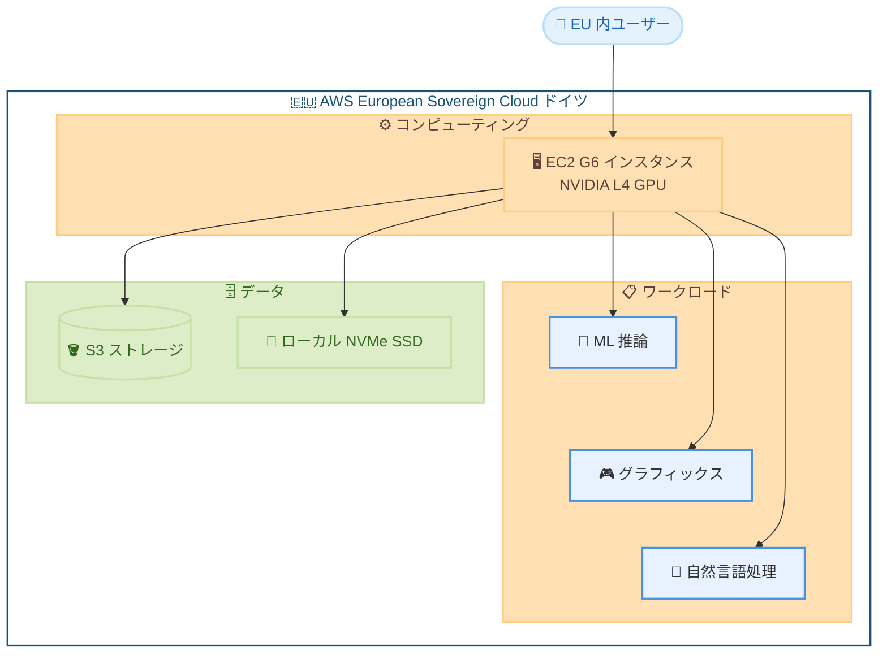

# Amazon EC2 G6 インスタンス - AWS European Sovereign Cloud (ドイツ) で利用可能に

**リリース日**: 2026年5月7日
**サービス**: Amazon EC2
**機能**: G6 インスタンスの AWS European Sovereign Cloud 対応

📊 [このアップデートのインフォグラフィックを見る](https://takech9203.github.io/aws-news-summary/20260507-amazon-ec2-g6-aws-european-sovereign-cloud.html)

## 概要

Amazon EC2 G6 インスタンスが AWS European Sovereign Cloud (ドイツ) で利用可能になった。G6 インスタンスは NVIDIA L4 GPU を搭載し、グラフィックス処理や機械学習 (ML) ワークロードに最適化されたインスタンスタイプである。

AWS European Sovereign Cloud は、EU のデータ主権要件に対応するために設計された独立したクラウドインフラストラクチャであり、データとメタデータが EU 域内に留まることが保証される。今回のアップデートにより、データ主権要件を持つ欧州の組織が GPU コンピューティングリソースを活用した ML 推論やグラフィックスワークロードを、コンプライアンスを維持しながら実行できるようになった。

**アップデート前の課題**

- AWS European Sovereign Cloud で GPU インスタンスが利用できず、ML 推論やグラフィックス処理のために通常の AWS リージョンを使用する必要があった
- データ主権要件を持つ組織が GPU ワークロードを EU 域内で完結させることが困難だった
- ソブリンクラウド環境で AI/ML ワークロードを実行するための選択肢が限られていた

**アップデート後の改善**

- AWS European Sovereign Cloud 内で G6 インスタンスを使用した GPU コンピューティングが可能になった
- EU データ主権要件を満たしながら ML 推論やグラフィックスワークロードを実行できるようになった
- オンデマンド、スポット、Savings Plans など柔軟な購入オプションが利用可能になった

## アーキテクチャ図



AWS European Sovereign Cloud 内で G6 インスタンスが ML 推論、グラフィックス処理、自然言語処理などのワークロードを実行し、データが EU 域内に留まるアーキテクチャを示している。

## サービスアップデートの詳細

### 主要機能

1. **NVIDIA L4 Tensor Core GPU**
   - 最大 8 基の NVIDIA L4 GPU を搭載
   - GPU あたり 24 GB のメモリ
   - 第 4 世代 NVIDIA Tensor Core によるディープラーニング推論の高速化
   - 第 3 世代 RT Core による高品質なレイトレーシング

2. **高性能コンピューティングリソース**
   - 最大 192 vCPU (第 3 世代 AMD EPYC プロセッサ)
   - 最大 100 Gbps のネットワーク帯域幅
   - 最大 7.52 TB のローカル NVMe SSD ストレージ

3. **データ主権対応**
   - EU 域内でのデータ処理保証
   - AWS European Sovereign Cloud のセキュリティとコンプライアンス基盤上で動作
   - EU 在住の AWS 従業員のみが運用に関与

## 技術仕様

### G6 インスタンスサイズ一覧 (シングル GPU)

| インスタンスサイズ | GPU 数 | GPU メモリ | vCPU | メモリ (GiB) | ローカルストレージ | ネットワーク帯域幅 |
|---|---|---|---|---|---|---|
| g6.xlarge | 1 | 24 GB | 4 | 16 | 1x250 GB NVMe | 最大 10 Gbps |
| g6.2xlarge | 1 | 24 GB | 8 | 32 | 1x450 GB NVMe | 最大 10 Gbps |
| g6.4xlarge | 1 | 24 GB | 16 | 64 | 1x600 GB NVMe | 最大 25 Gbps |
| g6.8xlarge | 1 | 24 GB | 32 | 128 | 2x450 GB NVMe | 25 Gbps |
| g6.16xlarge | 1 | 24 GB | 64 | 256 | 2x940 GB NVMe | 25 Gbps |

### マルチ GPU インスタンス

| インスタンスサイズ | GPU 数 | GPU メモリ | vCPU | メモリ (GiB) | ネットワーク帯域幅 |
|---|---|---|---|---|---|
| g6.24xlarge | 4 | 96 GB | 96 | 384 | 50 Gbps |
| g6.48xlarge | 8 | 192 GB | 192 | 768 | 100 Gbps |

### G4dn との性能比較

| 項目 | G6 (NVIDIA L4) | G4dn (NVIDIA T4) |
|---|---|---|
| ディープラーニング推論性能 | 最大 2 倍向上 | ベースライン |
| グラフィックス性能 | 最大 2 倍向上 | ベースライン |
| Tensor Core 世代 | 第 4 世代 | 第 3 世代 |
| RT Core 世代 | 第 3 世代 | 第 2 世代 |
| GPU メモリ | 24 GB | 16 GB |

## 設定方法

### 前提条件

1. AWS European Sovereign Cloud へのアクセス権限
2. 適切な IAM ポリシー (EC2 インスタンスの起動権限)
3. G6 インスタンスのサービスクォータの確認

### 手順

#### ステップ 1: サービスクォータの確認

```bash
aws service-quotas get-service-quota \
  --service-code ec2 \
  --quota-code L-3819A6DF
```

G6 インスタンスのオンデマンド vCPU 制限を確認する。必要に応じてクォータの引き上げをリクエストする。

#### ステップ 2: G6 インスタンスの起動

```bash
aws ec2 run-instances \
  --instance-type g6.xlarge \
  --image-id ami-xxxxxxxx \
  --key-name my-key-pair \
  --security-group-ids sg-xxxxxxxx \
  --subnet-id subnet-xxxxxxxx
```

AWS European Sovereign Cloud のリージョンエンドポイントに対してインスタンスを起動する。AMI は NVIDIA ドライバがプリインストールされた Deep Learning AMI を使用することを推奨する。

#### ステップ 3: NVIDIA ドライバの確認

```bash
nvidia-smi
```

インスタンスに接続後、NVIDIA ドライバが正しくインストールされ、L4 GPU が認識されていることを確認する。

## メリット

### ビジネス面

- **データ主権コンプライアンス**: EU のデータ保護規制 (GDPR など) に準拠しながら GPU コンピューティングを活用可能
- **コスト最適化**: オンデマンド、スポット、Savings Plans の柔軟な購入オプションにより、ワークロードに応じたコスト管理が可能
- **レイテンシー低減**: EU 域内にデータとコンピューティングを配置することで、欧州ユーザーへのレスポンス時間を短縮

### 技術面

- **高性能 GPU**: NVIDIA L4 GPU により G4dn 比で最大 2 倍のディープラーニング推論性能を実現
- **スケーラビリティ**: 単一 GPU (g6.xlarge) から 8 GPU (g6.48xlarge) まで幅広いサイズに対応
- **高速ローカルストレージ**: 最大 7.52 TB の NVMe SSD によりデータ集約型ワークロードのパフォーマンスを向上

## デメリット・制約事項

### 制限事項

- AWS European Sovereign Cloud はすべての AWS サービスが利用できるわけではなく、利用可能なサービスが限定される
- 通常の AWS リージョンと比較して料金が高くなる可能性がある
- AWS European Sovereign Cloud への新規アクセスには申請プロセスが必要

### 考慮すべき点

- データ主権要件がない場合は、通常の EU リージョン (フランクフルト、パリ等) の方がサービスの選択肢が多く、コスト効率が高い可能性がある
- GPU インスタンスのキャパシティは需要に応じて変動するため、安定した利用にはリザーブドインスタンスまたは Savings Plans を検討すべき

## ユースケース

### ユースケース 1: EU 域内での ML 推論サービス

**シナリオ**: 欧州の金融機関が、顧客データを EU 域内に留めながら自然言語処理モデルをデプロイする必要がある。

**実装例**:
```bash
# Deep Learning AMI で G6 インスタンスを起動
aws ec2 run-instances \
  --instance-type g6.2xlarge \
  --image-id ami-deep-learning-nvidia \
  --tag-specifications 'ResourceType=instance,Tags=[{Key=Purpose,Value=NLP-Inference}]'
```

**効果**: GDPR 準拠を維持しながら、高性能な NLP 推論パイプラインを EU 域内で運用可能。

### ユースケース 2: ソブリン環境でのリアルタイムグラフィックスレンダリング

**シナリオ**: 政府機関向けのシミュレーションやビジュアライゼーションシステムで、機密性の高いデータを使用したリアルタイムレンダリングが必要。

**実装例**:
```bash
# グラフィックスワークロード向けに大容量 GPU メモリを持つインスタンスを起動
aws ec2 run-instances \
  --instance-type g6.4xlarge \
  --image-id ami-nvidia-rtx-enterprise
```

**効果**: ソブリンクラウド内でリアルタイムの 3D レンダリングやシミュレーションを実行し、データの域外流出リスクを排除。

### ユースケース 3: マルチモーダル AI モデルの推論

**シナリオ**: 欧州のヘルスケア企業が、医療画像解析と音声認識を組み合わせたマルチモーダル AI システムを、患者データの主権を確保しながら運用する。

**実装例**:
```bash
# マルチ GPU インスタンスで大規模モデルを分散推論
aws ec2 run-instances \
  --instance-type g6.24xlarge \
  --image-id ami-deep-learning-nvidia \
  --tag-specifications 'ResourceType=instance,Tags=[{Key=Purpose,Value=MultiModal-Healthcare}]'
```

**効果**: 4 基の L4 GPU (合計 96 GB GPU メモリ) を活用し、大規模なマルチモーダルモデルの推論を患者データの EU 域内保持を保証しながら実行可能。

## 料金

G6 インスタンスはオンデマンド、スポットインスタンス、Savings Plans で購入可能。AWS European Sovereign Cloud での具体的な料金は AWS の料金ページを参照のこと。

### 購入オプション

| 購入オプション | 特徴 |
|---|---|
| オンデマンド | 長期契約不要。必要な時に必要な分だけ利用 |
| スポットインスタンス | 最大 90% のコスト削減。中断可能なワークロード向け |
| Savings Plans | 1 年または 3 年の利用コミットメントで割引 |

## 利用可能リージョン

G6 インスタンスは以下のリージョンおよびクラウドで利用可能。

- **AWS European Sovereign Cloud**: ドイツ (今回追加)
- **米国**: 米国東部 (バージニア北部、オハイオ)、米国西部 (オレゴン)
- **欧州**: フランクフルト、ロンドン、パリ、スペイン、ストックホルム、チューリッヒ
- **アジアパシフィック**: ムンバイ、東京、マレーシア、ソウル、シドニー
- **南米**: サンパウロ
- **中東**: UAE
- **カナダ**: セントラル

## 関連サービス・機能

- **AWS European Sovereign Cloud**: EU のデータ主権要件に対応した独立クラウドインフラストラクチャ
- **Amazon EC2 G5 インスタンス**: NVIDIA A10G GPU 搭載の前世代 GPU インスタンス
- **AWS Deep Learning AMI**: ML フレームワークとドライバがプリインストールされた AMI
- **Amazon SageMaker**: ML モデルのトレーニングとデプロイのマネージドサービス

## 参考リンク

- 📊 [インフォグラフィック](https://takech9203.github.io/aws-news-summary/20260507-amazon-ec2-g6-aws-european-sovereign-cloud.html)
- [公式発表 (What's New)](https://aws.amazon.com/about-aws/whats-new/2026/05/amazon-ec2-g6-aws-european-sovereign-cloud/)
- [EC2 G6 インスタンスページ](https://aws.amazon.com/ec2/instance-types/g6/)
- [AWS European Sovereign Cloud](https://aws.amazon.com/sovereign-cloud/european/)
- [EC2 料金ページ](https://aws.amazon.com/ec2/pricing/on-demand/)

## まとめ

今回のアップデートにより、AWS European Sovereign Cloud で GPU コンピューティングリソースが利用可能になり、EU のデータ主権要件を持つ組織が ML 推論やグラフィックスワークロードをソブリン環境内で実行できるようになった。金融、ヘルスケア、政府機関など規制の厳しい業界で AI/ML 活用を検討している欧州の組織にとって、重要な選択肢が追加されたと言える。データ主権要件がある場合は、G6 インスタンスのサービスクォータ確認とユースケースの検証を開始することを推奨する。
