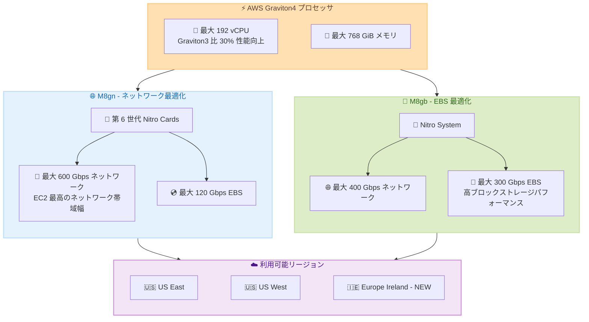

# Amazon EC2 - M8gn/M8gb インスタンスが Europe (Ireland) リージョンで利用可能に

**リリース日**: 2026 年 5 月 7 日
**サービス**: Amazon EC2
**機能**: M8gn/M8gb インスタンスのリージョン拡大

📊 [このアップデートのインフォグラフィックを見る](https://takech9203.github.io/aws-news-summary/20260507-amazon-ec2-m8gn-m8gb-aws-europe.html)

## 概要

Amazon EC2 M8gn および M8gb インスタンスが AWS Europe (Ireland) リージョンで利用可能になった。これらのインスタンスは AWS Graviton4 プロセッサを搭載し、Graviton3 プロセッサと比較して最大 30% 優れたコンピューティングパフォーマンスを提供する。最新の第 6 世代 AWS Nitro Cards を搭載している。

M8gn インスタンスは最大 600 Gbps のネットワーク帯域幅を提供し、ネットワーク最適化 EC2 インスタンスの中で最高のネットワーク帯域幅を実現する。M8gb インスタンスは最大 300 Gbps の EBS 帯域幅を提供し、同サイズの他の Graviton4 ベースインスタンスと比較してより高い EBS パフォーマンスを実現する。

**アップデート前の課題**

- M8gn/M8gb インスタンスは US East (N. Virginia) および US West (Oregon) リージョンでのみ利用可能だった
- 欧州地域でネットワーク集約型やブロックストレージ集約型のワークロードを Graviton4 で実行する場合、別リージョンを利用する必要があった
- GDPR 等のデータレジデンシー要件がある欧州のワークロードで、最新の Graviton4 ベースのネットワーク/ストレージ最適化インスタンスを利用できなかった

**アップデート後の改善**

- Europe (Ireland) リージョンで M8gn/M8gb インスタンスが利用可能になり、欧州でのデータレジデンシー要件を満たしながら高性能なインスタンスを活用できる
- 欧州地域の顧客に近いリージョンでワークロードを実行でき、レイテンシーが改善される
- US リージョンと Europe (Ireland) リージョンの間でのマルチリージョン構成が容易になった

## アーキテクチャ図

M8gn はネットワーク最適化、M8gb は EBS 最適化に特化した Graviton4 ベースのインスタンスであり、今回 Europe (Ireland) が利用可能リージョンに追加された。

## サービスアップデートの詳細

### 主要機能

1. **M8gn - ネットワーク最適化インスタンス**
   - 最大 600 Gbps のネットワーク帯域幅 (EC2 ネットワーク最適化インスタンスで最高)
   - 最大 120 Gbps の EBS 帯域幅
   - 最大 48xlarge および metal-48xl サイズ
   - 最大 768 GiB のメモリ
   - 16xlarge、24xlarge、48xlarge、metal-24xl、metal-48xl で EFA をサポート

2. **M8gb - ブロックストレージ最適化インスタンス**
   - 最大 300 Gbps の EBS 帯域幅
   - 最大 400 Gbps のネットワーク帯域幅
   - 最大 48xlarge および metal-48xl サイズ
   - 最大 768 GiB のメモリ
   - 16xlarge、24xlarge、48xlarge、metal-24xl、metal-48xl で EFA をサポート

3. **AWS Graviton4 プロセッサ**
   - Graviton3 比で最大 30% のコンピューティングパフォーマンス向上
   - 第 6 世代 AWS Nitro Cards を搭載
   - エネルギー効率に優れた ARM ベースアーキテクチャ

4. **Elastic Fabric Adapter (EFA) サポート**
   - 密結合クラスターでの低レイテンシー通信を実現
   - HPC やクラスターベースのワークロードのパフォーマンスを向上

## 技術仕様

### M8gn と M8gb の比較

| 項目 | M8gn | M8gb |
|------|------|------|
| 最適化対象 | ネットワーク | EBS ブロックストレージ |
| 最大ネットワーク帯域幅 | 600 Gbps | 400 Gbps |
| 最大 EBS 帯域幅 | 120 Gbps | 300 Gbps |
| 最大インスタンスサイズ | 48xlarge / metal-48xl | 48xlarge / metal-48xl |
| 最大メモリ | 768 GiB | 768 GiB |
| プロセッサ | AWS Graviton4 | AWS Graviton4 |
| Nitro Card | 第 6 世代 | 第 6 世代 |
| EFA サポート | 16xlarge 以上 | 16xlarge 以上 |

### インスタンスサイズ

M8gn および M8gb の両方で以下のサイズが利用可能:

- medium
- large
- xlarge
- 2xlarge
- 4xlarge
- 8xlarge
- 12xlarge
- 16xlarge
- 24xlarge
- 48xlarge
- metal-24xl
- metal-48xl

**注意**: Metal サイズは US East (N. Virginia) リージョンで利用可能。Europe (Ireland) での Metal サイズの利用可否は公式ドキュメントで確認が必要。

## メリット

### ビジネス面

- **データレジデンシー対応**: GDPR 等の欧州規制に準拠しながら、最新の高性能インスタンスを利用可能
- **レイテンシー改善**: 欧州の顧客やサービスに近いリージョンでワークロードを実行し、エンドユーザー体験を向上
- **コスト最適化**: Graviton4 の優れた価格パフォーマンスにより、同等ワークロードのコストを削減

### 技術面

- **高ネットワークスループット**: M8gn で最大 600 Gbps のネットワーク帯域幅により、大規模なデータ転送やネットワーク集約型処理が可能
- **高 EBS パフォーマンス**: M8gb で最大 300 Gbps の EBS 帯域幅により、I/O 集約型データベースワークロードの高速化
- **マルチリージョン構成**: US リージョンと EU リージョンでの冗長構成やフェイルオーバーが容易に

## デメリット・制約事項

### 制限事項

- Metal サイズ (metal-24xl、metal-48xl) は US East (N. Virginia) リージョンでのみ利用可能と明記されている
- ARM (Graviton4) ベースのため、x86 アーキテクチャ向けにコンパイルされたアプリケーションは再コンパイルまたはコンテナイメージの再構築が必要
- 全リージョンで均一に利用可能なわけではない (現時点で 3 リージョンのみ)

### 考慮すべき点

- Graviton4 への移行には、アプリケーションの ARM 互換性テストが必要
- 既存のワークロードを M8gn/M8gb に移行する場合、インスタンスサイズの選定とパフォーマンステストを推奨
- EFA を利用する場合は、対応するインスタンスサイズ (16xlarge 以上) の選択が必要

## ユースケース

### ユースケース 1: 欧州向け 5G ネットワーク機能

**シナリオ**: 欧州の通信事業者が 5G User Plane Function (UPF) を低レイテンシーで処理する必要がある。データ主権の観点から欧州リージョン内でのデータ処理が必須。

**効果**: M8gn の 600 Gbps ネットワーク帯域幅により、大規模な 5G トラフィックを Europe (Ireland) リージョンで直接処理できる。GDPR 準拠を維持しながら、最高のネットワークパフォーマンスを実現。

### ユースケース 2: 高性能データベースの欧州展開

**シナリオ**: 欧州市場向けの高性能 NoSQL データベースクラスターを構築する。大量の I/O 処理が必要であり、データは欧州内に保持する必要がある。

**効果**: M8gb の 300 Gbps EBS 帯域幅により、データベースの I/O パフォーマンスが大幅に向上。EFA サポートにより、クラスター間通信の低レイテンシーも実現。

### ユースケース 3: 分散インメモリキャッシュ

**シナリオ**: 欧州のユーザーにサービスを提供する Web アプリケーションのキャッシュレイヤーを、欧州リージョンでスケールアウトする必要がある。

**効果**: M8gn の高ネットワーク帯域幅により、キャッシュノード間のデータレプリケーションが高速化。最大 768 GiB のメモリと Graviton4 の高い処理性能により、大規模なインメモリキャッシュを効率的に運用可能。

## 料金

M8gn および M8gb インスタンスは、オンデマンドインスタンス、Savings Plans、スポットインスタンス、専用インスタンス、専用ホストとして購入可能。料金はリージョンとインスタンスサイズによって異なる。

詳細な料金については、[Amazon EC2 料金ページ](https://aws.amazon.com/ec2/pricing/on-demand/) を参照。

## 利用可能リージョン

M8gn および M8gb インスタンスは、以下の AWS リージョンで利用可能:

- US East (N. Virginia)
- US West (Oregon)
- Europe (Ireland) - **今回追加**

Metal サイズ (metal-24xl、metal-48xl) は US East (N. Virginia) リージョンで利用可能。

## 関連サービス・機能

- **AWS Graviton4**: 最新世代の AWS 設計 ARM ベースプロセッサ。前世代比で最大 30% のコンピューティングパフォーマンス向上
- **AWS Nitro System**: 第 6 世代 Nitro Cards によるハードウェアアクセラレーションにより、高いネットワーク/ストレージパフォーマンスを提供
- **Elastic Fabric Adapter (EFA)**: HPC および ML アプリケーション向けの高スループット、低レイテンシーネットワークインターフェース
- **Amazon EBS**: EC2 インスタンス向けの高性能ブロックストレージサービス

## 参考リンク

- 📊 [インフォグラフィック](https://takech9203.github.io/aws-news-summary/20260507-amazon-ec2-m8gn-m8gb-aws-europe.html)
- [公式発表 (What's New)](https://aws.amazon.com/about-aws/whats-new/2026/05/amazon-ec2-m8gn-m8gb-aws-europe/)
- [Amazon EC2 M8gn and M8gb Instances](https://aws.amazon.com/ec2/instance-types/m8g/)
- [料金ページ](https://aws.amazon.com/ec2/pricing/on-demand/)
- [Level up your compute with AWS Graviton](https://aws.amazon.com/ec2/graviton/level-up-with-graviton/)

## まとめ

Amazon EC2 M8gn および M8gb インスタンスが Europe (Ireland) リージョンで利用可能になったことで、欧州地域のデータレジデンシー要件を満たしながら、Graviton4 ベースの最高性能ネットワーク/ストレージ最適化インスタンスを活用できるようになった。欧州でネットワーク集約型ワークロードや高 I/O データベースを運用している場合は、M8gn/M8gb インスタンスへの移行を検討し、パフォーマンスとコストの最適化を実現することを推奨する。
