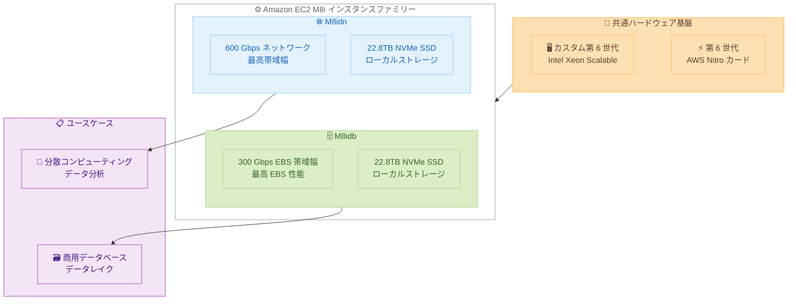

# Amazon EC2 M8idn / M8idb - 高性能ネットワーク・ストレージ最適化インスタンス

**リリース日**: 2026 年 5 月 7 日
**サービス**: Amazon EC2
**機能**: M8idn および M8idb インスタンスの一般提供開始

📊 [このアップデートのインフォグラフィックを見る](https://takech9203.github.io/aws-news-summary/20260507-amazon-ec2-m8idn-m8idb.html)

## 概要

AWS は Amazon EC2 M8idn および M8idb インスタンスの一般提供 (GA) を発表した。これらのインスタンスは、AWS 独自のカスタム第 6 世代 Intel Xeon Scalable プロセッサと、最新の第 6 世代 AWS Nitro カードを搭載しており、前世代の M6idn インスタンスと比較して vCPU あたり最大 43% の計算性能向上を実現する。

M8idn インスタンスは最大 600 Gbps のネットワーク帯域幅を提供し、Enhanced Networking 対応 EC2 インスタンスの中で最高のネットワーク帯域幅を誇る。M8idb インスタンスは最大 300 Gbps の EBS 帯域幅を提供し、非アクセラレーテッドコンピュート EC2 インスタンスの中で最高の EBS パフォーマンスを実現する。両インスタンスとも最大 22.8TB の NVMe SSD ローカルインスタンスストレージを搭載し、前世代比 3 倍の容量を提供する。

**アップデート前の課題**

- M6idn インスタンスではネットワーク帯域幅が最大 200 Gbps に制限されており、大規模な分散コンピューティングワークロードではネットワークがボトルネックになることがあった
- 前世代インスタンスの EBS 帯域幅では大規模商用データベースの I/O 要件を満たすことが困難な場合があった
- ローカル NVMe ストレージ容量が限定的で、大規模データセットを扱うワークロードに制約があった
- メモリ帯域幅の制限により、メモリインテンシブなワークロードでの性能が不十分だった

**アップデート後の改善**

- ネットワーク帯域幅が最大 600 Gbps に拡大し、高スループットの分散処理が可能になった (M8idn)
- EBS 帯域幅が最大 300 Gbps、1,440K IOPS に向上し、大規模データベースワークロードの I/O 要件を満たせるようになった (M8idb)
- ローカル NVMe SSD ストレージが最大 22.8TB に拡大し、前世代比 3 倍の容量を提供
- メモリ帯域幅が前世代比 3.3 倍に向上し、メモリインテンシブな処理が高速化された
- vCPU あたりの計算性能が最大 43% 向上し、コスト効率が改善された

## アーキテクチャ図



M8idn はネットワーク帯域幅に特化し、M8idb は EBS 帯域幅に特化したインスタンスであり、共通のハードウェア基盤上で異なるワークロード要件に対応する。

## サービスアップデートの詳細

### 主要機能

1. **カスタム第 6 世代 Intel Xeon Scalable プロセッサ**
   - AWS 専用に設計されたカスタムプロセッサ
   - vCPU あたり最大 43% の計算性能向上 (前世代 M6idn 比)
   - メモリ帯域幅が前世代比 3.3 倍に向上

2. **第 6 世代 AWS Nitro カード**
   - 最新世代の Nitro カードによるオフロード処理の効率化
   - ネットワーク、ストレージ、セキュリティ処理をハードウェアレベルで分離
   - ホスト CPU リソースをワークロードに最大限活用可能

3. **最大 600 Gbps ネットワーク帯域幅 (M8idn)**
   - Enhanced Networking 対応 EC2 インスタンスの中で最高のネットワーク帯域幅
   - ネットワークインテンシブな汎用ワークロードに最適化
   - 分散コンピューティング、リアルタイムビッグデータ分析に対応

4. **最大 300 Gbps EBS 帯域幅・1,440K IOPS (M8idb)**
   - 非アクセラレーテッドコンピュート EC2 インスタンスの中で最高の EBS パフォーマンス
   - ストレージインテンシブな汎用ワークロードに最適化
   - 大規模商用データベース、データレイク、NoSQL データベースに対応

5. **最大 22.8TB NVMe SSD ローカルインスタンスストレージ**
   - 前世代比 3 倍のローカルストレージ容量
   - 高速・低レイテンシのローカルブロックストレージ
   - M8idn、M8idb 両方に搭載

## 技術仕様

### M8idn インスタンスサイズ

| インスタンスサイズ | vCPU | メモリ (GiB) | ネットワーク帯域幅 (Gbps) | EBS 帯域幅 (Gbps) |
|------|------|------|------|------|
| m8idn.large | 2 | 8 | 最大 25 | 最大 10 |
| m8idn.xlarge | 4 | 16 | 最大 30 | 最大 10 |
| m8idn.2xlarge | 8 | 32 | 最大 40 | 最大 10 |
| m8idn.4xlarge | 16 | 64 | 最大 50 | 最大 10 |
| m8idn.8xlarge | 32 | 128 | 50 | 10 |
| m8idn.12xlarge | 48 | 192 | 75 | 15 |
| m8idn.16xlarge | 64 | 256 | 100 | 20 |
| m8idn.24xlarge | 96 | 384 | 150 | 30 |
| m8idn.32xlarge | 128 | 512 | 200 | 40 |
| m8idn.48xlarge | 192 | 768 | 300 | 60 |
| m8idn.96xlarge | 384 | 1536 | 600 | 120 |

### M8idb インスタンスサイズ

| インスタンスサイズ | vCPU | メモリ (GiB) | EBS 帯域幅 (Gbps) | EBS IOPS |
|------|------|------|------|------|
| m8idb.large | 2 | 8 | 最大 10 | - |
| m8idb.xlarge | 4 | 16 | 最大 10 | - |
| m8idb.2xlarge | 8 | 32 | 最大 10 | - |
| m8idb.4xlarge | 16 | 64 | 最大 10 | - |
| m8idb.8xlarge | 32 | 128 | 10 | - |
| m8idb.12xlarge | 48 | 192 | 15 | - |
| m8idb.16xlarge | 64 | 256 | 20 | - |
| m8idb.24xlarge | 96 | 384 | 30 | - |
| m8idb.32xlarge | 128 | 512 | 40 | - |
| m8idb.48xlarge | 192 | 768 | 60 | - |
| m8idb.96xlarge | 384 | 1536 | 300 | 1,440K |

### 前世代との比較

| 項目 | M6idn | M8idn/M8idb |
|------|------|------|
| プロセッサ | 第 3 世代 Intel Xeon | カスタム第 6 世代 Intel Xeon |
| Nitro カード | 第 4 世代 | 第 6 世代 |
| 計算性能 (vCPU あたり) | ベースライン | 最大 43% 向上 |
| メモリ帯域幅 | ベースライン | 3.3 倍 |
| 最大ネットワーク帯域幅 | 200 Gbps | 600 Gbps (M8idn) |
| 最大 EBS 帯域幅 | - | 300 Gbps (M8idb) |
| ローカルストレージ | 最大 7.6TB | 最大 22.8TB (3 倍) |

## 設定方法

### 前提条件

1. AWS アカウントと適切な IAM 権限
2. 対応リージョン (US East (N. Virginia)、US West (Oregon)、Europe (Spain)) での利用
3. VPC とサブネットの設定

### 手順

#### ステップ 1: AWS CLI でインスタンスを起動する

```bash
aws ec2 run-instances \
  --instance-type m8idn.8xlarge \
  --image-id ami-xxxxxxxxxxxxxxxxx \
  --subnet-id subnet-xxxxxxxxxxxxxxxxx \
  --security-group-ids sg-xxxxxxxxxxxxxxxxx \
  --key-name my-key-pair \
  --region us-east-1
```

M8idn インスタンスを起動するコマンド。インスタンスタイプを `m8idn.*` または `m8idb.*` に指定することで、各インスタンスファミリーを利用できる。

#### ステップ 2: ローカル NVMe ストレージのマウント

```bash
# NVMe デバイスの確認
lsblk

# ファイルシステムの作成とマウント
sudo mkfs.xfs /dev/nvme1n1
sudo mkdir /mnt/local-storage
sudo mount /dev/nvme1n1 /mnt/local-storage
```

M8idn/M8idb インスタンスに搭載されている NVMe SSD ローカルストレージをマウントして使用する。インスタンスストレージはエフェメラル (一時的) であり、インスタンス停止時にデータが消失する点に注意が必要。

#### ステップ 3: ネットワーク設定の最適化 (M8idn の場合)

```bash
# ENA Express の確認
aws ec2 describe-instances \
  --instance-ids i-xxxxxxxxxxxxxxxxx \
  --query 'Reservations[].Instances[].NetworkInterfaces[].Attachment.EnaSrdSpecification'

# Placement Group の利用（推奨）
aws ec2 create-placement-group \
  --group-name high-bandwidth-group \
  --strategy cluster \
  --region us-east-1
```

M8idn インスタンスの最大ネットワーク帯域幅を活用するには、クラスタープレイスメントグループ内での配置が推奨される。

## メリット

### ビジネス面

- **コスト効率の向上**: vCPU あたり 43% の性能向上により、同等のワークロードをより少ないインスタンス数で処理可能
- **ワークロード統合**: 高いネットワーク/ストレージ性能により、複数の小規模インスタンスを統合してインフラ管理コストを削減
- **柔軟な購入オプション**: Savings Plans、オンデマンド、スポットインスタンスに対応し、コスト最適化の選択肢が豊富

### 技術面

- **業界最高のネットワーク帯域幅**: 600 Gbps により、大規模分散システムでのデータ転送ボトルネックを解消 (M8idn)
- **最高の EBS パフォーマンス**: 300 Gbps EBS 帯域幅と 1,440K IOPS により、大規模データベースの I/O 要件に対応 (M8idb)
- **大容量ローカルストレージ**: 22.8TB NVMe SSD により、一時データやキャッシュの大規模処理が可能
- **最新世代 Nitro カード**: ハードウェアレベルのオフロードにより、ホスト CPU リソースをワークロードに最大限活用

## デメリット・制約事項

### 制限事項

- 利用可能リージョンが 3 リージョンに限定されている (2026 年 5 月時点)
- ローカルインスタンスストレージはエフェメラルであり、インスタンス停止・終了時にデータが消失する
- 最大帯域幅を利用するには大きなインスタンスサイズ (48xlarge 以上) が必要
- 小さなインスタンスサイズでは帯域幅にバースト上限がある (例: large で最大 25 Gbps)

### 考慮すべき点

- 既存の M6idn/M6idb ワークロードからの移行では、NVMe デバイス名の変更やドライバの互換性確認が必要
- 大規模インスタンス (96xlarge: 384 vCPU) はリージョン内のキャパシティ制約を受ける可能性がある
- ネットワーク帯域幅を最大限に活用するにはクラスタープレイスメントグループの使用が推奨される

## ユースケース

### ユースケース 1: リアルタイムビッグデータ分析

**シナリオ**: 大規模な分散データ分析クラスタで、ノード間のデータシャッフルがボトルネックになっている場合

**実装例**:
```bash
# M8idn.48xlarge を使用した Apache Spark クラスタの構成
aws ec2 run-instances \
  --instance-type m8idn.48xlarge \
  --count 10 \
  --placement "GroupName=spark-cluster" \
  --image-id ami-xxxxxxxxxxxxxxxxx \
  --region us-east-1
```

**効果**: 300 Gbps のネットワーク帯域幅 (48xlarge) と 22.8TB のローカル NVMe ストレージにより、Spark のシャッフル処理とスピルストレージの両方を高速化。前世代比で分析ジョブの完了時間を大幅に短縮可能。

### ユースケース 2: 大規模商用データベース

**シナリオ**: 大規模な Oracle Database や SQL Server を実行し、高い EBS スループットと低レイテンシのローカルストレージが必要な場合

**実装例**:
```bash
# M8idb.96xlarge でデータベースインスタンスを起動
aws ec2 run-instances \
  --instance-type m8idb.96xlarge \
  --image-id ami-xxxxxxxxxxxxxxxxx \
  --block-device-mappings '[{
    "DeviceName": "/dev/sda1",
    "Ebs": {
      "VolumeType": "io2",
      "VolumeSize": 1000,
      "Iops": 64000
    }
  }]' \
  --region us-east-1
```

**効果**: 300 Gbps EBS 帯域幅と 1,440K IOPS により、大規模 OLTP データベースの I/O ボトルネックを解消。ローカル NVMe ストレージを一時表領域やログバッファとして活用することで、データベース全体のレスポンスタイムが向上する。

### ユースケース 3: 高性能ファイルシステム

**シナリオ**: HPC (High Performance Computing) や AI/ML ワークロード向けに、高スループットの並列ファイルシステムを構築する場合

**実装例**:
```bash
# M8idn インスタンスで Lustre クライアントを構成
aws ec2 run-instances \
  --instance-type m8idn.24xlarge \
  --count 4 \
  --placement "GroupName=lustre-clients" \
  --image-id ami-xxxxxxxxxxxxxxxxx \
  --region us-west-2
```

**効果**: 150 Gbps のネットワーク帯域幅 (24xlarge) により、FSx for Lustre や自前の並列ファイルシステムへの高スループットアクセスを実現。AI/ML トレーニングジョブのデータ読み込み待ち時間を大幅に削減可能。

## 料金

M8idn および M8idb インスタンスは以下の購入オプションに対応している。

- **オンデマンド**: 使用した分だけ秒単位 (最低 60 秒) で課金
- **Savings Plans**: 1 年または 3 年のコミットメントにより割引
- **スポットインスタンス**: 未使用キャパシティを最大 90% 割引で利用可能

### 料金例

具体的な料金は EC2 料金ページを参照。一般的に、同世代の標準インスタンス (M8i) と比較して、ローカルストレージや強化されたネットワーク/EBS 帯域幅に対する追加プレミアムが含まれる。

| 購入オプション | 特徴 |
|--------|--------|
| オンデマンド | 初期費用なし、柔軟なスケーリング |
| Savings Plans (1 年) | オンデマンド比で割引 |
| Savings Plans (3 年) | 最大割引率 |
| スポットインスタンス | 最大 90% 割引、中断リスクあり |

## 利用可能リージョン

2026 年 5 月時点で以下の 3 リージョンで利用可能。

- US East (N. Virginia) - us-east-1
- US West (Oregon) - us-west-2
- Europe (Spain) - eu-south-2

今後、追加リージョンへの展開が予想される。

## 関連サービス・機能

- **Amazon EC2 M8i**: 同世代の標準汎用インスタンス (EBS のみ、ローカルストレージなし)
- **Amazon EC2 M8in**: 600 Gbps ネットワーク帯域幅を持つ M8i バリアント (ローカルストレージなし)
- **Amazon EC2 M8ib**: 300 Gbps EBS 帯域幅を持つ M8i バリアント (ローカルストレージなし)
- **Amazon EC2 M8ine**: 高パケット性能に特化した M8i バリアント
- **Amazon EBS io2 Block Express**: M8idb と組み合わせて最大の EBS パフォーマンスを発揮
- **Elastic Fabric Adapter (EFA)**: M8idn の高帯域幅ネットワークと組み合わせて HPC ワークロードに対応
- **AWS Nitro System**: 第 6 世代 Nitro カードによるハードウェアオフロード基盤

## 参考リンク

- 📊 [インフォグラフィック](https://takech9203.github.io/aws-news-summary/20260507-amazon-ec2-m8idn-m8idb.html)
- [公式発表 (What's New)](https://aws.amazon.com/about-aws/whats-new/2026/05/amazon-ec2-m8idn-m8idb/)
- [EC2 M8i インスタンスタイプ](https://aws.amazon.com/ec2/instance-types/m8i/)
- [EC2 料金ページ](https://aws.amazon.com/ec2/pricing/)
- [EC2 ドキュメント](https://docs.aws.amazon.com/ec2/)

## まとめ

Amazon EC2 M8idn および M8idb インスタンスは、カスタム第 6 世代 Intel Xeon プロセッサと第 6 世代 AWS Nitro カードにより、前世代比 43% の性能向上と業界最高レベルのネットワーク/EBS 帯域幅を実現する。ネットワークインテンシブな分散処理には M8idn、ストレージインテンシブなデータベースワークロードには M8idb を選択することで、大幅な性能改善が見込める。現在 M6idn/M6idb を使用しているワークロードについては、移行による性能向上とコスト効率改善の検証を推奨する。
