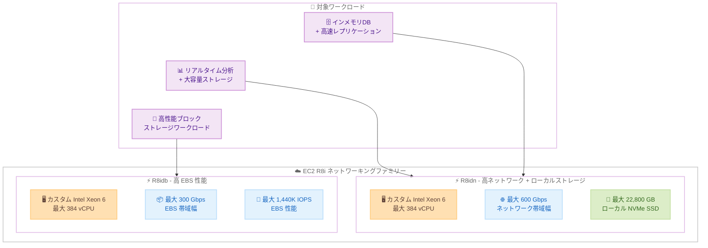

# Amazon EC2 - R8idn / R8idb インスタンス

**リリース日**: 2026 年 5 月 7 日
**サービス**: Amazon EC2
**機能**: R8idn および R8idb インスタンスタイプ

📊 [このアップデートのインフォグラフィックを見る](https://takech9203.github.io/aws-news-summary/20260507-amazon-ec2-r8idn-r8idb.html)

## 概要

AWS は、Amazon EC2 R8idn および R8idb インスタンスの一般提供を発表しました。これらのインスタンスは、AWS 専用のカスタム第 6 世代 Intel Xeon Scalable プロセッサと、最新の第 6 世代 AWS Nitro カードを搭載しています。前世代の R6in インスタンスと比較して、vCPU あたり最大 43% のコンピューティング性能向上を実現します。

R8idn は最大 600 Gbps のネットワーク帯域幅を提供し、拡張ネットワーキング対応 EC2 インスタンスの中で最高のネットワーク帯域幅を誇ります。さらに、最大 22,800 GB のローカル NVMe インスタンスストレージを搭載しています。R8idb は最大 300 Gbps の EBS 帯域幅と最大 1,440K IOPS を提供し、非アクセラレーテッドコンピュート EC2 インスタンスの中で最高の EBS 性能を実現します。

**アップデート前の課題**

- メモリ集約型ワークロードで高ネットワークスループットが必要な場合、既存の R6in インスタンスでは性能が不足していた
- ネットワーク帯域幅が 200 Gbps に制限されており、大規模な分散処理やデータ転送で制約となっていた
- EBS 集約型のメモリワークロードにおいて、ストレージ I/O がボトルネックとなっていた

**アップデート後の改善**

- vCPU あたり 43% のコンピューティング性能向上により、同じインスタンス数でより多くの処理が可能
- R8idn で 600 Gbps のネットワーク帯域幅により、大規模データ転送やクラスタ間通信が高速化
- R8idb で 300 Gbps の EBS 帯域幅と 1,440K IOPS により、ストレージ集約型ワークロードの大幅な高速化を実現
- 第 6 世代 Nitro カードによるハードウェアレベルでの効率改善

## アーキテクチャ図



R8idn はネットワーク帯域幅とローカル NVMe ストレージに特化し、R8idb は EBS 帯域幅と IOPS に特化した構成で、それぞれ異なるメモリ集約型ワークロードのニーズに対応します。

## サービスアップデートの詳細

### 主要機能

1. **カスタム第 6 世代 Intel Xeon Scalable プロセッサ**
   - AWS 専用に設計されたカスタムプロセッサ
   - vCPU あたり最大 43% のコンピューティング性能向上 (前世代 R6in 比)
   - メモリ集約型ワークロードに最適化されたアーキテクチャ

2. **第 6 世代 AWS Nitro カード**
   - 最新世代の Nitro カードによるハードウェアオフロード
   - ネットワーキングおよびストレージ処理の効率化
   - セキュリティとパフォーマンスの両立

3. **R8idn: 超高速ネットワーキング + ローカルストレージ**
   - 最大 600 Gbps のネットワーク帯域幅 (拡張ネットワーキング EC2 インスタンス中最高)
   - 最大 22,800 GB のローカル NVMe インスタンスストレージ
   - 高速ネットワークとローカルストレージの組み合わせが必要なワークロードに最適

4. **R8idb: 最高レベルの EBS 性能**
   - 最大 300 Gbps の EBS 帯域幅
   - 最大 1,440K IOPS (非アクセラレーテッドコンピュート EC2 インスタンス中最高)
   - ブロックストレージ性能が重要なメモリ集約型ワークロードに最適

## 技術仕様

### R8idn と R8idb の比較

| 項目 | R8idn | R8idb |
|------|-------|-------|
| プロセッサ | カスタム第 6 世代 Intel Xeon Scalable | カスタム第 6 世代 Intel Xeon Scalable |
| Nitro カード | 第 6 世代 | 第 6 世代 |
| 最大ネットワーク帯域幅 | 600 Gbps | 標準 |
| 最大 EBS 帯域幅 | 標準 | 300 Gbps |
| 最大 EBS IOPS | 標準 | 1,440K |
| ローカル NVMe ストレージ | 最大 22,800 GB | なし |
| コンピューティング性能向上 | 最大 43% (vs R6in) | 最大 43% (vs R6in) |

### 前世代との性能比較

| メトリクス | R8idn/R8idb | R6in (前世代) | 向上率 |
|-----------|-------------|---------------|--------|
| vCPU あたりコンピューティング性能 | 基準 | - | +43% |
| ネットワーク帯域幅 (R8idn) | 600 Gbps | 200 Gbps | 3 倍 |
| EBS 帯域幅 (R8idb) | 300 Gbps | - | 大幅向上 |
| EBS IOPS (R8idb) | 1,440K | - | 大幅向上 |
| ローカル NVMe (R8idn) | 22,800 GB | - | 大容量 |

### API 変更履歴

| 日付 | サービス | 変更内容 |
|------|----------|----------|
| 2026/05/07 | [Amazon Elastic Compute Cloud](https://awsapichanges.com/archive/changes/4fa215-ec2.html) | 1 updated api methods - DescribeInstanceTypes に IncludeUnsupportedInRegion パラメータ追加 |

### 想定されるインスタンスサイズ

R8i ファミリーの構成に基づき、以下のサイズが利用可能と想定されます。

| サイズ | vCPU | メモリ |
|--------|------|--------|
| r8idn.xlarge / r8idb.xlarge | 4 | 32 GiB |
| r8idn.2xlarge / r8idb.2xlarge | 8 | 64 GiB |
| r8idn.4xlarge / r8idb.4xlarge | 16 | 128 GiB |
| r8idn.8xlarge / r8idb.8xlarge | 32 | 256 GiB |
| r8idn.12xlarge / r8idb.12xlarge | 48 | 384 GiB |
| r8idn.16xlarge / r8idb.16xlarge | 64 | 512 GiB |
| r8idn.24xlarge / r8idb.24xlarge | 96 | 768 GiB |
| r8idn.48xlarge / r8idb.48xlarge | 192 | 1,536 GiB |
| r8idn.metal / r8idb.metal | 384 | 3,072 GiB |

## 設定方法

### 前提条件

1. AWS アカウントと EC2 起動権限
2. 対応リージョン (US East (N. Virginia, Ohio), US West (Oregon), Europe (Spain)) へのアクセス
3. R8idn/R8idb インスタンスタイプに対するサービスクォータの確認と引き上げ申請

### 手順

#### ステップ 1: サービスクォータの確認

```bash
aws service-quotas get-service-quota \
  --service-code ec2 \
  --quota-code L-417A185B \
  --region us-east-1
```

新しいインスタンスタイプはデフォルトのクォータが 0 の場合があるため、必要に応じてクォータ引き上げをリクエストします。

#### ステップ 2: R8idn インスタンスの起動

```bash
aws ec2 run-instances \
  --instance-type r8idn.8xlarge \
  --image-id ami-xxxxxxxxxxxxxxxxx \
  --subnet-id subnet-xxxxxxxxxxxxxxxxx \
  --security-group-ids sg-xxxxxxxxxxxxxxxxx \
  --key-name my-key-pair \
  --region us-east-1
```

R8idn インスタンスを起動します。ローカル NVMe ストレージが自動的にアタッチされます。

#### ステップ 3: R8idb インスタンスの起動と EBS ボリュームの設定

```bash
aws ec2 run-instances \
  --instance-type r8idb.8xlarge \
  --image-id ami-xxxxxxxxxxxxxxxxx \
  --subnet-id subnet-xxxxxxxxxxxxxxxxx \
  --security-group-ids sg-xxxxxxxxxxxxxxxxx \
  --key-name my-key-pair \
  --block-device-mappings '[{"DeviceName":"/dev/xvda","Ebs":{"VolumeSize":500,"VolumeType":"io2","Iops":64000}}]' \
  --region us-east-1
```

R8idb インスタンスを起動し、高性能 EBS ボリューム (io2) をアタッチして最大性能を引き出します。

#### ステップ 4: ローカル NVMe ストレージの初期化 (R8idn)

```bash
# NVMe デバイスの確認
lsblk

# ファイルシステムの作成
sudo mkfs -t xfs /dev/nvme1n1

# マウント
sudo mkdir -p /data
sudo mount /dev/nvme1n1 /data
```

R8idn のローカル NVMe ストレージは手動でフォーマットとマウントが必要です。エフェメラルストレージのためインスタンス停止でデータが失われる点に注意してください。

## メリット

### ビジネス面

- **コスト効率の向上**: vCPU あたり 43% の性能向上により、同じワークロードをより少ないインスタンスで処理可能
- **ネットワーク帯域幅の大幅拡張**: 600 Gbps のネットワーク帯域幅により、大規模データ転送のコスト削減と時間短縮
- **柔軟なストレージ選択**: ワークロード特性に応じてローカル NVMe (R8idn) または EBS (R8idb) を選択可能

### 技術面

- **最新ハードウェア**: 第 6 世代 Intel Xeon + 第 6 世代 Nitro カードの組み合わせによる最高レベルの性能
- **ネットワーク性能の革新**: 600 Gbps は拡張ネットワーキング EC2 インスタンスで最高値であり、クラスタ通信やレプリケーションが大幅に高速化
- **EBS 性能の最大化**: 1,440K IOPS は非アクセラレーテッドインスタンスで最高値であり、データベースワークロードに最適

## デメリット・制約事項

### 制限事項

- 利用可能リージョンが限定的 (3 リージョン、4 AZ のみ)
- 新しいインスタンスタイプのため、Reserved Instances やSavings Plans の適用に確認が必要
- R8idn のローカル NVMe ストレージはエフェメラル (インスタンス停止でデータ消失)

### 考慮すべき点

- 前世代 (R6in) からの移行には AMI の互換性確認が必要
- 大型インスタンスサイズはサービスクォータの引き上げが必要な場合がある
- R8idn と R8idb の選択はワークロードのストレージ特性に応じて適切に判断する必要がある
- 東京リージョンでの提供は現時点では未定

## ユースケース

### ユースケース 1: 大規模インメモリデータベースのレプリケーション

**シナリオ**: 複数のアベイラビリティゾーンにまたがる Redis クラスタや SAP HANA のシステムレプリケーションで、高ネットワーク帯域幅とローカルストレージが必要な場合。

**実装例**:
```bash
# R8idn.24xlarge で大規模 Redis クラスタノードを起動
aws ec2 run-instances \
  --instance-type r8idn.24xlarge \
  --placement '{"GroupName":"redis-cluster-pg"}' \
  --network-interfaces '[{"DeviceIndex":0,"Groups":["sg-xxx"],"SubnetId":"subnet-xxx","InterfaceType":"efa"}]' \
  --region us-east-1
```

**効果**: 600 Gbps のネットワーク帯域幅により、ノード間のデータレプリケーションが従来比 3 倍高速化。フェイルオーバー時の復旧時間を大幅に短縮。

### ユースケース 2: 高性能データベースの EBS 最適化

**シナリオ**: 大量のランダム I/O を伴う Oracle Database や SQL Server のミッションクリティカルなワークロードで、最高レベルの EBS 性能が必要な場合。

**実装例**:
```bash
# R8idb.16xlarge で高性能 DB サーバーを起動
aws ec2 run-instances \
  --instance-type r8idb.16xlarge \
  --block-device-mappings '[
    {"DeviceName":"/dev/xvda","Ebs":{"VolumeSize":100,"VolumeType":"gp3"}},
    {"DeviceName":"/dev/xvdf","Ebs":{"VolumeSize":2000,"VolumeType":"io2","Iops":256000}}
  ]' \
  --region us-east-1
```

**効果**: 300 Gbps の EBS 帯域幅と 1,440K IOPS により、トランザクション処理のレイテンシを最小化。大規模バッチ処理やレポート生成の所要時間を大幅に短縮。

### ユースケース 3: 分散機械学習の前処理パイプライン

**シナリオ**: 大量のトレーニングデータをネットワーク経由で収集し、ローカル NVMe に一時保存してデータ前処理を行う ML パイプライン。

**実装例**:
```bash
# R8idn.48xlarge でデータ前処理ノードを構成
aws ec2 run-instances \
  --instance-type r8idn.48xlarge \
  --block-device-mappings '[{"DeviceName":"/dev/xvda","Ebs":{"VolumeSize":100,"VolumeType":"gp3"}}]' \
  --tag-specifications 'ResourceType=instance,Tags=[{Key=Role,Value=ml-preprocessing}]' \
  --region us-west-2
```

**効果**: 600 Gbps のネットワーク帯域幅で S3 や他のデータソースから高速にデータを取得し、22,800 GB のローカル NVMe でデータシャッフルと前処理を実行。GPU インスタンスへのデータ供給ボトルネックを解消。

## 料金

料金はオンデマンド、Reserved Instances、Savings Plans、Spot インスタンスの各モデルで提供されます。具体的な料金は AWS の公式料金ページで確認してください。

### 料金の目安

R8idn/R8idb は高性能ネットワーキングおよびストレージを搭載しているため、標準的な R8i インスタンスより高い料金設定が想定されます。前世代 R6idn/R6idb からの移行では、性能向上分を考慮した TCO 比較を推奨します。

| 考慮事項 | 説明 |
|----------|------|
| オンデマンド料金 | リージョンおよびサイズにより異なる |
| Spot インスタンス | 最大 90% のコスト削減が可能 |
| Savings Plans | 1 年または 3 年のコミットメントで割引 |
| データ転送 | ネットワーク帯域幅の増加による転送コスト最適化 |

## 利用可能リージョン

以下のリージョンで利用可能です。

| リージョン | リージョンコード |
|-----------|----------------|
| US East (N. Virginia) | us-east-1 |
| US East (Ohio) | us-east-2 |
| US West (Oregon) | us-west-2 |
| Europe (Spain) | eu-south-2 |

今後、追加のリージョンでの提供が予定されています。東京リージョン (ap-northeast-1) での提供時期は現時点で未発表です。

## 関連サービス・機能

- **Amazon EC2 R8i / R8id**: 同世代のメモリ最適化インスタンスファミリー。標準ネットワーク帯域幅の汎用メモリ最適化用途
- **AWS Nitro System**: R8idn/R8idb を支えるハードウェア基盤。第 6 世代 Nitro カードにより性能とセキュリティを両立
- **Amazon EBS io2 Block Express**: R8idb と組み合わせて最大 256,000 IOPS の単一ボリューム性能を実現
- **Elastic Fabric Adapter (EFA)**: R8idn の高ネットワーク帯域幅と組み合わせてクラスタ通信を最適化
- **EC2 Placement Groups**: クラスタ配置グループにより低レイテンシのノード間通信を実現

## 参考リンク

- 📊 [インフォグラフィック](https://takech9203.github.io/aws-news-summary/20260507-amazon-ec2-r8idn-r8idb.html)
- [公式発表 (What's New)](https://aws.amazon.com/about-aws/whats-new/2026/03/amazon-ec2-r8idn-r8idb/)
- [Amazon EC2 R8i インスタンスタイプ](https://aws.amazon.com/ec2/instance-types/r8i/)
- [Amazon EC2 料金ページ](https://aws.amazon.com/ec2/pricing/)
- [AWS Nitro System](https://aws.amazon.com/ec2/nitro/)

## まとめ

Amazon EC2 R8idn および R8idb は、メモリ集約型ワークロードに対してネットワーク帯域幅またはブロックストレージ性能のいずれかを最大化する選択肢を提供します。R8idn の 600 Gbps ネットワーク帯域幅は EC2 拡張ネットワーキングインスタンスで最高値、R8idb の 1,440K IOPS は非アクセラレーテッドインスタンスで最高値であり、いずれも業界をリードする性能です。現在 R6in/R6idn を使用しているワークロードでは、43% の性能向上と大幅に強化された I/O 性能により、移行検討を推奨します。
