# Amazon EC2 - X8i インスタンスのヨーロッパ (アイルランド) およびアジアパシフィック (ムンバイ) リージョン提供開始

**リリース日**: 2026 年 5 月 7 日
**サービス**: Amazon EC2
**機能**: X8i インスタンスのヨーロッパ (アイルランド) およびアジアパシフィック (ムンバイ) リージョン提供開始

📊 [このアップデートのインフォグラフィックを見る](https://takech9203.github.io/aws-news-summary/20260507-amazon-ec2-x8i-instances-BOM-DUB-region.html)

## 概要

Amazon EC2 X8i インスタンスがヨーロッパ (アイルランド) およびアジアパシフィック (ムンバイ) リージョンで利用可能になりました。X8i インスタンスは、AWS 独自のカスタム Intel Xeon 6 プロセッサを搭載した次世代メモリ最適化インスタンスであり、クラウド上の同等 Intel プロセッサの中で最高のパフォーマンスと最速のメモリ帯域幅を提供します。SAP 認定を取得しており、SAP HANA、大規模データベース、データ分析、電子設計自動化 (EDA) などのメモリ集約型ワークロードに最適です。

前世代の X2i インスタンスと比較して、最大 43% の高パフォーマンス、1.5 倍のメモリ容量 (最大 6TB)、3.3 倍のメモリ帯域幅を実現します。14 種類のサイズ (large から 96xlarge まで) が用意されており、2 つのベアメタルオプションも含まれています。

今回のアイルランドおよびムンバイリージョン追加により、X8i インスタンスは合計 8 リージョンで利用可能となりました。特にアジアパシフィック地域での初めての提供となるムンバイリージョンの追加は、インド市場の顧客にとって大きな意味を持ちます。

**アップデート前の課題**

- アジアパシフィック地域では X8i インスタンスが利用できず、メモリ集約型ワークロードに次世代インスタンスを使用するには米国またはヨーロッパリージョンを選択する必要があった
- ヨーロッパ (アイルランド) リージョンを利用する既存顧客は、X8i インスタンスを使用するためにフランクフルトやストックホルムへのワークロード移行が必要だった
- インドのデータレジデンシー要件を持つ顧客は、X8i インスタンスの高パフォーマンスを享受できなかった

**アップデート後の改善**

- アジアパシフィック (ムンバイ) リージョンで X8i インスタンスが利用可能になり、インド市場の顧客がデータレジデンシー要件に対応しながら次世代メモリ最適化インスタンスを活用できるようになった
- ヨーロッパ (アイルランド) リージョンの追加により、ヨーロッパの顧客は 4 つのリージョン (フランクフルト、ストックホルム、パリ、アイルランド) から X8i インスタンスを選択可能になった
- アジアパシフィック地域のユーザーに対するレイテンシーが大幅に改善された

## アーキテクチャ図

```mermaid
flowchart TD
    subgraph X8i["⚙️ Amazon EC2 X8i インスタンス"]
        direction LR
        CPU["🔧 カスタム Intel<br/>Xeon 6 プロセッサ"]
        MEM["💾 メモリ<br/>最大 6TB"]
        PERF["📈 パフォーマンス<br/>X2i 比 43% 向上"]
        CPU ~~~ MEM ~~~ PERF
    end

    subgraph Workloads["🏢 対象ワークロード"]
        direction LR
        SAP["📊 SAP HANA"]
        DB["🗄️ 大規模<br/>データベース"]
        Analytics["📉 データ分析"]
        EDA["🔬 EDA"]
        SAP ~~~ DB ~~~ Analytics ~~~ EDA
    end

    subgraph USRegions["🇺🇸 米国リージョン"]
        direction LR
        Virginia["us-east-1<br/>バージニア北部"]
        Ohio["us-east-2<br/>オハイオ"]
        Oregon["us-west-2<br/>オレゴン"]
        Virginia ~~~ Ohio ~~~ Oregon
    end

    subgraph EURegions["🇪🇺 ヨーロッパリージョン"]
        direction LR
        Frankfurt["eu-central-1<br/>フランクフルト"]
        Stockholm["eu-north-1<br/>ストックホルム"]
        Paris["eu-west-3<br/>パリ"]
        Ireland["eu-west-1<br/>アイルランド 🆕"]
        Frankfurt ~~~ Stockholm ~~~ Paris ~~~ Ireland
    end

    subgraph APRegions["🌏 アジアパシフィックリージョン"]
        direction LR
        Mumbai["ap-south-1<br/>ムンバイ 🆕"]
    end

    X8i --> Workloads
    X8i --> USRegions
    X8i --> EURegions
    X8i --> APRegions

    classDef cloud fill:none,stroke:#CCCCCC,stroke-width:2px,color:#666666
    classDef compute fill:#FFE0B2,stroke:#FFCC80,stroke-width:2px,color:#5D4037
    classDef storage fill:#DCEDC8,stroke:#C5E1A5,stroke-width:2px,color:#33691E
    classDef process fill:#FFFFFF,stroke:#4A90E2,stroke-width:2px,color:#333333
    classDef internal fill:#E8F1FF,stroke:#4A90E2,stroke-width:2px,color:#333333
    classDef input fill:#E9F7EC,stroke:#66BB6A,stroke-width:2px,color:#333333
    classDef decision fill:#F3E5F5,stroke:#7B61FF,stroke-width:2px,color:#333333

    class X8i,Workloads,USRegions,EURegions,APRegions cloud
    class CPU,MEM,PERF compute
    class SAP,DB,Analytics,EDA input
    class Virginia,Ohio,Oregon internal
    class Frankfurt,Stockholm,Paris process
    class Ireland,Mumbai decision
```



X8i インスタンスのアーキテクチャと利用可能リージョンを示しています。今回新たに追加されたアイルランドおよびムンバイリージョンにより、グローバルでの選択肢が 8 リージョンに拡大しました。

## サービスアップデートの詳細

### 主要機能

1. **次世代メモリ最適化インスタンス**
   - AWS 独自のカスタム Intel Xeon 6 プロセッサを搭載 (AWS でのみ利用可能)
   - クラウド上の同等 Intel プロセッサの中で最高のパフォーマンスと最速のメモリ帯域幅を実現
   - SAP 認定取得済みで、エンタープライズワークロードに対応

2. **前世代からの大幅なパフォーマンス向上**
   - X2i 比で最大 43% の総合パフォーマンス向上
   - 1.5 倍のメモリ容量 (最大 6TB)
   - 3.3 倍のメモリ帯域幅向上

3. **豊富なインスタンスサイズ**
   - 14 種類のサイズを提供 (large から 96xlarge まで)
   - 2 つのベアメタルオプションを含む
   - ワークロードの規模に応じた柔軟なサイズ選択が可能

## 技術仕様

### X8i インスタンスの性能比較 (X2i 比)

| 項目 | X8i の改善 |
|------|------|
| 総合パフォーマンス | 最大 43% 向上 |
| メモリ容量 | 1.5 倍 (最大 6TB) |
| メモリ帯域幅 | 3.3 倍 |
| インスタンスサイズ | 14 種類 (large - 96xlarge) |
| ベアメタルオプション | 2 種類 |
| プロセッサ | カスタム Intel Xeon 6 |

### インスタンスサイズ一覧

| サイズ範囲 | 詳細 |
|------|------|
| 最小サイズ | x8i.large |
| 最大サイズ | x8i.96xlarge |
| ベアメタル | 2 オプション |
| 合計サイズ数 | 14 種類 |

### API 変更履歴

今回のアップデートはリージョン拡張であり、新しい API やパラメータの追加は伴いません。X8i インスタンスの起動には既存の EC2 RunInstances API を使用します。

### 購入オプション

```json
{
    "InstanceType": "x8i.xlarge",
    "Placement": {
        "AvailabilityZone": "ap-south-1a"
    },
    "PurchaseOptions": [
        "On-Demand",
        "Savings Plans",
        "Spot Instances"
    ]
}
```

## 設定方法

### 前提条件

1. AWS アカウントが有効化されていること
2. ヨーロッパ (アイルランド) リージョン (eu-west-1) またはアジアパシフィック (ムンバイ) リージョン (ap-south-1) へのアクセスが可能であること
3. AWS CLI v2 がインストールおよび設定されていること
4. 適切な IAM 権限 (ec2:RunInstances など) が付与されていること

### 手順

#### ステップ 1: リージョンとインスタンスタイプの確認

```bash
# ムンバイリージョンで X8i インスタンスの利用可能状況を確認
aws ec2 describe-instance-type-offerings \
  --location-type availability-zone \
  --filters "Name=instance-type,Values=x8i.*" \
  --region ap-south-1 \
  --query "InstanceTypeOfferings[].{Type:InstanceType,Zone:Location}" \
  --output table
```

ムンバイリージョンで利用可能な X8i インスタンスサイズとアベイラビリティゾーンを一覧表示します。

#### ステップ 2: X8i インスタンスの起動

```bash
# X8i インスタンスをムンバイリージョンで起動
aws ec2 run-instances \
  --instance-type x8i.xlarge \
  --image-id ami-xxxxxxxxxxxxxxxxx \
  --key-name my-key-pair \
  --security-group-ids sg-xxxxxxxxxxxxxxxxx \
  --subnet-id subnet-xxxxxxxxxxxxxxxxx \
  --region ap-south-1 \
  --tag-specifications 'ResourceType=instance,Tags=[{Key=Name,Value=x8i-mumbai-instance}]'
```

ムンバイリージョンで X8i インスタンスを起動します。AMI ID はリージョン固有のため、ムンバイリージョンで利用可能な AMI を指定してください。

#### ステップ 3: アイルランドリージョンでの起動

```bash
# X8i インスタンスをアイルランドリージョンで起動
aws ec2 run-instances \
  --instance-type x8i.xlarge \
  --image-id ami-xxxxxxxxxxxxxxxxx \
  --key-name my-key-pair \
  --security-group-ids sg-xxxxxxxxxxxxxxxxx \
  --subnet-id subnet-xxxxxxxxxxxxxxxxx \
  --region eu-west-1 \
  --tag-specifications 'ResourceType=instance,Tags=[{Key=Name,Value=x8i-ireland-instance}]'
```

アイルランドリージョンで X8i インスタンスを起動します。eu-west-1 は AWS で最も広く利用されているヨーロッパリージョンの一つです。

## メリット

### ビジネス面

- **インド市場への対応**: アジアパシフィック (ムンバイ) リージョンの追加により、インドのデータレジデンシー要件を持つ顧客が次世代メモリ最適化インスタンスを初めて利用できるようになった
- **ヨーロッパでの選択肢拡大**: アイルランドリージョンの追加により、ヨーロッパの顧客は 4 つのリージョンから X8i インスタンスを選択でき、既存のアイルランドリージョン利用顧客がワークロードを移行せずに X8i を導入できる
- **グローバル展開の加速**: 8 リージョンでの提供により、グローバルに展開する企業がより多くの地域で統一的なインフラストラクチャを構築できる

### 技術面

- **レイテンシーの大幅削減**: アジアパシフィック地域のユーザーは、米国やヨーロッパへのアクセスが不要になり、ムンバイリージョンを活用してレイテンシーを大幅に削減できる
- **マルチリージョン DR 構成の強化**: アイルランドとムンバイの追加により、グローバルな高可用性構成やディザスタリカバリ戦略の選択肢が広がった
- **大幅なパフォーマンス向上**: X2i からの移行により、同等コストで最大 43% のパフォーマンス向上と 1.5 倍のメモリ容量を実現できる

## デメリット・制約事項

### 制限事項

- X8i インスタンスは現時点で 8 リージョンでの提供であり、東京リージョンなどその他のアジアパシフィックリージョンではまだ利用できない
- ベアメタルインスタンスは特定のユースケースに限定されるため、すべてのワークロードに適しているわけではない
- X2i からの移行にあたり、オペレーティングシステムやアプリケーションの互換性確認が必要

### 考慮すべき点

- 大規模メモリインスタンスは起動時間が通常のインスタンスより長くなる場合がある
- X8i インスタンスの料金は X2i と異なるため、移行前にコスト分析を実施することを推奨
- Savings Plans や Reserved Instances の既存の契約がある場合、X8i への適用可否を確認する必要がある
- ムンバイリージョンは初めての X8i 提供となるため、初期段階ではキャパシティに制約がある可能性がある

## ユースケース

### ユースケース 1: インドでの SAP HANA ワークロード

**シナリオ**: インドに拠点を置く企業が、インド国内のデータレジデンシー要件に準拠しながら SAP HANA を高パフォーマンスで運用する必要がある。

**実装例**:
```bash
# SAP HANA 向け X8i 大規模インスタンスの起動
aws ec2 run-instances \
  --instance-type x8i.24xlarge \
  --image-id ami-xxxxxxxxxxxxxxxxx \
  --region ap-south-1 \
  --placement '{"AvailabilityZone":"ap-south-1a"}' \
  --block-device-mappings '[{
    "DeviceName": "/dev/sda1",
    "Ebs": {
      "VolumeSize": 500,
      "VolumeType": "gp3",
      "Iops": 16000,
      "Throughput": 1000
    }
  }]' \
  --tag-specifications 'ResourceType=instance,Tags=[{Key=Name,Value=sap-hana-mumbai},{Key=Application,Value=SAP-HANA}]'
```

**効果**: インド国内のデータレジデンシー要件を満たしながら、X2i 比で最大 43% のパフォーマンス向上により SAP HANA のレスポンスタイムが大幅に改善される。これまで海外リージョンへの依存が必要だったワークロードを国内で完結できる。

### ユースケース 2: グローバルマルチリージョンデータベース構成

**シナリオ**: グローバルに展開する企業が、ヨーロッパとアジアパシフィックの両地域で高可用性が求められる大規模データベースを運用する。

**実装例**:
```bash
# アイルランドのプライマリインスタンス
aws ec2 run-instances \
  --instance-type x8i.16xlarge \
  --region eu-west-1 \
  --tag-specifications 'ResourceType=instance,Tags=[{Key=Role,Value=primary-db},{Key=Region,Value=europe}]'

# ムンバイのリードレプリカインスタンス
aws ec2 run-instances \
  --instance-type x8i.16xlarge \
  --region ap-south-1 \
  --tag-specifications 'ResourceType=instance,Tags=[{Key=Role,Value=read-replica},{Key=Region,Value=apac}]'
```

**効果**: ヨーロッパとアジアパシフィックの両地域で X8i インスタンスを使用したグローバルデータベース構成を構築でき、各地域のユーザーに低レイテンシーでサービスを提供できる。PostgreSQL の場合は X2i 比で最大 47% の高速化が期待できる。

### ユースケース 3: インドでのインメモリデータ分析基盤

**シナリオ**: インドの金融機関が、リアルタイムのリスク分析やトランザクション処理のために大規模なインメモリデータ分析基盤をムンバイリージョンで構築する。

**実装例**:
```bash
# データ分析向けの大容量メモリインスタンスの起動
aws ec2 run-instances \
  --instance-type x8i.48xlarge \
  --region ap-south-1 \
  --tag-specifications 'ResourceType=instance,Tags=[{Key=Name,Value=analytics-mumbai},{Key=Workload,Value=in-memory-analytics}]'
```

**効果**: 最大 6TB のメモリ容量を活用して大規模なデータセットをインメモリで処理でき、3.3 倍のメモリ帯域幅向上により高速なリアルタイム分析が可能。インドの金融規制に準拠しながら、データを国外に転送することなく分析を実行できる。

## 料金

X8i インスタンスは On-Demand、Savings Plans、Spot Instances の 3 つの購入オプションで利用可能です。料金はインスタンスサイズとリージョンによって異なります。

### 料金例

| 購入オプション | 説明 |
|--------|------------------|
| On-Demand | 長期契約なしの従量課金。短期利用やテストに適している |
| Savings Plans | 1 年または 3 年の使用量コミットメントにより最大 72% の割引 |
| Spot Instances | 未使用キャパシティを最大 90% 割引で利用。中断耐性のあるワークロード向け |

最新の料金情報は [Amazon EC2 料金ページ](https://aws.amazon.com/ec2/pricing/) を確認してください。

## 利用可能リージョン

X8i インスタンスは以下の 8 つの AWS リージョンで利用可能です。

| リージョン名 | リージョンコード |
|------|------|
| 米国東部 (バージニア北部) | us-east-1 |
| 米国東部 (オハイオ) | us-east-2 |
| 米国西部 (オレゴン) | us-west-2 |
| ヨーロッパ (フランクフルト) | eu-central-1 |
| ヨーロッパ (ストックホルム) | eu-north-1 |
| ヨーロッパ (パリ) | eu-west-3 |
| ヨーロッパ (アイルランド) 🆕 | eu-west-1 |
| アジアパシフィック (ムンバイ) 🆕 | ap-south-1 |

## 関連サービス・機能

- **Amazon EC2 X2i インスタンス**: X8i の前世代にあたるメモリ最適化インスタンス。X8i への移行により大幅なパフォーマンス向上が期待できる
- **AWS Savings Plans**: X8i インスタンスの長期利用に対する割引を提供。Compute Savings Plans は X2i から X8i への移行時にも自動的に適用される
- **Amazon EBS**: X8i インスタンスと組み合わせるブロックストレージサービス。高い帯域幅を活用してデータベースワークロードのパフォーマンスを最大化できる
- **SAP on AWS**: SAP 認定インスタンスとして、SAP HANA やその他の SAP ワークロードの実行をサポートする AWS のプログラム
- **AWS Nitro System**: X8i インスタンスの基盤となるハードウェアおよびソフトウェアプラットフォーム。セキュリティとパフォーマンスを向上させる

## 参考リンク

- 📊 [インフォグラフィック](https://takech9203.github.io/aws-news-summary/20260507-amazon-ec2-x8i-instances-BOM-DUB-region.html)
- [公式発表 (What's New)](https://aws.amazon.com/about-aws/whats-new/2026/02/amazon-ec2-x8i-instances-BOM-DUB-region/)
- [Amazon EC2 X8i インスタンスページ](https://aws.amazon.com/ec2/instance-types/x8i/)
- [Amazon EC2 料金ページ](https://aws.amazon.com/ec2/pricing/)
- [SAP on AWS ドキュメント](https://aws.amazon.com/sap/)

## まとめ

Amazon EC2 X8i インスタンスがヨーロッパ (アイルランド) およびアジアパシフィック (ムンバイ) リージョンで利用可能になりました。特にムンバイリージョンはアジアパシフィック地域初の X8i 提供となり、インド市場の顧客がデータレジデンシー要件に対応しながら次世代メモリ最適化インスタンスを活用できるようになります。X2i 比で最大 43% のパフォーマンス向上と 1.5 倍のメモリ容量 (最大 6TB) を提供する X8i は、SAP HANA、大規模データベース、データ分析などのメモリ集約型ワークロードに最適です。既存の X2i ユーザーや新規リージョンでメモリ集約型ワークロードを計画している顧客は、X8i への移行または採用を検討することを推奨します。
