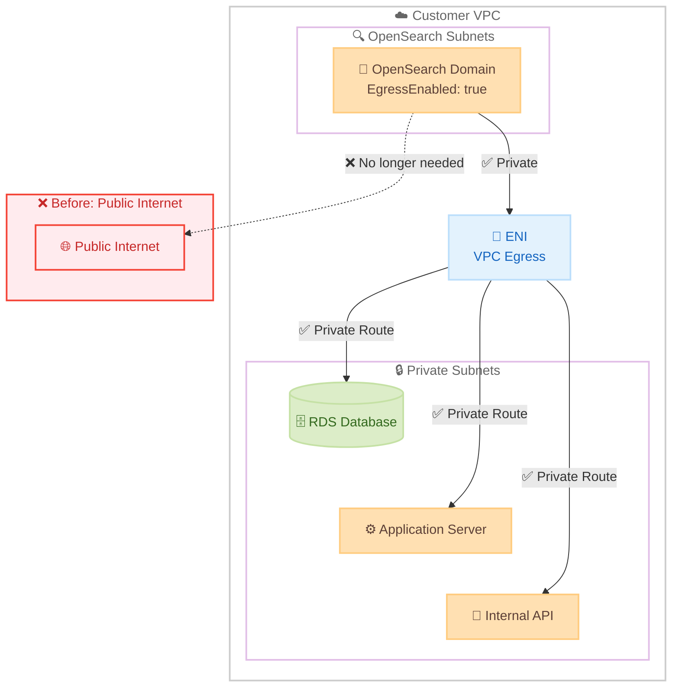

# Amazon OpenSearch Service - VPC Egress によるプライベート接続

**リリース日**: 2026年5月7日
**サービス**: Amazon OpenSearch Service
**機能**: VPC Egress for Private Connectivity

📊 [このアップデートのインフォグラフィックを見る](https://takech9203.github.io/aws-news-summary/20260507-amazon-opensearch-service-vpc.html)

## 概要

Amazon OpenSearch Service が VPC Egress をサポートし、OpenSearch ドメインから顧客の VPC 内のリソースへプライベートに接続できるようになった。この機能により、OpenSearch ドメインからのアウトバウンドトラフィックがパブリックインターネットを経由せずに、VPC 内のリソースへ直接ルーティングされる。

この機能は、OpenSearch のアラート通知、カスタムプラグイン、インジェストパイプラインなどが VPC 内のリソース (データベース、アプリケーションサーバー、内部 API など) にアクセスする必要がある場合に特に有用である。セキュリティとコンプライアンスの要件が厳しい環境において、すべての通信をプライベートネットワーク内に閉じることが可能になる。

**アップデート前の課題**

- OpenSearch ドメインから VPC 内のリソースへ通信する際、パブリックインターネットを経由する必要があった
- セキュリティ要件の厳しい環境では、OpenSearch からの外部通信に対する追加のネットワーク制御が必要だった
- VPC 内のリソースへのプライベート接続のために、複雑なネットワーク構成 (NAT Gateway、VPN、プロキシ等) が必要だった

**アップデート後の改善**

- OpenSearch ドメインから VPC 内リソースへの通信がプライベートネットワーク経由で完結する
- `VPCOptions` の `EgressEnabled` パラメータを `true` に設定するだけで VPC Egress を有効化できる
- パブリックインターネットを経由しないため、データ漏洩リスクの低減とネットワークセキュリティの強化が実現する

## アーキテクチャ図



VPC Egress を有効にすると、OpenSearch ドメインは ENI (Elastic Network Interface) を介して VPC 内のリソースへプライベートに接続する。パブリックインターネットを経由する従来のルートは不要になる。

## サービスアップデートの詳細

### 主要機能

1. **VPC Egress の有効化**
   - ドメイン作成時または VPC エンドポイント作成時に `EgressEnabled: true` を指定
   - 既存のドメインに対しても設定変更で有効化可能
   - セキュリティグループとサブネットの指定と組み合わせて利用

2. **プライベートアウトバウンド接続**
   - OpenSearch ドメインから VPC 内リソースへのすべてのアウトバウンドトラフィックがプライベートルート経由
   - VPC ピアリング、Transit Gateway 経由の他 VPC リソースへの接続も可能
   - セキュリティグループによるトラフィック制御が適用される

3. **既存 VPC 機能との統合**
   - 既存の VPC アクセス (インバウンド) と併用可能
   - サブネット、セキュリティグループ、ルートテーブルの既存設定を活用
   - VPC Flow Logs によるトラフィック監視に対応

## 技術仕様

### API 変更内容

| 項目 | 詳細 |
|------|------|
| 新規パラメータ | `VPCOptions.EgressEnabled` (boolean) |
| 対象 API | CreateDomain, CreateVpcEndpoint, DescribeDomain, UpdateDomainConfig 等 |
| 変更 API 数 | 10 メソッド (全て updated) |
| デフォルト値 | `false` (従来と同じ動作) |

### API 変更履歴

| 日付 | サービス | 変更内容 |
|------|----------|----------|
| 2026/05/05 | [Amazon OpenSearch Service](https://awsapichanges.com/archive/changes/2d415e-es.html) | 10 updated api methods - VPC Egress 対応 |

### VPCOptions 設定例

```json
{
  "VPCOptions": {
    "SubnetIds": [
      "subnet-0123456789abcdef0",
      "subnet-0123456789abcdef1"
    ],
    "SecurityGroupIds": [
      "sg-0123456789abcdef0"
    ],
    "EgressEnabled": true
  }
}
```

## 設定方法

### 前提条件

1. OpenSearch ドメインが VPC アクセスモードで構成されていること
2. VPC 内に適切なサブネットとセキュリティグループが存在すること
3. ターゲットリソースが同一 VPC 内、またはピアリング/Transit Gateway 経由でアクセス可能であること

### 手順

#### ステップ 1: セキュリティグループの準備

```bash
# OpenSearch ドメイン用のセキュリティグループを作成
aws ec2 create-security-group \
  --group-name opensearch-egress-sg \
  --description "Security group for OpenSearch VPC egress" \
  --vpc-id vpc-0123456789abcdef0

# アウトバウンドルールの設定 (ターゲットリソースへの通信を許可)
aws ec2 authorize-security-group-egress \
  --group-id sg-0123456789abcdef0 \
  --protocol tcp \
  --port 443 \
  --cidr 10.0.0.0/16
```

OpenSearch ドメインからのアウトバウンドトラフィックを許可するセキュリティグループを設定する。ターゲットリソースのポートと CIDR に合わせて適切に制限する。

#### ステップ 2: ドメイン作成時に VPC Egress を有効化

```bash
aws opensearch create-domain \
  --domain-name my-domain \
  --engine-version OpenSearch_2.17 \
  --cluster-config InstanceType=r6g.large.search,InstanceCount=2 \
  --ebs-options EBSEnabled=true,VolumeType=gp3,VolumeSize=100 \
  --vpc-options SubnetIds=subnet-0123456789abcdef0,subnet-0123456789abcdef1,SecurityGroupIds=sg-0123456789abcdef0,EgressEnabled=true
```

新規ドメイン作成時に `EgressEnabled=true` を指定することで VPC Egress を有効化する。

#### ステップ 3: 既存ドメインの更新

```bash
aws opensearch update-domain-config \
  --domain-name my-existing-domain \
  --vpc-options EgressEnabled=true
```

既存の VPC ドメインに対しても、ドメイン設定の更新により VPC Egress を有効化できる。

## メリット

### ビジネス面

- **コンプライアンス要件への対応**: 金融、医療、政府機関などの規制が厳しい業界において、すべての通信をプライベートネットワーク内に閉じる要件を満たせる
- **運用コストの削減**: NAT Gateway やプロキシサーバーなどの中間インフラストラクチャが不要になる場合があり、コスト削減につながる
- **セキュリティ監査の簡素化**: プライベート通信のみであることを証明しやすくなり、セキュリティ監査への対応が容易になる

### 技術面

- **ネットワーク構成の簡素化**: 複雑な NAT Gateway やプロキシ構成が不要になり、アーキテクチャがシンプルになる
- **レイテンシーの低減**: パブリックインターネットを経由しないため、通信のレイテンシーが低くなる
- **セキュリティの強化**: 通信経路が VPC 内に限定されるため、データ漏洩やフィッシング攻撃のリスクが低減する

## デメリット・制約事項

### 制限事項

- VPC アクセスモードで構成されたドメインでのみ利用可能 (パブリックアクセスモードでは利用不可)
- VPC Egress を有効にすると、アウトバウンドトラフィックは VPC のルーティングルールに従う
- セキュリティグループとルートテーブルの適切な設定が必須

### 考慮すべき点

- VPC Egress を有効にした後のセキュリティグループルールの見直しが必要
- 外部インターネットへのアクセスが必要な場合は、VPC 内に NAT Gateway を別途設定する必要がある
- VPC ピアリングや Transit Gateway を使用する場合、適切なルーティング設定が必要

## ユースケース

### ユースケース 1: アラート通知の内部 API 連携

**シナリオ**: OpenSearch のアラートモニターが異常を検知した際に、VPC 内の社内 Webhook サーバーへ通知を送信する。

**実装例**:
```json
{
  "type": "custom_webhook",
  "custom_webhook": {
    "url": "https://internal-alerts.private.example.com/webhook",
    "method": "POST",
    "header_params": {
      "Content-Type": "application/json"
    }
  }
}
```

**効果**: アラート通知がパブリックインターネットを経由せずに内部 API へ到達するため、セキュリティが向上し、レイテンシーも低減する。

### ユースケース 2: インジェストパイプラインからの内部データソースアクセス

**シナリオ**: OpenSearch Ingestion パイプラインが VPC 内の RDS データベースからデータを取得し、インデックスに格納する。

**実装例**:
```yaml
pipeline:
  source:
    jdbc:
      hostname: "my-rds-instance.cluster-abc123.us-east-1.rds.amazonaws.com"
      port: 5432
      database: "analytics_db"
      table: "events"
```

**効果**: データベースへのアクセスがプライベートネットワーク内で完結するため、機密データがパブリックインターネットに露出するリスクがなくなる。

### ユースケース 3: マルチ VPC アーキテクチャでの検索基盤

**シナリオ**: Transit Gateway 経由で複数の VPC に接続された環境で、OpenSearch が各 VPC 内のマイクロサービスからデータを収集する。

**実装例**:
```bash
# Transit Gateway 経由で他 VPC のリソースにアクセスするルートテーブル設定
aws ec2 create-route \
  --route-table-id rtb-0123456789abcdef0 \
  --destination-cidr-block 10.1.0.0/16 \
  --transit-gateway-id tgw-0123456789abcdef0
```

**効果**: 複数 VPC にまたがるマイクロサービスアーキテクチャにおいて、OpenSearch がすべてのデータソースにプライベートかつ低レイテンシーでアクセスできる。

## 料金

VPC Egress 機能自体に追加料金は発生しないと想定される。ただし、以下の標準的な AWS ネットワーキング料金が適用される。

### 料金例

| 項目 | 料金 |
|------|------|
| 同一 AZ 内の VPC 内通信 | 無料 |
| 異なる AZ 間の通信 | $0.01/GB (送受信各) |
| VPC ピアリング経由の通信 | $0.01/GB (同一リージョン) |
| Transit Gateway 経由の通信 | $0.02/GB |

## 利用可能リージョン

Amazon OpenSearch Service が利用可能なすべての AWS リージョンで VPC Egress 機能を利用できる。

## 関連サービス・機能

- **Amazon VPC**: OpenSearch ドメインのネットワーク基盤として、サブネット、セキュリティグループ、ルートテーブルを提供
- **AWS PrivateLink**: VPC エンドポイント経由での OpenSearch へのインバウンドプライベート接続を提供
- **Amazon OpenSearch Ingestion**: VPC Egress を活用してプライベートデータソースからのデータ取り込みが可能
- **AWS Transit Gateway**: 複数 VPC 間の接続を提供し、VPC Egress と組み合わせてマルチ VPC アーキテクチャを実現

## 参考リンク

- 📊 [インフォグラフィック](https://takech9203.github.io/aws-news-summary/20260507-amazon-opensearch-service-vpc.html)
- [公式発表 (What's New)](https://aws.amazon.com/about-aws/whats-new/2026/05/amazon-opensearch-service-vpc/)
- [Amazon OpenSearch Service ドキュメント](https://docs.aws.amazon.com/opensearch-service/latest/developerguide/)
- [VPC サポートドキュメント](https://docs.aws.amazon.com/opensearch-service/latest/developerguide/vpc.html)
- [料金ページ](https://aws.amazon.com/opensearch-service/pricing/)

## まとめ

Amazon OpenSearch Service の VPC Egress サポートにより、OpenSearch ドメインから VPC 内リソースへのプライベート接続が実現した。セキュリティ要件の厳しい環境や、複雑なネットワーク構成を簡素化したい場合に特に有効であり、`VPCOptions.EgressEnabled` パラメータを有効にするだけで利用を開始できる。既存の VPC ドメインを利用しているユーザーは、セキュリティグループとルーティング設定を確認した上で、段階的に VPC Egress の有効化を検討することを推奨する。
