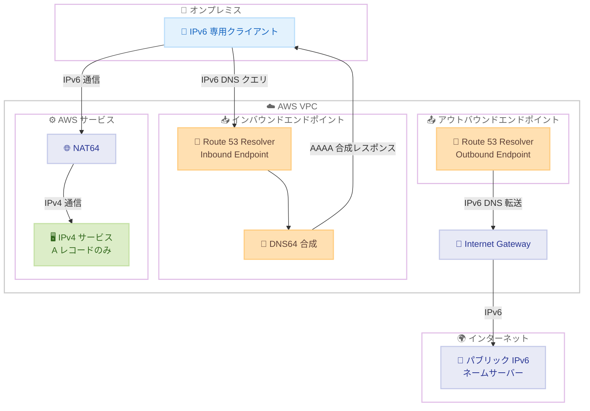

# Amazon Route 53 Resolver - IPv6 クエリトラフィックの追加機能サポート

**リリース日**: 2026 年 5 月 7 日
**サービス**: Amazon Route 53 Resolver
**機能**: インバウンドエンドポイントでの DNS64 サポートおよびアウトバウンドエンドポイントでの IPv6 IGW 転送

📊 [このアップデートのインフォグラフィックを見る](https://takech9203.github.io/aws-news-summary/20260507-amazon-route-53-resolver-ipv6.html)

## 概要

Amazon Route 53 Resolver エンドポイントに IPv6 クエリトラフィック向けの追加機能が導入された。具体的には、インバウンドエンドポイントでの DNS64 サポートと、アウトバウンドエンドポイントでのインターネットゲートウェイ (IGW) を経由した IPv6 転送が可能になった。これにより、IPv4 と IPv6 が混在するハイブリッド DNS 環境の管理が大幅に簡素化される。

DNS64 をインバウンドエンドポイントで有効にすると、A レコード (IPv4) のみを持つドメインに対して AAAA レコード (IPv6) レスポンスを合成できる。これにより、オンプレミスの IPv6 専用クライアントが AWS 上の IPv4 サービスにアクセスする際、サービス側の変更なしに通信が可能になる。また、アウトバウンドエンドポイントでは、パブリック IPv6 ネームサーバーへの DNS クエリ転送を IGW 経由で実行できるようになった。

本機能は Route 53 Resolver エンドポイントがサポートされているすべての AWS リージョンで追加費用なしで利用可能である。

**アップデート前の課題**

- IPv6 専用クライアントからオンプレミス経由で AWS 上の IPv4 サービスにアクセスする場合、NAT64 やプロキシなど追加のインフラ構成が必要だった
- アウトバウンドエンドポイントからパブリック IPv6 ネームサーバーへ DNS クエリを転送する手段がなく、IPv6 ネームサーバーを利用するには別途回避策が必要だった
- IPv4/IPv6 混在環境でのハイブリッド DNS 管理が複雑で、運用負荷が高かった

**アップデート後の改善**

- インバウンドエンドポイントで DNS64 を有効化するだけで、IPv6 クライアントが IPv4 専用サービスにアクセス可能になった
- アウトバウンドエンドポイントから IGW 経由でパブリック IPv6 ネームサーバーへの DNS クエリ転送が可能になった
- ハイブリッド DNS 環境における IPv4/IPv6 間のブリッジングが簡素化され、運用負荷が軽減された

## アーキテクチャ図



上図は DNS64 によるインバウンド DNS クエリの IPv6 合成フローと、アウトバウンドエンドポイントから IGW 経由でパブリック IPv6 ネームサーバーへ転送するフローを示している。

## サービスアップデートの詳細

### 主要機能

1. **インバウンドエンドポイントでの DNS64 サポート**
   - A レコード (IPv4) のみを持つドメインに対し、AAAA レコード (IPv6) レスポンスを自動的に合成
   - オンプレミスの IPv6 専用クライアントが AWS 上の IPv4 サービスにアクセス可能
   - サービス側のコード変更やインフラ追加が不要
   - `Dns64Enabled` パラメータで有効化/無効化を制御

2. **アウトバウンドエンドポイントでの IPv6 IGW 転送**
   - パブリック IPv6 ネームサーバーへの DNS クエリ転送を IGW 経由で実行
   - IPv6 対応の外部 DNS インフラとの統合が容易に
   - `Ipv6InternetAccessEnabled` パラメータで有効化/無効化を制御

3. **既存エンドポイントへの適用**
   - 新規作成時だけでなく、既存のエンドポイントに対しても `UpdateResolverEndpoint` API で設定変更可能
   - デュアルスタック (DUALSTACK) エンドポイントタイプとの組み合わせで柔軟な構成が可能

## 技術仕様

### API パラメータの追加

| パラメータ | 型 | 説明 |
|------|------|------|
| `Dns64Enabled` | boolean | インバウンドエンドポイントでの DNS64 合成の有効化 |
| `Ipv6InternetAccessEnabled` | boolean | アウトバウンドエンドポイントでの IGW 経由 IPv6 転送の有効化 |

### エンドポイントタイプ

| タイプ | 説明 |
|------|------|
| `IPV4` | IPv4 アドレスのみ |
| `IPV6` | IPv6 アドレスのみ |
| `DUALSTACK` | IPv4 と IPv6 の両方をサポート |

### API 変更履歴

| 日付 | サービス | 変更内容 |
|------|----------|----------|
| 2026/05/07 | [Route 53 Resolver](https://awsapichanges.com/archive/changes/4fa215-route53resolver.html) | 7 updated api methods - DNS64 および IPv6 IGW 転送サポートの追加 |

### 更新された API メソッド

| メソッド | 変更内容 |
|----------|----------|
| `CreateResolverEndpoint` | リクエストに `Dns64Enabled`, `Ipv6InternetAccessEnabled` パラメータ追加 |
| `UpdateResolverEndpoint` | リクエストに `Dns64Enabled`, `Ipv6InternetAccessEnabled` パラメータ追加 |
| `GetResolverEndpoint` | レスポンスに `Dns64Enabled`, `Ipv6InternetAccessEnabled` フィールド追加 |
| `ListResolverEndpoints` | レスポンスに `Dns64Enabled`, `Ipv6InternetAccessEnabled` フィールド追加 |
| `DeleteResolverEndpoint` | レスポンスに `Dns64Enabled`, `Ipv6InternetAccessEnabled` フィールド追加 |
| `AssociateResolverEndpointIpAddress` | レスポンスに `Dns64Enabled`, `Ipv6InternetAccessEnabled` フィールド追加 |
| `DisassociateResolverEndpointIpAddress` | レスポンスに `Dns64Enabled`, `Ipv6InternetAccessEnabled` フィールド追加 |

## 設定方法

### 前提条件

1. Route 53 Resolver エンドポイントがサポートされているリージョンを使用していること
2. VPC にインターネットゲートウェイ (IGW) がアタッチされていること (アウトバウンド IPv6 転送を使用する場合)
3. サブネットが IPv6 CIDR ブロックを持つこと (デュアルスタックまたは IPv6 エンドポイントを使用する場合)

### 手順

#### ステップ 1: DNS64 を有効にしたインバウンドエンドポイントの作成

```bash
aws route53resolver create-resolver-endpoint \
    --creator-request-id "dns64-inbound-$(date +%s)" \
    --name "dns64-inbound-endpoint" \
    --security-group-ids "sg-xxxxxxxxxxxxxxxxx" \
    --direction INBOUND \
    --resolver-endpoint-type DUALSTACK \
    --ip-addresses SubnetId=subnet-xxxxxxxxxxxxxxxxx,Ipv6=2001:db8::1 \
    --dns64-enabled \
    --protocols Do53
```

DNS64 を有効にしたインバウンドエンドポイントを作成する。`--dns64-enabled` フラグにより、IPv4 のみの A レコードに対して AAAA レスポンスが合成される。

#### ステップ 2: IPv6 IGW 転送を有効にしたアウトバウンドエンドポイントの作成

```bash
aws route53resolver create-resolver-endpoint \
    --creator-request-id "ipv6-outbound-$(date +%s)" \
    --name "ipv6-outbound-endpoint" \
    --security-group-ids "sg-xxxxxxxxxxxxxxxxx" \
    --direction OUTBOUND \
    --resolver-endpoint-type DUALSTACK \
    --ip-addresses SubnetId=subnet-xxxxxxxxxxxxxxxxx,Ipv6=2001:db8::2 \
    --ipv6-internet-access-enabled \
    --protocols Do53
```

IPv6 インターネットアクセスを有効にしたアウトバウンドエンドポイントを作成する。`--ipv6-internet-access-enabled` フラグにより、IGW 経由でパブリック IPv6 ネームサーバーへのクエリ転送が可能になる。

#### ステップ 3: 既存エンドポイントの更新

```bash
aws route53resolver update-resolver-endpoint \
    --resolver-endpoint-id "rslvr-in-xxxxxxxxxxxxxxxxx" \
    --dns64-enabled
```

既存のインバウンドエンドポイントに対して DNS64 を有効化する。既存のエンドポイントを停止することなく設定を変更できる。

## メリット

### ビジネス面

- **インフラ投資の削減**: NAT64 ゲートウェイやプロキシサーバーなどの追加インフラが不要になり、コスト削減が可能
- **IPv6 移行の加速**: IPv6 専用環境への段階的移行を DNS レベルで支援し、移行リスクを低減
- **運用コストの削減**: ハイブリッド DNS の管理が簡素化され、運用チームの負荷が軽減される

### 技術面

- **シームレスな IPv4/IPv6 ブリッジング**: DNS64 合成により、アプリケーション層の変更なしに IPv6 クライアントから IPv4 サービスへのアクセスが可能
- **パブリック IPv6 DNS との統合**: IGW 経由での IPv6 ネームサーバーアクセスにより、IPv6 ネイティブの外部 DNS インフラとの統合が容易
- **追加費用なし**: 既存の Route 53 Resolver エンドポイント料金に含まれるため、機能追加による追加コストが発生しない

## デメリット・制約事項

### 制限事項

- DNS64 はインバウンドエンドポイントでのみ有効化可能 (アウトバウンドエンドポイントでは使用不可)
- IPv6 IGW 転送はアウトバウンドエンドポイントでのみ使用可能
- DNS64 の合成はクライアント側の NAT64 実装と組み合わせる必要がある (DNS64 だけではトランスポート層の変換は行われない)

### 考慮すべき点

- DNS64 を有効にすると、IPv4 のみのドメインに対するすべてのクエリに AAAA レスポンスが合成されるため、意図しない通信経路の変更に注意が必要
- セキュリティグループおよび VPC ルートテーブルの設定を IPv6 トラフィックに対応させる必要がある
- 既存の DNS キャッシュを考慮し、切り替え時に TTL の影響を確認すること

## ユースケース

### ユースケース 1: IPv6 専用オンプレミスネットワークから AWS IPv4 サービスへのアクセス

**シナリオ**: 企業がオンプレミスネットワークを IPv6 専用に移行したが、AWS 上のレガシーサービスはまだ IPv4 でのみ動作している。

**実装例**:
```bash
# DNS64 対応インバウンドエンドポイントの作成
aws route53resolver create-resolver-endpoint \
    --name "onprem-ipv6-bridge" \
    --direction INBOUND \
    --resolver-endpoint-type DUALSTACK \
    --security-group-ids "sg-xxx" \
    --ip-addresses SubnetId=subnet-xxx,Ipv6=2001:db8::10 \
    --dns64-enabled
```

**効果**: オンプレミスの IPv6 クライアントが DNS クエリを送信すると、DNS64 により合成 AAAA レスポンスを受け取り、NAT64 経由で IPv4 サービスにアクセス可能。サービス側の変更は不要。

### ユースケース 2: IPv6 対応パブリック DNS への転送

**シナリオ**: 組織のセキュリティポリシーにより、特定のドメインの DNS クエリを IPv6 対応のパブリックリゾルバーに転送する必要がある。

**実装例**:
```bash
# IPv6 IGW 転送対応アウトバウンドエンドポイントの作成
aws route53resolver create-resolver-endpoint \
    --name "ipv6-public-dns-forwarder" \
    --direction OUTBOUND \
    --resolver-endpoint-type DUALSTACK \
    --security-group-ids "sg-xxx" \
    --ip-addresses SubnetId=subnet-xxx,Ipv6=2001:db8::20 \
    --ipv6-internet-access-enabled

# 転送ルールの作成
aws route53resolver create-resolver-rule \
    --name "forward-to-ipv6-ns" \
    --rule-type FORWARD \
    --domain-name "example.com" \
    --resolver-endpoint-id "rslvr-out-xxx" \
    --target-ips Ipv6=2001:4860:4860::8888
```

**効果**: VPC 内のワークロードから特定ドメインの DNS クエリを、IGW 経由でパブリック IPv6 ネームサーバーに転送し、IPv6 ネイティブな DNS 解決が可能。

### ユースケース 3: マルチクラウド IPv6 DNS 統合

**シナリオ**: マルチクラウド環境で、他のクラウドプロバイダーの IPv6 ネームサーバーと DNS クエリを連携させたい。

**実装例**:
```bash
# デュアルスタックアウトバウンドエンドポイント
aws route53resolver create-resolver-endpoint \
    --name "multicloud-dns-bridge" \
    --direction OUTBOUND \
    --resolver-endpoint-type DUALSTACK \
    --security-group-ids "sg-xxx" \
    --ip-addresses SubnetId=subnet-xxx,Ipv6=2001:db8::30 \
    --ipv6-internet-access-enabled

# マルチクラウド転送ルール
aws route53resolver create-resolver-rule \
    --name "forward-to-other-cloud" \
    --rule-type FORWARD \
    --domain-name "internal.othercloud.example" \
    --resolver-endpoint-id "rslvr-out-xxx" \
    --target-ips Ipv6=2600:1f00::1
```

**効果**: AWS と他のクラウドプロバイダー間で IPv6 ネイティブの DNS クエリ転送が可能になり、マルチクラウド環境での名前解決がシームレスに統合される。

## 料金

本機能は追加費用なしで利用可能。Route 53 Resolver エンドポイントの既存料金体系が適用される。

### 料金例

| 項目 | 月額料金 (概算) |
|--------|------------------|
| Resolver エンドポイント (ENI あたり) | $0.125/時間 (約 $90/月) |
| DNS クエリ (最初の 10 億クエリ) | $0.40/100 万クエリ |
| DNS64 合成 | 追加費用なし |
| IPv6 IGW 転送 | 追加費用なし |

## 利用可能リージョン

Route 53 Resolver エンドポイントがサポートされているすべての AWS リージョンで利用可能。東京リージョン (ap-northeast-1) を含む。

## 関連サービス・機能

- **Amazon VPC NAT64**: DNS64 と組み合わせて使用し、IPv6 クライアントから IPv4 サービスへのトランスポート層変換を実行
- **Amazon Route 53 Resolver**: ハイブリッド DNS の基盤となるサービスで、VPC とオンプレミス間の DNS クエリ解決を提供
- **AWS Internet Gateway**: VPC とインターネット間の通信を可能にし、今回のアップデートでアウトバウンド DNS の IPv6 転送経路として使用
- **Amazon VPC IPv6 サポート**: デュアルスタック VPC 構成の基盤であり、IPv6 CIDR ブロックの割り当てを管理

## 参考リンク

- 📊 [インフォグラフィック](https://takech9203.github.io/aws-news-summary/20260507-amazon-route-53-resolver-ipv6.html)
- [公式発表 (What's New)](https://aws.amazon.com/about-aws/whats-new/2026/05/amazon-route-53-resolver-ipv6/)
- [Route 53 Resolver ドキュメント](https://docs.aws.amazon.com/Route53/latest/DeveloperGuide/resolver.html)
- [Route 53 Resolver 料金](https://aws.amazon.com/route53/pricing/)
- [API 変更履歴 - Route 53 Resolver](https://awsapichanges.com/archive/changes/4fa215-route53resolver.html)

## まとめ

Amazon Route 53 Resolver エンドポイントに DNS64 と IPv6 IGW 転送機能が追加されたことで、IPv4/IPv6 混在環境でのハイブリッド DNS 管理が大幅に簡素化された。特に IPv6 への移行を進めている組織にとって、既存の IPv4 サービスへの接続性を維持しながら段階的に移行を進められる点が大きな価値である。追加費用なしで利用可能なため、デュアルスタック環境を運用しているすべての組織で即座に活用を検討することを推奨する。
