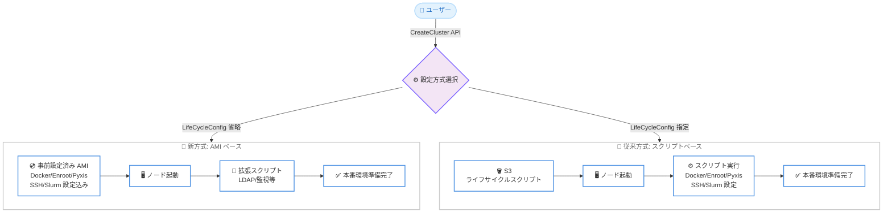

# Amazon SageMaker HyperPod - AMI ベースのノードライフサイクル設定

**リリース日**: 2026 年 5 月 7 日
**サービス**: Amazon SageMaker HyperPod
**機能**: AMI ベースのノードライフサイクル設定 (Slurm クラスター向け)

📊 [このアップデートのインフォグラフィックを見る](https://takech9203.github.io/aws-news-summary/20260507-amazon-sagemaker-hyperpod-ami-based-node.html)

## 概要

Amazon SageMaker HyperPod が Slurm クラスターにおける AMI ベースのノードライフサイクル設定をサポートした。これにより、ノードのプロビジョニング時にライフサイクル設定スクリプトを S3 にアップロードして実行する従来の方法に代わり、必要なソフトウェアと設定が事前に組み込まれた AMI からノードを直接起動できるようになった。

この機能は、AI/ML トレーニングワークロードを実行するための本番環境を迅速にセットアップしたいユーザーを対象としている。クラスター作成時の運用ステップが削減され、ノードプロビジョニング中にライフサイクルスクリプトを実行する必要がなくなるため、クラスター作成時間が大幅に短縮される。

**アップデート前の課題**

- ライフサイクル設定スクリプトをダウンロード、作成し、S3 にアップロードする必要があった
- ノードプロビジョニング中にスクリプトが実行されるため、クラスター作成に時間がかかっていた
- Docker、Enroot、Pyxis などの必須ソフトウェアのインストールをスクリプトで管理する運用負荷があった
- Slurm アカウンティングや SSH 鍵生成などの設定もスクリプトで都度実施する必要があった

**アップデート後の改善**

- AMI に必要なソフトウェアと設定が事前に含まれているため、S3 へのスクリプトアップロードが不要になった
- ノードプロビジョニング中のスクリプト実行が不要になり、クラスター作成時間が大幅に短縮された
- AMI ベースの基本設定に加えて、拡張スクリプト (Extension Script) でカスタマイズを追加可能になった
- フルカスタムのライフサイクルスクリプトも引き続きサポートされ、高度なユースケースにも対応可能

## アーキテクチャ図



AMI ベース方式では、事前設定済み AMI からノードを直接起動することで、従来のスクリプト実行ステップを省略し、クラスター起動時間を短縮する。

## サービスアップデートの詳細

### 主要機能

1. **AMI ベースのノード設定**
   - Docker、Enroot、Pyxis などの必須ソフトウェアが事前インストール済み
   - Slurm アカウンティング、SSH 鍵生成、ログローテーション、ユーザーホームディレクトリのセットアップが設定済み
   - CreateCluster API でインスタンスグループ設定から `LifeCycleConfig` ブロックを省略することで有効化

2. **拡張スクリプト (Extension Script)**
   - AMI ベースの基本設定の上に追加カスタマイズを適用可能
   - ユーザー設定、オブザーバビリティ、LDAP 統合など、追加機能に集中できる
   - CreateCluster API の `LifeCycleConfig` ブロック内で `OnInitComplete` パラメータと `SourceS3Uri` を指定

3. **カスタムライフサイクルスクリプトの継続サポート**
   - プロビジョニングの完全な制御が必要な高度なユースケース向け
   - API およびコンソールの両方から引き続き利用可能
   - 既存のワークフローとの後方互換性を維持

## 技術仕様

### 設定方式の比較

| 項目 | AMI ベース | AMI ベース + 拡張スクリプト | カスタムスクリプト |
|------|-----------|---------------------------|-------------------|
| 事前ソフトウェア | 含まれる | 含まれる | ユーザー管理 |
| S3 スクリプト | 不要 | 拡張スクリプトのみ | 必須 |
| 起動時間 | 最短 | 短い | 従来通り |
| カスタマイズ性 | 基本 | 中程度 | 最大 |
| `LifeCycleConfig` | 省略 | `OnInitComplete` 指定 | `OnCreate` 指定 |

### API 変更履歴

| 日付 | サービス | 変更内容 |
|------|----------|----------|
| 2026/05/06 | [Amazon SageMaker Service](https://awsapichanges.com/archive/changes/7068f3-api.sagemaker.html) | 3 updated api methods - DescribeCluster、DescribeClusterNode、ListClusterNodes に `ImageVersionStatus` フィールドを追加 |

### API 設定例

AMI ベース設定 (LifeCycleConfig を省略):

```json
{
  "ClusterName": "my-hyperpod-cluster",
  "InstanceGroups": [
    {
      "InstanceGroupName": "compute-group",
      "InstanceType": "ml.p5.48xlarge",
      "InstanceCount": 4,
      "ExecutionRole": "arn:aws:iam::123456789012:role/HyperPodRole",
      "ThreadsPerCore": 1
    }
  ]
}
```

AMI ベース + 拡張スクリプト:

```json
{
  "ClusterName": "my-hyperpod-cluster",
  "InstanceGroups": [
    {
      "InstanceGroupName": "compute-group",
      "InstanceType": "ml.p5.48xlarge",
      "InstanceCount": 4,
      "ExecutionRole": "arn:aws:iam::123456789012:role/HyperPodRole",
      "LifeCycleConfig": {
        "SourceS3Uri": "s3://my-bucket/hyperpod-scripts/",
        "OnInitComplete": "extension.sh"
      }
    }
  ]
}
```

## 設定方法

### 前提条件

1. SageMaker HyperPod が利用可能なリージョンの AWS アカウント
2. クラスター作成に必要な IAM ロール
3. VPC、サブネット、セキュリティグループの設定

### 手順

#### ステップ 1: AMI ベースでクラスターを作成 (AWS CLI)

```bash
aws sagemaker create-cluster \
  --cluster-name my-ami-based-cluster \
  --instance-groups '[{
    "InstanceGroupName": "compute",
    "InstanceType": "ml.p5.48xlarge",
    "InstanceCount": 4,
    "ExecutionRole": "arn:aws:iam::123456789012:role/HyperPodRole"
  }]'
```

`LifeCycleConfig` ブロックを省略することで、AMI ベースの設定が自動的に適用される。

#### ステップ 2: 拡張スクリプトを使用する場合

```bash
# 拡張スクリプトを S3 にアップロード
aws s3 cp extension.sh s3://my-bucket/hyperpod-scripts/

# 拡張スクリプト付きでクラスターを作成
aws sagemaker create-cluster \
  --cluster-name my-extended-cluster \
  --instance-groups '[{
    "InstanceGroupName": "compute",
    "InstanceType": "ml.p5.48xlarge",
    "InstanceCount": 4,
    "ExecutionRole": "arn:aws:iam::123456789012:role/HyperPodRole",
    "LifeCycleConfig": {
      "SourceS3Uri": "s3://my-bucket/hyperpod-scripts/",
      "OnInitComplete": "extension.sh"
    }
  }]'
```

`OnInitComplete` パラメータにより、AMI ベースの基本設定が完了した後に拡張スクリプトが実行される。

#### ステップ 3: コンソールから設定する場合

SageMaker AI コンソールでクラスターを作成する際に、Custom setup セクションで以下を選択する。

- **AMI ベース設定のみ**: Lifecycle scripts で "None" を選択
- **拡張スクリプト付き**: "Extension script file in S3" フィールドに S3 URI を指定

## メリット

### ビジネス面

- **クラスター起動時間の短縮**: ライフサイクルスクリプトの実行が不要になり、ジョブ開始までの待ち時間が大幅に短縮される
- **運用コストの削減**: スクリプトの作成、テスト、メンテナンスにかかる工数が削減される
- **迅速な実験開始**: データサイエンティストがより早く AI/ML トレーニングジョブを実行できる

### 技術面

- **運用の簡素化**: S3 へのスクリプトアップロード、権限設定、デバッグが不要になる
- **一貫性のある環境**: AMI から起動されるため、全ノードで同一のソフトウェア構成が保証される
- **段階的カスタマイズ**: 拡張スクリプトにより、基本設定に追加機能のみを記述すればよく、フルスクリプトを管理する必要がない
- **後方互換性**: 既存のカスタムスクリプトベースのワークフローは引き続き利用可能

## デメリット・制約事項

### 制限事項

- AMI ベース設定で提供されるソフトウェアバージョンは AWS が管理するため、特定バージョンの固定が必要な場合はカスタムスクリプトが適切
- 拡張スクリプトは `OnInitComplete` でのみ実行されるため、ノード起動前のカスタマイズには対応しない
- AMI に含まれるソフトウェア構成の詳細は AWS が決定するため、不要なソフトウェアの除外はできない

### 考慮すべき点

- 既存のカスタムライフサイクルスクリプトから移行する場合、スクリプト内の設定が AMI に含まれているか確認が必要
- 拡張スクリプトの実行順序は AMI ベース設定完了後となるため、依存関係に注意が必要

## ユースケース

### ユースケース 1: 迅速なプロトタイピング環境の構築

**シナリオ**: データサイエンスチームが新しい大規模言語モデルのトレーニング実験を迅速に開始したい。

**実装例**:
```bash
aws sagemaker create-cluster \
  --cluster-name rapid-prototype-cluster \
  --instance-groups '[{
    "InstanceGroupName": "training",
    "InstanceType": "ml.p5.48xlarge",
    "InstanceCount": 8,
    "ExecutionRole": "arn:aws:iam::123456789012:role/HyperPodRole"
  }]'
```

**効果**: ライフサイクルスクリプトの準備やデバッグなしに、数分でトレーニング可能な Slurm クラスターが起動する。

### ユースケース 2: LDAP 統合付きの本番クラスター

**シナリオ**: 企業のディレクトリサービスと統合された HyperPod クラスターを運用したいが、基本設定は標準のままにしたい。

**実装例**:
```bash
# extension.sh - LDAP 統合のみに集中
#!/bin/bash
yum install -y sssd
cp /opt/config/sssd.conf /etc/sssd/sssd.conf
systemctl enable sssd
systemctl start sssd
```

**効果**: AMI が Docker、Enroot、Slurm 設定を処理し、拡張スクリプトは LDAP 統合のみに集中できるため、スクリプトの複雑性が大幅に低下する。

### ユースケース 3: オブザーバビリティ付きの大規模トレーニング環境

**シナリオ**: 数百ノードの大規模クラスターで、CloudWatch や Prometheus を使ったモニタリングを追加したい。

**実装例**:
```bash
# extension.sh - モニタリングエージェントの追加
#!/bin/bash
# CloudWatch Agent のインストールと設定
yum install -y amazon-cloudwatch-agent
cp /opt/config/cloudwatch-config.json /opt/aws/amazon-cloudwatch-agent/etc/
/opt/aws/amazon-cloudwatch-agent/bin/amazon-cloudwatch-agent-ctl \
  -a fetch-config -m ec2 -s \
  -c file:/opt/aws/amazon-cloudwatch-agent/etc/cloudwatch-config.json
```

**効果**: 大規模クラスターでも、基本環境の AMI ベースプロビジョニングにより起動時間が短縮され、拡張スクリプトでモニタリング機能のみを追加できる。

## 料金

AMI ベースのノードライフサイクル設定機能自体に追加料金は発生しない。クラスターの料金は従来通り、使用するインスタンスタイプと数量に基づく SageMaker HyperPod の標準料金が適用される。

## 利用可能リージョン

SageMaker HyperPod が利用可能な全ての AWS リージョンで利用可能。

## 関連サービス・機能

- **Amazon SageMaker HyperPod**: 大規模 ML トレーニング用のマネージドクラスターサービス
- **AWS ParallelCluster**: HPC ワークロード向けのクラスター管理ツール (Slurm ベース)
- **Amazon EC2 AMI**: カスタム AMI の作成・管理基盤
- **Amazon S3**: 拡張スクリプトの保存先

## 参考リンク

- 📊 [インフォグラフィック](https://takech9203.github.io/aws-news-summary/20260507-amazon-sagemaker-hyperpod-ami-based-node.html)
- [公式発表 (What's New)](https://aws.amazon.com/about-aws/whats-new/2026/05/amazon-sagemaker-hyperpod-ami-based-node/)
- [ドキュメント: Getting started with SageMaker HyperPod using the AWS CLI](https://docs.aws.amazon.com/sagemaker/latest/dg/smcluster-getting-started-slurm-cli.html)
- [ドキュメント: Getting started with SageMaker HyperPod using the SageMaker AI console](https://docs.aws.amazon.com/sagemaker/latest/dg/smcluster-getting-started-slurm-console.html)
- [料金ページ](https://aws.amazon.com/sagemaker/pricing/)

## まとめ

Amazon SageMaker HyperPod の AMI ベースノードライフサイクル設定は、Slurm クラスターの運用を大幅に簡素化する機能である。ライフサイクルスクリプトの作成・管理から解放されることで、クラスター起動時間の短縮と運用負荷の軽減を実現する。既存のカスタムスクリプトとの後方互換性も維持されているため、段階的な移行が可能であり、まずは新規クラスターから AMI ベース設定を試すことを推奨する。
