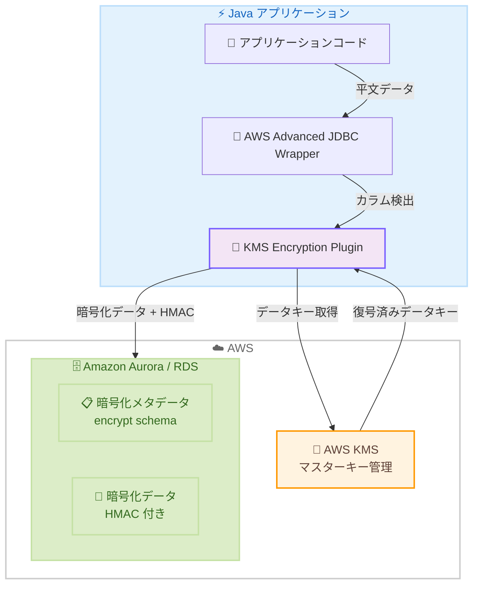

# AWS Advanced JDBC Wrapper - KMS Encryption Plugin によるクライアントサイド暗号化

**リリース日**: 2026年5月7日
**サービス**: AWS Advanced JDBC Wrapper
**機能**: KMS Encryption Plugin (クライアントサイドカラムレベル暗号化)

:bar_chart: [このアップデートのインフォグラフィックを見る](https://takech9203.github.io/aws-news-summary/20260507-aws-advanced-jdbc-wrapper-encryption.html)

## 概要

AWS Advanced JDBC Wrapper に KMS Encryption Plugin が追加され、Java アプリケーションからデータベースへの書き込み時にカラムレベルのクライアントサイド暗号化が可能になった。この機能により、機密データはデータベースに到達する前にアプリケーション側で暗号化され、データベースエンジン内では常に暗号化された状態で保持される。

AWS Advanced JDBC Wrapper は、Amazon Aurora および Amazon RDS のオープンソースデータベースに対してフェイルオーバー処理、AWS 認証統合、拡張モニタリングなどの高度な機能を提供する JDBC ラッパーである。今回の KMS Encryption Plugin は、既存の SQL、Spring、Hibernate、コネクションプールの設定を変更することなく、透過的な暗号化/復号を実現する。

**アップデート前の課題**

- データベースの保存時暗号化 (encryption at rest) や TLS による通信暗号化 (encryption in transit) では、データベースエンジン内でデータが復号される
- 認証情報の漏洩、過剰な権限を持つ管理者、SQL インジェクション攻撃により機密データが平文で露出するリスクがあった
- PCI DSS、HIPAA、GDPR などのコンプライアンス要件に対して、アプリケーション側での暗号化を個別に実装する必要があった
- カラムレベルの暗号化を実現するには、アプリケーションコードの大幅な変更が必要だった

**アップデート後の改善**

- JDBC ドライバレベルで透過的に暗号化/復号が行われ、平文はアプリケーションのみで参照可能になった
- アプリケーションコードを変更せずに、既存の PreparedStatement や ResultSet でそのまま利用可能
- HMAC 検証によりデータの整合性をデータベース側で確認可能 (暗号鍵なしで改竄検知)
- AWS KMS との統合によるエンベロープ暗号化で、鍵管理が安全かつ容易になった

## アーキテクチャ図



アプリケーションが PreparedStatement でデータを書き込む際、KMS Encryption Plugin が暗号化対象カラムを自動検出し、AWS KMS から取得したデータキーで暗号化してからデータベースに送信する。読み取り時は逆方向に復号が行われる。

## サービスアップデートの詳細

### 主要機能

1. **透過的カラムレベル暗号化**
   - PreparedStatement と ResultSet を通じた自動暗号化/復号
   - SQL パーシングによる暗号化対象カラムの自動検出
   - SQL コメントアノテーションによる明示的なカラム指定も可能

2. **AWS KMS 統合によるエンベロープ暗号化**
   - AWS KMS がデータキーを生成・暗号化
   - データキーで実データを暗号化 (AES-256-GCM)
   - HMAC キーによるデータ整合性の検証
   - データキーのキャッシュによる KMS API コール削減

3. **HMAC ベースの整合性検証**
   - PostgreSQL では `encrypted_data` カスタムドメイン型を提供
   - データベース側で暗号鍵なしに改竄を検知可能
   - INSERT/UPDATE 時にトリガーで自動検証

4. **鍵ローテーション機能**
   - `KeyManagementUtility` クラスによるプログラマティックな鍵ローテーション
   - 同一マスターキーでのデータキーローテーション
   - 新しいマスターキーへの移行にも対応

## 技術仕様

### 暗号化仕様

| 項目 | 詳細 |
|------|------|
| 暗号化アルゴリズム | AES-256-GCM |
| 鍵管理 | エンベロープ暗号化 (AWS KMS) |
| 整合性検証 | HMAC-SHA256 |
| データキーキャッシュ TTL | デフォルト 300 秒 (設定可能) |
| 対応データベース | Amazon Aurora PostgreSQL、Aurora MySQL、Amazon RDS PostgreSQL、RDS MySQL |
| PostgreSQL 要件 | バージョン 12 以上 + pgcrypto 拡張 |
| MySQL 要件 | バージョン 8.0 以上 |
| Java 要件 | Java 8 以上 + AWS SDK for Java 2.x |

### 必要な IAM 権限

```json
{
  "Version": "2012-10-17",
  "Statement": [
    {
      "Effect": "Allow",
      "Action": [
        "kms:GenerateDataKey",
        "kms:Decrypt",
        "kms:DescribeKey"
      ],
      "Resource": "arn:aws:kms:*:*:key/*"
    }
  ]
}
```

## 設定方法

### 前提条件

1. AWS アカウントと KMS へのアクセス権限
2. Amazon Aurora または Amazon RDS (PostgreSQL 12+ / MySQL 8.0+)
3. Java 8 以上の開発環境と AWS SDK for Java 2.x
4. AWS Advanced JDBC Wrapper の導入

### 手順

#### ステップ 1: データベースに暗号化メタデータスキーマを作成

```sql
-- PostgreSQL の場合
CREATE SCHEMA encrypt;
CREATE EXTENSION IF NOT EXISTS pgcrypto;

-- 鍵ストレージテーブル
CREATE TABLE encrypt.key_storage (
    id SERIAL PRIMARY KEY,
    name VARCHAR(255) NOT NULL,
    master_key_arn VARCHAR(512) NOT NULL,
    encrypted_data_key TEXT NOT NULL,
    hmac_key BYTEA NOT NULL,
    key_spec VARCHAR(50) DEFAULT 'AES_256',
    created_at TIMESTAMPTZ DEFAULT CURRENT_TIMESTAMP
);

-- 暗号化メタデータテーブル
CREATE TABLE encrypt.encryption_metadata (
    table_name VARCHAR(255) NOT NULL,
    column_name VARCHAR(255) NOT NULL,
    encryption_algorithm VARCHAR(50) NOT NULL,
    key_id INTEGER NOT NULL,
    PRIMARY KEY (table_name, column_name),
    FOREIGN KEY (key_id) REFERENCES encrypt.key_storage(id)
);
```

暗号化メタデータスキーマを作成し、鍵の保存先とカラムごとの暗号化設定を管理するテーブルを定義する。

#### ステップ 2: AWS KMS マスターキーを作成

```bash
# KMS マスターキーの作成
aws kms create-key \
    --description "JDBC Encryption Master Key" \
    --key-usage ENCRYPT_DECRYPT \
    --key-spec SYMMETRIC_DEFAULT

# エイリアスの設定
aws kms create-alias \
    --alias-name alias/jdbc-encryption-key \
    --target-key-id <KEY_ID>

# 自動キーローテーションの有効化
aws kms enable-key-rotation --key-id <KEY_ID>
```

AWS KMS で対称暗号鍵を作成し、エンベロープ暗号化のマスターキーとして使用する。自動ローテーションを有効にすることで、セキュリティを強化する。

#### ステップ 3: JDBC 接続でプラグインを有効化

```java
Properties props = new Properties();

// KMS Encryption Plugin を有効化
props.setProperty("wrapperPlugins", "kmsEncryption");

// KMS マスターキーの設定
props.setProperty("kmsKeyArn",
    "arn:aws:kms:us-east-1:123456789012:key/...");
props.setProperty("kmsRegion", "us-east-1");

// メタデータスキーマの指定
props.setProperty("encryptionMetadataSchema", "encrypt");

// データキーキャッシュ TTL の設定
props.setProperty("dataKeyCacheTTL", "300");

// 接続の確立
String url = "jdbc:aws-wrapper:postgresql://mydb.cluster-xxx.us-east-1.rds.amazonaws.com:5432/mydb";
Connection conn = DriverManager.getConnection(url, props);
```

接続プロパティに `wrapperPlugins=kmsEncryption` を指定するだけで、プラグインが有効になる。既存のアプリケーションコードの変更は不要。

## メリット

### ビジネス面

- **コンプライアンス対応の強化**: PCI DSS、HIPAA、GDPR が求めるデータ保護要件を、アプリケーション層の暗号化で満たすことが可能
- **開発コストの削減**: 既存コードを変更せずに暗号化を導入できるため、大規模なリファクタリングが不要
- **リスク軽減**: データベース管理者や攻撃者がデータベースにアクセスしても、機密データの平文を参照できない

### 技術面

- **ゼロコード変更**: PreparedStatement と ResultSet のインターフェースがそのまま使えるため、透過的に動作
- **Spring/Hibernate 互換**: 既存の ORM フレームワークやコネクションプールと組み合わせて利用可能
- **パフォーマンス最適化**: データキーキャッシュにより KMS API コールを最小化し、レイテンシへの影響を軽減
- **鍵管理の安全性**: エンベロープ暗号化により、平文のデータキーはメモリ上にのみ存在し永続化されない

## デメリット・制約事項

### 制限事項

- 暗号化されたカラムに対する WHERE 句での検索、ソート、インデックスの利用は不可 (暗号化後のデータは元のデータと異なるバイト列のため)
- 対応データベースは PostgreSQL と MySQL 互換エンジンのみ (Oracle、SQL Server は非対応)
- カラムの型として PostgreSQL では `encrypted_data` 型または `BYTEA`、MySQL では `VARBINARY` を使用する必要がある

### 考慮すべき点

- データキーキャッシュの TTL 設定は、セキュリティ要件とパフォーマンスのバランスを考慮して調整が必要
- 既存データの暗号化には移行作業 (全行の読み取り・再書き込み) が必要
- HMAC 検証のためのデータベースセットアップ (スキーマ、テーブル、トリガー) が事前に必要
- KMS API のレート制限とコストを考慮した設計が必要

## ユースケース

### ユースケース 1: 金融機関における個人情報保護

**シナリオ**: 銀行のオンラインバンキングシステムで、顧客の口座番号やマイナンバーをデータベースに保存する際に、DBA であっても平文を参照できないようにしたい。

**実装例**:
```java
// 口座番号と SSN を暗号化カラムとして登録
// INSERT 時に自動暗号化
String sql = "INSERT INTO customers (name, account_number, ssn) VALUES (?, ?, ?)";
PreparedStatement stmt = conn.prepareStatement(sql);
stmt.setString(1, "田中太郎");
stmt.setString(2, "1234-5678-9012");  // 自動暗号化
stmt.setString(3, "123-45-6789");      // 自動暗号化
stmt.executeUpdate();
```

**効果**: PCI DSS 要件を満たしつつ、アプリケーション開発者は通常の JDBC コードと同じように実装可能。DBA によるデータ参照リスクを排除。

### ユースケース 2: ヘルスケアシステムにおける医療記録の保護

**シナリオ**: 電子カルテシステムで、患者の診断情報や処方データを HIPAA 準拠で保護する必要がある。

**実装例**:
```java
// 診断情報の暗号化
String sql = "INSERT INTO medical_records (patient_id, diagnosis, prescription) VALUES (?, ?, ?)";
PreparedStatement stmt = conn.prepareStatement(sql);
stmt.setInt(1, patientId);
stmt.setString(2, "Type 2 Diabetes");  // 自動暗号化
stmt.setString(3, "Metformin 500mg");  // 自動暗号化
stmt.executeUpdate();
```

**効果**: HIPAA の Protected Health Information (PHI) 保護要件を満たし、データベース侵害時にも患者の医療情報が平文で漏洩しない。

### ユースケース 3: SaaS マルチテナント環境でのデータ分離

**シナリオ**: マルチテナント SaaS アプリケーションで、テナントごとに異なる KMS キーを使用してデータを暗号化し、論理的なデータ分離を実現したい。

**実装例**:
```java
// テナントごとに異なる KMS キーを設定
Properties props = new Properties();
props.setProperty("wrapperPlugins", "kmsEncryption");
props.setProperty("kmsKeyArn", tenantKmsKeyArn);  // テナント固有のキー
props.setProperty("kmsRegion", "us-east-1");

Connection conn = DriverManager.getConnection(url, props);
```

**効果**: テナント A の KMS キーではテナント B のデータを復号できないため、暗号レベルでのデータ分離を実現。コンプライアンス監査への対応が容易になる。

## 料金

KMS Encryption Plugin 自体は無料 (オープンソース、Apache 2.0 ライセンス) で利用可能。ただし以下の AWS サービス料金が発生する。

### 料金例

| 項目 | 料金 (概算) |
|------|------------|
| AWS KMS カスタマーマネージドキー | $1.00/月/キー |
| KMS API リクエスト (GenerateDataKey, Decrypt) | $0.03/10,000 リクエスト |
| Amazon Aurora / RDS | 通常のデータベース料金 |

データキーキャッシュを適切に設定することで、KMS API コール数を大幅に削減し、コストを最小化できる。

## 利用可能リージョン

AWS KMS と Amazon Aurora / Amazon RDS が利用可能なすべての AWS リージョンで使用可能。

## 関連サービス・機能

- **AWS KMS**: マスターキーの管理とデータキーの生成・暗号化を担当
- **Amazon Aurora**: 高可用性リレーショナルデータベースとして暗号化データの保存先
- **Amazon RDS**: マネージドリレーショナルデータベースサービスとして PostgreSQL / MySQL をサポート
- **AWS IAM**: KMS キーへのアクセス制御と認証情報の管理
- **AWS Secrets Manager**: AWS Advanced JDBC Wrapper の Secrets Manager プラグインとの組み合わせ利用が可能

## 参考リンク

- :bar_chart: [インフォグラフィック](https://takech9203.github.io/aws-news-summary/20260507-aws-advanced-jdbc-wrapper-encryption.html)
- [公式発表 (What's New)](https://aws.amazon.com/about-aws/whats-new/2026/05/aws-advanced-jdbc-wrapper-encryption/)
- [AWS Advanced JDBC Wrapper ドキュメント](https://github.com/aws/aws-advanced-jdbc-wrapper)
- [KMS Encryption Plugin ガイド](https://github.com/aws/aws-advanced-jdbc-wrapper/blob/main/docs/using-the-jdbc-driver/using-plugins/KmsEncryptionPluginGuide.md)
- [AWS KMS 料金ページ](https://aws.amazon.com/kms/pricing/)

## まとめ

AWS Advanced JDBC Wrapper の KMS Encryption Plugin は、既存の Java アプリケーションにコード変更なしでカラムレベルのクライアントサイド暗号化を導入できる画期的な機能である。PCI DSS、HIPAA、GDPR などの規制要件に対応する必要がある組織は、早期に導入を検討することを推奨する。まずは開発環境で対象カラムを特定し、暗号化メタデータの設定とプラグインの動作確認から始めるのがよい。
