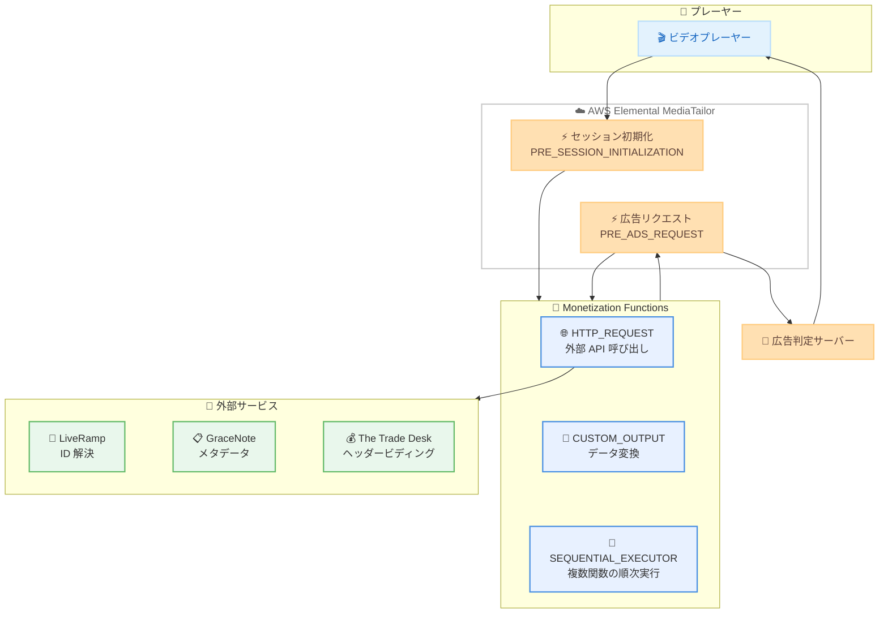

# AWS Elemental MediaTailor - Monetization Functions

**リリース日**: 2026年5月7日
**サービス**: AWS Elemental MediaTailor
**機能**: Monetization Functions

📊 [このアップデートのインフォグラフィックを見る](https://takech9203.github.io/aws-news-summary/20260507-aws-elemental-mediatailor-monetization-functions.html)

## 概要

AWS Elemental MediaTailor が Monetization Functions を一般提供 (GA) として発表した。この新機能により、ストリーミングメディアのプレイバックセッション中に、広告判定サーバー (ADS) へのリクエストのカスタマイズやセッションデータの管理を柔軟に行えるようになる。

Monetization Functions を使用すると、外部 API の呼び出しやインラインデータ変換を、プレイバックセッションの定義されたポイント (ライフサイクルフック) で実行できる。これにより、プレーヤーと ADS の間にカスタムミドルウェアを構築・運用する必要がなくなる。JSONata 式を使用したデータ変換や、外部データソースからの情報エンリッチメントがサーバーレスで実現される。

Monetization Functions はフェイルオープン設計を採用しており、関数がエラー、タイムアウト、リソース制限に達した場合でも、MediaTailor はデフォルトの広告挿入動作を継続し、視聴者のプレイバックが中断されることはない。

**アップデート前の課題**

- プレーヤーと広告判定サーバーの間にカスタムミドルウェアを自前で構築・運用する必要があった
- 外部データソースから取得した情報で広告リクエストをエンリッチするためにインフラストラクチャの管理が必要だった
- セッション初期化時のデータ変換処理を実装するための開発コストが高かった
- ミドルウェアの障害がプレイバック全体に影響するリスクがあった

**アップデート後の改善**

- カスタムインフラストラクチャなしで外部 API 呼び出しやデータ変換をライフサイクルフック内で実行可能になった
- JSONata 式によるインラインデータ変換が可能になり、開発工数が大幅に削減された
- フェイルオープン設計により、関数のエラーが視聴者体験に影響しない信頼性が確保された
- 3 種類の関数タイプ (HTTP_REQUEST、CUSTOM_OUTPUT、SEQUENTIAL_EXECUTOR) を組み合わせて複雑なワークフローを構築可能になった

## アーキテクチャ図



MediaTailor のライフサイクルフック (セッション初期化、広告リクエスト) で Monetization Functions が実行され、外部サービスへの API 呼び出しやデータ変換を経て、エンリッチされた情報が広告判定サーバーに送信される流れを示している。

## サービスアップデートの詳細

### 主要機能

1. **3 種類の関数タイプ**
   - **HTTP_REQUEST**: 外部 API に GET/POST リクエストを送信し、レスポンスデータを広告リクエストに統合する
   - **CUSTOM_OUTPUT**: JSONata 式を使用してセッションパラメータのインラインデータ変換を実行する
   - **SEQUENTIAL_EXECUTOR**: 複数の関数を順次実行し、条件付き実行 (RunCondition) やタイムアウト制御が可能

2. **ライフサイクルフック**
   - **PRE_SESSION_INITIALIZATION**: セッション初期化前に外部データの取得やパラメータ変換を実行
   - **PRE_ADS_REQUEST**: 広告判定サーバーへのリクエスト前にデータのエンリッチメントやパラメータ調整を実行

3. **フェイルオープン設計**
   - 関数がエラーを返した場合、出力を破棄してデフォルト動作を継続
   - タイムアウトやリソース制限超過時も同様に安全にフォールバック
   - 視聴者のプレイバック体験を最優先で保護

4. **JSONata ランタイム**
   - すべての関数タイプで JSONata 式によるデータ変換をサポート
   - 軽量かつ柔軟なデータ変換ロジックをインラインで記述可能

## 技術仕様

### 関数タイプの詳細

| 関数タイプ | 用途 | 主要パラメータ |
|------|------|------|
| HTTP_REQUEST | 外部 API 呼び出し | URL、MethodType (GET/POST)、Headers、Body、RequestTimeoutMilliseconds |
| CUSTOM_OUTPUT | データ変換 | Output (JSONata 式) |
| SEQUENTIAL_EXECUTOR | 複数関数の順次実行 | FunctionList、RunCondition、TimeoutMilliseconds |

### API 変更履歴

| 日付 | サービス | 変更内容 |
|------|----------|----------|
| 2026/05/05 | [mediatailor](https://awsapichanges.com/archive/changes/2d415e-api.mediatailor.html) | 4 new 4 updated api methods - Monetization Functions サポートの追加 |

### 新規 API メソッド

| メソッド名 | 説明 |
|------|------|
| PutFunction | Monetization Function の作成・更新 |
| GetFunction | 指定した Monetization Function の詳細取得 |
| DeleteFunction | Monetization Function の削除 |
| ListFunctions | Monetization Functions の一覧取得 |

### 更新された API メソッド

| メソッド名 | 変更内容 |
|------|------|
| PutPlaybackConfiguration | FunctionMapping パラメータの追加 |
| GetPlaybackConfiguration | FunctionMapping、ログ設定の拡張 |
| ListPlaybackConfigurations | FunctionMapping、ログ設定の拡張 |
| ConfigureLogsForPlaybackConfiguration | Function 関連ログイベントタイプの追加 |

### FunctionMapping 設定

```json
{
  "FunctionMapping": {
    "PRE_SESSION_INITIALIZATION": "function-id-for-session-init",
    "PRE_ADS_REQUEST": "function-id-for-ads-request"
  }
}
```

### 関数定義例 (HTTP_REQUEST)

```json
{
  "FunctionId": "resolve-identity",
  "FunctionType": "HTTP_REQUEST",
  "Description": "LiveRamp で ID 解決を実行",
  "HttpRequestConfiguration": {
    "Runtime": "JSONATA",
    "MethodType": "POST",
    "Url": "https://api.liveramp.com/resolve",
    "Body": "{\"hashed_email\": session.hashedEmail}",
    "Headers": {
      "Authorization": "Bearer <token>",
      "Content-Type": "application/json"
    },
    "RequestTimeoutMilliseconds": 500,
    "Output": {
      "identity_envelope": "$.response.envelope"
    }
  }
}
```

### 関数定義例 (SEQUENTIAL_EXECUTOR)

```json
{
  "FunctionId": "monetization-pipeline",
  "FunctionType": "SEQUENTIAL_EXECUTOR",
  "Description": "ID 解決とメタデータ付与を順次実行",
  "SequentialExecutorConfiguration": {
    "Runtime": "JSONATA",
    "FunctionList": [
      {
        "FunctionId": "resolve-identity",
        "RunCondition": "$exists(session.hashedEmail)"
      },
      {
        "FunctionId": "append-metadata",
        "RunCondition": "$exists(session.contentId)"
      }
    ],
    "TimeoutMilliseconds": 1000,
    "Output": {
      "enriched_params": "$.merged_output"
    }
  }
}
```

## 設定方法

### 前提条件

1. AWS Elemental MediaTailor のプレイバック設定が作成済みであること
2. 外部 API エンドポイントが利用可能であること (HTTP_REQUEST タイプを使用する場合)
3. IAM ポリシーで `mediatailor:PutFunction`、`mediatailor:GetFunction` などの権限が付与されていること

### 手順

#### ステップ 1: Monetization Function の作成

```bash
aws mediatailor put-function \
  --function-id "resolve-identity" \
  --function-type "HTTP_REQUEST" \
  --description "外部 ID プロバイダーで ID 解決" \
  --http-request-configuration '{
    "Runtime": "JSONATA",
    "MethodType": "POST",
    "Url": "https://api.example.com/resolve",
    "RequestTimeoutMilliseconds": 500,
    "Output": {"identity": "$.response.id"}
  }'
```

PutFunction API を使用して Monetization Function を作成する。FunctionType に応じて適切な設定 (HttpRequestConfiguration、CustomOutputConfiguration、SequentialExecutorConfiguration) を指定する。

#### ステップ 2: プレイバック設定への関数マッピング

```bash
aws mediatailor put-playback-configuration \
  --name "my-playback-config" \
  --ad-decision-server-url "https://ads.example.com/vast" \
  --video-content-source-url "https://origin.example.com/content" \
  --function-mapping '{
    "PRE_ADS_REQUEST": "resolve-identity"
  }'
```

PutPlaybackConfiguration API の FunctionMapping パラメータで、ライフサイクルフックに関数を割り当てる。PRE_SESSION_INITIALIZATION または PRE_ADS_REQUEST のフックポイントを指定できる。

#### ステップ 3: ログ設定の有効化

```bash
aws mediatailor configure-logs-for-playback-configuration \
  --playback-configuration-name "my-playback-config" \
  --percent-enabled 100 \
  --enabled-logging-strategies '["VENDED_LOGS"]' \
  --ads-interaction-log '{
    "PublishOptInEventTypes": ["PRE_ADS_REQUEST_FUNCTION_COMPLETED"]
  }'
```

関数実行の結果をログに記録するため、PublishOptInEventTypes に PRE_ADS_REQUEST_FUNCTION_COMPLETED や PRE_SESSION_INIT_FUNCTION_COMPLETED を追加する。エラーイベントも ExcludeEventTypes から除外して監視することを推奨する。

## メリット

### ビジネス面

- **運用コスト削減**: カスタムミドルウェアの構築・運用が不要になり、インフラストラクチャコストと開発リソースを削減できる
- **収益最適化**: LiveRamp、GraceNote、The Trade Desk などの外部プロバイダーと容易に連携し、広告ターゲティングの精度を向上させ収益を最大化できる
- **市場投入時間の短縮**: JSONata 式によるノーコード/ローコードのデータ変換で、新しいマネタイゼーション戦略を迅速に実装・テストできる

### 技術面

- **サーバーレス実行**: インフラストラクチャの管理なしに外部 API 呼び出しとデータ変換を実行可能
- **高信頼性**: フェイルオープン設計により、関数障害が視聴者体験に影響しない
- **柔軟な制御**: SEQUENTIAL_EXECUTOR で条件付き実行やパイプライン構成が可能、複雑なビジネスロジックにも対応
- **詳細なログ**: 関数実行の成功・失敗を CloudWatch や S3 に記録でき、デバッグやパフォーマンス監視が容易

## デメリット・制約事項

### 制限事項

- 関数のランタイムは JSONata のみサポート (カスタムコードの実行は不可)
- HTTP_REQUEST のタイムアウトは RequestTimeoutMilliseconds で制御され、外部 API のレスポンス時間に依存する
- SEQUENTIAL_EXECUTOR の TimeoutMilliseconds を超えた場合、残りの関数はスキップされる
- フェイルオープンのため、関数の出力が破棄された場合のフォールバック動作を事前に設計する必要がある

### 考慮すべき点

- 外部 API の可用性とレイテンシーが広告リクエストのパフォーマンスに影響する可能性がある
- 高トラフィック環境では外部プロバイダーの API レート制限に注意が必要
- JSONata 式の複雑さがデバッグの難易度を上げる場合がある
- 料金はライフサイクルフック呼び出しごとに課金されるため、大規模ライブ配信では高コストになる可能性がある

## ユースケース

### ユースケース 1: プライバシー準拠の ID 解決

**シナリオ**: ストリーミングサービスが、ハッシュ化されたメールアドレスから LiveRamp のプライバシー準拠 ID エンベロープを解決し、パーソナライズド広告を配信する。

**実装例**:
```json
{
  "FunctionId": "liveramp-id-resolve",
  "FunctionType": "HTTP_REQUEST",
  "HttpRequestConfiguration": {
    "Runtime": "JSONATA",
    "MethodType": "POST",
    "Url": "https://api.liveramp.com/v1/identity/resolve",
    "Headers": {
      "Authorization": "Bearer ${session.apiToken}"
    },
    "Body": "{\"hashed_email\": \"${session.hashedEmail}\"}",
    "RequestTimeoutMilliseconds": 300,
    "Output": {
      "rampId": "$.envelope.rampId"
    }
  }
}
```

**効果**: カスタムサーバーなしでプライバシー準拠の ID 解決を実現し、広告ターゲティング精度の向上と CPM の増加を期待できる。

### ユースケース 2: コンテキストメタデータによる広告リクエストのエンリッチメント

**シナリオ**: VOD プラットフォームが、GraceNote から番組ジャンルやコンテンツレーティングなどのメタデータを取得し、広告リクエストに付加してコンテキストターゲティングを実現する。

**実装例**:
```json
{
  "FunctionId": "gracenote-metadata",
  "FunctionType": "HTTP_REQUEST",
  "HttpRequestConfiguration": {
    "Runtime": "JSONATA",
    "MethodType": "GET",
    "Url": "https://api.gracenote.com/content/${session.contentId}",
    "RequestTimeoutMilliseconds": 400,
    "Output": {
      "genre": "$.metadata.genre",
      "rating": "$.metadata.rating",
      "keywords": "$.metadata.keywords"
    }
  }
}
```

**効果**: コンテンツのコンテキストに基づいた広告配信により、視聴者体験の向上と広告効果の最大化を実現する。

### ユースケース 3: A/B テストによる広告サーバー比較

**シナリオ**: メディア企業が、複数の広告判定サーバーの収益パフォーマンスを比較するための A/B テストを実施する。

**実装例**:
```json
{
  "FunctionId": "ab-test-routing",
  "FunctionType": "CUSTOM_OUTPUT",
  "CustomOutputConfiguration": {
    "Runtime": "JSONATA",
    "Output": {
      "ads_server_url": "$random() > 0.5 ? 'https://ads-server-a.example.com/vast' : 'https://ads-server-b.example.com/vast'",
      "test_group": "$random() > 0.5 ? 'group_a' : 'group_b'"
    }
  }
}
```

**効果**: 追加のインフラストラクチャなしで広告サーバーの A/B テストを実行し、データに基づいた収益最適化の意思決定が可能になる。

## 料金

Monetization Functions はライフサイクルフック呼び出し (invocation) ごとの従量課金制で、関数の数、タイプ、ロジックの複雑さに依存しない。初期費用や最低利用料金は不要。

### 料金例

| シナリオ | 月額料金 (概算) |
|--------|------------------|
| 50 万視聴者 x 1 セッション初期化 + 18 広告ブレーク = 950 万 invocations | $950 (9,500,000 x $0.0001) |
| 10 万視聴者 x 1 セッション + 10 広告ブレーク = 110 万 invocations | $110 (1,100,000 x $0.0001) |
| 1 万視聴者 x 1 セッション + 5 広告ブレーク = 6 万 invocations | $6 (60,000 x $0.0001) |

1 回の invocation は、1 つのライフサイクルフックにマッピングされた関数群の 1 回の実行に相当する。マッピングされた関数の数に関係なく、フック呼び出し 1 回につき 1 invocation として課金される。

## 利用可能リージョン

AWS Elemental MediaTailor が稼働するすべての AWS リージョンで利用可能。主なリージョンは以下の通り。

- US West (Oregon)
- US East (N. Virginia)
- US East (Ohio)
- Europe (Ireland)
- Europe (Frankfurt)
- Africa (Cape Town)
- Asia Pacific (Mumbai)
- Asia Pacific (Singapore)
- Asia Pacific (Sydney)
- Asia Pacific (Tokyo)

## 関連サービス・機能

- **AWS Elemental MediaTailor Ad Insertion**: サーバーサイド広告挿入の基盤サービス。Monetization Functions はこの機能を拡張する
- **AWS Elemental MediaTailor Channel Assembly**: リニアチャンネルの組み立て機能。Monetization Functions と組み合わせて FAST チャンネルのマネタイゼーションを強化可能
- **Amazon CloudWatch**: Monetization Functions の実行ログとメトリクスの監視に使用
- **Amazon CloudFront**: MediaTailor と組み合わせて広告セグメントやコンテンツのキャッシュ配信を最適化

## 参考リンク

- 📊 [インフォグラフィック](https://takech9203.github.io/aws-news-summary/20260507-aws-elemental-mediatailor-monetization-functions.html)
- [公式発表 (What's New)](https://aws.amazon.com/about-aws/whats-new/2026/05/aws-elemental-mediatailor-monetization-functions/)
- [MediaTailor ドキュメント](https://docs.aws.amazon.com/mediatailor/latest/ug/what-is.html)
- [料金ページ](https://aws.amazon.com/mediatailor/pricing/)
- [MediaTailor 製品ページ](https://aws.amazon.com/mediatailor/)

## まとめ

AWS Elemental MediaTailor の Monetization Functions は、ストリーミングメディアのマネタイゼーションにおいて、カスタムインフラストラクチャの構築・運用を不要にする重要なアップデートである。JSONata ベースのデータ変換と外部 API 連携をフェイルオープン設計で提供し、視聴者体験を損なうことなく広告収益の最適化を実現する。ID 解決、コンテキストターゲティング、ヘッダービディングなどのユースケースを持つストリーミング事業者は、早期の評価・導入を推奨する。
