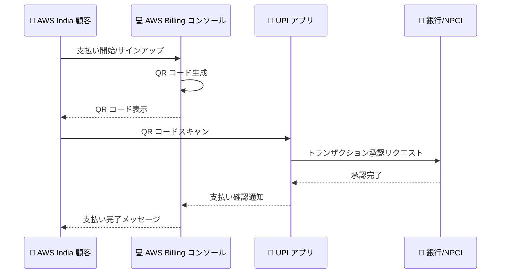

# AWS India - UPI Scan and Pay による支払い対応

**リリース日**: 2026年5月7日
**サービス**: AWS Billing and Cost Management
**機能**: UPI Scan and Pay (インド向け)

📊 [このアップデートのインフォグラフィックを見る](https://takech9203.github.io/aws-news-summary/20260507-aws-india-upi-scanandpay.html)

## 概要

AWS India の顧客が、アカウントのサインアップおよび請求書の支払いに UPI Scan and Pay を利用できるようになりました。UPI (Unified Payments Interface) はインドで広く普及しているリアルタイム決済システムであり、今回の対応によりインドの顧客が使い慣れた決済手段で AWS の利用料金を支払えるようになります。

UPI Scan and Pay では、AWS Billing and Cost Management コンソール上に QR コードが表示され、ユーザーは自身の UPI アプリ (Google Pay、PhonePe、Paytm など) で QR コードをスキャンしてトランザクションを承認します。UPI ID の入力が不要なため、従来の UPI 支払いよりもさらに簡便な操作で支払いが完了します。

この機能は、AWS India (AISPL) アカウントを持つインドの顧客を対象としており、一回払いおよび UPI AutoPay (自動繰り返し支払い) の両方に対応しています。

**アップデート前の課題**

- UPI での支払いには UPI ID を手入力して認証する必要があり、手順が煩雑だった
- UPI AutoPay の設定にも UPI ID の入力と別途承認プロセスが必要だった
- QR コード決済に慣れたインドのユーザーにとって、ID 入力型の UPI 支払いは直感的ではなかった

**アップデート後の改善**

- QR コードをスキャンするだけで支払いが完了するため、UPI ID の入力が不要になった
- サインアップ時にも UPI Scan and Pay を利用でき、アカウント作成のハードルが下がった
- UPI AutoPay の設定も QR コードスキャンで簡単に完了できるようになった

## アーキテクチャ図



AWS Billing コンソールが QR コードを生成し、ユーザーが UPI アプリでスキャンして承認することで支払いが完了するフローを示しています。トランザクションは 10 分以内に承認する必要があります。

## サービスアップデートの詳細

### 主要機能

1. **UPI Scan and Pay による一回払い**
   - AWS Billing コンソールの Payments ページから利用可能
   - 「Use UPI Scan and Pay」ボタンを選択し、「Verify and pay」をクリック
   - 表示された QR コードを UPI アプリでスキャンして支払いを承認
   - 10 分以内に承認しない場合はリクエストが期限切れとなり、再度支払いが必要

2. **UPI Scan and Pay による AutoPay 設定**
   - Payment preferences から UPI AutoPay を選択して設定可能
   - QR コードスキャンで自動支払いの承認が完了
   - 設定後は将来の AWS 請求書に対して自動的に支払いが実行される

3. **サインアップ時の UPI Scan and Pay 利用**
   - 新規 AWS India アカウント作成時の支払い方法として UPI Scan and Pay を選択可能
   - クレジットカードや Net Banking がなくても AWS アカウントを開設できる

## 技術仕様

### 対応する支払い方法の比較

| 支払い方法 | UPI ID 入力 | QR コードスキャン | AutoPay 対応 | サインアップ対応 |
|------|------|------|------|------|
| クレジット/デビットカード | - | - | INR 15,000 まで | 対応 |
| Net Banking | - | - | 非対応 | 対応 |
| UPI (ID 入力型) | 必要 | - | 対応 | 対応 |
| UPI Scan and Pay | 不要 | 必要 | 対応 | 対応 |

### 制約事項

| 項目 | 詳細 |
|------|------|
| トランザクション承認期限 | 10 分以内 |
| 対象アカウント | AWS India (AISPL) アカウントのみ |
| 必要な UPI アプリ | QR コードスキャン対応の UPI アプリ |
| 通貨 | インドルピー (INR) |

## 設定方法

### 前提条件

1. AWS India (AISPL) アカウントを保有していること
2. QR コードスキャン対応の UPI アプリがインストールされたスマートフォン
3. UPI アプリに銀行口座がリンクされていること

### 手順

#### ステップ 1: 支払いの開始

AWS Billing and Cost Management コンソール (https://console.aws.amazon.com/costmanagement/) を開き、ナビゲーションペインから「Payments」を選択します。Payments due テーブルに表示されている請求書を選択し、「Complete payment」をクリックします。

#### ステップ 2: UPI Scan and Pay の選択

Complete a payment ページで「Use UPI Scan and Pay」を選択し、「Verify and pay」をクリックします。QR コードと支払い承認の手順が表示されます。

#### ステップ 3: QR コードスキャンと承認

スマートフォンで UPI アプリを開き、画面に表示された QR コードをスキャンします。アプリ内でトランザクション内容を確認し、承認します。承認が完了すると、AWS Billing コンソールにリダイレクトされ、成功メッセージが表示されます。

#### ステップ 4: AutoPay の設定 (任意)

Payment preferences ページから「Add payment method」を選択し、「UPI AutoPay」を選択します。請求先住所を入力して「Add payment method」をクリックし、「Verify」を選択します。表示された QR コードをスキャンして承認すると、自動支払いが有効になります。

## メリット

### ビジネス面

- **アカウント開設の障壁低減**: クレジットカード不要でサインアップできるため、インドのスタートアップや個人開発者の AWS 利用を促進
- **支払い遅延の削減**: QR コードスキャンという簡便な操作により、請求書の迅速な支払いが可能
- **市場拡大**: インドで最も普及している決済手段に対応することで、より幅広い顧客層にリーチ

### 技術面

- **UPI ID 入力不要**: QR コードスキャンのみで支払いが完了し、入力ミスのリスクを排除
- **リアルタイム決済**: UPI の即時決済インフラにより、支払いが即座に反映
- **AutoPay 統合**: QR コードベースの自動支払い設定により、継続的な支払い管理が容易

## デメリット・制約事項

### 制限事項

- AWS India (AISPL) アカウントのみが対象であり、グローバルの AWS アカウントでは利用不可
- トランザクション承認は 10 分以内に完了する必要があり、タイムアウトした場合は再操作が必要
- UPI のトランザクション上限 (1 回あたり INR 100,000 - 銀行により異なる) が適用される

### 考慮すべき点

- スマートフォンと UPI アプリが手元に必要なため、デスクトップのみの環境では利用しにくい場合がある
- 高額な請求の場合、UPI のトランザクション上限に注意が必要

## ユースケース

### ユースケース 1: スタートアップの AWS アカウント開設

**シナリオ**: インドのスタートアップ企業が初めて AWS を利用する際、法人クレジットカードが未発行の状態でアカウントを開設したい。

**実装例**:
```
1. AWS サインアップページで UPI Scan and Pay を選択
2. 表示された QR コードを Google Pay でスキャン
3. 初回の確認金額を承認してアカウント作成完了
```

**効果**: クレジットカード発行を待つことなく、即座に AWS の利用を開始できる。

### ユースケース 2: 月次請求の迅速な支払い

**シナリオ**: AWS India の月次請求書が発行された後、経理担当者が迅速に支払いを完了したい。

**実装例**:
```
1. AWS Billing コンソールで未払い請求書を選択
2. Use UPI Scan and Pay をクリック
3. 経理担当者のスマートフォンで QR コードをスキャンして承認
```

**効果**: カード情報の入力や Net Banking へのログインが不要で、数秒で支払いが完了する。

### ユースケース 3: 自動支払いの簡単設定

**シナリオ**: 個人開発者が毎月の AWS 請求を自動的に UPI で支払いたい。

**実装例**:
```
1. Payment preferences で UPI AutoPay を選択
2. 請求先住所を入力して Add payment method をクリック
3. 表示された QR コードをスキャンして AutoPay を承認
```

**効果**: 一度設定すれば毎月の請求が自動処理され、支払い忘れを防止できる。

## 料金

UPI Scan and Pay の利用に AWS 側の追加料金は発生しません。通常の AWS サービス利用料金のみが請求されます。UPI トランザクションに対する手数料は、ユーザーの銀行や UPI アプリのポリシーに依存しますが、一般的に UPI トランザクションは無料です。

## 利用可能リージョン

この機能は AWS India (AISPL) アカウントに対してグローバルに提供されます。AWS India アカウントであれば、どのリージョンのサービスの支払いにも UPI Scan and Pay を利用できます。

**対象**: AWS India (Amazon Internet Services Private Limited - AISPL) のアカウントを持つインドの顧客

## 関連サービス・機能

- **AWS Billing and Cost Management**: 請求書管理、支払い履歴の確認、支払い方法の管理を行うコンソール
- **UPI AutoPay**: UPI を使用した自動繰り返し支払い機能。e-mandate に基づく自動引き落とし
- **AWS India Payment Verification**: カード保存時の INR 2 の検証チャージと返金プロセス

## 参考リンク

- 📊 [インフォグラフィック](https://takech9203.github.io/aws-news-summary/20260507-aws-india-upi-scanandpay.html)
- [公式発表 (What's New)](https://aws.amazon.com/about-aws/whats-new/2026/05/aws-india-upi-scanandpay/)
- [ドキュメント - Managing your payments in India](https://docs.aws.amazon.com/awsaccountbilling/latest/aboutv2/edit-aispl-payment-method.html)
- [AWS Billing and Cost Management コンソール](https://console.aws.amazon.com/costmanagement/)

## まとめ

AWS India が UPI Scan and Pay に対応したことで、インドの顧客はクレジットカードや UPI ID の入力なしに、QR コードスキャンだけで AWS の支払いとサインアップが可能になりました。インドで最も利用されている決済手段である UPI の中でも特に手軽な QR コード決済に対応したことは、AWS のインド市場拡大における重要な施策です。インドで AWS を利用している、または利用を検討している場合は、Payment preferences から UPI Scan and Pay の設定を確認することを推奨します。
