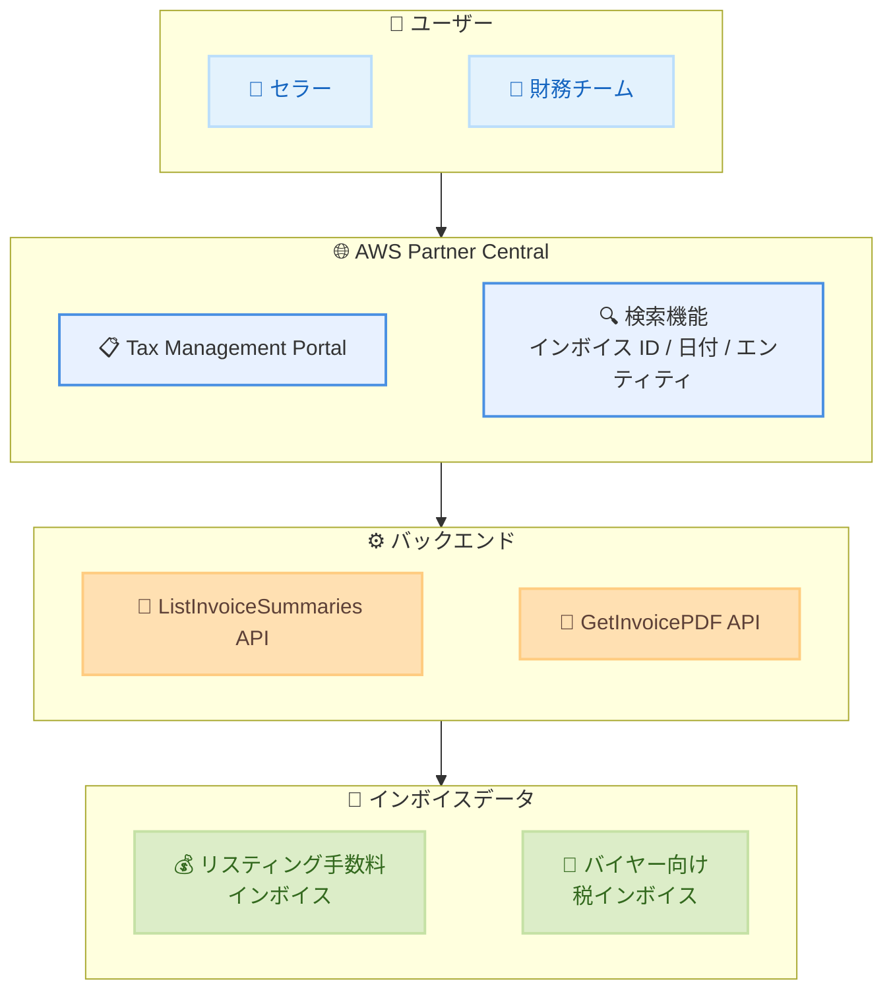

# AWS Marketplace - Tax Management Portal for Sellers

**リリース日**: 2026 年 5 月 7 日
**サービス**: AWS Marketplace
**機能**: Tax Management Portal (税務管理ポータル)

[このアップデートのインフォグラフィックを見る](https://takech9203.github.io/aws-news-summary/20260507-aws-marketplace-tax.html)

## 概要

AWS Marketplace は、セラー向けの新しい Tax Management Portal (税務管理ポータル) を発表した。このポータルにより、セラーはサポートチャネルを通じてインボイスをリクエストする必要がなくなり、セルフサービスでインボイスの閲覧およびダウンロードが可能になる。

Tax Management Portal は AWS Partner Central コンソールに直接統合されており、セラーのリスティング手数料インボイスと、該当リージョンのバイヤーに発行されたインボイスの両方に一元的にアクセスできる。これにより、AWS Marketplace の運用を管理するセラーやパートナーの財務チームにとって、インボイスの取得と記録管理が大幅に効率化される。

**アップデート前の課題**

- インボイスの取得にはサポートチャネルを通じたリクエストが必要であり、時間と手間がかかっていた
- セラーのリスティング手数料インボイスとバイヤー向けインボイスが分散しており、一元的な管理ができなかった
- インボイスの検索やフィルタリング機能がなく、特定のインボイスを見つけるのが困難だった
- インド拠点のセラーがバイヤー向け税インボイスを確認する手段が限られていた

**アップデート後の改善**

- AWS Partner Central コンソールからセルフサービスでインボイスの閲覧・ダウンロードが可能になった
- リスティング手数料インボイスとバイヤー向けインボイスを一元的に管理できるようになった
- インボイス ID、日付範囲、インボイス発行エンティティによる検索機能が追加された
- インド拠点のセラーはバイヤー向け税インボイスをポータルから直接閲覧・ダウンロードできるようになった
- ListInvoiceSummaries API を通じたプログラマティックアクセスが可能になった

## アーキテクチャ図



セラーおよび財務チームが AWS Partner Central の Tax Management Portal を通じてインボイスにアクセスし、バックエンド API 経由でリスティング手数料インボイスとバイヤー向け税インボイスを取得するフローを示している。

## サービスアップデートの詳細

### 主要機能

1. **セルフサービスインボイス管理**
   - サポートへの問い合わせ不要で、インボイスの閲覧・ダウンロードが可能
   - AWS Partner Central コンソールに統合された UI から直接操作
   - リスティング手数料インボイスとバイヤー向けインボイスの一元管理

2. **高度な検索・フィルタリング機能**
   - インボイス ID による検索
   - 日付範囲による期間指定検索
   - インボイス発行エンティティによるフィルタリング
   - ReceiverRole (SELLER / RESELLER / BUYER) による絞り込み

3. **インド拠点セラー向け税インボイス機能**
   - バイヤーに代わって発行された税インボイスの閲覧
   - 税インボイスの PDF ダウンロード
   - GOVERNMENT_INVOICE、TAX_E_INVOICE 等のドキュメントタイプに対応

4. **API アクセス (ListInvoiceSummaries API)**
   - プログラマティックにインボイス情報を取得可能
   - フィルタ条件: 期間、請求期間、インボイス発行エンティティ、ReceiverRole
   - ページネーション対応 (NextToken, MaxResults)
   - 税額、割引、手数料の内訳を含む詳細な金額情報を返却

## 技術仕様

### ListInvoiceSummaries API

| 項目 | 詳細 |
|------|------|
| API 名 | ListInvoiceSummaries |
| サービス | AWS Invoicing |
| リクエストフィルタ | TimeInterval, BillingPeriod, InvoicingEntity, ReceiverRole |
| セレクタ | ACCOUNT_ID または INVOICE_ID |
| レスポンス情報 | インボイス ID、発行日、請求期間、金額内訳、税額、為替情報 |
| ページネーション | NextToken, MaxResults 対応 |

### GetInvoicePDF API

| 項目 | 詳細 |
|------|------|
| API 名 | GetInvoicePDF |
| 入力 | InvoiceId |
| 出力 | DocumentUrl (署名付き URL)、有効期限、補足ドキュメント一覧 |
| ドキュメントタイプ | GOVERNMENT_INVOICE, TAX_E_INVOICE, PAYMENT_RECEIPT, SUPPLEMENT |

### API 変更履歴

| 日付 | サービス | 変更内容 |
|------|----------|----------|
| 2026/05/07 | [AWS Invoicing](https://awsapichanges.com/archive/changes/4fa215-invoicing.html) | 2 updated api methods - ListInvoiceSummaries に ReceiverRole フィルタ追加、GetInvoicePDF に SupplementalDocuments 追加 |

### API リクエスト例

```python
import boto3

client = boto3.client('invoicing')

# セラーとしてのインボイス一覧を取得
response = client.list_invoice_summaries(
    Selector={
        'ResourceType': 'ACCOUNT_ID',
        'Value': '123456789012'
    },
    Filter={
        'TimeInterval': {
            'StartDate': '2026-01-01T00:00:00Z',
            'EndDate': '2026-05-07T23:59:59Z'
        },
        'InvoicingEntity': 'AWS_MARKETPLACE',
        'ReceiverRole': 'SELLER'
    },
    MaxResults=50
)

# インボイス PDF のダウンロード URL を取得
for invoice in response['InvoiceSummaries']:
    pdf_response = client.get_invoice_pdf(
        InvoiceId=invoice['InvoiceId']
    )
    print(f"Invoice: {invoice['InvoiceId']}")
    print(f"Download URL: {pdf_response['InvoicePDF']['DocumentUrl']}")
```

## 設定方法

### 前提条件

1. AWS Partner Central アカウントへのアクセス権限
2. AWS Marketplace セラーとして登録済みであること
3. API アクセスの場合は適切な IAM ポリシー (invoicing:ListInvoiceSummaries, invoicing:GetInvoicePDF) が付与されていること

### 手順

#### ステップ 1: AWS Partner Central コンソールへのアクセス

AWS Partner Central コンソールにログインし、Tax Management Portal セクションに移動する。セラーアカウントに紐づくインボイス情報が自動的に表示される。

#### ステップ 2: インボイスの検索

検索フィルタを使用して目的のインボイスを絞り込む。

- **インボイス ID**: 特定のインボイスを直接検索
- **日付範囲**: 指定期間内に発行されたインボイスを表示
- **インボイス発行エンティティ**: 発行元によるフィルタリング

#### ステップ 3: インボイスのダウンロード

対象のインボイスを選択し、PDF 形式でダウンロードする。インド拠点のセラーの場合は、バイヤー向け税インボイスも同様にダウンロード可能。

#### ステップ 4: API によるプログラマティックアクセス (オプション)

```bash
# AWS CLI を使用したインボイス一覧の取得
aws invoicing list-invoice-summaries \
  --selector '{"ResourceType":"ACCOUNT_ID","Value":"123456789012"}' \
  --filter '{"ReceiverRole":"SELLER","InvoicingEntity":"AWS_MARKETPLACE"}' \
  --max-results 20
```

AWS CLI または SDK を使用して、インボイス情報をプログラマティックに取得する。自動化ワークフローや財務システムとの統合に活用できる。

## メリット

### ビジネス面

- **運用効率の向上**: サポートチケットの作成・待機時間が不要になり、インボイス取得にかかる時間を大幅に短縮
- **一元的な財務管理**: リスティング手数料とバイヤー向けインボイスを単一ポータルで管理でき、財務チームの業務効率が向上
- **コンプライアンス対応の強化**: 特にインドの GST 対応など、各地域の税務要件に対するインボイスの即時取得が可能

### 技術面

- **API による自動化**: ListInvoiceSummaries API により、インボイス管理ワークフローの自動化が可能
- **詳細な金額情報**: 税額内訳、割引、手数料、為替レート情報を API レスポンスで取得可能
- **柔軟な検索機能**: 複数のフィルタ条件を組み合わせた効率的なインボイス検索

## デメリット・制約事項

### 制限事項

- バイヤー向け税インボイスの閲覧・ダウンロードは現時点ではインド拠点のセラーに限定されている
- API アクセスには適切な IAM 権限の設定が必要
- 過去のインボイスがポータルで利用可能な範囲は明示されていない

### 考慮すべき点

- 既存のサポートチャネル経由でのインボイス取得プロセスから移行する場合、財務チームへの周知が必要
- API を利用する場合、レートリミットやページネーションの考慮が必要
- 複数リージョンで運用している場合、インボイス発行エンティティの正確な指定が重要

## ユースケース

### ユースケース 1: 月次財務レポートの自動化

**シナリオ**: ISV (独立系ソフトウェアベンダー) の財務チームが、毎月の AWS Marketplace リスティング手数料を自動的に集計し、社内の会計システムに連携したい。

**実装例**:
```python
import boto3
from datetime import datetime, timedelta

client = boto3.client('invoicing')

# 前月のインボイスを取得
today = datetime.now()
first_day_last_month = (today.replace(day=1) - timedelta(days=1)).replace(day=1)

response = client.list_invoice_summaries(
    Selector={'ResourceType': 'ACCOUNT_ID', 'Value': '123456789012'},
    Filter={
        'BillingPeriod': {
            'Month': first_day_last_month.month,
            'Year': first_day_last_month.year
        },
        'ReceiverRole': 'SELLER'
    }
)

# 会計システムへの連携処理
for invoice in response['InvoiceSummaries']:
    total = invoice['BaseCurrencyAmount']['TotalAmount']
    tax = invoice['BaseCurrencyAmount']['AmountBreakdown']['Taxes']['TotalAmount']
    print(f"Invoice {invoice['InvoiceId']}: Total={total}, Tax={tax}")
```

**効果**: 手動でのインボイス収集作業を排除し、月次の財務処理を自動化

### ユースケース 2: インドの GST コンプライアンス対応

**シナリオ**: インド拠点のセラーが、バイヤーに発行された税インボイスを確認し、GST 申告用の記録を維持する必要がある。

**実装例**:
```python
# インド拠点セラーとしてバイヤー向け税インボイスを取得
response = client.list_invoice_summaries(
    Selector={'ResourceType': 'ACCOUNT_ID', 'Value': '123456789012'},
    Filter={
        'TimeInterval': {
            'StartDate': '2026-04-01T00:00:00Z',
            'EndDate': '2026-04-30T23:59:59Z'
        },
        'ReceiverRole': 'SELLER'
    }
)

# 税インボイスの PDF をダウンロード
for invoice in response['InvoiceSummaries']:
    pdf = client.get_invoice_pdf(InvoiceId=invoice['InvoiceId'])
    for doc in pdf['InvoicePDF'].get('SupplementalDocuments', []):
        if doc['DocumentType'] == 'TAX_E_INVOICE':
            print(f"Tax e-Invoice URL: {doc['DocumentUrl']}")
```

**効果**: GST 申告に必要な税インボイスの即時取得により、コンプライアンス対応を効率化

### ユースケース 3: マルチアカウント環境での集中管理

**シナリオ**: 複数の AWS アカウントで Marketplace 出品を管理する大規模パートナーが、全アカウントのインボイスを集中的に管理・監視したい。

**実装例**:
```python
# 複数アカウントのインボイスを集約
accounts = ['111111111111', '222222222222', '333333333333']

all_invoices = []
for account_id in accounts:
    response = client.list_invoice_summaries(
        Selector={'ResourceType': 'ACCOUNT_ID', 'Value': account_id},
        Filter={
            'ReceiverRole': 'SELLER',
            'InvoicingEntity': 'AWS_MARKETPLACE'
        }
    )
    all_invoices.extend(response['InvoiceSummaries'])

# アカウント横断のサマリーレポート生成
print(f"Total invoices across {len(accounts)} accounts: {len(all_invoices)}")
```

**効果**: 分散したアカウントのインボイスを一元的に把握し、財務管理の効率を向上

## 料金

Tax Management Portal 自体の利用は追加料金なしで提供される。AWS Marketplace のセラーアカウントを持つすべてのパートナーが利用可能。API (ListInvoiceSummaries, GetInvoicePDF) の呼び出しに関する追加料金も発表されていない。

## 利用可能リージョン

Tax Management Portal は AWS Partner Central コンソールを通じてグローバルに利用可能。API アクセスについては、AWS Invoicing サービスが利用可能なリージョンで使用できる。インド拠点セラー向けのバイヤー税インボイス機能は、該当リージョンで適用される。

## 関連サービス・機能

- **AWS Partner Central**: Tax Management Portal が統合されるコンソール。セラーの各種管理機能を提供
- **AWS Marketplace Seller**: セラーとしての出品管理、価格設定、契約管理を行うサービス
- **AWS Invoicing API**: インボイスの検索・取得を行う API サービス。ListInvoiceSummaries、GetInvoicePDF 等のメソッドを提供
- **AWS Marketplace Agreement Service**: 契約管理、課金、エンタイトルメント管理を行う API。今回のアップデートと同時期に 10 の新規メソッドが追加

## 参考リンク

- [このアップデートのインフォグラフィック](https://takech9203.github.io/aws-news-summary/20260507-aws-marketplace-tax.html)
- [公式発表 (What's New)](https://aws.amazon.com/about-aws/whats-new/2026/05/aws-marketplace-tax/)
- [AWS Marketplace セラーガイド](https://docs.aws.amazon.com/marketplace/latest/userguide/what-is-marketplace.html)
- [AWS Invoicing API リファレンス](https://docs.aws.amazon.com/aws-cost-management/latest/APIReference/API_Operations_Invoicing.html)
- [AWS Partner Central](https://partnercentral.awspartner.com/)

## まとめ

AWS Marketplace の Tax Management Portal は、セラーのインボイス管理業務を根本的に改善するアップデートである。サポートチャネルへの依存を排除し、セルフサービスでの即時アクセスを実現することで、財務チームの運用効率が大幅に向上する。特にインド拠点のセラーにとっては GST コンプライアンス対応が容易になる点が重要であり、ListInvoiceSummaries API の提供により自動化の道も開かれている。AWS Marketplace でソフトウェアを販売しているパートナーは、早期にこのポータルを活用した財務プロセスの効率化を検討することを推奨する。
