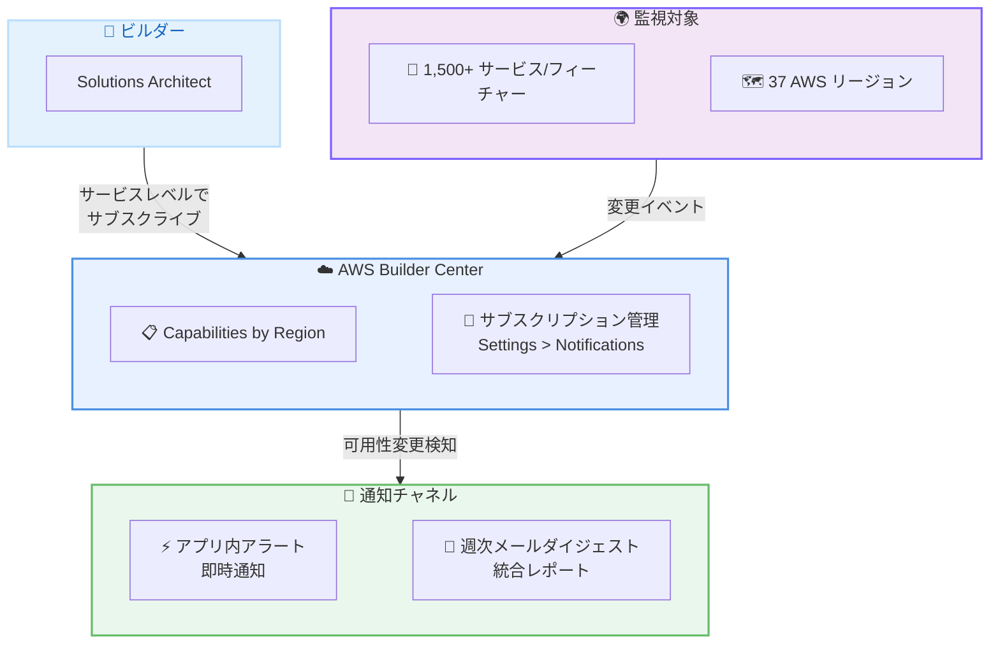

# AWS Capabilities by Region - 可用性通知機能

**リリース日**: 2026年5月7日
**サービス**: AWS Builder Center
**機能**: AWS Capabilities by Region 可用性通知 (Availability Notifications)

📊 [このアップデートのインフォグラフィックを見る](https://takech9203.github.io/aws-news-summary/20260507-aws-regional-planning-tool-notification.html)

## 概要

AWS は、AWS Builder Center 内の AWS Capabilities by Region にサブスクリプションベースの可用性通知機能を追加したことを発表した。この機能により、AWS サービスやフィーチャーが特定のリージョンで利用可能になった際に自動的にアラートを受け取ることができるようになる。37 の AWS リージョンにまたがる 1,500 以上のサービスおよびフィーチャーの可用性を追跡でき、インフラストラクチャの計画やデプロイの意思決定を加速する。

通知はサービスレベルでサブスクライブでき、サブスクリプションは選択したリージョン全体でそのサービス配下のすべてのフィーチャーを自動的にカバーする。そのため、個々のフィーチャーを個別に追跡する必要がない。通知は AWS Builder Center 内のアプリ内アラート (即時) と週次のメールダイジェスト (統合) の 2 つのチャネルで配信される。

対象ユーザーは、マルチリージョン展開を計画する Solutions Architect、新しいリージョンへのマイグレーションを準備するクラウドエンジニア、およびサービスパリティを監視する必要がある開発者である。

**アップデート前の課題**

- サービスやフィーチャーが特定のリージョンで利用可能になったかどうかを手動で確認する必要があった
- AWS Capabilities by Region ページを定期的にチェックしてリージョン対応状況を監視する必要があった
- 複数のサービスの複数リージョンでの可用性変更を同時に追跡することが困難だった

**アップデート後の改善**

- サービスレベルでサブスクライブするだけで、配下の全フィーチャーの可用性変更が自動通知される
- アプリ内アラートにより即時に可用性変更を把握でき、週次メールダイジェストで見逃しを防止できる
- 手動でのリージョン対応状況確認が不要になり、インフラ計画の効率が向上した

## アーキテクチャ図



ビルダーが AWS Builder Center でサービスレベルのサブスクリプションを設定し、37 リージョンにまたがる 1,500 以上のサービス/フィーチャーの可用性変更がアプリ内アラートまたは週次メールダイジェストで通知される仕組みを示している。

## サービスアップデートの詳細

### 主要機能

1. **サービスレベルサブスクリプション**
   - AWS Builder Center UI を通じてサービス単位でサブスクライブ可能
   - サブスクリプションは選択したリージョン全体で、配下のすべてのフィーチャーを自動カバー
   - 個々のフィーチャーを個別に追跡する必要がない

2. **デュアルチャネル通知**
   - アプリ内アラート: AWS Builder Center 内で即時に通知を受信
   - 週次メールダイジェスト: 統合された変更情報を定期的に受信
   - 用途に応じて通知チャネルを使い分け可能

3. **通知設定管理**
   - Settings > Notifications から一元管理
   - サブスクリプションと通知プリファレンスを柔軟に設定可能
   - リージョンおよびサービスの組み合わせで細かく制御

## 技術仕様

### サービス概要

| 項目 | 詳細 |
|------|------|
| サービス名 | AWS Capabilities by Region |
| 所属 | AWS Builder Center |
| 対象サービス数 | 1,500 以上のサービスおよびフィーチャー |
| 対象リージョン数 | 37 AWS リージョン |
| サブスクリプション単位 | サービスレベル |
| 通知チャネル | アプリ内アラート (即時)、週次メールダイジェスト |
| 設定場所 | Settings > Notifications |

## 設定方法

### 前提条件

1. AWS アカウントを保有していること
2. AWS Builder Center にアクセスできること

### 手順

#### ステップ 1: AWS Builder Center にアクセス

```
AWS Builder Center (https://builder.aws/) にアクセスし、
AWS Capabilities by Region セクションに移動する
```

AWS Builder Center は、AWS サービスのリージョン別可用性情報を一覧できるダッシュボードである。

#### ステップ 2: 通知のサブスクリプション設定

```
1. 通知を受け取りたいサービスを選択
2. 対象リージョンを指定
3. サブスクライブを実行
```

サービスレベルでサブスクライブすると、そのサービス配下のすべてのフィーチャーが対象リージョンで利用可能になった際に通知を受け取る設定が完了する。

#### ステップ 3: 通知プリファレンスの管理

```
Settings > Notifications に移動し、
通知チャネル (アプリ内 / メールダイジェスト) の設定を確認・変更する
```

必要に応じて通知頻度やチャネルの有効/無効を切り替えることで、情報量を適切にコントロールできる。

## メリット

### ビジネス面

- **計画精度の向上**: マルチリージョン展開の計画において、サービス可用性の変更をリアルタイムに把握できる
- **工数削減**: 手動でのリージョン対応状況チェックが不要になり、インフラチームの運用負荷を軽減
- **意思決定の迅速化**: サービス可用性情報の即時通知により、デプロイのタイミング判断を早期に実施可能

### 技術面

- **自動カバレッジ**: サービスレベルのサブスクリプションで配下の全フィーチャーを自動追跡し、漏れを防止
- **デュアルチャネル**: 即時のアプリ内アラートと統合された週次ダイジェストの使い分けで、情報を適切な粒度で受信
- **リージョンパリティ監視**: 複数リージョン間のサービス対応状況の差異を効率的に追跡可能

## デメリット・制約事項

### 制限事項

- サブスクリプション単位はサービスレベルのみであり、個別フィーチャー単位での通知設定はできない
- 通知チャネルはアプリ内アラートと週次メールダイジェストの 2 種類に限定
- AWS Builder Center へのアクセスが必要

### 考慮すべき点

- 多数のサービスをサブスクライブすると、通知量が増大する可能性がある
- 週次メールダイジェストのため、即時性を求める場合はアプリ内アラートの確認が必要

## ユースケース

### ユースケース 1: 生成 AI アプリケーションのマルチリージョン展開

**シナリオ**: Solutions Architect が生成 AI アプリケーションを新しいリージョンに展開するにあたり、Amazon Bedrock の Knowledge Bases、Guardrails などのフィーチャーが対象リージョンで利用可能になるタイミングを把握したい。

**実装例**:
```
1. AWS Builder Center で Amazon Bedrock をサブスクライブ
2. 展開予定のリージョンを選択
3. Knowledge Bases, Guardrails 等が対象リージョンで
   利用可能になった時点で自動通知を受信
```

**効果**: 手動での可用性チェックが不要になり、必要なフィーチャーが揃った時点で速やかに展開を開始できる。

### ユースケース 2: サービスパリティの監視

**シナリオ**: グローバルに展開するエンタープライズが、主要リージョン間でのサービスパリティを維持するため、使用中のサービスの可用性変更を追跡したい。

**実装例**:
```
1. 使用中の全サービスをサブスクライブ
2. 全運用リージョンを対象に設定
3. 週次メールダイジェストでリージョン間の差異を定期レビュー
```

**効果**: リージョン間のサービス可用性の差異を週次で把握し、パリティ計画の更新を効率的に実施できる。

### ユースケース 3: マイグレーション計画の最適化

**シナリオ**: クラウドエンジニアがオンプレミスから特定リージョンへのマイグレーションを計画しており、必要なサービスがすべて揃うタイミングを待っている。

**実装例**:
```
1. マイグレーションに必要な全サービスをサブスクライブ
2. マイグレーション先リージョンを選択
3. アプリ内アラートで即時通知を有効化
4. 全サービスが揃った時点でマイグレーション開始判断
```

**効果**: マイグレーションのブロッカーとなるサービス可用性を自動監視し、準備完了のタイミングを逃さない。

## 料金

AWS Capabilities by Region の可用性通知機能は追加料金なしで利用可能。AWS Builder Center の一部として無料で提供される。

### 料金例

| 項目 | 料金 |
|------|------|
| 可用性通知サブスクリプション | 無料 |
| アプリ内アラート | 無料 |
| 週次メールダイジェスト | 無料 |

## 利用可能リージョン

AWS Capabilities by Region はグローバルなツールであり、すべての AWS リージョン (37 リージョン) のサービス可用性情報を追跡できる。AWS Builder Center 自体はグローバルにアクセス可能。

## 関連サービス・機能

- **AWS Builder Center**: AWS のリージョン別サービス可用性情報を提供するダッシュボード。本通知機能のホストサービス
- **AWS Health Dashboard**: AWS サービスの稼働状況やイベントを通知。可用性通知はサービスのリージョン対応追加に特化
- **AWS CloudFormation StackSets**: マルチリージョンデプロイメントの自動化。可用性通知と組み合わせてデプロイタイミングを最適化

## 参考リンク

- 📊 [インフォグラフィック](https://takech9203.github.io/aws-news-summary/20260507-aws-regional-planning-tool-notification.html)
- [公式発表 (What's New)](https://aws.amazon.com/about-aws/whats-new/2026/05/aws-regional-planning-tool-notification/)
- [AWS Capabilities by Region](https://aws.amazon.com/about-aws/global-infrastructure/regional-product-services/)

## まとめ

AWS Capabilities by Region の可用性通知機能により、マルチリージョン展開やマイグレーション計画において、サービスの可用性変更を手動で確認する負担が大幅に軽減される。特に、複数のリージョンにまたがるワークロードを運用する組織や、特定のサービスが新しいリージョンで利用可能になるタイミングを待っている開発チームにとって有用である。AWS Builder Center にアクセスし、使用中または計画中のサービスに対してサブスクリプションを設定することを推奨する。
